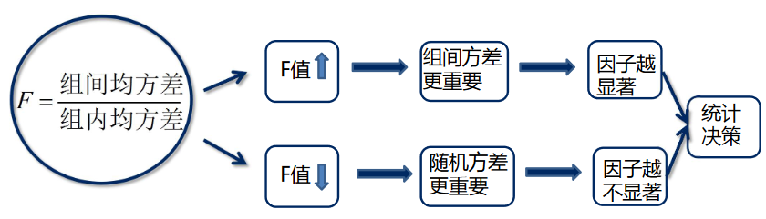
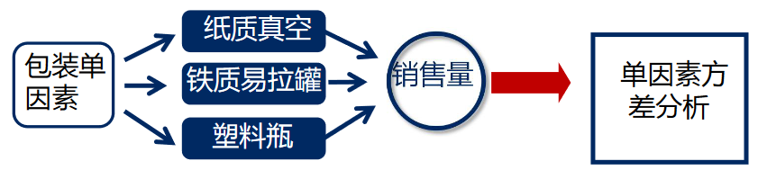
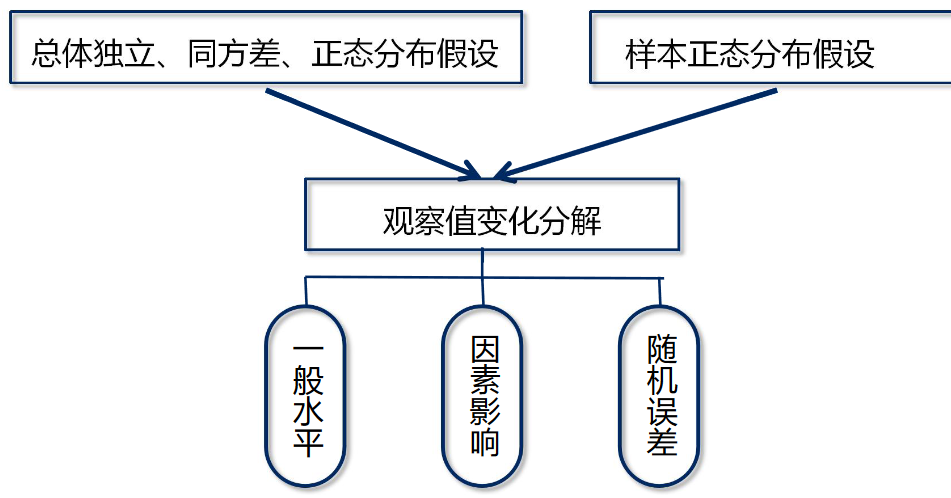
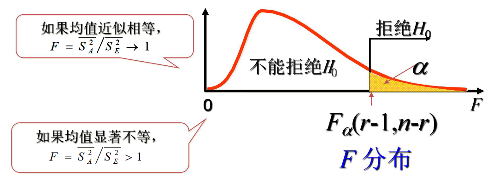

https://www.icourse163.org/learn/ZUFE-1002844001

https://zhuanlan.zhihu.com/p/33357167

# 方差分析

抑郁症是一种常见的精神疾病

为了了解地理位置对抑郁症是否有影响。

# 方差分析的含义及基本思路

## 方差分析的提出

Ronald Fisher提出

Analysis of Variance(ANOVA)

方差分析又被称为F检验，用来推断因素对试验指标的影响是否显著

在农业、生物学、医学、经济学中广泛使用

## 问题背景

阳光食品责任有限公司开发了一种新型儿童运动饮料，设想了三种不同类型的包装形式：纸质真空包装、铁质易拉罐和塑料瓶。九州市场研究事务所受“阳光食品”的委托，采取市场实验的方式取得有关数据。生产了三种包装方式的样品，在较有代表性的八个商店实行试销。（分散在全市各主要区域，商店周边的顾客源即为该目标产品的潜在需求者）。为避免商品陈列位置差异对销售结果的影响，各商店样品的陈列高度要求一致、排列顺序随机变化。销售人员不做诱导性推销。试销一个月之后，各商店三种包装形式产品的销售量数据如下表所示。

| 商店编号       | 1    | 2    | 3    | 4    | 5    | 6    | 7    | 8    |
| -------------- | ---- | ---- | ---- | ---- | ---- | ---- | ---- | ---- |
| 纸质真空(A1)   | 152  | 188  | 238  | 192  | 180  | 115  | 125  | 100  |
| 纸质易拉罐(A2) | 208  | 256  | 300  | 280  | 270  | 210  | 185  | 165  |
| 塑料瓶(A3)     | 182  | 198  | 268  | 220  | 200  | 128  | 110  | 105  |

儿童运动饮料的试销量箱型图

略

箱型图能够发现销量和包装有一定关系，但是不能提供充分的证据，需要有更准确的方法来检验。

需要分析三种包装的销售量差异是由随机偶然因素造成的，还是由于不同包装方式造成的，这就是**方差分析问题**

其他例子：

- 教学方法、教师素质、学生基础等因素影响统计学教学的效果。
- 超市产品销售取决于产品品牌、款式、材料、价格等多种因素。
- 某疾病的手术效果取决于患者年龄、患病程度、手术条件等因素。
- 网站访问量取决于网站主题、网页界面、内容丰富程度等因素。

## 方差分析的含义

方差分析实质是对多个正态分布总体的均值比较问题。

检验三种包装形式的均值是否相等

$H_0: \overline{X}_1=\overline{X}_2=\overline{X}_3$

$H_1: \overline{X}_1,\overline{X}_2,\overline{X}_3$不全相等

## 方差分析的类型

因素数量：

- 单因素方差分析
- 双因素方差分析
- 多因素方差分析

变量个数：

- 一元方差分析
- 多元方差分析

## 方差分析的基本思路

### 方差分解

离差平方和反映样本数据的波动，将**离差平方和**分解为组间方差与组内方差两部分。**组间方差**反映不同的因子对样本波动的影响，而**组内方差**则是不考虑组间方差的随机性影响。

### 方差比较

因素与随机性哪一个对观测的影响更显著，要看祖间方差和组内方差的比较结果。并考虑产生方差的独立变量的个数。独立变量的个数越多，方差就有可能越大。为此用**均方误差**消除数量的影响。独立变量的个数称之为自由度。

### F检验

# 单因素方差分析

只考虑一种因素对观察（试验）指标影响的方差分析，称为单因素方差分析。

## 数据结构表

| 水平号 | 观察指标值                     | 算术均值         | 方差    |
| ------ | ------------------------------ | ---------------- | ------- |
| $A_1$  | $[x_{11},x_{12}...,x_{1m_1}]$  | $\overline{x}_1$ | $s_1^2$ |
| ...    | ...                            | ...              | ...     |
| $A_r$  | $[x_{r1},x_{r2},...,x_{rm_r}]$ | $\overline{x}_r$ | $s_r^2$ |

## 基本假设

## 模型

一般水平$\overline{X}$

总均值：
$$
\overline{x}=\frac{\sum_{i=1}^r\sum_{j=1}^{n_i}x_{ij}}{\sum_{i=1}^rn_i}
$$

i水平均值（第i个变量的均值，塑料装的饮料所有分店卖出量的均值）：
$$
\overline{x}_i=\frac{1}{n_i}\sum_{j=1}^{n_i}x_{ij}
$$
$n_i$，第i个水平样本数量。

因素水平的差异：$\alpha_i=\overline{x}_i-\overline{x}$

随机误差带来的偶然性差异：$e_{ij}=x_{ij}-\overline{x}_i$

单因素方差分析模型：$X_{ij}=\overline{X}+\alpha_i+e_{ij}$，其中$(i=1,...,r)(j=1,...,n_i)$

$e_{ij} \sim N(0,S^2)$，0均值方差是$S^2$的正态分布并且相互独立

因素水平差异的效应和为0：$\sum_{i=1}^rn_i\alpha_i=0$

每一个观察数据对一般水平的偏差表示为$X_{ij}-\overline{X}=\alpha_i+e_{ij}$

对偏差表达式的两边求平方和：
$$
\sum_{i=1}^r\sum_{j=1}^{n_i}(X_{ij}-\overline{X})^2=\sum_{i=1}^rn_i\alpha_i^2+\sum_{i=1}^r\sum_{j=1}^{n_i}e_{ij}^2
$$

 

组间离差平方和：反映了因素不同水平造成的指标变化，如果这个值小，说明不同组的均值都差不多。

组内离差平方和：每个观测数，与其组内平均值的离差平方和，是所有随机误差造成指标变化的总度量。

## 检验形式

形式1：

$H_0:\overline{X}_1=\overline{X}_2=...=\overline{X}_r$

$H_1:\overline{X}_1,\overline{X}_2,...,\overline{X}_r$不完全相等

形式2：

$H_0:\alpha_1=\alpha_2=...=\alpha_r=0$

$H_1:\alpha_1,\alpha_2,...,\alpha_r$不全为0

## 检验统计量构造

需要讨论$SS_A/SS_E$的统计分布

记$n=\sum_{i=1}^rn_i$，当$H_0$成立时：
$$
\begin{aligned}
\frac{SS_T}{S^2}&=\sum_{i=1}^r\sum_{j=1}^{n_i} \left(\frac{x_{ij}-\overline{x}}{S}\right)^2 \sim \chi^2(n-1)\\
\frac{SS_A}{S^2}&=\sum_{i=1}^rn_i \left(\frac{\overline{x}_{i}-\overline{x}}{S}\right)^2 \sim \chi^2(r-1)\\
\frac{SS_E}{S^2}&=\sum_{i=1}^r\sum_{j=1}^{n_i} \left(\frac{x_{ij}-\overline{x}_i}{S}\right)^2 \sim \chi^2(n-r)
\end{aligned}
$$
都服从不同分布的卡方分布
$$
F=\frac{SS_A/(r-1)}{SS_E/(n-r)} \sim F(r-1, n-r)
$$
服从F分布

若F值超过临界值或P值，则说明显著不等。

## 方差分析表

| 方差来源 | 自由度 | 离差平方和 | 均方差                              | F值                                   | P值  |
| -------- | ------ | ---------- | ----------------------------------- | ------------------------------------- | ---- |
| 因素A    | r-1    | $SS_A$     | $\overline{S^2_A}=\frac{SS_A}{r-1}$ | $F=\overline{S^2_A}/\overline{S^2_E}$ | P    |
| 随机误差 | n-r    | $SS_E$     | $\overline{S^2_A}=SS_E/(n-r)$       |                                       |      |
| 总和     | n-1    | $SS_T$     |                                     |                                       |      |

## 例题

利用儿童运动饮料试销量的数据，进行单因素方差分析，回答三种包装形式对饮料销售量的影响是否具有显著性（0.05）？

| 商店编号       | 1    | 2    | 3    | 4    | 5    | 6    | 7    | 8    |
| -------------- | ---- | ---- | ---- | ---- | ---- | ---- | ---- | ---- |
| 纸质真空(A1)   | 152  | 188  | 238  | 192  | 180  | 115  | 125  | 100  |
| 纸质易拉罐(A2) | 208  | 256  | 300  | 280  | 270  | 210  | 185  | 165  |
| 塑料瓶(A3)     | 182  | 198  | 268  | 220  | 200  | 128  | 110  | 105  |

（1）计算总平均值、各水平均值等有关中间结果

水平总数r=3

观测数据总数n=24

总平均值$\overline{x}$=190.625

各组平均值：$\overline{x}_1$=161.25，$\overline{x}_2$=234.25，$\overline{x}_3$=176.375

$\sum_{i=1}^3n_i\overline{x}_i^2$=895862.125

$\sum_{i=1}^r\sum_{j=1}^{n_i}x_{ij}^2$=950917.

（2）计算组间、组内和总离差平方和

SSA=23752.75，SSE=55054.875，SST=78807.625

则F统计量为：F=4.53

以上只告诉我们，三个总体均值存在显著差异，但不能告诉我们哪些总体均值存在差异，需要进行多重比较分析。

# 双因素方差分析
