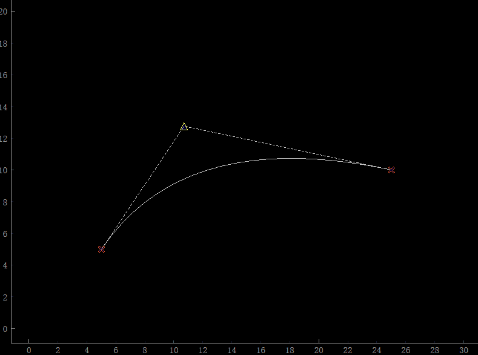

[从零开始学图形学：10分钟看懂贝塞尔曲线 - 知乎 (zhihu.com)](https://zhuanlan.zhihu.com/p/344934774)

[曲线篇: 贝塞尔曲线 - 知乎 (zhihu.com)](https://zhuanlan.zhihu.com/p/136647181)

[贝塞尔曲线 - 知乎 (zhihu.com)](https://zhuanlan.zhihu.com/p/267027346)


首先用pyqtgraph编写了一个贝塞尔曲线的示例程序



```python
import pyqtgraph as pg
import numpy as np
from PyQt5.QtCore import Qt


def update_curve():
    point1 = target1.pos()
    point2 = target2.pos()
    point3 = control_point.pos()

    curve1.setData([point1.x(), point3.x()], [point1.y(), point3.y()])
    curve2.setData([point2.x(), point3.x()], [point2.y(), point3.y()])

    t_vals = np.linspace(0, 1, 100)
    bezier_x = [bezier_curve(t, point1.x(), point3.x(), point2.x()) for t in t_vals]
    bezier_y = [bezier_curve(t, point1.y(), point3.y(), point2.y()) for t in t_vals]
    bezier_curve_plot.setData(bezier_x, bezier_y)


def bezier_curve(t, P0, P1, P2):
    return (1 - t) ** 2 * P0 + 2 * (1 - t) * t * P1 + t**2 * P2


app = pg.mkQApp("bezier_curve")
pw = pg.PlotWidget()

point1, point2 = (5, 5), (25, 10)
point3 = (12, 12)

target1 = pg.TargetItem(pos=point1, size=10, symbol="x", pen="#F4511E")
target2 = pg.TargetItem(pos=point2, size=10, symbol="x", pen="#F4511E")
control_point = pg.TargetItem(pos=point3, size=10, symbol="t1")
curve1 = pw.plot(pen={"style": Qt.DashLine})
curve2 = pw.plot(pen={"style": Qt.DashLine})
bezier_curve_plot = pw.plot()

target1.sigPositionChanged.connect(update_curve)
target2.sigPositionChanged.connect(update_curve)
control_point.sigPositionChanged.connect(update_curve)

pw.addItem(target1)
pw.addItem(target2)
pw.addItem(control_point)

update_curve()
pw.setXRange(0, 30)
pw.setYRange(0, 20)
pw.show()


if __name__ == "__main__":
    pg.exec()

```

### 贝塞尔曲线的组成

最简单的贝塞尔曲线主要由起始点、结束点和控制点组成。

其中一般起始点和结束点是固定的，通过调整控制点来实现曲线形状的变化。

对于贝塞尔曲线x和y的坐标点计算函数如下

```python
def bezier_curve(t, P0, P1, P2):
    return (1 - t) ** 2 * P0 + 2 * (1 - t) * t * P1 + t**2 * P2
```

要绘制贝塞尔曲线，你可以使用以下公式来计算二次贝塞尔曲线上的点：

$$
B(t) = (1-t)^2 \times P_0 + 2(1-t)t \times P_1 + t^2 \times P_2
$$


二次贝塞尔曲线（Quadratic Bézier Curve）是由三个控制点 \( P_0, P_1, \) 和 \( P_2 \) 定义的。这个曲线可以看作是两条线性贝塞尔曲线（即两条直线段）之间的线性插值。

### 线性贝塞尔曲线

二次贝塞尔曲线本质上就是对两个线再进行一次贝塞尔曲线计算。

首先，让我们回顾一下线性贝塞尔曲线的数学表达式：

$$
B(t) = (1-t) \times P_0 + t \times P_1
$$


这里，\( t \) 是从 0 到 1 的参数。

二次贝塞尔曲线的推导

1. **第一条线性贝塞尔曲线**：连接 \( P_0 \) 和 \( P_1 \)，用参数 \( t \) 表示这条线上的任意一点 \( Q_0 \)：

$$
Q_0(t) = (1-t) \times P_0 + t \times P_1
$$


2. **第二条线性贝塞尔曲线**：连接 $P_1$和$P_2$，用参数$t$表示这条线上的任意一点$Q_1$：

$$
Q_1(t) = (1-t) \times P_1 + t \times P_2
$$

3. **线性插值**：现在，我们在$Q_0$和$Q_1$之间进行线性插值，用相同的参数$t$表示这条线上的任意一点$B(t)$：

$$
B(t) = (1-t) \times Q_0(t) + t \times Q_1(t)
$$


4. **代入 \( Q_0(t) \) 和 \( Q_1(t) \)**：

$$
B(t) = (1-t) \times [(1-t) \times P_0 + t \times P_1] + t \times [(1-t) \times P_1 + t \times P_2]
$$


5. **展开并简化**：

$$
B(t) = (1-t)^2 \times P_0 + 2(1-t)t \times P_1 + t^2 \times P_2
$$


这就是二次贝塞尔曲线的数学表达式。

通过这种方式，二次贝塞尔曲线实际上是两条线性贝塞尔曲线之间的“平滑过渡”。希望这能帮助你理解二次贝塞尔曲线的数学基础！有其他问题，随时问我。

### N次贝塞尔曲线

N次贝塞尔曲线的数学表达式是：

$$
B(t) = \sum_{i=0}^{n} \binom{n}{i} (1-t)^{(n-i)} t^i P_i
$$


其中，$\binom{n}{i} $ 是组合数，也就是从 \( n \) 个不同项中取 \( i \) 个的组合数，计算公式为：

$$
\binom{n}{i} = \frac{n!}{i! (n-i)!}
$$


在Python中，你可以使用`math`库中的`factorial`函数来计算阶乘，从而得到组合数。然后，你可以用一个循环来计算贝塞尔曲线上的点。

下面是一个Python函数，用于计算N次贝塞尔曲线上的点：

```python
from math import factorial

def combination(n, i):
    return factorial(n) // (factorial(i) * factorial(n - i))

def bezier_curve(control_points, t):
    n = len(control_points) - 1
    x, y = 0.0, 0.0
    for i, (px, py) in enumerate(control_points):
        coef = combination(n, i)
        term = coef * ((1 - t) ** (n - i)) * (t ** i)
        x += term * px
        y += term * py
    return x, y

# 测试代码
control_points = [(0, 0), (1, 2), (2, 2), (3, 0)]
t_values = [i / 100.0 for i in range(101)]

curve_points = [bezier_curve(control_points, t) for t in t_values]

print(curve_points)
```

在这个例子中，`control_points`是一个包含控制点坐标的列表。`t_values`是一个包含多个`t`值的列表，用于计算曲线上的点。`curve_points`则是曲线上的点。

