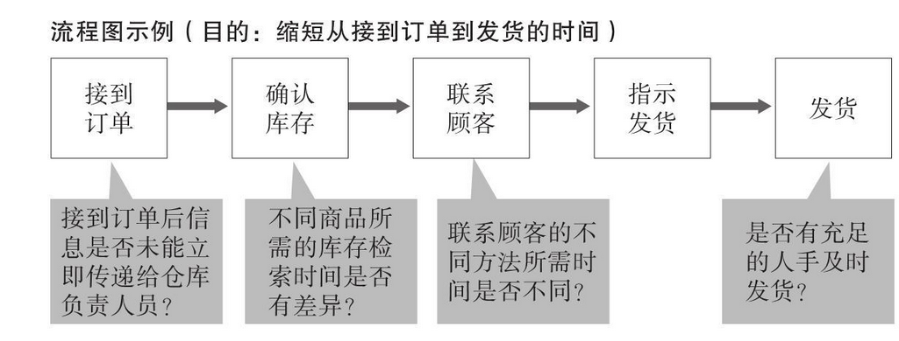
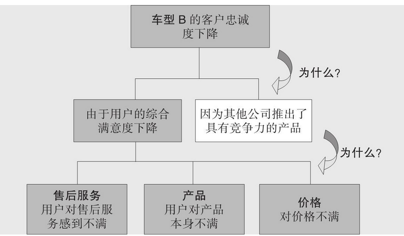
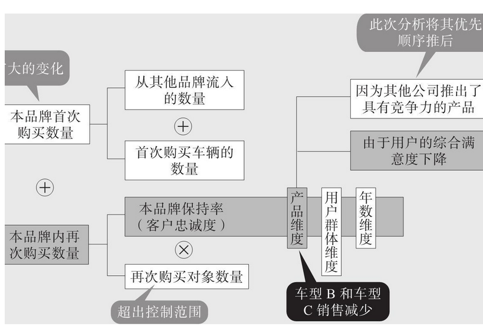
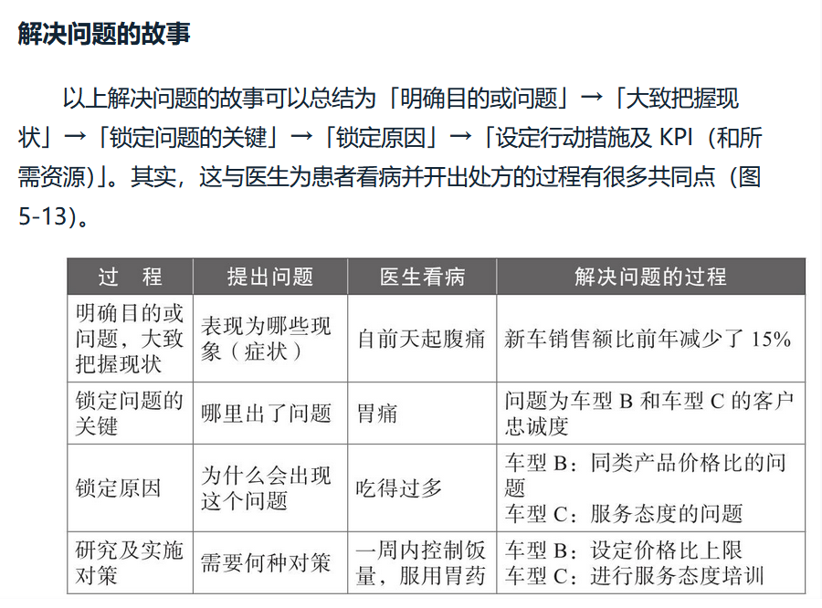

> [《如何用数据解决实际问题》](https://www.zhihu.com/pub/book/119573734)
>
> 作者：柏木吉基 柏木吉基，日本数据分析实战专家及资深培训师，数据&故事公司总裁。

首先要确定数据分析目的，确定目的后做出假设，然后采取相应的策略验证假设。

可以用一个框架来帮助拟定假设

如果是其他类型的数据分析，可以考虑其他假设

数据范围和离群值对相关分析的结果也会产生较大的影响。

相关分析是个重要的工具。有时候可以采取2个维度绘制散点图的方式展示相关分析的结果

如何挖掘一个问题的本质，可以通过WHY型假设来层层递进

	

利用数据解决实际问题，最重要的是如何讲好一个故事，讲好故事的同时要讲对这个故事。首先要求你对数据有个基本认知，了解都是些什么数据，这些数据的含义、数据基本特征。

其实要求的数学知识都不多，绘制的图表也很基础。

然后就是确定数据分析的目的（要解决什么问题）。根据目的，提出假设。比如要分析为什么奶茶的销量下降了？从这个问题着手基于业务经验提出自己的假设：天气逐渐变冷了；奶茶定价上升了；奶茶质量下降了等等等。如果有必要的话，还可以延伸问题。比如对于奶茶定价上升了，可以延伸为，原材料价格上升了，人力成本增加了，店铺租金增加了等多个维度。

最后就是一个一个地验证这些假设。并且采用相关分析、回归分析的方法给出具体的量化建议，给出数据分析的结果。

