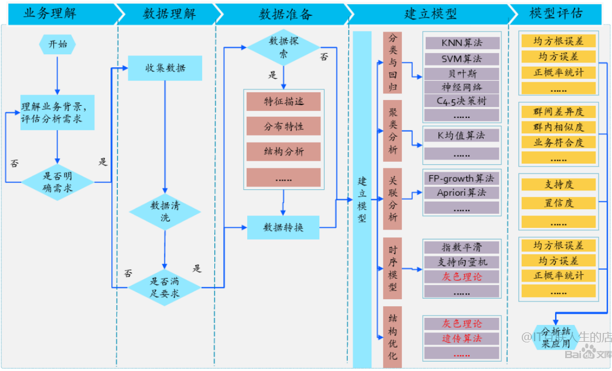
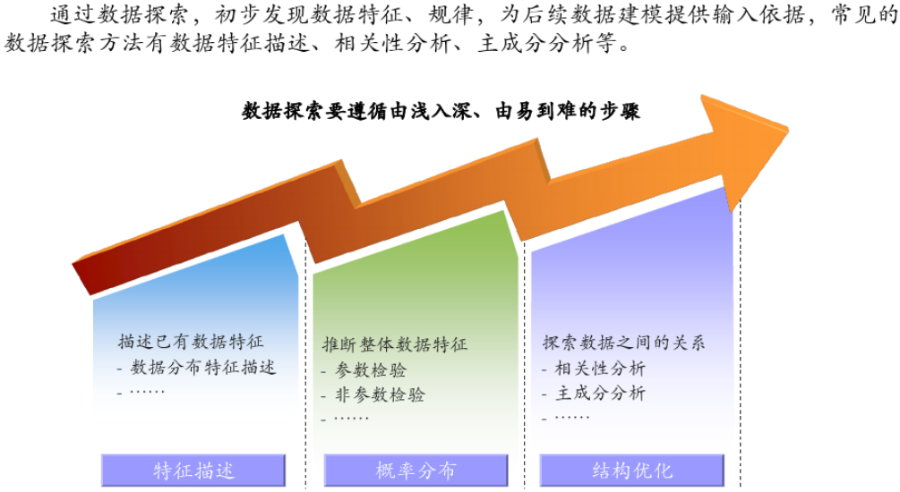
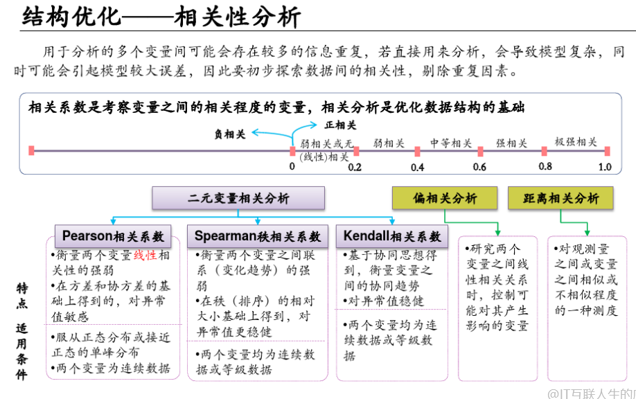

# [什么是工业大数据分析(知乎)](https://www.zhihu.com/question/61176122/answer/976147629?utm_source=wechat_session)

## 什么是大数据

大数据的5个V，数据量大Volumn、种类丰富Variety、增长速度快Velocity、真实性Veracity、价值高Vaule

> Veracity是指可用数据的不确定性。由于大量数据带来不完整性和不一致性，因此产生了准确性。

## 工业大数据

环节十分多，从材料采购、产品研发、产品生产、库存供应、市场销售、运维等等。

## 工业领域数据分析

工业领域数据分析是利用统计学分析技术、机器学习技术、信号处理技术等技术手段，结合业务知识对工业过程中产生的数据进行处理，计算，分析并提取其中有价值的信息、规律的过程。

1.对数据处理和计算的目的在于**提取统计特征**，以人们可以理解的方式展示“知识”，而这些“知识”旨在描述生产制造中“做了什么”；

2.相关性的数据分析是一种“探索因果的过程”，剔除非致命或弱相关性的假象因素，定位“为什么会这样的”根本原因；

3.假设模型的构建是对“预测的论证”，通过现有的可见因素推测将会出现的可能；再通过测试数据集来判断这种可能的可信度；

4.通过步骤1-3的不断迭代，归纳总结出数据分析报告，辅助指导、优化工业生产。最终达到“智能制造”的目标。

工业领域数据分析的“**真正意义**“在于做“**有效建模**”。如果直接套用现有成千上万的“数学模型”，例如做简单的u检验、t检验、F检验等，而不顾实际领域知识，结果只是用数据描述数据，得出的结论甚至会违背制造业常识。

所以，真正的工业领域数据分析， 应该**以工业行业中的领域知识作为“大数据分析结果”**有效性判断的起点，作为认识的定性依据。而数据建模是连接数据与领域知识的桥梁。如果能将纯粹的数据和领域知识做合理的映射， 即以有效的数学模型来描述它们之间的关系，这样的分析才称得上是“真正”的工业领域数据分析。

# [工业大数据分析指南(PPT)](https://wenku.baidu.com/view/deedc31b4973f242336c1eb91a37f111f1850d95.html)

## 工业大数据分析框架

**CRISP-DM模型**（跨行业数据挖掘标准流程）

以数据为中心，将相关工作分成**业务理解**、**数据理解**、**数据准备**、**建模**、**验证与评估**、**实施与运行**等六个基本的步骤，用以指导工业大数据分析的过程。

**CRISP-DM模型落地难点**

工业数据关联关系复杂、工业数据质量差、工业场景的分析要求高。

**工业大数据分析的指导思想**

用好CRISP-DM，减少不必要的反复，提高数据分析效率

## 工业大数据分析指南

- 认识工业对象：用系统的观点认识工业对象，理解系统功能并进行功能描述，深入认识系统的功能原理、注重系统功能与业务场景关联
- 理解数据分析需求：工业过程中的数据分析需求：DMAIC模型，界定D、测量M、分析A、改进I、控制C等五个步骤。
- 分析目标的评估：理解工业知识、分析工业知识的合用性、专业领域知识和数据模型融合
- 制造的全生命周期：跨生命周期数据的管理和分析

## 数据建模

### 数据的形式化描述

基本描述、模型的深入表述、对建模思想的影响

### 工业建模的基本过程

建模的基本思路、模型融合的方法、模型优化的过程

### 工业建模的特征工程

数据初步筛选、特征变换、特征组合、特征筛选、特征的迭代

### 工业数据分析算法介绍

传统统计分析模型

通用机器学习模型

旋转设备振动分析

时序数据时间序列类

非结构化数据文本挖掘类

统计质量控制类

排程优化类

## 模型的验证与评估

### 知识的质量

知识的确定性与准确性，知识的使用范围、知识的质量与可靠性

传统数据分析方法及问题

基于精度的验证方法

精度验证方法的局限性

解决验证问题的传统方法

**基于领域知识的模型验证与评估**

对适用范围的评估

对精度的评估

场景的综合评估

模型的迭代评估

### [企业大数据分析方法论](https://www.docin.com/p-2564208438.html)

数据特征描述

数据分布初步推断

Pearson相关系数：衡量两个变量线性相关性的强弱。对异常值敏感。适用于服从正态分布的数据。

Spearman秩相关系数：衡量两个变量之间的联系（变化趋势）的强弱。在秩（排序）的相对大小基础上得到，对异常值更稳健。

Kendall相关系数：基于协同思想得到，衡量变量之间的协同趋势

### 时间序列分析

长期趋势：随时间变化而逐渐增加或减少的长期变化趋势

季节变动：时间序列在一年中或固定时间内呈现的固定规则的变动

循环变动：沿着趋势线如钟摆般地循环变动，又称景气循环变动

不规则变动：在时间序列中由于随机因素影响所引起的变动

组合模型：

- 加法模型：假定时间序列是基于4个成分相加而成的
- 乘法模型：假定时间序列是基于4种成分相乘而成的

