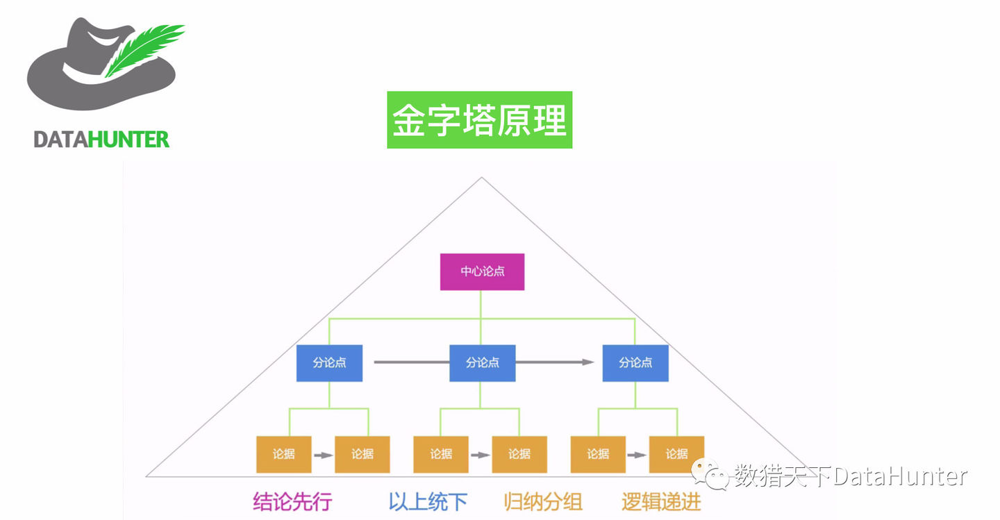
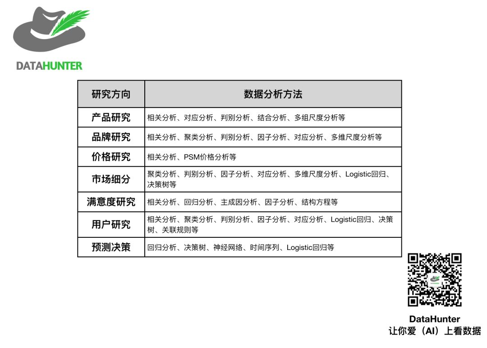

[如何写好一份数据分析报告](https://www.zhihu.com/question/39373532)

**1、展示分析结果**
报告以某一种特定的形式将数据分析结果清晰地展示给决策者，使得他们能够迅速理解、分析、研究问题的基本情况、结论与建议等内容。

**2、验证分析质量**
从某种角度上来讲，分析报告也是对整个数据分析项目的一个总结。通过报告中对数据分析方法的描述、对数据结果的处理与分析等几个方面来检验数据分析的质量，并且让决策者能够感受到这个数据分析过程是科学并且严谨的。

**3、提供决策参考**

大部分的数据分析报告都是具有时效性的，因此所得到的结论与建议可以作为决策者在决策方面的一个重要参考依据。虽然，大部分决策者（尤其是高层管理人员）没有时间去通篇阅读分析报告，但是在决策过程中，报告的结论与建议或其他相关章节将会被重点阅读，并根据结果辅助其最终决策。所以，分析报告是决策者二手数据的重要来源之一。

**数据分析报告的结构**
数据分析报告确实有特定的结构，但是这种结构并非一成不变，不同的数据分析师、不同的老板、不同的客户、不同性质的数据分析，其最后的报告可能会有不同的结构。最经典的报告结构还是“总—分—总”结构，它主要包括：开篇、正文和结尾三大部分。

**前言**

**（1）分析背景**

对数据分析背景进行说明主要是为了 让报告阅读这对整个分析研究的背景有所了解，主要阐述此项分析的主要原因、分析的意义、以及其他相关信息，如行业发展现状等内容。

**（2）分析目的**

数据分析报告中陈述分析目的是为了让报告的阅读者了解开展此次分析能带来何种效果，可以解决什么问题。有时将研究背景和目的意义合二为一。

**（3）分析思路**

分析思路用来指导数据分析师如何进行一个完整的数据分析，即确定需要分析的内容或指标。这是分析方法论中的重点，也是很多人常常感到困惑的问题。只有在营销、管理理论的指导下，才能确保数据分析维度的完整性，分析结果的有效性及正确性。可参考之前的文章《[干货 | 如何从零开始学数据分析](https://link.zhihu.com/?target=https%3A//mp.weixin.qq.com/s%3F__biz%3DMzIyNDQ3MTk2Nw%3D%3D%26mid%3D2247485414%26idx%3D1%26sn%3Da98ccbcf93ce254e2d3cd747af405e74%26scene%3D21%23wechat_redirect)》

**正文**

正文是数据分析报告的核心部分，它将系统全面地表述数据分析的过程与结果。

撰写正文报告时，根据之前分析思路中确定的每项分析内容，利用各种数据分析方法，一步步地展开分析，通过图表及文字相结合的方式，形成报告正文，方便阅读者理解。

正文通过展开论题，对论点进行分析论证，表达报告撰写者的见解和研究成果的核心部分，因此正文占分析报告的绝大部分篇幅。一篇报告只有想法和主张是不行的 ，必须经过科学严密的论证，才能确认观点的合理性和真实性，才能使别人信服。因此，报告主题部分的论证是极为重要的。

报告正文具有以下几个特点：是报告最长的主题部分、包含所有数据分析事实和观点、通过数据图表和相关的文字结合分析、正文各部分具有逻辑关系。

作者：DataHunter
链接：https://www.zhihu.com/question/39373532/answer/566222481
来源：知乎
著作权归作者所有。商业转载请联系作者获得授权，非商业转载请注明出处。

我们通常通过金字塔原理来组织报告逻辑，整个报告的核心观点是什么，又由哪些子观点构建，支持每个子观点的数据是什么，如图所示：

**5、结论与建议**

结论是以数据分析结果为依据得出的分析结果，通常以综述性文字来说明。它不是分析结果的简单重复，而是结合公司实际业务，经过综合分析、逻辑推理形成的总体论点。结论是去粗取精、由表及里而抽象出的共同、本质的规律，它与正文紧密衔接，与前言相呼应，使分析报告首尾呼应。结论应该措辞严谨、准确、鲜明。

建议是根据数据分析结论对企业或业务等所面临的问题而提出的改进方法，建议主要关注在保持有时候及改进劣势等方面。因为分析人员所给出的建议主要是基于数据分析结果而得到的。会存在局限性，因此必须结合公司的具体业务才能得出切实可行的建议。

**6、附录**

附录是数据分析报告的一个重要组成部分。一般来说，附录提供正文中涉及而未予阐述的有关资料，有时也含有正文中提及的资料，从而向读者提供一条深入数据分析报告的途径。它主要包括报告中涉及的专业名词解释、计算方法、重要原始数据、地图等内容。每个内容都需要编号，以备查询。

当然并不是要求每篇报告都有附录，附录是数据分析报告的补充，并不是必需的，应该根据各自的情况再决定是否需要在报告结尾处添加附录。

**注意事项**

**1、分析结论要明确，要精，要有逻辑**

如果没有明确的结论那分析就不叫分析了，也失去了意义，因为我们是要去寻找或者印证一个结论才会去做分析的，所以千万不要忘本舍果；

如果可以的话一个分析一个最重要的结论就好了，很多时候分析就是发现问题，如果一个分析能发现一个重大问题，就达到目的了，不要事事求多，宁要仙桃一口，不要烂杏一筐，精简的结论也容易让阅读者接受，减少重要阅读者（通常是事务繁多的领导，没有太多时间看那么多）的阅读心理门槛，如果别人看到问题太多，结论太繁，读不下去，一百个结论也等于零；

不要有猜测性的结论，太主观的东西会没有说服力，如果一个结论连自己都没有肯定的把握就不要拿出来误导别人了。

作者：DataHunter
链接：https://www.zhihu.com/question/39373532/answer/566222481
来源：知乎
著作权归作者所有。商业转载请联系作者获得授权，非商业转载请注明出处。

**2、数据分析报告尽量图表化，风格统一**

用图表代替大量堆砌的数字会有助于人们更形象更直观地看清楚问题和结论，当然，图表也不要太多，过多的图表一样会让人无所适从；

数据分析报告本身是一个很严肃的东西，跟样式、美观程度也有一定关系，不是说做的花销，而是基本的美观度要保证，风格要统一。例如一些常识性的配色：餐饮类（暖色调，例如橘色、红色、黄色）；国际贸易类（蓝色、灰色、雾蓝色、灰绿色等）；社会人文类（按照感情颜色进行配色，例如较严峻的社会问题，要用灰色、深蓝；较喜庆的，使用红色、绿色、黄色；具体可按需搭配对比色和互补色等）。

**3、好的分析一定要基于可靠的数据源，同时具有可读性**

其实很多时候收集数据会占据更多的时间，包括规划定义数据、协调数据上报、让开发人员提取正确的数据或者建立良好的数据体系平台，最后才在收集的正确数据基础上做分析，既然一切都是为了找到正确的结论，那么就要保证收集到的数据的正确性， 否则一切都将变成为了误导别人的努力；

除此之外，每个人都有自己的阅读习惯和思维方式，写东西总会按照自己的思维逻辑来写，别人不一定了解，要知道阅读者往往只会花10分钟以内的时间来阅读，所以要考虑你的报告阅读者是谁？他们最关心什么？必须站在读者的角度去写分析报告。

# 常见数据分析方法

## 1、对比分析法

**（1）定义**

是指将两个或两个以上的数据进行比较，分析它们的差异，从而揭示这些数据所代表的事物发展变化情况和规律性。对比分析法的特点是：可以非常直观地看出事物某方面的变化或差距，并且可以准确、量化地表示出这种变化或差距是多少？

**（2）分类**

对比分析法可分为静态比较和动态比较两类

静态比较是在同一时间条件下对不同总体指标的比较，如不同部门、不同地区、不同国家的比较、也叫横向比较，简称横比

动态比较是在同一总体条件下对不同时期指标数值的比较，也叫纵向比较，简称纵比

这两种方法既课单独使用，也可结合使用。进行对比分析时，可以单独使用总量指标、相对指标或平均指标，也可将它们结合起来进行对比。比较的结果可用相对数表示，如百分数、倍数等指标。

**（3）实践运用**

a）与目标对比：实际完成值与目标进行对比，属于横比；

b）不同时期对比：选择不同时期的指标数值作为对比标准，属于纵比；

c）同级部门、单位、地区对比：与同级部门、单位、地区进行对比，属于横比；

d）行业内对比：与行业中的标杆企业、竞争对比或行业的平均水平进行对比，属于横比

e）活动效果比：对某项营销活动开展前后进行对比，属纵比。同时，我们还可以对活动的开展状况进行分组对比，这属于横比。

**（4）注意事项**

指标的口径范围、计算方法、计量单位必须一致，即要用同一种单位或标准去衡量；对比的对象要有可比性；对比的指标类型必须一致。无论绝对数指标、相对数指标、平均数指标，还是其他不同类型的指标，在进行对比时，双方必须统一。 

## 2、分组分析法

**（1）定义**

作数据分析不仅要对总体的数量特征和数量关系进行分析，还要深入总体的内部进行分组分析。这种方法是根据数据分析对象的特征，按照一定的标志（指标），把数据分析对象划分为不同的部分和类型来进行研究，以揭示其内在的联系和规律性。

**（2）目的**

分组的目的就是为了便于对比，把总体中具有不同性质的对象区分开，把性质相同的对象合并在一起，保持各组内对象属性的一致性、组与组之间属性的差异性，以便进一步运用各种数据分析方法来解构内在的数量关系，因此分组法必须与对比法结合运用。

**（3）步骤**

a）确定组数

这个可以由数据分析师决定，根据数据本身的特点（数据的大小）来判断确定。由于分组的目的之一是为了观察数据分布的特征。因此确定的组数应适中。如果组数太少，数据的分布就会过于集中，组数太多，数据的分布就会过于分散，这都不便于观察数据分布的特征和规律

b）确定各组的组距

组距是一个组的最大值与最小值只差，可根据全部数据的最大值和最小值及所分的组数来确定，及组距=（最大值—最小值）/组数

c）根据组距大小，对数据进行分组整理，划归至相应组内。 

## **3、结构分析法**

结构分析法是指被分析总体内的各部分与总体之间进行对比的分析方法，即总体内各部分占总体的比例，属于相对指标。一般某部分的比例越大，说明其重要程度越高，对总体影响越大。

**结构相对指标（比例）=（总体某部分的数值/总体总量）\*100%**

**市场占有率=（某种商品销售量/该种商品销售总量）\*100%**

市场占有率是分析企业在行业中竞争状况的重要指标，也是衡量企业运营状况的综合经济指标。市场占有率高，表明企业运营状况好，竞争能力强，在市场上占据有利地位；反之，则表明企业运营状态差，竞争能力弱，在市场上处于不利地位。 

## **4、平均分析法**

平均分析法就是运用计算平均数的方法来反应总体在一定时间、地点条件下某一数量特征的一般水平。平均指标法的主要作用有两点：

（1）利用平均指标对比同类现象在不同地区、不同行业、不同类型单位等之间的差异程度，比用总量指标对比更具有说服力

（2）利用平均指标对比某些现象在不同历史时期的变化，更能说明其发展趋势和规律。

**算术平均数=总体各单位数值的综合/总体单位个数**

算术平均数是非常重要的基础指标。平均数是综合指标，它的特点是将总体内各单位的数量差异抽象化，它只能代表总体的一般水平，掩盖了在平均数后各单位的差异。 

## **5、交叉分析法**

交叉分析法通常用于分析两个变量（字段）之间的关系，即同时将两个有一定联系的变量及其值交叉排列在一张表格内，使各变量值成为不同变量的交叉结点，形成交叉表，从而分析交叉表中变量之间的关系。交叉表当然也有也有二维以上的，维度越多，交叉表就越复杂，所以在选择几个维度的时候需要根据分析的目的决定。

## **6、综合评价分析法**

综合评价分析法是将多个指标转化为一个能够反映综合情况的指标来进行分析评价。主要有5个步骤：

（1）确定综合评价指标体系，即包含哪些指标，是综合评价的基础和依据。

（2）收集数据，并对不同计量单位的指标数据进行标准化处理。

（3）确定指标体系中各指标的权重，以保证评价的科学性。

（4）对经处理后的指标再进行汇总计算出综合评价指数或综合评价分值。

（5）根据评价指标或分值对参评单位进行排序，并由此得出结论 。

**7、杜邦分析法**

杜邦分析法是由美国杜邦公司创造并最先采用的一种综合分析方法，又称杜邦财务分析体系，简称杜邦体系。它是利用各主要财务指标间的内在联系，对企业财务状况及经济效益进行综合分析评价的方法。

杜邦分析体系的特点是，将若干个用以评价企业经营效率和财务状况的比率按其内在联系有机结合起来，形成一个完整的指标体系，并最终通过权益收益率来综合反映。杜邦分析采用的金字塔形结构，使财务比率分析的层次更清晰、条理更突出，简洁明了地表达了各财务指标之间的关系。 

## 8、漏斗分析法

漏斗图分析法是一个适合业务流程比较规范、周期比较长、各流程环节涉及复杂业务过程比较多的管理分析工具。例如漏斗图用于网站中某些关键路径的转化率的分析，不仅能显示用户从进入网站到实现购买的最终转化率，同时还可以展示整个关键路径中每一步的转化率。

单一的漏斗图无法评价网站某个关键流程中个步骤转化率的好坏。我们可以利用之前介绍的对比分析法，对同一环节优化前后的效果进行对比分析，或对同一环节不同细分用户群的转化率作比较，或对同行业类似产品的转化率进行对比，等等。 

## 9、矩阵关联分析法

矩阵分析法是指根据事物（产品、服务等）的两个重要属性（指标）作为分析的依据，进行分类关联分析，找出解决问题的一种分析方法，也成为矩阵关联分析法，简称矩阵分析法。

矩阵关联分析法在解决问题和资源分配时，为决策者提供重要参考依据。先解决主要矛盾，再解决次要矛盾，有利于提高工作效率，将资源分配到最能产生绩效的部门、工作中，有利于决策者进行资源优化配置。 

**10、高级数据分析法**

