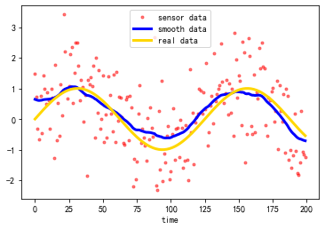

https://github.com/cerlymarco/tsmoothie/blob/master/notebooks/Basic%20Smoothing.ipynb

```python
# 卡尔曼平滑
import numpy as np
import matplotlib.pyplot as plt
from tsmoothie.smoother import KalmanSmoother, LowessSmoother, ConvolutionSmoother

np.random.seed(2021)
x = np.linspace(0, 10, 200)
real = np.sin(x)
error = np.random.randn(200)
data = real + error

# 创建平滑器，调小level可以更平滑
smoother = KalmanSmoother(component='level_trend', 
                          component_noise={'level':.01, 'trend':0.})
# 平滑数据
smoother.smooth(data)

# 绘图
plt.plot(smoother.data[0], '.r', alpha=.5, label='sensor data')
plt.plot(smoother.smooth_data[0], lw=3, color='blue', label='smooth data')
plt.plot(real, color='gold', lw=3, label='real data')
plt.xlabel('time')
plt.legend()
```



其他两个平滑方法也比较好用

```python
smoother = LowessSmoother(smooth_fraction=0.2, iterations=1)
smoother = ConvolutionSmoother(window_len=20, window_type='ones')
```


LowessSmoother
ConvolutionSmoother