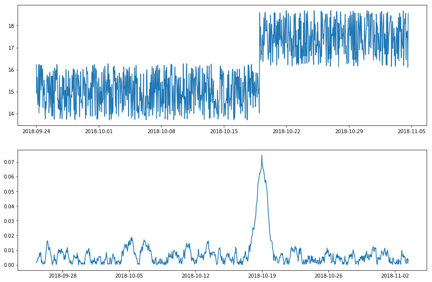
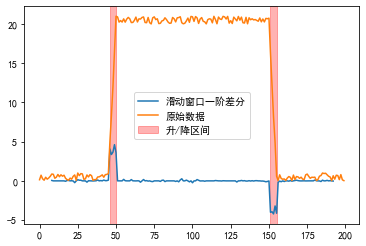

# 异常检测

https://www.zhihu.com/question/280696035/answer/417065342

https://github.com/yzhao062/anomaly-detection-resources


[ADTK文档](https://adtk.readthedocs.io/en/stable/)

[ADTK github](https://github.com/odnura/adtk)

谷歌搜索：Time Series Anomaly Detection Algorithms

https://blog.csdn.net/akenseren/article/details/102920507

## 异常类型

### 离群值(Outlier)

离群值是最基本的时间序列异常，可以通过设定阈值等方式检测这一异常，比如下图的实现序列，可以设定异常检测策略为：大于17的点为异常点。

> 很多其他类型的异常值都是通过将时间序列转换为新的时间序列，然后应用离群值检测方法找出来的。


### 脉冲与阶跃(Spike and Level Shift)


脉冲异常指连续平稳的时间序列突然出现了一个毛刺数据。

阶跃异常指连续平稳的时间序列突然上升/下降

两者的共同点在于：异常是跟时间相关的，虽然脉冲异常看起来与上面的离群值异常相似，但脉冲异常与时间相关，而离群值异常与时间无关。如果在不考虑时间顺序的情况下对所有数据点进行检查，则脉冲峰值可能是正常的


可以通过并排滑动两个时间窗口，并计算它们的平均值(或中位数)之差，来得到一个新的时间序列。

当左右窗口的统计值差异比较明显时，说明这个区域附近发生了异常。

时间窗口的长度控制要检测的变化的时间尺度：对于脉冲异常，左窗口比右窗口长，以捕获近期的代表性信息；另一方面，对于阶跃异常，两个窗口都应足够长，以捕获稳定状态。



### 模式改变(Pattern Change)

上述策略可以推广延伸，比如下面这种波动变化改变的异常。之前波动幅度较大，突然一个时间点过后，波动幅度变小了。

这种也是利用双滑动窗口统计值之差来发现，比如使用**标准差**，**方差**


此外，单窗口统计值也可以发现异常。例如，如果想要检测到系统的临时大量访问，则可以计算滑动窗口中的访问总次数。


### 季节性(Seasonality)

当时间序列受季节性因素（例如一天中的小时、一周中的一天、一年中的一个月）影响时，就存在季节性模式。

首先移除季节模式（怎么移除？）然后计算残差检测出季节性异常。


需要注意区分季节性序列和循环序列。

由于季节性，季节性序列总是有一个固定的、通常可解释且已知的周期。

由于其物理性质，循环时间序列不会遵循固定的周期模式，即使它似乎重复类似的子序列。

例如，旋转设备中的移动部件的轨迹是三维循环时间序列，其**周期**取决于转速并且不固定。用季节性的异常检测方法转换时间序列无法得到想要的结果。


目前，ADTK不提供一个transformer，可从循环（而非季节性）时间序列中删除循环模式。然而，Adtk.Detector.AutoreGustrionad可以捕获自回归关系的变化（在过去的过去的数据点和点之间的关系），并且可以在某些情况下用于循环（但不是季节性）系列。

## 检测方法

### 双窗口检测

https://adtk.readthedocs.io/en/stable/notebooks/demo.html#DoubleRollingAggregate

具体而言，就是两个**不重叠**的窗口之内的统计值计算。

比如：一个长度100的窗口，分成两个长度为50的小窗口，分别计算窗口内的统计值。


## 其他

```python
import numpy as np
import matplotlib.pyplot as plt
x = np.random.random(200)
x[:50] += 50
x[50:100] += -1 * np.arange(50) + 50
x[150:155] += 40
x = pd.Series(x)
x.plot()
```


观察该曲线可以发现

```python
# 10秒内变化幅度达到40
(x - x.rolling(10, center=True).min()).plot()
```


其附近的值小于5，只有异常区间大于20。

此处也可以采用`median()`

```python
x[(x - x.rolling(10, center=True).min()) > 5]=None
x.plot()
```

## level shift anomaly detect

先求滑动均值或中位数，然后对求出来的滑动均值求一阶差分，就能得到异常值。

优点：专门用来寻找阶跃区间。

缺点：可能会忽视掉毛刺数据。

构建数据

```python
x = np.random.random(200)
x[50:150] += 20
x[45:50] += 20 * np.arange(5) / 5
x[150:155] += - 20 * np.arange(5) / 5 + 20

x = pd.Series(x)
x.plot()
```


求滑动窗口中位数，可以看到数据被平滑了。

```python
x1 = x.rolling(15, center=True).median()
x1.plot()
```


求滑动窗口中位数的一阶差分，其中蓝色线会有比较明显的突起，求这个突起发生的时间范围即可确定升/降区间

```python
x2 = x1.diff()
x2.plot(label='滑动窗口一阶差分')
plt.axvspan(x2[x2>0.5].index[0], x2[x2>0.5].index[-1], color='r', alpha=.3)
plt.axvspan(x2[x2<-0.5].index[0], x2[x2<-0.5].index[-1], color='r', alpha=.3, label='升/降区间')
x.plot(label='原始数据')
plt.legend()
```




