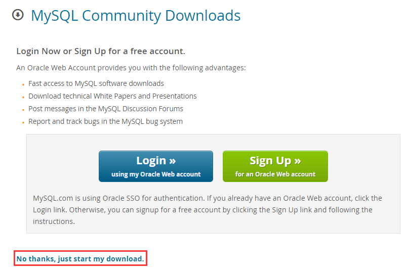
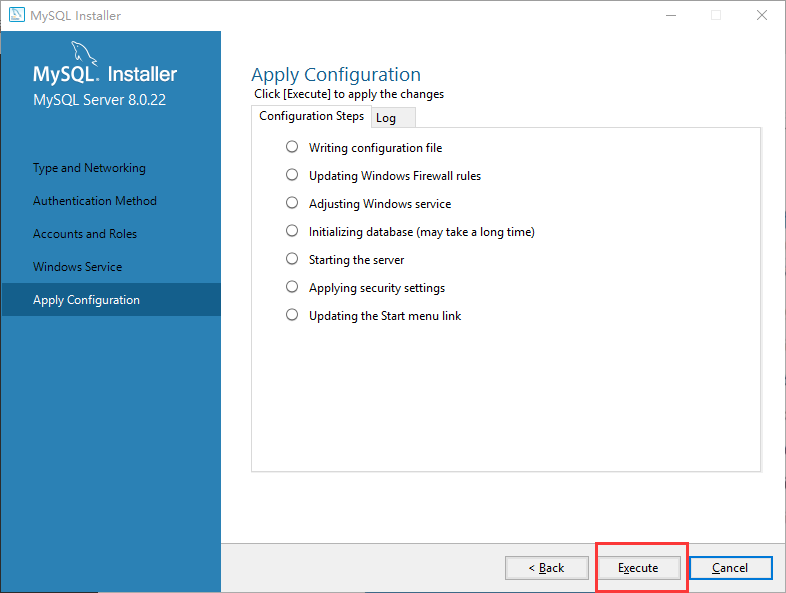
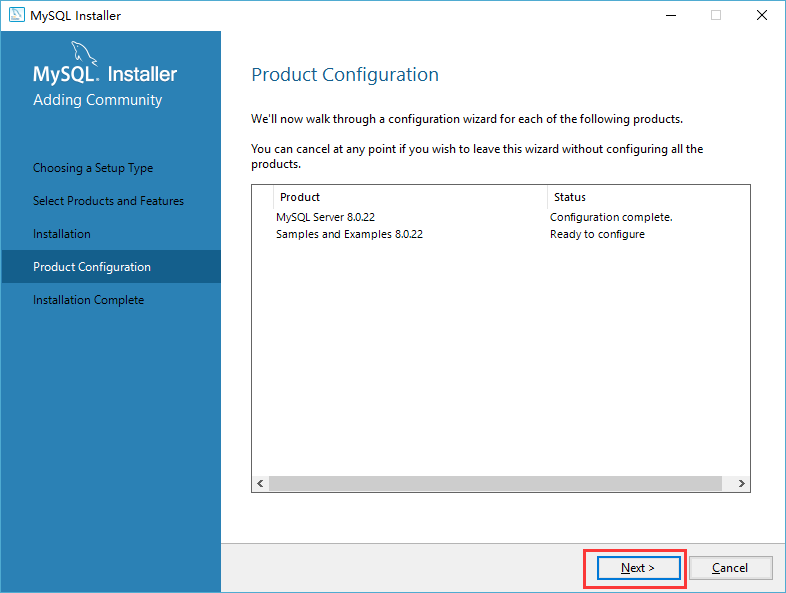
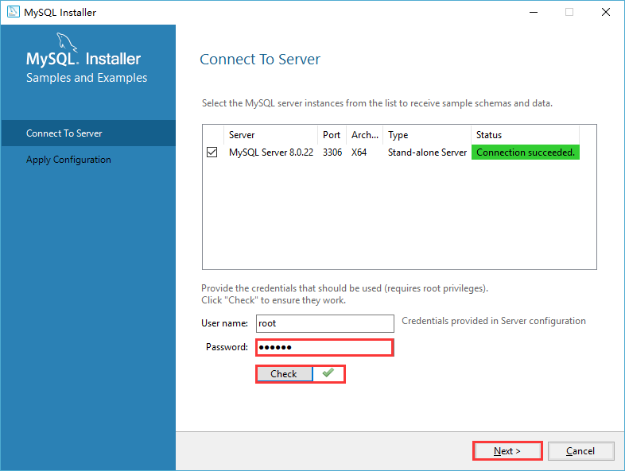
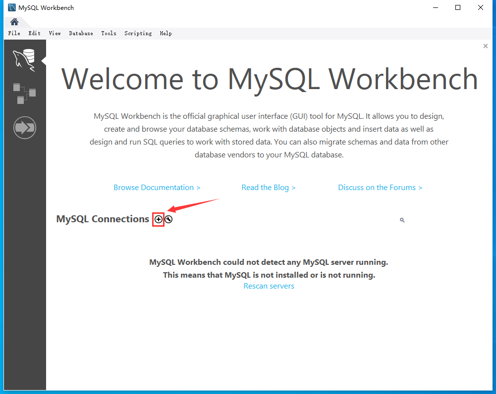
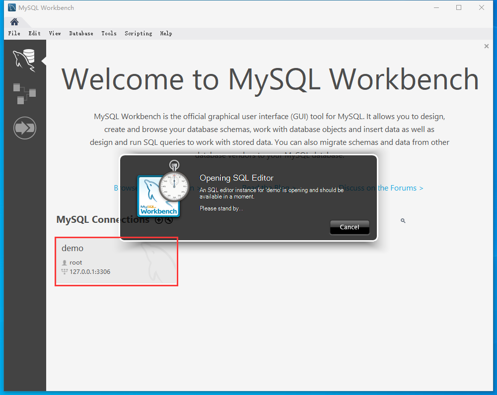

# 1. 数据库概述

数据库的四个基本操作CURD：

- 创建（Create）
- 更新（Update）
- 读取（Retrieve）
- 删除（Delete）

数据库管理系统（Database Manage System）：管理数据库的软件，用于建立和维护数据库，比如MySQL。有，，

SQL（Structure Query Language）结构化查询语言。SQL是通过数据库软件（DBMS）和数据库（DB）通信的工具。

## 1.1 数据库分类和常见数据库

关系型数据库和非关系型数据库

- 关系型：采用关系模型（二维表）来组织数据结构的数据库
- 非关系型：不采用关系模型组织数据结构的数据库。例如：Redis、MongoDB

开源数据库和非开源数据库

- 开源：MySQL、SQLite、MongoDB
- 非开源：Oracle、SQL Server、DB2

常见关系型数据库

| 数据库软件名称 | 所属公司          | 费用      | 适用场景     |
| -------------- | ----------------- | --------- | ------------ |
| SQLite         | 开源              | 免费      | 嵌入式项目   |
| MySQL          | Oracle（甲骨文）  | 免费/收费 | 中小型项目   |
| SQL Server     | Microsoft（微软） | 版本付费  | 大中型项目   |
| Oracle         | Oracle（甲骨文）  | 授权费/年 | 大型项目     |
| OceanBase      | Alibaba（阿里）   | 方案付费  | 企业级分布式 |

> MySQL 并不是所有版本都是免费的，MySQL 各版本及费用介绍如下:
>
> 1、 MySQL Community Server 社区版本，开源免费，但不提供官方技术支持。
> 2、MySQL Enterprise Edition 企业版本，需付费，可以试用30天。
> 3、 MySQL Cluster 集群版，开源免费。可将几个MySQL Server封装成一个Server。
> 4、 MySQL Cluster CGE 高级集群版，需付费。
> MySQL Community Server 是开源免费的，这也是我们通常用的MySQL的版本。  

> **Oracle商业收费标准简介**
> Oracle软件本身是免费的，所以任何人都可以从Oracle官方网站下载并安装Oracle的数据库软件，收费的是License，即软件授权，如果数据库用于商业用途，就需要购买相应Oracle产品的License。
> 现在Oracle有两种授权方式，按CPU(Process)数和按用户数(Named User Plus)。前一种方式一般
> 用于用户数不确定或者用户数量很大的情况，典型的如互联网环境，而后一种则通常被用于用户数
> 确定或者较少的情况。  

# 2. MySQL入门

## 2.1 安装和启动

https://dev.mysql.com/downloads/windows/installer/8.0.html  

2020-01-16


- 大的安装包功能较全，推荐使用，可以选择安装指定的部件，点击download下载安装包。



直接点击红框部分即可开始下载。

下载完成后，双击打开`mysql-installer-community-8.0.22.0.msi`选自定义安装：


选择安装以下几个组件，选择完毕后点击next进行下一步


点击Execute，等待一段时间


完整后会全部打上:heavy_check_mark:，如下图，点击Next


进入如下界面，继续点击Next


进入配置界面，直接点击Next即可


直接点击Next


填写root用户和密码，我这里填了123456，会提示是弱密码，暂时不用管。


进入服务配置窗口，默认设置是开机自动启动的，可以直接点击Next


点击Execute



完成后点击Finish


接下来还有一些东西要安装，点击Next



输入刚才配置的密码，点击check通过后，点击Next



点击Execute


完成后点击Finish


点击Next


点击Finish


完成后会进入Workbench

## 2.2 基本操作

进入界面后首先需要创建一个MySQL服务，点击MySQL Connections 旁边的加号



只需要设置Connection Name，并点击Password旁边的 Store in Vault...设置初始密码，然后点击OK。我这里密码设置的也是root。


这时候就创建好了一个MySQL连接，点击这个连接会让你等一会




## 2.3 使用windows命令行

先找到mysql安装的路径

`C:\Program Files\MySQL\MySQL Server 8.0\bin`

把这个路径加入环境变量。

启动与连接

本地连接可省略 -h 选项。

```
mysql -h localhost -u root -p root
```


# 3.服务器安装MySQL

https://cloud.tencent.com/developer/article/1395973