关系型数据库的存储特点

- **数据库**：数据表的容器，数据存放在数据表中。一个数据库可以有多个表。
- **数据表**：存放数据的表格，每个表都有一个名字，表名具有唯一性。
- **字段**：每个列，也称为字段。用来表示该列数据的含义，所有表都是由一个或多个列组成
- **记录**：每个行，表示一组完整的数据。表中的数据是按行存储的。


概念对比

| 数据库       | Excel         | 面向对象 |
| ------------ | ------------- | -------- |
| 库(Database) | 文件(.xlsx)   |          |
| 表(Table)    | 工作簿(sheet) | 类       |
| 字段(Field)  | 列            | 属性     |
| 记录(Record) | 行            | 对象     |


SQL语句

结构化查询语言（Structured Query Language），一种特殊目的的编程语言，是一种数据库查询和程序设计语言，用于存取数据以及查询、更新和管理关系数据库系统。

SQL语句使用特点：

- SQL语言基本上独立于数据库本身
- 各种不同的数据库对SQL语言的支持与标准存在着细微的不同
- 每条命令必须以；结尾
- SQL命令关键字不区分字母大小写

SQL语言内容：

- 数据查询语言：select
- 数据定义语言：DDL(Data Define Language)
  - create
  - drop
  - alter
- 数据操作语言：DML(Data Manipulate Language)
  - insert
  - update
  - delete
- 数据控制语言：DCL(Data Control Language)
  - grant
  - revoke
- 事务控制语言：commit, rollback

MySQL的语法规范：

- 不区分大小写，建议关键字大写，表名、列名小写
- 每条命令用分号结尾
- 每条命令根据需要，可以缩进、换行
- 注释（ctrl + /）
  - 单行注释： `#` 或 `--`
  - 多行注释： `/* 注释的内容 */`

# 数据库操作

## 图形化界面

### 创建数据库

点击图中红色框标签，可以新建schema，可以简单地把schema理解为数据库。


点击后会弹出一个页面，默认的字符集是utf8mb4，会默认选择第一个排序规则，所谓排序规则就是比如windows系统中，可以按名称进行排序，这样就是以a开头的文件会比b开头文件更靠前。

一般选择默认选项即可，直接点击右下角的apply

> utf8 与 utf8mb4 的区别，utf8 3个字节表示一个字符，utf8mb4 用4个字节表示一个字符。

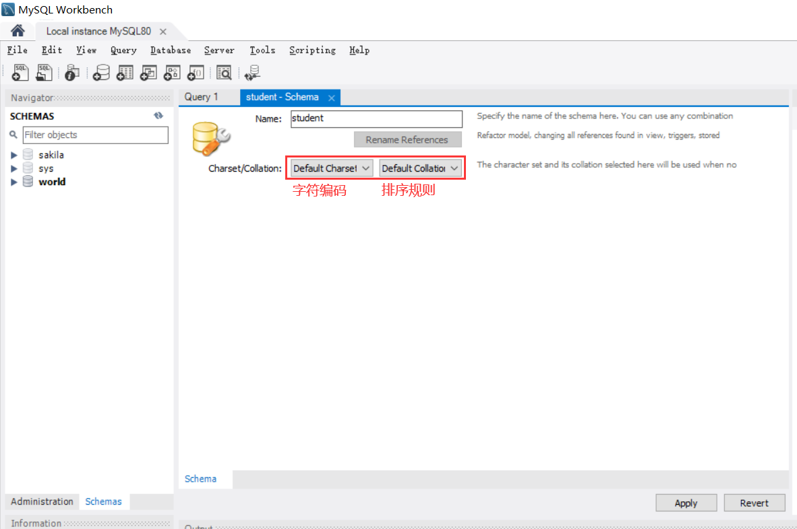

进入如下画面，直接点击apply


点击finish即可


创建完毕后，可以看到右侧导航栏已经多出了一个数据库

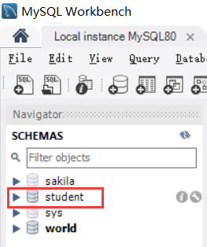

数据库文件的格式：

找到MySQL的文件存放路径`C:\ProgramData\MySQL\MySQL Server 8.0\Data`

进入sakila文件夹


可以看到数据库文件的格式是这样的

比如第一个actor.ibd，就是存储了一张叫actor的表


回到图形化界面，并右键把student表删了

接下来学习如何使用命令行的方式操作数据库

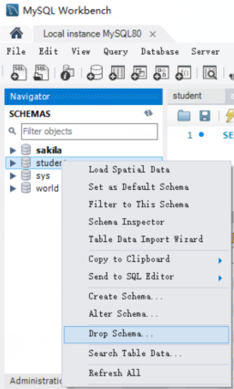

### 导入导出数据库

文件夹下有个叫`oracle.sql`的数据库脚本，是oracle数据库的学习资料，这里用来辅助学习

点击导航栏上的Server - DataImport


选中Import from Self-Contained File，并选择路径

新创建一个数据库用来导入

点击Start Import开始导入


完成之后在左侧刷新就能看到数据库了

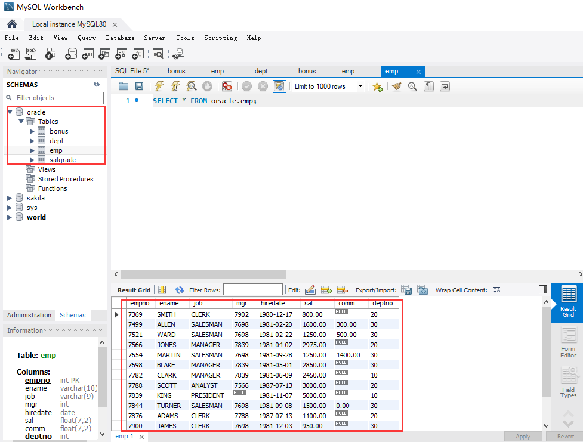


## 命令行方式

大小写不敏感：`StuDent`和`student`是同样的。

显示所有数据库

```mysql
show databases;
```

### 创建数据库

```mysql
create database student;
```

创建时指定字符集

```mysql
create database student character set utf8;
create database [if not exists] student charset=utf8mb4;
```

- 多次创建会报错
- 如果不指定字符编码，默认为utf8mb4（一个汉字4字节）
- 给数据库命名一定要习惯性加上反引号，防止和关键字冲突

### 查看数据库

显示所有数据库

```mysql
show databases;
```

显示数据库的字符集

```mysql
show create database student;
```

### 使用某个数据库

```mysql
use student;
```

查看当前选择的数据库

```mysql
select database();
```

查看当前数据库下的表

```mysql
sh
```


### 删除数据库

```mysql
drop database [if exists] student;
```

### 修改数据库

```mysql
-- 只能修改字符集
alter database student charset=utf8;
```


# 数据表操作

- 创建数据表
- 查看数据表
  - 查看所有数据表
  - 查看一张数据表的表结构
- 删除或清空数据表
- 修改数据表
  - 修改表名
  - 删除数据列
  - 修改数据列
  - 调整数据列顺序

> **数据库引擎**：存储、查询、锁机制、事务处理等方面有不同的设定，会影响数据的查询效率，根据不同的业务需求，需要选择不同的数据存储引擎。
>
> **ID(Identity document)**：身份标识号。是账号、唯一编码、专属号码等概念的表达。
>
> **空间数据类型(Spatial Data Types)**：用来存储经纬度等地理位置信息。

表结构的设置

- 分析存储内容
- 确定字段构成
- 设计字段类型

## 图形化界面

### 查看表

可以右键表，选择Table Inspector，弹出右侧的页面，可以选择Info、Columns、Indexes等标签查看该表的各种信息。


### 创建表

右击Tables，选择Create Table即可创建一个表，主要修改Table Name


> Engine：数据库引擎，在底层查询、存储等操作中具有一定的区别

每个字段可以选择

- Primary Key：主键，一个表中至多能有一个字段具有这个属性，且值不能重复
- Not Null：插入数据时不能为空
- Unique：不能重复
- Binary：二进制
- Unsigned：无符号？
- Zero Fill：默认0填充
- Auto Increment：自增
- Generated：

定义好列以后，点击apply


点击apply后，软件会自动帮我们生成创建数据库的语句，点击Finish就创建好了一张表

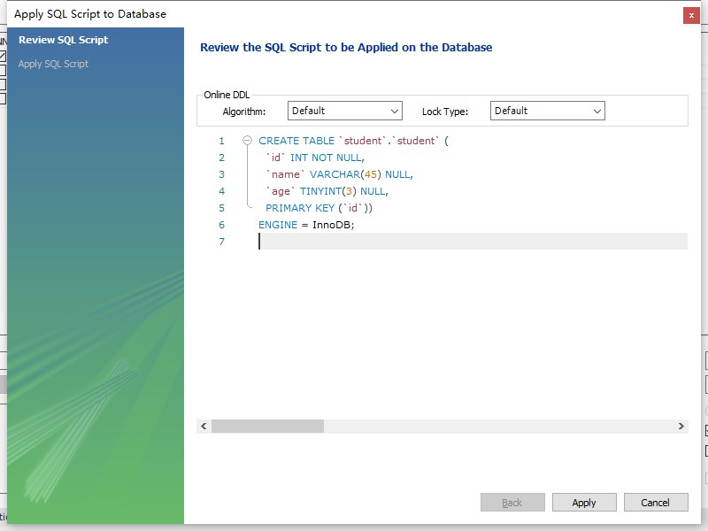

### 插入数据

鼠标放在表上，点击表格状的按钮就可以查看这个表


在下方可以添加数据，添加完毕后点击Apply


点击apply即可插入两条数据


### 修改表结构

右键表名，点击Alter table...


又回到了和之前创建表时比较类似的界面，在这里就可以更改表结构


这里新增了一列名为sex的字段，并且把name字段修改为Unique。修改之后点击Apply


### 更新表

修改后给新字段添加数据，点击apply


点击apply完成更改


### 清空表


### 删除表


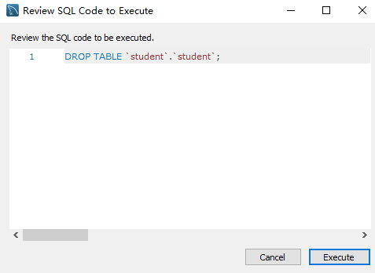

## 命令行方式

### 查看表

使用默认的学习数据库sakila做演示，首先进入这个数据库

```mysql
use sakila;
```

查看所有表

```mysql
show tables;
```

查看其中某个表的基本信息

```mysql
desc actor;
```

查看建表语句

```mysql
show create table student;
```


>有时候返回的结果太多，命令行方式查询时展示效果不佳，此时需要采用数据库管理软件进行查看。
>
>命令行方式也可以在图形化界面中使用，这样更有利于学习。
>
>不用图形化界面也行

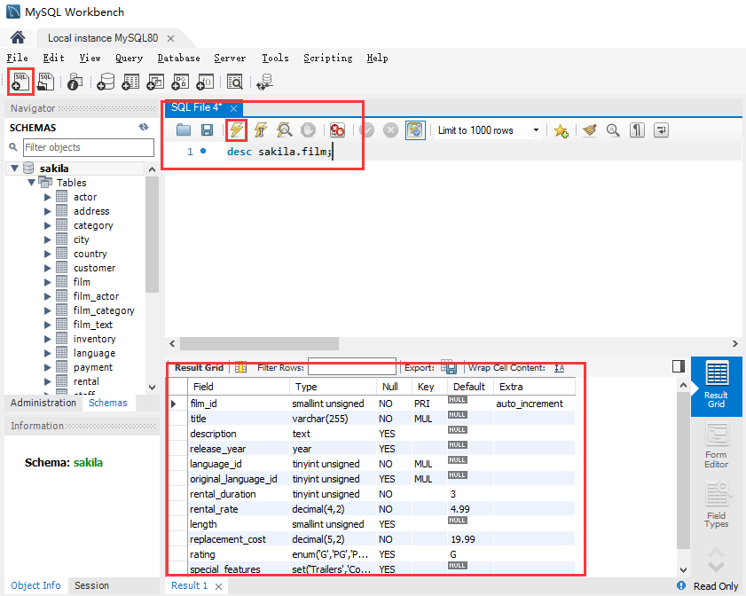

数据库脚本以sql作为后缀名

```mysql
desc sakila.film;
```

快捷键：

- ctrl + enter: 执行光标所在行
- ctrl + shift + enter: 执行整篇SQL脚本
- ctrl + ? : 添加注释
- ctrl + B : 自动格式化语法

### 创建表

```mysql
# 首先创建一个数据库
create database if not exists test charset=utf8;

use test;
# 更加稳妥的方法
# create table test.student(...)
create table student(
    id int primary key,
    stu_name varchar(20) not null,
    age tinyint(3) null
);

# 增加一些数据
insert into student(id, stu_name, age) values(1, 'lily', 14);
insert into student(id, stu_name, age) values(2, 'tom', 15);
```

执行后需要右键schemas框，选择reflesh all刷新才能看到效果

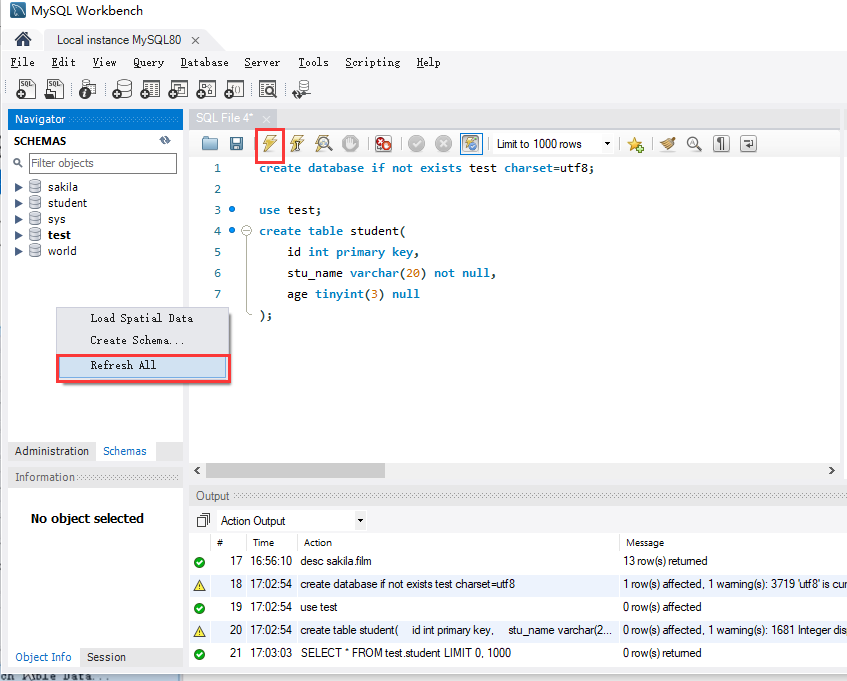

创建一个和student结构相同的数据表

```mysql
create table student2 like student;
```

### 清空/删除表

清空数据表

```mysql
truncate table student;
```

删除数据表

```mysql
drop table student2;
```

### 修改表

修改数据表名称

```mysql
alter table student rename stu;
```

重命名并移动表

```mysql
alter tabel student rename to 数据库名.表名;
```

新增字段

```mysql
# 新增一个字段
alter table stu add gender enum("male", "female");
# 新增一个字段并放到表的最前面
alter table stu add gender enum("male", "female") first;
# 新增一个字段并放到某个字段的后面
alter table stu add gender enum("male", "female") after stu_name;

# 换一个字段进行举例
alter table stu add score int not null first;
```

删除字段

```mysql
alter table stu drop column gender;
```

修改字段类型

```mysql
alter table stu modify stu_name char(10);
```

修改字段名称和类型

```mysql
alter table stu change stu_name s_name varchar(10);
# 甚至可以换一个位置
alter table stu change stu_name s_name varchar(10) after stu_name;
```

### 复制表

```mysql
# 复制一个表 不建议使用，不会复制自增和主键等属性
create table student2 select * from stu

# 创建新表，把字段和属性复制过去
create table student3 like student
insert into student3 select * from student
```

# :star:查询语句

## 基础查询

### 查询常量和表达式

```mysql
select 100;

select 100 + 5;

select 100 % 3;
```

### 简单字段查询

```mysql
use world

# 查询单个字段
select name from city;

# 查询多个字段
select id, name from city;

# 查询所有字段
select * from city;
```

### 查询函数

```mysql
# 查看当前时间
select now();

# 显示当前登录的用户名和IP
select user();

# 显示MySQL版本
select version();

# 显示当前选中的数据库
select databasae();
```

### 设置字段别名

```mysql
select name from city;

# 这几种效果都是一样的
select name 姓名 from city;
select name '姓名' from city;
select name "姓名" from city;
select name as 姓名 from city;
```

### 关键字

```mysql
select distinct CountryCode from city;
```

## 条件查询

执行顺序：from > where > select

### 关系表达式

一般主要指的是单个筛选条件

查询 **countrylanguage** 表，国家编码为中国(CHN)的数据

```mysql
select * from countrylanguage where CountryCode='CHN';
# 不等于的符号为 <> 或 !=
select * from countrylanguage where CountryCode!='CHN';
```

查询 **country** 表，人口大于10亿的国家或地区

```mysql
# 这里10E8表示 10 * 10^8
select * from country where Population>10E8;
# 效果同上
select * from country where Population>1000000000;
```

查询 **country** 表，GNP增长速率大于10%的国家或地区

```mysql
SELECT 
    `name`, gnp, gnpold, gnp / gnpold
FROM
    country
WHERE
    gnp / gnpold >= 1.1;
```

### 逻辑表达式

多个筛选条件，可以用`and`，`or`，`not`连接组合

查询 **country** 表，预期寿命小于40岁和大于80岁的国家和地区

```mysql
# 写法1
select 
    `name`, lifeExpectancy 
from 
    country 
where 
    lifeExpectancy < 40 or lifeExpectancy > 80;
```

```mysql
# 写法2
select 
    `name`, lifeExpectancy 
from 
    country 
where 
    not (lifeExpectancy >= 40 and lifeExpectancy <=80);
```

查询 **city** 表，查询中国人口超过5百万的城市

```mysql
SELECT 
    CountryCode, `name`
FROM
    city
WHERE
    Population > 500000
        AND CountryCode = 'CHN';
```

查询 **country** 表，预期寿命大于80，**或**国土面积超过100万**且**人口大于1亿的国家和地区。

```mysql
SELECT 
    `name`, LifeExpectancy, SurfaceArea, Population
FROM
    country
WHERE
    LifeExpectancy > 80
        OR (SurfaceArea > 1000000
        AND Population > 100000000);
```

### LIKE关键字

- `%`表示**0~N**个任意字符
- `_`表示**1**个任意字符
- 可以使用`\`做为转义符，也可以自定义转义符

查询国家名称中包含字母INA的（无视大小写）

```mysql
select name from country where name like '%INA%';
```

查询以字母IA结尾的国家

```mysql
select name from country where name like '%IA';
```

查询以字母CH开头的国家

```mysql
select name from country where name like 'CH%';
```

查询第3、4个字母为IN的国家

```mysql
# _ 表示占位符，表示任意一个字符
select name from country where name like '__IN%';

# 如何查询字符串带下划线 _ 的数据
# 使用 \作为转义符
select name from country where name like '\_CH';

# 也可以使用 escape关键字自定义自定义一个转义符
select name from country where name like '#_CH' escape '#';
```

### BETWEEN关键字

查询预期寿命在80至85的国家和地区

```mysql
SELECT 
    name, LifeExpectancy
FROM
    country
WHERE
    LifeExpectancy BETWEEN 80 AND 85;
```

效果同逻辑运算符

```mysql
SELECT 
    name, LifeExpectancy
FROM
    country
WHERE
    LifeExpectancy >= 80
        AND LifeExpectancy <= 85;
```

预期寿命不在40至60的国家和地区

```mysql
SELECT 
    name, LifeExpectancy
FROM
    country
WHERE
    LifeExpectancy NOT BETWEEN 40 AND 60;
```

### IN集合查询

建国时间为1971,1981,1991的国家和地区

```mysql
SELECT 
    name, IndepYear
FROM
    country
WHERE
    IndepYear IN (1971 , 1981, 1991);
```

建国时间**不是**1971,1981,1991的国家和地区

```mysql
SELECT 
    name, IndepYear
FROM
    country
WHERE
    IndepYear NOT IN (1971 , 1981, 1991);
```

### IS NULL

```mysql
SELECT 
    name, IndepYear
FROM
    country
WHERE
    IndepYear IS NULL;
```

比较所属国家首脑为`''`和`null`的效果

```mysql
# 空字符串与 NULL是有区别的，这个查询结果是不一样的
SELECT name, HeadOfState FROM country WHERE HeadOfState = '';
SELECT name, HeadOfState FROM country WHERE HeadOfState IS NULL;

# 使用 <=> 可以简化记忆，不需要考虑空字符串或NULL
SELECT name, HeadOfState FROM country WHERE HeadOfState <=> '';
SELECT name, HeadOfState FROM country WHERE HeadOfState <=> NULL;
```

因为不能用下面的语法

```
value = NULL  # x
```

但是可以

```
value <=> NULL
```


## 排序查询

执行顺序：from > where > select > order by

要点：

- 排序列表可以是单个字段、多个字段、表达式、函数、列数以及以上的组合
- 默认为升序，用`asc`表示，降序为`desc`

### 按照单字段排序

按照人口进行**升序**显示国家名称

```mysql
select name, population from country order by population;
```

按照建国年份进行**降序**显示国家名称

```mysql
select name, IndepYear from country order by IndepYear desc;
```

### 按照表达式排序

按照GNP增长的比例**降序**显示国家名称

```mysql
SELECT 
    name, gnp, gnpold, gnp / gnpold
FROM
    country
ORDER BY gnp / gnpold DESC;
```

### 按照别名排序

```mysql
SELECT 
    name, gnp, gnpold, gnp / gnpold as GNP增长率
FROM
    country
ORDER BY GNP增长率 DESC;
```

### 按照函数结果排序

按照国家名称的字符个数倒序显示国家名称

```mysql
SELECT 
    `name`, LENGTH(`name`) AS name_length
FROM
    country
ORDER BY name_length DESC;
```

### 按照多个字段排序

越前面的条件越优先

```mysql
SELECT 
    `name`, LENGTH(`name`) AS name_length, population
FROM
    country
ORDER BY name_length, population DESC;
```

### 按照列数排序

按照第2列（国家名称）降序排列

```mysql
select * from country order by 2 desc;
```

## 单行函数

MySQL将常用的数据操作封装成了方便调用的函数

SQL中的函数分为单行函数和分组函数

- [字符函数](https://dev.mysql.com/doc/refman/8.0/en/string-functions.html )
- [数学函数](https://dev.mysql.com/doc/refman/8.0/en/numeric-functions.html)
- [日期函数](https://dev.mysql.com/doc/refman/8.0/en/date-and-time-functions.html)
- [流程控制函数](https://dev.mysql.com/doc/refman/8.0/en/flow-control-functions.html)

### 字符函数

#### length

按照国家的本地名称字母个数降序排列

```mysql
SELECT 
    name, LocalName, LENGTH(localname)
FROM
    country
ORDER BY LENGTH(localname) DESC; #朝鲜
```

#### concat

字符串连接，如果有任何一个参数为NULL，则返回值为NULL

输出每行记录的格式为：国家名称 was founded in 建国年份

```mysql
SELECT 
    `code`,
    `name`,
    IndepYear,
    CONCAT(name, ' was founded in ', indepyear)
FROM
    country;
```

#### substr

截取部分字符串

```mysql
# 语法
# substr(字符串, 起始索引[, 截取的字符长度])
# 默认从起始索引截取到最后
# 起始索引从1开始
select substr("IT私塾",3);
select substr("IT私塾",1,3);
```

```mysql
SELECT 
    `name`, substr(`name`, 5)
FROM
    country;
```

#### instr

获取字符第一次出现的索引

```mysql
select name,instr(name,"a") from country;
```

#### trim

去前后指定的字符，默认去除空格

```mysql
select trim(" IT    私    塾 ");
select concat("--",trim(" IT 私 塾 "),"--");
select trim("-" from "--IT - 私 - 塾--");
```

 **lapd/rpad** 

左填充 / 右填充，中间的数值是设定总的字符长度，剩余的用第三个参数内容填充

```mysql
select lpad("IT私塾",10,"="), rpad("IT私塾",10,"=");
# ======IT私塾, IT私塾======

select lpad(rpad("IT私塾",10,"="),15,"=");
# '=====IT私塾======'
```

####  upper/lower

变大写/变小写

将所有国家编码变为小写，国家名称变为大写

```mysql
select code,lower(code),name,upper(name) from country;
```

### 数学函数

#### abs

获取绝对值

```mysql
select abs(-4);
```

查询国家表，GNP变化的绝对值降序排列

```mysql
SELECT 
    name,
    gnp,
    gnpold,
    gnp - gnpold,
    ABS(gnp - gnpold) as GNP变化值
FROM
    country
ORDER BY GNP变化值 DESC;
```

#### ceil

向上取整

```mysql
select ceil(-1.1);  # -1
select ceil(1.1);  # 2
```

#### floor

向下取整

```mysql
select floor(-1.1);  # -2
select floor(1.1);  # 1
```

#### round

四舍五入

```mysql
select round(1.4);  # 1
select round(1.5);  # 2

# 注意一下，这个四舍五入无视负号
select round(-1.4);  # -1
select round(-1.5);  # -2
```

#### truncate

截断小数点

```mysql
select truncate(3.14159, 4);  # 3.1415
```

### 日期函数

#### now

显示当前日期和时间

```mysql
select now(); # 2021-07-25 13:50:29
```

#### curdate

显示当前日期

```mysql
select curdate(); # 2021-07-25
```

#### datediff

显示两个日期之间的差值

```mysql
select datediff('2019-1-1', '2020-10-10');
# -648
```

#### date_format

将日期类型按照指定格式显示

```mysql
select date_format('2020-12-25 13:15:45','%Y年%m月%d日 %h小时%i分钟%s秒') as 圣诞节;
# m表示数值，M表示英文单词；h表示12小时制，H表示24小时制；
# 圣诞节
# 2020年12月25日 01小时15分钟45秒
```

查找sakila数据库中的address表，以"2014年09月25日 22:30:27"的形式显示租赁时间

```mysql
select address,last_update,date_format(last_update,'%Y年%m月%d日 %H:%i:%s') "上次租
赁时间" from sakila.address;
```

#### str_to_date

按照指定格式解析字符串中的日期

```mysql
select str_to_date('12/25 2020','%m/%d %Y');
```

查找sakila数据库中的address表，在"2014年09月25日 22:34:10"以后租赁的记录信息

```mysql
select * from sakila.address where last_update > str_to_date("2014年09月25日22:34:10",'%Y年%m月%d日 %H:%i:%s');

# 效果同上
select * from sakila.address where last_update > '2014-09-25 22:34:10';
```

### 流程控制函数

#### ifnull

当给定的字段内容为空时，显示指定的值

```mysql
select name, ifnull(indepyear, "无独立时间") from country;
```

查询国家表：输出的每行记录格式为：

- 有独立年份时：显示 `<country.name> was founded in <date>`
- 无独立年份时：显示`<country.name> was founded in ----`

```mysql
select concat(`name`, 'was founded in ', ifnull(indepyear, "----")) from country; 
```

:star:查询国家表，输出国名和建国时间

- 有独立年份时：显示 `建国时间为xxxx年`
- 无独立年份时：显示 `无建国时间`

```mysql
select `name`, ifnull(concat("建国时间为", indepyear, "年"), "无建国时间") from country;
```

**扩展**：字符串函数convert，将指定字符串转换为对应的字符集进行输出

```mysql
select convert("建国时间" using gbk);
```

查询国家表，输出：

- 有独立年份时：显示 `<country.name> 建国时间 in <year>年`
- 无独立年份时：显示 `<country.name> 建国时间 in ----`

```mysql
# 报错
select concat(`name`, " 建国时间 in", ifnull(indepyear, "----"), "年") from country;

# 使用convert
select concat(convert(`name` using utf8), " 建国时间 in", ifnull(indepyear, "----"), "年") from country;
```

#### if

语法：if(a, b, c)

功能：如果1成立，则显示2，否则显示3

```mysql
select if(10 < 5, "yes", "no") "10<5";
```

#### case when

语法：

```
case
when 条件1 then 结果1
when 条件2 then 结果2
...
else 结果n
end
```

功能：按照数值进行判断

示例：查询国家表，将国家所在大洲的英文翻译为中文

```mysql
SELECT 
    `name`,
    continent,
    CASE Continent
        WHEN 'Asia' THEN '亚洲'
        WHEN 'Africa' THEN '非洲'
        WHEN 'South America' THEN '南美洲'
        ELSE '暂不做翻译'
    END 中文名称
FROM
    country;
```

查询国家表，根据预期寿命分阶段显示评价信息

- 大于等于80岁，显示“长寿”
- 大于等于60岁，显示“一般”
- 大于等于40岁，显示“悲观”
- 低于40岁，显示“预期寿命太短”
- 没有数据，显示“暂无统计数据”

```mysql
SELECT 
    `name`,
    LifeExpectancy,
    CASE
        WHEN LifeExpectancy >= 80 THEN '长寿'
        WHEN LifeExpectancy >= 60 THEN '一般'
        WHEN LifeExpectancy >= 40 THEN '一般'
        WHEN LifeExpectancy < 40 THEN '预期寿命太短'
        ELSE '暂无统计数据'
    END AS '评价'
FROM
    country;
```

## 分组函数

**概念**：分组函数往往用于实现将一组数据进行统计计算，最终得到一个值，又称为**聚合函数**或**统计函数**

常见分组函数：

- sum：求和
- avg：求平均值
- max：求最大值
- min：求最小值
- count：计算非空字段值的个数

**要点**：

- 实参的字段的类型，sum和avg只支持数值型，其他三个可以支持任意类型

- 这五个函数都忽略null值

- count可以支持以下参数
  - count(字段)：查询该字段非空值 的个数
  - count(*) ：查询结果集的行数
  - count(1)：查询结果集的行数

- **分组函数可以和distinct搭配使用**，实现去重的统计
  - `select count(distinct 字段) from 表`;

### 基本应用

查询国家表，显示：

- 所有国家的GNP综合
- GNP均值（相当于`sum(字段) / count(字段)`）
- 最高GNP
- 最低GNP
- 有GNP记录的个数

```mysql
select sum(gnp),count(gnp),avg(gnp),min(gnp),max(gnp) from country;
```

### 对于结果为空的不计算数量

```mysql
select count(*) "记录总数",count(gnp) "有GNP数值的记录数" from country;
select count(*) "记录总数",count(gnpold) "有GNPOLD数值的记录数" from country;
```

统计GNP高于平均值的国家数量

```mysql
select avg(gnp) from country;  # 122823.882427
select count(*) from country where gnp > 122823.882427;

# 为何报错? 需要用到子查询的方式，之后会提到
select count(*) from country where gnp > avg(gnp);
```

### 结合distinct去重

查询国家表，大洲的数量

```mysql
select count(distinct continent) from country;  # 7
```

## 分组查询

语法：

```
select 查询列表
from 表名 [where 筛选条件]
group by 分组列表 [ having 分组后筛选] [ order by 排序列表 ]
```

**执行顺序**：from > where > group by > having > select > order by

### group by

查询国家表，显示每个大洲的GNP总和

```mysql
select continent, sum(gnp) from country group by continent;
```

查询国家表，查询每个大洲的国家数

```mysql
select continent, count(`name`) from country group by continent;
```

### where 分组前筛选

查询国家表，统计不同年份建国的记录数量

```mysql
SELECT 
    indepyear, COUNT(`indepyear`)
FROM
    country
GROUP BY indepyear;
```

查询国家表，统计不同年份建国的记录数量，建国年份为空的记录不参与分组

```mysql
SELECT 
    indepyear, COUNT(`indepyear`)
FROM
    country
WHERE
    indepyear IS NOT NULL
GROUP BY indepyear;
```

查询城市表，统计人口大于10万的城市数量，按照国家来分组

```mysql
SELECT 
    CountryCode, COUNT(*)
FROM
    city
WHERE
    Population > 100000
GROUP BY CountryCode;
```

### order by 分组后排序

查询城市表，统计人口大于10万的城市数量，按国家分组，按城市数量倒序排序

```mysql
SELECT 
    CountryCode, COUNT(*) as city_num
FROM
    city
WHERE
    population > 100000
GROUP BY CountryCode
ORDER BY city_num DESC;
# ORDER BY COUNT(*) DESC;
```

### having 分组后筛选

**练习**：查询国家表，统计不同年份建国的记录数量，去除年份为空的分组结果

```mysql
SELECT 
    indepyear, COUNT(indepyear)
FROM
    country
GROUP BY indepyear
HAVING indepyear IS NOT NULL;
```

**练习**：查询城市表，统计人口大于10万的城市数量，按照国家来分组，
按照城市数量进行倒序排列,只保留（显示）城市数大于100个的国家

```mysql
SELECT 
    CountryCode, COUNT(*) AS city_num
FROM
    city
WHERE
    population > 100000
GROUP BY CountryCode
HAVING city_num > 100
ORDER BY city_num DESC;
```

**练习**：查询国家表，对于独立年份不为空的国家，按照地区进行分组，
显示平均预期寿命在70岁以上的“各地区的平均预期寿命”，按照预期寿命降序排列

```mysql
# 查看地区名称
# select distinct region from country;

SELECT 
    region, AVG(LifeExpectancy) AS avg_life
FROM
    country
WHERE
    indepyear IS NOT NULL and region != ''
GROUP BY region
HAVING avg_life > 70
ORDER BY avg_life DESC;
```

## 连接查询

大量的结构化数据，会根据数据的相关性，存放在不同的表中。经常遇到所需要查询的数据结果分布在多张表中，这时候就需要对多张表的数据进行连接后再查询。

查询语句通过逗号分隔两个表名，默认会将两张表的记录做"笛卡尔积"：

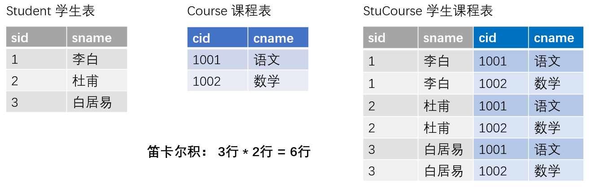

笛卡尔乘积现象：表1 有m行，表2有n行，结果=m*n行
**发生原因**：没有有效的连接条件
**如何避免**：添加有效的连接条件

通过设定不同的连接方式与条件，筛选多表连接后的数据记录集：


**连接的分类**：

- 按年代分类：
  - SQL92标准:仅仅支持内连接
  - **SQL99标准【推荐】**：支持内连接 + 外连接 + 交叉连接
- 按功能分类：
  - 内连接：等值连接、非等值连接、自连接
  - 外连接：左外连接、右外连接、全外连接
  - 交叉连接

### 内连接

| SQL92语法                                                    | SQL99语法                                                    |
| ------------------------------------------------------------ | ------------------------------------------------------------ |
| select 查询列表 ①<br/>from 表1 别名,表2 别名,... ②<br/>where 连接条件 ③<br/>and 筛选条件④<br/>group by 分组列表⑤<br/>having 分组后筛选⑥<br/>order by 排序列表;⑦ | select 查询列表 ①<br/>from 表1 别名②<br/>【inner】 join 表2 别名 on 连接条件 ③<br/>【inner】 join 表3 别名 on 连接条件<br/>where 筛选条件 ④<br/>group by 分组列表⑤<br/>having 分组后的筛选⑥<br/>order by 排序列表⑦ |

执行顺序：②③④⑤⑥①⑦

#### 等值连接

**要点**：

- 多表等值连接的结果为多表的交集部分
- n表连接，至少需要n-1个连接条件
- 多表的顺序没有要求
- 一般需要为表起别名
- 可以搭配前面介绍的所有子句使用，比如排序、分组、筛选

（1）等值连接的写法

**练习**：按照国家代码等值连接**country**表和**countrylanguage**表

country表有`name`字段，而countrylanguage表没有

countrylanguage表有`Language`字段，而country表没有

希望同时查看这2个字段

```mysql
# sql 92标准
SELECT 
    country.code,
    country.name,
    countrylanguage.Language
FROM
    country,
    countrylanguage
WHERE
    country.code = countrylanguage.CountryCode;
# 这种方式是在查询结果中又做了一次条件筛选得到了结果
```

```mysql
# 推荐使用这种语法
# sql 99标准
select * from country join countrylanguage on code = CountryCode;

# 默认的join就是inner join
select * from country inner join countrylanguage on code = CountryCode;
```


**练习**：查询每个国家的名称及其首都城市的名称

city表中，name表示city的名称，id表示城市代码

country表中，name表示国家名称，capital表示首都城市代码

现在想要同时显示国家名称和首都名称

```mysql
select country.name, city.name from country inner join city on country.capital = city.id;
```

（2）为表起别名

**作用**：

- 提高语句简洁度
- 区分多个重名的字段

**要点**：一旦为表起了别名，则查询的字段就**不能使用原来的表名**去限定。

**练习**：查询每个国家的名称及其首都城市的名称

```mysql
select ct.name "国家名称", c.name "首都" from country ct, city c where c.ID = ct.Capital;

# 会报错
select city.name from city c;
```

（3）两个表的顺序可以调换

```mysql
# SQL92
select ct.name "国家名称", c.name "首都" from city c, country ct where c.ID = ct.Capital;
```

```mysql
# SQL99
select ct.name "国家名称", c.name "首都" from city c join country ct on c.ID = ct.Capital;
```

（4）增加筛选条件

**练习**：查询有独立年份的国家名称及其语言

```mysql
SELECT 
    ct.name, ctl.language, ct.indepyear
FROM
    country ct
        JOIN
    countrylanguage ctl ON ct.code = ctl.countrycode
WHERE
    ct.indepyear IS NOT NULL;
```

**练习**：查询国家表和国家语言表，显示每个国家名称及其官方语言

```mysql
SELECT 
    ct.name, ctl.language, ct.indepyear
FROM
    country ct
        JOIN
    countrylanguage ctl ON ct.code = ctl.countrycode
WHERE
    ctl.IsOfficial is True;
```

（5）可以进行分组

**练习**：查询城市表汇总每个国家的名字和所包含的城市数量

```mysql
SELECT 
    ct.name, COUNT(c.name)
FROM
    country ct
        JOIN
    city c ON ct.Code = c.CountryCode
GROUP BY ct.name;
```

（6）可以进行排序

**练习**：查询城市表汇总每个国家的名字和所包含的城市数量，结果按城市数量降序排序

```mysql
SELECT 
    ct.name, COUNT(c.name) c_num
FROM
    country ct
        JOIN
    city c ON ct.Code = c.CountryCode
GROUP BY ct.name
ORDER BY c_num desc;
```

（7）可以实现3表连接

查询城市表、国家表、国家语言表、显示国家名称、首都名以及官方语言，按照官方语言占比倒序排序

```mysql
# 这是我写的版本
# 问题：1 忘记判断是否是官方语言
#      2 不够简洁
SELECT 
    ct.name, c.name capital, ctl.language, ctl.Percentage
FROM
    country ct
        JOIN
    city c ON ct.Capital = c.id
        JOIN
    countrylanguage ctl ON ct.code = ctl.countrycode
ORDER BY ctl.percentage DESC;
```


```mysql
SELECT 
    ct.name '国家',
    c.name '首都',
    ctl.language '官方语言',
    ctl.Percentage '官方语言占比'
FROM
    country ct
        JOIN
    city c
        JOIN
    countrylanguage ctl ON ct.code = ctl.countrycode
        AND ct.Capital = c.id
WHERE
    IsOfficial = 'T'
ORDER BY ctl.percentage DESC;
```

#### 非等值连接

使用频率较低，以oracle 数据库中的emp表和salgrade表为例

**练习**：查询不同工资等级的人数

emp表中的`sal`字段为员工薪资

salgrade表中的`grade`为薪资等级，`losal`为对应薪资等级的最低薪资，`hisal`为对应薪资等级的最高薪资。

```mysql
SELECT 
    losal, hisal, grade, COUNT(*)
FROM
    emp e
        JOIN
    salgrade g ON e.sal BETWEEN g.losal AND g.hisal
GROUP BY g.grade;
```

**详解**：查询员工姓名，工资等级，和薪水

首先，不加on条件查询

```mysql
SELECT 
    e.ename, grade, e.sal, g.losal, g.hisal
FROM
    emp e JOIN
    salgrade g;
```

可以看到输出结果中，同一个员工输出了多个结果，这是我们不想要的

```
SMITH	1	800.00	700	1200
SMITH	2	800.00	1201	1400
SMITH	3	800.00	1401	2000
SMITH	4	800.00	2001	3000
SMITH	5	800.00	3001	9999
```

加入`ON`条件筛选后：

```mysql
SELECT 
    e.ename, grade, e.sal, g.losal, g.hisal
FROM
    emp e JOIN
    salgrade g
ON
    e.sal BETWEEN g.losal AND g.hisal;
```

只有满足条件的数据留了下来

```mysql
SMITH	1	800.00	700	1200
ALLEN	3	1600.00	1401	2000
WARD	2	1250.00	1201	1400
```

#### 自连接

**练习**：查询emp表中员工及其上级领导的姓名。

emp表中，ename为员工姓名，mgr为主管领导的id，empno为员工id

因此需要自连接找到领导的姓名

```mysql
SELECT 
    e1.ename '员工姓名', e2.ename '领导姓名'
FROM
    emp e1
        JOIN
    emp e2 ON e1.mgr = e2.empno;
```

```mysql
员工姓名  领导姓名
SMITH	FORD
ALLEN	BLAKE
WARD	BLAKE
```

### 外连接

**语法**：
select 查询列表 ①
from 表1 别名 ②
left|right|full【outer】 join 表2 别名 on 连接条件 ③
where 筛选条件 ④
group by 分组列表 ⑤
having 分组后的筛选 ⑥
order by 排序列表; ⑦

**执行顺序**：
②③④⑤⑥①⑦

**要点**：

- 外连接分主、从表，两表的顺序不能任意调换
- 查询的结果为：主表中所有的行，如果从表和它匹配的将显示匹配行，如果从表没有匹配的则显示
  null
- left join 左外连接，左边的就是主表，左边的表不加限制；
- right join 右外连接，右边的就是主表，右边的表不加限制；
- full join 全外连接两边都是主表，左右两表都不加限制 【MySQL不支持这个写法，使用union替代】
- 一般用于查询主表中有但从表没有的记录

#### 左外连接

左连接 (left join) : 以左表为主,右表为辅,完整查询左表数据,右表匹配不上的补null

基于用户，查询能查到地址

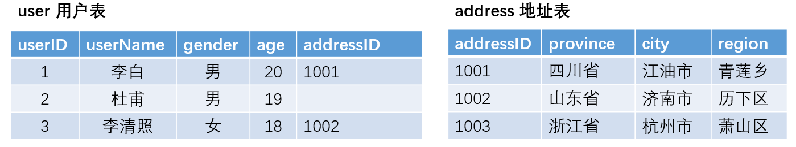


#### 右外连接

右连接 (right join): 以右表为主,左表为辅,完整查询右表数据,左表匹配不上的补null

基于地址，查询能查到的用户


通过限定语句，可以只保留**从表内容为空的主表记录**。

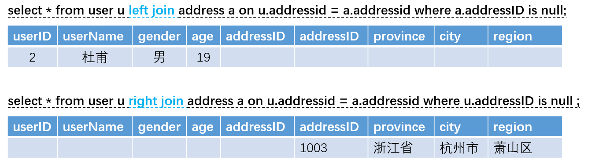

#### 全外连接

全连接 (union) : 把所有数据形成并集。


上表为全连接，保留主、从表空值记录。

#### 练习题

```mysql
use sakila;  # 切换到sakila数据库

# 全部影片数：1000
select count(distinct film_id) from film; #1000

# 库存影片数：958
SELECT count(distinct film_id) FROM inventory; # 958

```


（1）用左连接实现查出现有库存影片的影片信息 （影片ID、影片名称、影片描述，发布年份）

film表中，拥有film_id、title、description，release_year 字段

inventory表中，有film_id。

要求根据inventory表中的film_id，找到所有对应的电影的相关信息

```mysql
SELECT DISTINCT
    (i.film_id), f.title, f.description, f.release_year
FROM
    inventory i
        LEFT JOIN
    film f ON i.film_id = f.film_id;
```

（2）上述例子用右连接实现

只需要调换一下表的位置

```mysql
SELECT DISTINCT
    (i.film_id), f.title, f.description, f.release_year
FROM
    film f
        RIGHT JOIN
    inventory i ON i.film_id = f.film_id;
```

（3）查看所有影片的库存信息（影片ID、影片名称、影片描述，发布年份），如果没有租借记录，租借信息显示为null

```mysql
SELECT DISTINCT
    (i.film_id), f.title, f.description, f.release_year
FROM
    film f
        LEFT JOIN
    inventory i ON i.film_id = f.film_id;
```

（4）通过限定条件，只保留主表和从表没有对应记录的信息

```mysql
SELECT DISTINCT
    (i.film_id), f.title, f.description, f.release_year
FROM
    film f
        LEFT JOIN
    inventory i ON i.film_id = f.film_id
WHERE
    i.film_id IS NULL;
```

### 交叉连接（了解）

**语法**：
select 查询列表 ①
from 表1 别名 ②
cross join 表2 别名 on 连接条件 ③
where 筛选条件 ④
group by 分组列表 ⑤
having 分组后的筛选 ⑥
order by 排序列表; ⑦
**执行顺序**：
②③④⑤⑥①⑦
**要点**：
不加连接条件时，cross join 结果集为两张表的笛卡尔乘积

如果在交叉连接时使用 where 子句，MySQL 会先生成两个表的笛卡尔积，然后再选择满足WHERE 条件的记录。

因此，表的数量较多时，交叉连接会非常非常慢。

一般情况下不建议使用交叉连接。

查询结果跟等值连接的查询结果是一样

**示例**：

```mysql
select count(*) from city cross join country; #978960
select count(*) from country cross join city; #978960
select count(*) from country; #240
select count(*) from city; #4079
select * from country cross join city on CountryCode = code; #4079
select * from city cross join country on CountryCode = code; #4079
```

## 子查询

概念：嵌套在其他语句内部的select语句称为子查询或内查询，
外面的语句可以是insert、update、delete、select等，一般select作为外面语句较多
外面如果为select语句，则此语句称为外查询或主查询

**分类**：

- 按子查询出现的位置：
  - select后面： 仅仅支持标量子查询
  - from后面：表子查询
  - where或having后面：标量子查询、列子查询、行子查询
  - exists后面：标量子查询、列子查询、行子查询、表子查询
- 按结果集的行列：
  - 标量子查询（单行子查询）：结果集为一行一列（一个数值）
  - 列子查询（多行子查询）：结果集为多行一列（一个集合）
  - 行子查询：结果集为一行多列（一个集合）
  - 表子查询：结果集为多行多列（一张虚拟表）

**要点**：

- 子查询放在条件中，要求必须放在条件的右侧
- 子查询一般放在小括号中
- 子查询的执行优先于主查询
- 单行子查询对应了 单行操作符：> < >= <= = <>
- 多行子查询对应了 多行操作符：any/some all in

### 应用在where/having后面

#### 单行子查询

- 子查询语句需要放在小括号中
- 子查询放在操作符右侧

（1）【**一个条件**】查询人口比俄罗斯（Russian Federation）人口多的国家

```mysql
use world;

# 需要两行语句
# 146934000
select Population from country where Name='Russian Federation';
select Name, Population from country where Population > 146934000;

# 单行子查询
select Name, Population from country where Population > 
(select population from country where name like '%Russian%');
```

（2）【**多个条件**】查询预期寿命和GNP比中国高的国家名称及其GNP和预期寿命

```mysql
select Name, GNP, LifeExpectancy from country 
where 
    GNP > (select GNP from country where Name="China") and 
    LifeExpectancy > (select LifeExpectancy from country where Name="China");
```

（3）【**子查询中使用函数**】查询最近成立的一个国家的名称、独立年份和国土面积

```mysql
# 查询最近独立年份
select max(indepyear) from country;  # 1994
select name, indepyear, surfacearea from country where indepyear = 1994;

select name, indepyear, surfacearea from country where indepyear = (select max(indepyear) from country);
```

（4）:star:【**having字句中含有子查询**】查询最低寿命预期大于非洲平均寿命预期的大洲名称及其最低寿命预期

```mysql
# 查询非洲平均寿命预期
select avg(LifeExpectancy), continent from country where Continent='Africa';

# 如题
SELECT 
    continent, MIN(LifeExpectancy) AS m
FROM
    country
GROUP BY Continent
HAVING m > (SELECT 
        AVG(LifeExpectancy)
    FROM
        country
    WHERE
        Continent = 'Africa');
```

#### 多行子查询

**多行操作符**：

- `in`，判断某字段是否在集合内，例如：`x in (1, 2, 3)`
- `all`，判断某字段的值是否满足集合中所有的值，例`x >all(1, 2, 3)`等价于`x > max(1, 2, 3)`
- `any / some` 判断某字段的值是否满足集合中任意一个值，例`x > any(1, 2, 3)`相当于`x > min(1, 2, 3)`

（5）查询出使用官方语言是英语(English)或法语(French)的国家的个数

```mysql
# 方式1：多表连接
SELECT 
    count(distinct `code`)
FROM
    country c
        JOIN
    countrylanguage l ON c.code = l.countrycode
WHERE
    l.language IN ('English' , 'French')
        AND l.isofficial = 'T';
        
# 方式2：可以不使用多表连接
# 先找出官方语言是英语(English)或法语(French)的国家编码
select countrycode from countrylanguage where language in ('English', 'French')
and isofficial='T';

# 统计国家个数
select count(*) from country where `code` in (select countrycode from countrylanguage where language in ('English', 'French')
and isofficial='T');


# 方式3：一步到位
select count(distinct(CountryCode)) from countrylanguage where language in ('English', 'French')
and isofficial='T';
```

（6）查询比大洋洲**所有**国家预期寿命短的国家信息（名称、预期寿命、国土面积、GNP）

```mysql
# 大洋洲国家的最短预期寿命
select min(lifeexpectancy) from country where continent = 'oceania';
# 59.8


# 如题
SELECT 
    `name`, lifeexpectancy, surfacearea, gnp
FROM
    country
WHERE
    lifeexpectancy < ALL (SELECT 
            lifeexpectancy
        FROM
            country
        WHERE
            continent = 'Oceania'
                AND lifeexpectancy IS NOT NULL)
```

（7）查询比大洋洲**任一**国家预期寿命短的国家信息（名称、预期寿命、国土面积、GNP）

```mysql
# 大洋洲国家的最长预期寿命
select max(lifeexpectancy) from country where continent = 'oceania';
# 79.8

# 只要小于79.8即可
SELECT 
    `name`, lifeexpectancy, surfacearea, gnp
FROM
    country
WHERE
    lifeexpectancy < ANY (SELECT 
            lifeexpectancy
        FROM
            country
        WHERE
            continent = 'Oceania'
                AND lifeexpectancy IS NOT NULL)
```

### 应用在select后面

（8）显示预期寿命大于75岁的国家数量和国家总数

```mysql
# 预期寿命大于75岁的国家
select count(`name`) from country where lifeexpectancy > 75;
# 62

# 如题
SELECT 
    COUNT(`name`) AS 'total',
    (SELECT 
            COUNT(`name`)
        FROM
            country
        WHERE
            lifeexpectancy > 75) AS 'more_than_75'
FROM
    country;
```

### 应用在from后面

（9）查询每个部门的平均工资的工资级别

```mysql
use oracle;

# 每个部门的平均工资
select deptno, avg(sal) as avg_sal from emp group by deptno;
"""
deptno  avg_sal
10	2916.666667
20	2175.000000
30	1566.666667
"""

# 如题
SELECT 
    deptno, avg_sal, grade
FROM
    (SELECT 
        deptno, AVG(sal) AS avg_sal
    FROM
        emp
    GROUP BY deptno) AS f
        JOIN
    salgrade AS s ON f.avg_sal BETWEEN s.losal AND s.hisal;
```

### 应用在exists后面

（10）国家表中是否存在议会君主制(Parlementary Monarchy)国家

了解exists的使用方法

```mysql
# 查找议会君主制国家
# Samoa
select * from country where GovernmentForm = 'Parlementary Monarchy';

select exists (select * from country where GovernmentForm = 'Parlementary Monarchy');
# 
```

（11）:star:查询使用英语但英语不是官方语言的国家信息

```mysql
# 使用英语但英语不是官方语言的国家代码
select countrycode from countrylanguage l where l.language = 'english' and l.isofficial='F';

# 方法1
select * from country where code in (select countrycode from countrylanguage l where l.language = 'english' and l.isofficial='F');

# 方法2 使用exists

select * from country c where exists(select * from countrylanguage l where l.language = 'english' and l.isofficial='F' and c.code = l.countrycode);
```

## 分页查询

**功能**：LIMIT 子句用于限制由 SELECT 语句返回的数据数量 或者 UPDATE,DELETE语句的操作数量

**应用场景**：当要查询的条目数太多，一个页面上无法显示全部查询结果时

**语法**：
select 查询列表 ①
from 表1 别名 ②
join 表2 别名 ③
on 连接条件 ④
where 筛选条件 ⑤
group by 分组 ⑥
having 分组后筛选 ⑦
order by 排序列表 ⑧
**limit** 起始条目索引,显示的条目数 ⑨

**执行顺序**：
②③④⑤⑥⑦①⑧⑨
**要点**：

- 起始条目索引，默认从0开始

**公式**：假如要显示的页数为page，每一页条目数为size

```mysql
select * from [table] limit (page-1) * size, size
```


```mysql
# 不写起始点索引，默认为显示条数
# limit最后执行，本质上是查询结果集的【局部显示】
select count(*) from country limit 6; # 239

# 查询人口数量最多的第11-15名的国家名称和人口数量
select population from country order by population desc limit 10,5; # 下标从0开始，10表示第11条记录
```

## 联合查询

了解即可

可以想象成两个excel 垂直叠加

**功能**：将多次查询结果合并成一个结果
**语法**：
查询语句1
union 【all】
查询语句2
union 【all】
...

**应用场景**:

- 将一条比较复杂的查询语句拆分成多条语句
- 适用于多表查询时，查询的列基本是一致的情况


**要点**：

- 要求多条查询语句的查询列数必须一致
- 要求多条查询语句的查询的各列类型、顺序最好一致
- union 去重，union all包含重复项

（1）合并讲英语的国家编码和语言，和伊丽莎白二世（Elisabeth II）为国家元首的国家信息（国家编码和名称）

```mysql
# 讲英语的国家编码和语言
select `countrycode`, language from countrylanguage where language = 'english';

# 国家元首是伊丽莎白而是的国家编码和名称
select `code`, `name` from country where HeadOfState='Elisabeth II';

# 合并
select `countrycode`, language from countrylanguage where language = 'english'
union
select `code`, `name` from country where HeadOfState='Elisabeth II';
```

字段个数必须一致

字段的顺序和类型最好一致

通常情况下用于合并多个不同的数据源的相同字段信息

（2）合并查询讲英语的国家编码，以及讲法语的国家编码

```mysql
select countrycode, language from countrylanguage where language = 'english'
union
select countrycode, language from countrylanguage where language = 'french';

# 查看数量
select count(*) from countrylanguage where Language = 'English'; # 60
select count(*) from countrylanguage where Language = 'French'; # 25

# PS注意这条语句的结尾，是必须要起一个别名的
select count(*) from (
select CountryCode,Language from countrylanguage where Language = 'English'
union
select CountryCode,Language from countrylanguage where Language = 'French') a;
# 79

# 数据集合并后，union结果集会自动对记录进行去重
# 数据集合并后，union all结果集会保留重复数据
select count(*) from (
select CountryCode from countrylanguage where Language = 'English'
union all
select CountryCode from countrylanguage where Language = 'French') a;
# 85
```

## MySQL运算符

### 算数运算符

加减乘(`+ - * `)，除法`/`或`div`，以及求模 `%`或`MOD`

### 比较运算符

| 运算符       | 描述     | 示例         | 运算符        | 描述           | 示例                      |
| ------------ | -------- | ------------ | ------------- | -------------- | ------------------------- |
| `=`          | 等于     | `id=3`       | `IS NOT NULL` | 不为空         | `id is not null`          |
| `>`          | 大于     | `id>3`       | `BETWEEN`     | 在两值之间     | `id between 1 and 15`     |
| `<`          | 小于     | `id<3`       | `IN`          | 在集合中       | `id in (2,3,4)`           |
| `>=`         | 大于等于 | `id>=3`      | `NOT IN`      | 不在集合中     | `name not in (a, b)`      |
| `<=`         | 小于等于 | `id<=3`      | `LIKE`        | 模式匹配       | `name like ('shi %')`     |
| `!=` 或 `<>` | 不等于   | `id!=3`      | `NOT LIKE`    | 模式匹配       | `name not like ('shi %')` |
| `IS NULL`    | 为空     | `id is null` | `REGEXP`      | 正则表达式匹配 | `name 正则表达式`         |

### 逻辑运算符

```mysql
&& 或 AND # 与
|| 或 OR # 或
! 或 NOT # 非
XOR # 异或
```

### 位运算符

位运算符是在二进制数上进行计算的运算符。

位运算会**先将操作数变成二进制数**，进行位运算。 

然后**再将计算结果从二进制数变回十进制数**。

MySQL中支持6种位运算符。

| 运算符 | 作用     | 运算符 | 作用     |
| ------ | -------- | ------ | -------- |
| `&`    | 按位与   | `^`    | 按位异或 |
| `|`    | 按位或   | `<<`   | 左移     |
| `~`    | 按位取反 | `>>`   | 右移     |

### 运算符优先级

```
1 !
2 ~
3 ^
4 *, /, DIV, %, MOD
5 +, -
6 >>, <<
7 &
8 |
9 =, <, >, <=, >=, IN, IS, NULL, LIKE, REGEXP
10 BETWEEN, AND, CASE, WHEN, THEN, ELSE
11 NOT
12 &&, AND
13 ||, OR, XOR
14 :=
```


## :bookmark_tabs:练习用表world

使用 world 数据库进行练习

### **city表**

| 字段        | 类型     | 备注     |
| ----------- | -------- | -------- |
| ID          | int      | 编码     |
| Name        | char(35) | 国家名   |
| CountryCode | char(3)  | 国家编码 |
| District    | char(20) | 地区名   |
| Population  | int      | 人口     |

记录示例：

| ID   | Name    | CountryCode | District | Population |
| ---- | ------- | ----------- | -------- | ---------- |
| 1898 | Chengdu | CHN         | Sichuan  | 3361500    |

### **country表**

| 字段           | 类型                                                         | 备注              |
| -------------- | ------------------------------------------------------------ | ----------------- |
| Code           | char(3)                                                      | 国家编码          |
| Name           | char(52)                                                     | 国家名称          |
| Continent      | enum('Asia','Europe','North America','Africa','Oceania','Antarctica','South America') | 所属洲            |
| Region         | char(26)                                                     | 所属范围          |
| SurfaceArea    | float(10,2)                                                  | 国土面积          |
| IndepYear      | smallint                                                     | 独立年份          |
| Population     | int                                                          | 人口              |
| LifeExpectancy | float(3,1)                                                   | 预期寿命          |
| GNP            | float(10,2)                                                  | 国民生产总 值     |
| GNPOld         | float(10,2)                                                  | 国民生产总 旧值   |
| LocalName      | char(45)                                                     | 本地名称          |
| GovernmentForm | char(45)                                                     | 政府形式          |
| HeadOfState    | char(60)                                                     | 国家首脑          |
| Capital        | int                                                          | 首都（城市编码）  |
| Code2          | char(2)                                                      | 2个字母的国家编码 |

### **countrylanguage表**

| 字段       | 类型          | 备注         |
| ---------- | ------------- | ------------ |
| CountyCode | char(3)       | 国家编码     |
| Language   | char(30)      | 语言         |
| IsOffcial  | enum('T','F') | 是否官方语言 |
| Percentage | float(4,1)    | 百分比       |

## :bookmark_tabs:练习表orical

### **dept**

部门信息表

| 字段   | 类型        | 备注     |
| ------ | ----------- | -------- |
| deptno | int         | 部门编码 |
| dname  | varchar(14) | 部门名称 |
| loc    | varchar(13) | 地点     |

记录示例

| deptno | dname | loc     |
| ------ | ----- | ------- |
| 30     | SALES | CHICAGO |

### **emp**

员工信息表

| 字段     | 类型        | 备注             |
| -------- | ----------- | ---------------- |
| empno    | int         | 员工编码         |
| ename    | varchar(10) | 员工姓名         |
| job      | varchar(9)  | 岗位名称         |
| mgr      | int         | 主管领导（编码） |
| hiredate | date        | 入职时间         |
| sal      | float(7,2)  | 薪金             |
| comm     | float(7,2)  | 奖金             |
| deptno   | int         | 部门编码         |

### **salgrade**

薪金等级表

| 字段  | 类型 | 备注     |
| ----- | ---- | -------- |
| grade | int  | 等级     |
| losal | int  | 最低薪金 |
| hisal | int  | 最高薪金 |

### **bonus**

奖金表

| 字段  | 类型        | 备注     |
| ----- | ----------- | -------- |
| ename | varchar(10) | 员工姓名 |
| job   | varchar(9)  | 岗位名称 |
| sal   | int         | 薪金     |
| comm  | int         | 奖金     |

# DML

就是插入、更新和删除

## 插入(insert)

**语法**：

```mysql
# 插入单行
insert into 表名 values (值1, 值2, ...), ...;

# 插入多行
insert into 表名(字段1， 字段2, ...) values (值1, 值2, ...), (值1, 值2, ...), ...;
```

**要点**：

字段和值列表一一对应，包含类型、约束等必须匹配

数值型的值，不用单引号；

**非数值型的值，必须使用单引号**

字段顺序无要求

**示例**：

创建一个学生表

```mysql
CREATE TABLE student (
    sid INT,
    sname VARCHAR(20),
    sage INT,
    phonenum VARCHAR(20)
);
```

（1）不填写字段名，插入的数据需要完整填入每个字段的数值

```mysql
insert into student values(1, 'lily', 14, '110');

# 也可以赋空值
insert into student values(2, 'amy', null, '120')
```

（2）填写字段名，只需插入部分字段的数值

```mysql
insert into student(sid, sname) values(3,'tom');

# 字段的顺序可以变，效果同上
insert into student(sname, sid) values('tom', 3);
```

（3）一次性插入多条记录

```mysql
insert into student (sid,sname) values
(4,'alex'),(5,'jack'),(6,'neil');
```

（4）:star:从别的表插入数据

```mysql
# 创建一张表
create table student2 like student;
# 插入学生sid为奇数的学生信息到新表
insert into student2 select * from student where sid in (1, 3, 5);
```

## 更新(update)

（1）找到sid为6的记录，并将sname修改为`kevin`

```mysql
update student set sname='kevin' where sid=6;

# Error Code: 1175. You are using safe update mode and you tried to update a table without a WHERE that uses a KEY column.  To disable safe mode, toggle the option in Preferences -> SQL Editor and reconnect.
# 使用指令临时修改SQL更新的安全设置
set sql_safe_updates = 0;

update student set sname='kevin' where sid=6;
```

（2）将所有字段sage为空的记录设为18，并将字段phonenum为空的记录设置空字符串

```mysql
update student set sage=18, phonenum='' where sage is null or phonenum is null;

# 这里这句话其实是有点问题的，它会把所有符合条件的语句都设置了
# sage不空 phonenum空的数据也会被强行设置
```

## 删除(delete)

**注意**: delete语句后如果不加where条件,所有记录全部清空

（1）删除sid为1和3的数据

```mysql
delete from student where sid in (1, 3);
```

```mysql
# 清空数据表
truncate table student2;
```

（2）删除重复数据，只保留一条

https://www.cnblogs.com/jiangxiaobo/p/6589541.html

```mysql
# 插入测试数据
insert into student(sid, sname) 
    values(1,'feifei'),
          (2,'feifei'),
          (3,'feifei'),
          (4,'feifei');
                        
# 删除重复数据，会把所有feifei都删除
delete from student where sname='feifei';

# 删除重复数据，只保留一条
DELETE FROM student 
WHERE
    sid NOT IN (SELECT 
        MIN(sid)
    FROM
        student
    GROUP BY sname
    HAVING COUNT(sname) > 1)
    AND sname IN (SELECT 
        sname
    FROM
        student
    GROUP BY sname
    HAVING COUNT(sname) > 1);
```

## 数据备份

扩展：常用DOS命令

- 进入d盘：`d:`
- 进入备份文件夹：`cd d:/demo`
- 查看当前目录下文件以及文件夹信息：`dir`
- 新建文件夹：`mkdir backup`
- 进入文件夹：`cd backup`

### 导出数据库（备份）

```mysql
mysqldump -u账号 -p密码 --databases 数据库1 数据库2 > xxx.sql
```

参数说明：

- `-u`: 用户名
- `-p`：密码
- `-P`：端口号，默认3306
- `--all-databases / -A`：备份所有数据库
- `--databases / -B`：用于备份多个数据库，如果没有该选项，mysqldump把第一个名字参数作为数据库名，后面的作为表名。使用该选项，mysqldum把每个名字都当作为数据库名。
- `-d`：只导出数据库的表结构
- `-t`：只导出数据库的数据
- `--quick, -q`：快速导出
- `--xml / -X`：导出为xml文件

（1）备份**全部**数据库的数据和结构（-A）

```mysql
mysqldump -uroot -p123456 -A > 0101.sql
```

（2）备份**全部**数据库的结构（-d）

```mysql
mysqldump -uroot -p123456 -P3306 -A -d > 0102.sql
```

（3）备份**全部**数据库的数据（-t）

```mysql
mysqldump -uroot -p123456 -P3306 -A -t > 0103.sql
```

（4）备份**单个数据库**的数据和结构（sakila 为数据库名）

```mysql
mysqldump -uroot -p123456 -P3306 sakila > 0104.sql
```

（5）备份单个数据库结构（sakila 为数据库名，-d）

```mysql
mysqldump -uroot -p123456 -P3306 sakila -d > 0105.sql
```

（6）备份单个数据库数据（sakila 为数据库名，-t）

```mysql
mysqldump -uroot -p123456 -P3306 sakila -t > 0106.sql
```

（7）备份多个表的结构和数据 (table1,table2为表名)

```mysql
mysqldump -uroot -p123456 -P3306 sakila table1 table2 > 0107.sql
```

（8）一次备份多个数据库

```mysql
mysqldump -uroot -p123456 --databases db1 db2 > 0108.sql
```

### 导入数据库（还原）

（1）source 方法：登录mysql数据库操作终端后

```mysql
# 创建备用数据库：
create database backupdemo
# 使用备份数据库：
use backupdemo
# 导入数据：
source d:/itsishu/mysql_workspace/backup/20210106.sql
```

（2）命令行方式

```mysql
# 创建备份数据库：
mysqladmin -uroot -p create backupdemo
# 导入数据：
mysql -uroot -p backupdemo < d:/itsishu/mysql_workspace/backup/20210106.sql
```

注：在导入备份数据库前，db_name如果没有，是需要创建的； 而且与20210106.sql中数据库名是一样的才可以导入。

# DCL

DCL(Data Control Language)，即数据控制语言，用来定义数据库的访问权限和安全级别，及创建用户。

## 用户管理

### 查询用户

切换到mysql数据库

```mysql
USE mysql; #mysql数据库是MySQL数据库管理系统中自带的数据库
show tables; #查看当前数据库中所有的表
```

查看当前用户

```mysql
select user();
```

查询user表 (MySQL数据库存储用户信息的表)

```mysql
SELECT * FROM USER;
```

注：通配符： % 表示可以在任意主机使用用户登录数据库

### 添加用户

```mysql
CREATE USER '用户名'@'主机名' IDENTIFIED BY '密码';
```

主机名可以用通配符 % 表示该用户可以从任意地址访问数据库

**示例：**

```mysql
create user alice@localhost identified by '123456';
create user alice@'%' identified by '123456'; #相同用户名，不同登录地址，作为不同的记录存在

create user jack@'%' identified by '123456';
create user neil@127.0.0.1 identified by '123456';
# @后面可以指定具体的一个IP地址，其中127.0.0.1 表示本机和localhost作用相同。
```

### 删除用户

```mysql
DROP USER '用户名'@'主机名';
```

**示例：**

```mysql
drop user neil@127.0.0.1;
# 删除后再使用neil账户登录，报错：
# ERROR 1045 (28000): Access denied for user 'wangwei'@'localhost' (using password: YES)
drop user alice@localhost;
drop user alice@'%';
drop user jack@'%';
```

### 修改用户密码

**MySQL8.0**

```mysql
alter user 用户名@登录地址 identified with mysql_native_password by 新密码;

# 示例：
alter user alice@'%' identified with mysql_native_password by '654321';
```

**MySQL5.7**

```mysql
# 方式1
UPDATE USER SET PASSWORD = PASSWORD('123456') WHERE USER = 'lily';

# 方式2
SET PASSWORD FOR 'lily'@'localhost' = PASSWORD('123456');
```

**MySQL 5.7 忘记了root用户的密码**？

1. cmd -- > net stop mysql 停止mysql服务
    需要管理员运行该cmd

2. 使用无验证方式启动mysql服务： `mysqld --skip-grant-tables`

3. 打开新的cmd窗口,直接输入mysql命令，敲回车。就可以登录成功

4. `use mysql`;

5. `update user set password = password('你的新密码') where user = 'root';`

6. 关闭两个窗口

7. 打开任务管理器，手动结束mysqld.exe 的进程

8. 启动mysql服务

9. 使用新密码登录。

  

**MySQL 8.0忘记了root用户的密码？**

[扩展：MySQL8.0.12重置root密码](https://blog.csdn.net/baidu_32363401/article/details/81544573)

## 管理权限

### 查询权限

```mysql
create user 'lily'@localhost identified by '123456';
```

```mysql
mysql> show grants for lily@localhost;
+------------------------------------------+
| Grants for lily@localhost                |
+------------------------------------------+
| GRANT USAGE ON *.* TO `lily`@`localhost` |
+------------------------------------------+
1 row in set (0.00 sec)
```

```mysql
SHOW GRANTS FOR '用户名'@'主机名';
# 示例：
show grants for libai@localhost;
show grants for dufu@'%';
```

### 赋予权限

```mysql
grant 权限列表 on 数据库名.表名 to '用户名'@'主机名';
```

（1）赋予用户指定数据库的全部权限

```mysql
grant all on demo.* to lily@localhost;
# 意味着没有了访问其他数据库的权限
# 如果使用 lily 账号登陆后访问其他数据库，例如：
use world;
# 报错：ERROR 1044 (42000): Access denied for user 'lily'@'localhost' to database
'world'

# 数据库中查询权限内容为：
# 'GRANT USAGE ON *.* TO `lily`@`localhost`'
# 'GRANT ALL PRIVILEGES ON `demo`.* TO `lily`@`localhost`'
```

（2）赋予用户超级管理员权限（可以为他人赋予权限）

```mysql
grant all on *.* to lily@'%' with grant option;

grant select on demo.* to jack@127.0.0.1;

# 使用lily登录后，赋予jack查询student表的权限
# 查询后尝试插入，会报错。
insert into student values(10,'陶渊明',18，9999999);
# 报错：ERROR 1142 (42000): INSERT command denied to user 'jack'@'localhost' for table 'student'
```

注意：所有的数据库就用`*.*`，所有的权限就用`all`或者`all privileges`

### 撤销权限

```mysql
revoke 权限列表 on 数据库名.表名 from '用户名'@'主机名';
#示例：
revoke delete on demo.* from jack@localhost;
```

剩余的权限：

> grant select,insert,update,create,drop,references,index,alter,create temporary tables, lock tables,execute,create view,show view,create routine,alter routine,event,trigger on test.* to libai@localhost;

使用lily用户登录，删除sid=5的记录

```mysql
delete from student where sid = 5;
#报错：
#ERROR 1142 (42000): DELETE command denied to user 'lily'@'localhost' for table
'student'
```

# 常见约束

| 关键字         | 约束功能 | 要求                                                         |
| -------------- | -------- | ------------------------------------------------------------ |
| PRIMARY KEY    | 主键     | 该字段的值不可重复并且非空 unique + not null（可以作为外键） |
| NOT NULL       | 非空     | 该字段的值必填                                               |
| UNIQUE         | 唯一     | 该字段的值不可重复                                           |
| DEFAULT        | 默认     | 该字段的值不用手动插入有默认值                               |
| FOREIGN KEY    | 外键     | 该字段的值引用了另外的表的字段                               |
| AUTO INCREMENT | 自增长列 | 在插入数据后自动增长                                         |

```mysql
create table student (
    pid int primary key auto_increment,
    name varchar(40)
) auto_increment = 1000;

# 删除数据后，主键会继续增加，不会包含之前生成过的数据
```


## 创建表时添加约束

```mysql
create table 表名(
    字段名 字段类型 not null,#非空
    字段名 字段类型 primary key,#主键
    字段名 字段类型 unique,#唯一
    字段名 字段类型 default 值,#默认
    constraint 约束名 foreign key(字段名) references 主表(被引用列)
) 
```

**注意**：

| 约束范围 | 支持类型       | 可以起约束名     |
| -------- | -------------- | ---------------- |
| 列级约束 | 除了外键       | 不可以           |
| 表级约束 | 除了非空和默认 | 可以但对主键无效 |

### 列级约束

列级约束可以在一个字段上追加多个，中间用空格隔开，没有顺序要求

```mysql
# 列级约束的定义
create table student(
sid int primary key, # 主键,能够唯一确定一行记录的值，例如：学号、身份证号、手机号等
sname varchar(20) not null, # 非空,不能插入空值
sage int default 18, # 默认值设置为18
phonenum varchar(45) unique # 不能插入重复的数值
);
```


### 联合主键 （了解）

在字段定义完成后，另起一行定义一个联合主键。

```mysql
create table student2(
sid int,
sname varchar(20),
sage int,
primary key(sid, sname)
);


# 联合主键的话，要两个字段都相同才会报错
insert into student2 values(1, 'tom', 15);
insert into student2 values(1, 'jack', 13);

# 这时候才会报错
insert into student2 values(1, 'tom', 16);
# Error Code: 1062. Duplicate entry '1-tom' for key 'student2.PRIMARY'
```

### :star:外键约束

> 删除时，要先删除从表中的数据（或者将从表中对应的外键字段设为空），再删除主表中对应的数据

表中的字段内容，来自另一张表的主键（字段）

```mysql
# 创建一张表
create table address(
    addressID int,
    province varchar(45),
    city varchar(45),
    region varchar(45),
    primary key(addressID)
);

INSERT INTO `address` VALUES (1001,'四川省','江油市','青莲乡'),
                             (1002,'山东省','济南市','历下区'),
                             (1003,'浙江省','杭州市','萧山区');

#创建从表，user表，其中aid字段引用自address的addressID字段
create table user(
 userID int,
 userName varchar(45),
 gender varchar(10),
 age int,
 aid int,
 constraint fk_user_address_on_aid foreign key (aid) references
 address(addressID)
);

# 外键约束命名规则：FK_外键表名_主键表名_on_外键列名
# 插入user表中的外键字段数值，必须在address表被引用字段中已经存在
insert into user values(1,'李白','男',20,1001);

# 可以插入空值
insert into user values(2,'杜甫','男',19,null);

# 报错
insert into user values(3,'李清照','女',18,1111); 

# 成功
insert into user values(3,'李清照','女',18,1002); 

# 直接删除主表记录时，如果从表中有字段内容来自于该条记录，则删除报错：
delete from address where addressID = 1002; #报错

set sql_safe_updates = 0;
# 先将从表对应字段置为null
update user set aid = null where userID = 3;
# 再删除主表中的记录，成功
delete from address where addressID = 1002; 
```

小结：
1、用于限制两个表的关系，从表的字段值引用了主表的某字段值
2、外键列和主表的被引用列要求类型一致，意义一样，名称无要求
3、主表的被引用列要求是一个key（一般就是主键）
4、插入数据，先插入主表
5、删除数据，先删除从表


## 修改表时添加或删除约束

小结：
“非空”和“默认”约束只有列级约束，**没有约束名**，通过修改表结构添加或删除约束

“主键”、“唯一”约束既有列级约束，又有表级约束，有约束名，

“唯一”约束通过添加或删除约束名实现增减约束的效果

“主键”约束的删除是例外：alter table 表名 drop primary key

“外键”约束**只有表级约束**，有约束名，通过添加或删除约束名实现增减约束的效果

```mysql
#添加外键
alter table 表名 add [constraint 约束名] foreign key(字段名) references 主表（被引用列）;

#删除外键
alter table 表名 drop foreign key 约束名;
```

设置`on delete set null`在删除主表的数据后，从表对应的外键会变成`null`

```mysql
# 约束删除以后
alter table user drop constraint fk_user_address_on_aid;

# 添加约束
alter table user add constraint fk_user_address_on_aid foreign key(aid) references address(addressID) on delete set null;
```

on delete参数：

- set null：删除主表数据后，从表对应数据会被**置为空**。学习小组没了，但是同学还在。
- cascade：删除主表数据后，从表对应数据会被**删除**。整个班都被开除了，班级没了，同学也没了。

### 非空约束

```mysql
#添加非空
alter table 表名 modify column 字段名 字段类型 not null;
#删除非空
alter table 表名 modify column 字段名 字段类型 ;
```

示例

```mysql
# 测试用表：
CREATE TABLE `student3` (
`sid` int NOT NULL,
`sname` varchar(20) DEFAULT NULL,
`sage` int DEFAULT NULL,
`phonenum` varchar(20) DEFAULT NULL
)

# 给sname字段添加非空约束
alter table student3 modify column sname varchar(20) not null;

show create table student3; #查看建表语句的变化
# 删除sname字段的非空约束
alter table student3 modify column sname varchar(20);
```

### 默认约束

```mysql
#添加默认
alter table 表名 modify column 字段名 字段类型 default 值;
#删除默认
alter table 表名 modify column 字段名 字段类型 ;
```


```mysql
# 为sage字段添加默认值，18
alter table student3 modify column sage int default 18;
# 删除sage字段的默认值
alter table student3 modify column sage int;
```

### 唯一约束

```mysql
# 给phonenum字段添加唯一性约束（带索引名）
show create table student3;
alter table student3 add constraint uq_phonenum unique (phonenum);
# 报错：Error Code: 1062. Duplicate entry '' for key 'student3.uq_phonenum'
# 因为当前phonenum中有多条null值，也算数据重复，本身就违反唯一性约束
update student3 set phonenum = sid + 123455;
select * from student3;
# 小结：添加约束前，要保证当前数据满足约束条件，才能添加成功
# 唯一性约束命名规范:uk_字段名 或 uq_字段名
# 删除phonenum字段的唯一性约束（通过索引名）
alter table student3 drop constraint uq_phonenum;
```

### 主键约束

```mysql
#添加主键
alter table 表名 add【 constraint 约束名】 primary key(字段名);
#删除主键
alter table 表名 drop primary key;
```


```mysql
# 给sid添加主键约束 (索引名：pk_student3）
alter table student3 add constraint pk_student3 primary key (sid);
# 主键命名规范：pk_表名 或 pk_字段名
# 删除sid的主键约束 (索引名：pk_student3）
alter table student3 drop primary key;
```

### 自增长列

要点：
不用手动插入值，可以自动提供序列值，默认从1开始，步长为1
auto_increment_increment
如果要更改起始值：手动插入值
如果要更改步长：更改系统变量

set auto_increment_increment=值;
一个表至多有一个自增长列
自增长列只能支持数值型
自增长列必须为一个key


```mysql
# 建表时设置自增长
create table 表(
字段名 字段类型 约束 auto_increment
);

# 修改表时设置自增长列
alter table 表 modify column 字段名 字段类型 约束 auto_increment;

# 删除自增长列
alter table 表 modify column 字段名 字段类型 约束;
```

示例：

```mysql
# 创建诗人表，为主键添加自增长功能
create table poets(
pid int primary key auto_increment,
pname varchar(40),
aid int default null
);
insert into poets (pname) values("李白"); # pid自动添加为1
insert into poets (pname) values("杜甫"),("王维"); #查看pid自动添加为2和3
# 查看自增长列的初始值和步进值
show variables like 'auto_inc%';
#auto_increment的初始值(offset)是1, 步长(increment)是1. (步长指每次的递增量)
set auto_increment_increment = 2; #设置步进值为2
insert into poets(pname) values("白居易"); # pid自动添加为5
insert into poets(pname) values("苏轼"),("陶渊明"); #查看pid自动添加为7和9
drop table poets;

# 建表时指定自增长列的初始值
create table poets (
pid int primary key auto_increment,
pname varchar(40),
aid int default null
) auto_increment = 1000;

insert into poets (pname) values("李白"); #设置步进值为1001
insert into poets (pname) values("杜甫"),("王维"); #设置步进值为1003、1005

delete from poets where pid > 1002;

# 删除后，主键值会继续增长，不会再次生成相同的id值
select * from poets;
insert into poets(pname) values("白居易"); #设置步进值为1007
insert into poets(pname) values("苏轼"),("陶渊明"); #设置步进值为1009、1011
```

## 其他约束

### zero fill

如果值长度不够，在前面补0表示。就是本来是 1，变成001

```mysql
CREATE TABLE `test` (
`id1` tinyint(3) ZEROFILL,
`id2` int(4) unsigned DEFAULT NULL
)
INSERT INTO test VALUES(1,4);
```

### Generated Column

Generated Column是MySQL 5.7引入的新特性，所谓Cenerated Column，就是数据库中这一列由其他列计算而得。

例如，知道直角三角形的两条直角边，要求斜边的长度。很明显，斜边的长度可以通过两条直角边计算而得，那么，这时候就可以在数据库中只存放直角边，斜边使用Generated Column，如下所示：

```mysql
Create Table: CREATE TABLE `triangle` (
`sidea` double DEFAULT NULL,
`sideb` double DEFAULT NULL,
`sidec` double GENERATED ALWAYS AS (SQRT(sidea * sidea + sideb * sideb)) STORED)
INSERT INTO triangle (sidea, sideb) VALUES(1,1),(3,4),(6,8);
```


# 事务处理

## 事务的概念

**概念**：一条或多条 SQL 语句组成一个执行单位，一组SQL 语句要么都执行，要么都不执行。

**应用场景**：处理操作量大，复杂度高的数据。用于处理一系列有相关性、连续的数据操作。例如，在进销存管理系统中，需要一次性导入1000+条货品信息；在银行转账过程中，一个人员的账户减少金额，另一个人员的账户增加金额，需要保证账户金额的一致。

## 事务的特点

ACID

原子性（Atomicity，或称不可分割性）：一个事务是不可再分割的整体，要么都执行要么都不执行

一致性（Consistency）：一个事务可以使数据从一个一致状态切换到另外一个一致的状态。

隔离性（Isolation，又称独立性）：一个事务不受其他事务的干扰，多个事务互相隔离的

持久性（Durability）：一个事务一旦提交了，则永久的持久化到本地

## 事务的分类

隐式事务：没有明显的开启和结束，本身就是一条事务可以自动提交，比如insert、update、delete
显式事务：具有明显的开启和结束。

> 在 MySQL 命令行的默认设置下，事务都是自动提交的，即执行 SQL 语句后就会马上执行COMMIT 操作。

## 事务处理

事务处理步骤
1. 取消隐式事务自动开启的功能
2. 开启事务
3. 编写事务需要的SQL语句（1条或多条）
4. 结束事务

### 取消事务自动开启

```mysql
# 查看MySQL系统变量
show variables like '%auto%';

#1、取消事务自动开启
set autocommit = 0;
```

### 开启事务

```mysql
set autocommit=0;
start transaction; #可以省略
```

### 编写事务需要的SQL语句

```mysql
#注意：sql语句支持的是insert、update、delete
insert into student(sid,sname,phonenum) values(6,'李商隐',10000);
insert into student(sid,sname,phonenum) values(7,'孟浩然',0);

#设置回滚点(了解)
savepoint 回滚点名;
```

### 结束事务

```mysql
commit; #提交，生效
rollback; #回滚，撤销提交之前执行的所有语句
rollback to 回滚点名; #回滚到指定的地方 （了解）
```

### 并发事务

事务的并发问题是如何发生的？
多个事务同时操作同一个数据库的相同数据时

并发问题都有哪些？
脏读：一个事务读取了其他事务还没有提交的数据，读到的是其他事务“更新”的数据

不可重复读：一个事务多次读取，结果不一样

幻读：一个事务读取了其他事务还没有提交的数据，只是读到的是 其他事务“插入”的数据

如何解决并发问题？
通过设置隔离级别来解决并发问题

### 隔离级别

| 隔离级别                     | 脏读 | 不可重复读 | 幻读 |
| ---------------------------- | ---- | ---------- | ---- |
| 读未提交（Read uncommitted） | ×    | ×          | ×    |
| 读提交（read committed）     | √    | ×          | ×    |
| 可重复读（repeatable read）  | √    | √          | ×    |
| 串行化（Serializable）       | √    | √          | √    |

**读未提交**

如果一个事务已经开始写数据，则另外一个事务不允许同时进行写操作，但允许其他事务读此行数据，该隔离级别可以通过“排他写锁”，但是不排斥读线程实现。这样就避免了更新丢失，却可能出现脏读，也就是说事务B读取到了事务A未提交的数据。

**读提交**

如果是一个读事务(线程)，则允许其他事务读写，如果是写事务将会禁止其他事务访问该行数据，该隔离级别避免了脏读，但是可能出现不可重复读。事务A事先读取了数据，事务B紧接着更新了数据，并提交了事务，而事务A再次读取该数据时，数据已经发生了改变。

**可重复读**

可重复读取是指在一个事务内，多次读同一个数据，在这个事务还没结束时，其他事务不能访问该数据(包括了读写)，这样就可以在同一个事务内两次读到的数据是一样的，因此称为是可重复读隔离级别，读取数据的事务将会禁止写事务(但允许读事务)，写事务则禁止任何其他事务(包括了读写)，这样避免了不可重复读和脏读，但是有时可能会出现幻读。(读取数据的事务)可以通过“共享读镜”和“排他写锁”实现。


脏读：事务A在处理工资问题，还未结束。事务B在查询自己卡上余额，第一次查是0，处理了一些其他事情，再查发现是1000了。

不可重复读：采用读提交隔离级别的话，事务A在处理工资问题，还未结束。事务B不能查询工资了！但是如果事务A**先**查了工资，事务B在修改并提交工资。那事务A再查工资的时候发现不一样了！

幻读：现在采用可重复读隔离策略，事务A在查工资时，事务B不能修改了！因此事务A读过的数据，过一会再读的时候还是不变的。但是事务B可以新增一个员工，这样事务A在查的时候，会发现多了一个员工。

```mysql

```


```mysql

```


```mysql

```


```mysql

```


```mysql

```


# 数据类型

## 常用数据类型

| 类型          | 范围                                                         |
| ------------- | ------------------------------------------------------------ |
| INT           | 4个字节保存整数数据（32位）                                  |
| CHAR(size)    | 定长字符数据，若未指定，默认为1字符                          |
| VARCHAR(size) | 可变长字符数据，根据字符串实际长度保存，必须指定长度         |
| FLOAT(M,D)    | 单精度，M=整数位+小数位，D=小数位。<br />D<=M<=255, 0<=D<=30, 默认M+D<=6 |
| DOUBLE(M,D)   | 双精度，D<=M<=255, 0<=D<=30, 默认M+D<=15                     |
| DATE          | 日期型数据，'YYYY-MM-DD'                                     |
| BLOB          | 二进制形式的长文本数据，最大可达4G                           |
| TEXT          | 长文本数据，最大可达4G                                       |

## 数值类型

- 整数（精确值）：INTEGER\INT(4字节), SMALLINT(2字节), TINYINT(1字节), MEDIUMINT(3字节), BIGINT(8字节)
- 定点类型（精确值）：DECIMAL
- 浮点型（近似值）：FLOAT(4字节), DOUBLE(8字节)
- 比特值类型：BIT

| 类型          | 大小                                 | 有符号范围     | 无符号范围 | 用途                 |
| ------------- | ------------------------------------ | -------------- | ---------- | -------------------- |
| TINYINT       | 1 字节                               | `-128~127`     | `0~255`    | 小整数值             |
| SMALLINT      | 2 字节                               | `-32768~32767` | `0~65535`  | 大整数值             |
| MEDIUMINT     | 3 字节                               | `-2^23~2^23-1` | `0~2^24-1` | 大整数值             |
| INT / INTEGER | 4 字节                               | `-2^31~2^31-1` | `0~2^32-1` | 大整数值             |
| BIGINT        | 8 字节                               | `-2^63~2^63-1` | `0~2^64-1` | 极大整数值           |
| FLOAT         | 4 字节                               |                |            | 单精度<br />浮点数值 |
| DOUBLE        | 8 字节                               |                |            | 双精度<br />浮点数值 |
| DECIMAL       | DECIMAL(M, D)<br />max(M, D) + 2字节 | 取决于M和D     | 取决于M和D | 小数值               |

对于精度比较高的数据，如money，可以用decimal类型提高精度，减少误差。

`DEIMAL(M,D)`

> M是数字的最大位数（精度）。范围为1~65，默认为10
>
> D是小数点右侧数字的数目（标度）。范围为0~30，不得超过M
>
> 比如DECIMAL(6,2)，最多存6位数字，小数点后占两位，取值范围为-9999.99到9999.99

## 字符串类型


| 字符串类型   | 字节 | 描述及存储需求                                            |
| ------------ | ---- | --------------------------------------------------------- |
| CHAR(M)      | M    | M为0~255之间的整数                                        |
| VARCHAR(M)   |      | M为0~65535之间的整数，值的长度+1个字节                    |
| TINYBLOB     |      | 允许长度0~2^8^-1个字节的定长字节字符串，值的长度+1个字节  |
| BLOB         |      | 允许长度0~2^16^-1个字节的定长字节字符串，值的长度+2个字节 |
| MEDIUMBLOB   |      | 允许长度0~2^24^-1个字节的定长字节字符串，值的长度+3个字节 |
| LONGBLOB     |      | 允许长度0~2^32-1^个字节的定长字节字符串，值的长度+4个字节 |
| TINYTEXT     |      | 允许长度0~2^8^-1个字节的定长字节字符串，值的长度+2个字节  |
| TEXT         |      | 允许长度0~2^16^-1个字节的定长字节字符串，值的长度+2个字节 |
| MEDIUMTEXT   |      | 允许长度0~2^24^-1个字节的定长字节字符串，值的长度+3个字节 |
| LONGTEXT     |      | 允许长度0~2^32^-1个字节的定长字节字符串，值的长度+4个字节 |
| VARBINARY(M) |      | 允许长度0~M个字节的定长字节字符串，值的长度+1个字节       |
| BINARY(M)    | M    | 允许长度0~M个字节的定长字节字符串                         |

`CHAR`与`VARCHAR`区别：

| Type       | Input       | Saved in DB | 字节数 | Desc                              |
| ---------- | ----------- | ----------- | ------ | --------------------------------- |
| CHAR(5)    | `"a"`       | `"a     "`  | 5      | 固定占5个字节，不足的用空格补齐   |
| VARCHAR(5) | `"a"`       | `"a"`       | 2      | 固定1字节，额外用1字节记录位长    |
| CHAR(5)    | `"abc  "`   | `"abc  "`   | 5      | 保留结尾空格，依然占5字节         |
| VARCHAR(5) | `"abc  "`   | `"abc"`     | 4      | 删除结尾空格，额外用1字节记录位长 |
| CHAR(5)    | `"abcdefg"` | `"abcde"`   | 5      | 抛错                              |
| VARCHAR(5) | `"abcdefg"` | `"abcde"`   | 6      | 抛错                              |

blob存非文字信息，text存博客之类的文字信息

char和varchar

- char：定长，效率高，一般用于固定长度的表单提交数据存储，默认1字符
- varchar：不定长，效率偏低

text和blob

- text存储非二进制文本
- blob存储二进制字节串

enum和set

- enum存储给出的一个值
- set存储给出的值中一个或多个值

## 时间类型

| 日期和时间类型 | 字节 | 范围                                          | 格式                | 用途         |
| -------------- | ---- | --------------------------------------------- | ------------------- | ------------ |
| DATE           | 4    | 1000-01-01-9999-12-31                         | YYYY-MM-DD          | 日期值       |
| DATATIME       | 8    | 1000-01-01 00:00:00-9999-12-31 23:59:59       | YYYY-MM-DD HH:MM:SS | 日期和时间值 |
| TIMESTAMP      | 4    | 19700101080001-2038-1-19 11:14:07（北京时间） | YYYYMMDD HHMMSS     | 时间戳       |
| TIME           | 3    | -838:59:59-838:59:59                          | HH:MM:SS            | 时间值       |
| YEAR           | 1    | 1901-2155                                     | YYYY                | 年份值       |

datetime：不赋值默认返回NULL值

timestamp：不赋值默认返回系统当前时间，结束时间是第**2147483647**秒，北京时间**2038-1-19 11:14:07**

- datetime

  ```mysql
  create table t8(
  create_at datetime
  );
  
  insert into t8 values('2020-11-19 08:00:00');
  insert into t8 values('2020/11/20 09:00:00');
  insert into t8 values(now());
  
  insert into t8 values('12020/11/20 09:00:00'); -- 报错
  
  ```

- time

  ```mysql
  create table t9(
  create_at time
  );
  
  insert into t9 values('12:12:12'); -- 12:12:12 
  insert into t9 values('100:12:12'); -- 4 days, 4:12:12
  insert into t9 values('-100:12:12'); --  -5 days, 19:47:48 
  insert into t9 values('10 10:12:12'); -- 10 days, 10:12:12
  -- 时间的范围是[-839:59:59 - 838:59:59]
  insert into t9 values('839:12:12'); -- 报错
  ```

- timestamp时间戳类型

  - 时间戳类型在显示方面和datetime一样，咋存储不一样
  - 范围从1970-1-1 0:0:0 到2038-1-19 11:14:07
  - 时间戳用4个字节表示
  - 该值大小与存储的长度有关：`2 ** (4 * 8 - 1)`

  ```mysql
  create table t10(
  create_time timestamp
  );
  insert into t10 values(now());
  insert into t10 values('2038-1-19 11:14:07');
  select * from t10;
  
  insert into t10 values('2038-1-19 11:14:08'); -- 报错
  ```

- year，同理，用字符串传年份。

## 布尔型

mysql中的bool类型也是0和1

```mysql
create table t11(
cond boolean
);
# 范围在-128 - 127 直接
insert into t11 set cond=True; -- 1
insert into t11 set cond=1; -- 1
insert into t11 set cond=10; -- 10
insert into t11 set cond=-1; -- -1

insert into t11 set cond=-0.1; -- 0
insert into t11 set cond=0.1; -- 0
insert into t11 set cond=0; -- 0
insert into t11 set cond=False; -- 0
select * from t11;
insert into t11 set cond='True'; -- 报错
```

