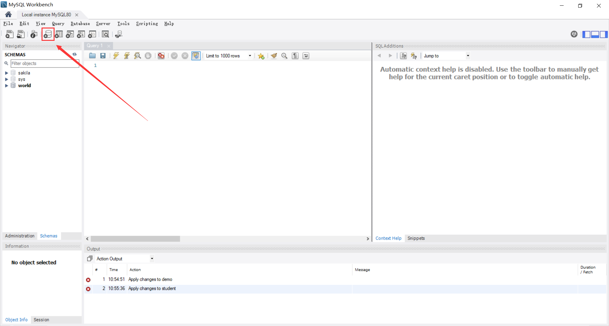
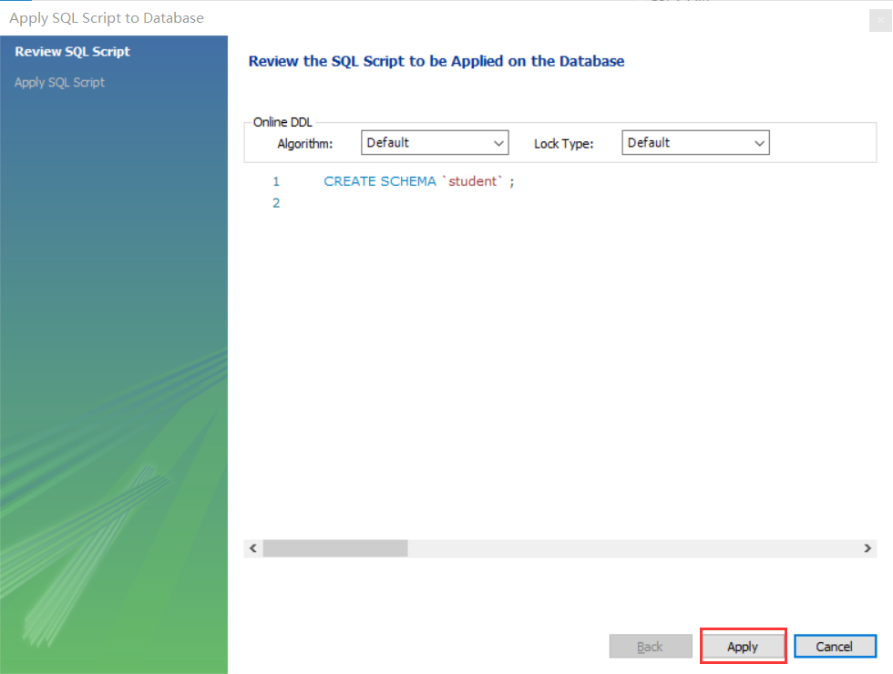
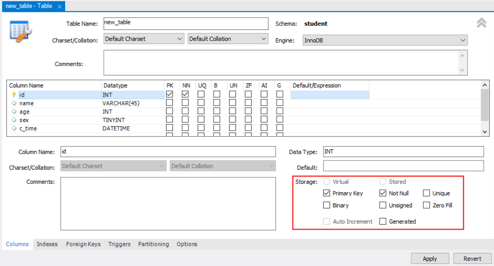

关系型数据库的存储特点

- 数据库：数据表的容器，数据存放在数据表中。一个数据库可以有多个表。
- 数据表：存放数据的表格，每个表都有一个名字，表名具有唯一性。
- 字段：每个列，也称为字段。用来表示该列数据的含义，所有表都是由一个或多个列组成
- 记录：每个行，表示一组完整的数据。表中的数据是按行存储的。


概念对比

| 数据库       | Excel         | 面向对象 |
| ------------ | ------------- | -------- |
| 库(Database) | 文件(.xlsx)   |          |
| 表(Table)    | 工作簿(sheet) | 类       |
| 字段(Field)  | 列            | 属性     |
| 记录(Record) | 行            | 对象     |


SQL语句

结构化查询语言（Structured Query Language），一种特殊目的的编程语言，是一种数据库查询和程序设计语言，用于存取数据以及查询、更新和管理关系数据库系统。

使用特点：

- SQL语言基本上独立于数据库本身
- 各种不同的数据库对SQL语言的支持与标准存在着细微的不同
- 每条命令必须以；结尾
- SQL命令关键字不区分字母大小写

SQL语言内容：

- 数据查询语言：select
- 数据定义语言：DDL(Data Define Language)
  - create
  - drop
  - alter
- 数据操作语言：DML(Data Manipulate Language)
  - insert
  - update
  - delete
- 数据控制语言：DCL(Data Control Language)
  - grant
  - revoke
- 事务控制语言：commit, rollback

MySQL的语法规范：

- 不区分大小写，建议关键字大写，表名、列名小写
- 每条命令用分号结尾
- 每条命令根据需要，可以缩进、换行
- 注释（ctrl + /）
  - 单行注释： # 或 --
  - 多行注释： /* ... */

# 数据库操作

## 图形化界面

点击图中红色框标签，可以新建schema，可以简单地把schema理解为数据库。



点击后会弹出一个页面，默认的字符集是utf8mb4，会默认选择第一个排序规则，所谓排序规则就是比如windows系统中，可以按名称进行排序，这样就是以a开头的文件会比b开头文件更靠前。

一般选择默认选项即可，直接点击右下角的apply

> utf8 与 utf8mb4 的区别，utf8 3个字节表示一个字符，utf8mb4 用4个字节表示一个字符。


进入如下画面，直接点击apply



点击finish即可


创建完毕后，可以看到已经多出了一个表


## 命令行方式

大小写不敏感：`StuDent`和`student`是同样的。

显示所有数据库

```mysql
show databases;
```

### 创建数据库

```mysql
create database student;
```

创建时指定字符集

```mysql
create database student character set utf8;
create database [if not exists] student charset=utf8mb4;
```

- 多次创建会报错
- 如果不指定字符编码，默认为utf8mb4（一个汉字4字节）
- 给数据库命名一定要习惯性加上反引号，防止和关键字冲突

### 查看数据库

显示所有数据库

```mysql
show databases;
```

显示数据库的字符集

```mysql
show create database student;
```

查看当前选择的数据库

```mysql
select database();
```

### 使用某个数据库

```mysql
use student;
```

### 删除数据库

```mysql
drop database [if exists] student;
```

### 修改数据库

```mysql
-- 只能修改字符集
alter database student charset=utf8;
```

# 数据类型

## 常用数据类型

| 类型          | 范围                                                         |
| ------------- | ------------------------------------------------------------ |
| INT           | 4个字节保存整数数据（32位）                                  |
| CHAR(size)    | 定长字符数据，若未指定，默认为1字符                          |
| VARCHAR(size) | 可变长字符数据，根据字符串实际长度保存，必须指定长度         |
| FLOAT(M,D)    | 单精度，M=整数位+小数位，D=小数位。<br />D<=M<=255, 0<=D<=30, 默认M+D<=6 |
| DOUBLE(M,D)   | 双精度，D<=M<=255, 0<=D<=30, 默认M+D<=15                     |
| DATE          | 日期型数据，'YYYY-MM-DD'                                     |
| BLOB          | 二进制形式的长文本数据，最大可达4G                           |
| TEXT          | 长文本数据，最大可达4G                                       |

## 数值类型

- 整数（精确值）：INTEGER\INT(4字节), SMALLINT(2字节), TINYINT(1字节), MEDIUMINT(3字节), BIGINT(8字节)
- 定点类型（精确值）：DECIMAL
- 浮点型（近似值）：FLOAT(4字节), DOUBLE(8字节)
- 比特值类型：BIT

对于精度比较高的数据，如money，可以用用decimal类型提高精度，减少误差。

`DEIMAL(M,D)`

> M是数字的最大位数（精度）。范围为1~65，默认为10
>
> D是小数点右侧数字的数目（标度）。范围为0~30，不得超过M
>
> 比如DECIMAL(6,2)，最多存6位数字，小数点后占两位，取值范围为-9999.99到9999.99

## 字符串类型


| 字符串类型   | 字节 | 描述及存储需求                                            |
| ------------ | ---- | --------------------------------------------------------- |
| CHAR(M)      | M    | M为0~255之间的整数                                        |
| VARCHAR(M)   |      | M为0~65535之间的整数，值的长度+1个字节                    |
| TINYBLOB     |      | 允许长度0~2^8^-1个字节的定长字节字符串，值的长度+1个字节  |
| BLOB         |      | 允许长度0~2^16^-1个字节的定长字节字符串，值的长度+2个字节 |
| MEDIUMBLOB   |      | 允许长度0~2^24^-1个字节的定长字节字符串，值的长度+3个字节 |
| LONGBLOB     |      | 允许长度0~2^32-1^个字节的定长字节字符串，值的长度+4个字节 |
| TINYTEXT     |      | 允许长度0~2^8^-1个字节的定长字节字符串，值的长度+2个字节  |
| TEXT         |      | 允许长度0~2^16^-1个字节的定长字节字符串，值的长度+2个字节 |
| MEDIUMTEXT   |      | 允许长度0~2^24^-1个字节的定长字节字符串，值的长度+3个字节 |
| LONGTEXT     |      | 允许长度0~2^32^-1个字节的定长字节字符串，值的长度+4个字节 |
| VARBINARY(M) |      | 允许长度0~M个字节的定长字节字符串，值的长度+1个字节       |
| BINARY(M)    | M    | 允许长度0~M个字节的定长字节字符串                         |

`CHAR`与`VARCHAR`区别：

| Type       | Input       | Saved in DB | 字节数 | Desc                              |
| ---------- | ----------- | ----------- | ------ | --------------------------------- |
| CHAR(5)    | `"a"`       | `"a     "`  | 5      | 固定占5个字节，不足的用空格补齐   |
| VARCHAR(5) | `"a"`       | `"a"`       | 2      | 固定1字节，额外用1字节记录位长    |
| CHAR(5)    | `"abc  "`   | `"abc  "`   | 5      | 保留结尾空格，依然占5字节         |
| VARCHAR(5) | `"abc  "`   | `"abc"`     | 4      | 删除结尾空格，额外用1字节记录位长 |
| CHAR(5)    | `"abcdefg"` | `"abcde"`   | 5      | 抛错                              |
| VARCHAR(5) | `"abcdefg"` | `"abcde"`   | 6      | 抛错                              |

blob存非文字信息，text存博客之类的文字信息

char和varchar

- char：定长，效率高，一般用于固定长度的表单提交数据存储，默认1字符
- varchar：不定长，效率偏低

text和blob

- text存储非二进制文本
- blob存储二进制字节串

enum和set

- enum存储给出的一个值
- set存储给出的值中一个或多个值

## 时间类型

| 日期和时间类型 | 字节 | 范围                                          | 格式                |
| -------------- | ---- | --------------------------------------------- | ------------------- |
| DATE           | 4    | 1000-01-01-9999-12-31                         | YYYY-MM-DD          |
| DATATIME       | 8    | 1000-01-01 00:00:00-9999-12-31 23:59:59       | YYYY-MM-DD HH:MM:SS |
| TIMESTAMP      | 4    | 19700101080001-2038-1-19 11:14:07（北京时间） | YYYYMMDD HHMMSS     |
| TIME           | 3    | -838:59:59-838:59:59                          | HH:MM:SS            |
| YEAR           | 1    | 1901-2155                                     | YYYY                |

- datetime

  ```mysql
  create table t8(
  create_at datetime
  );
  
  insert into t8 values('2020-11-19 08:00:00');
  insert into t8 values('2020/11/20 09:00:00');
  insert into t8 values(now());
  
  insert into t8 values('12020/11/20 09:00:00'); -- 报错
  
  ```

- time

  ```mysql
  create table t9(
  create_at time
  );
  
  insert into t9 values('12:12:12'); -- 12:12:12 
  insert into t9 values('100:12:12'); -- 4 days, 4:12:12
  insert into t9 values('-100:12:12'); --  -5 days, 19:47:48 
  insert into t9 values('10 10:12:12'); -- 10 days, 10:12:12
  -- 时间的范围是[-839:59:59 - 838:59:59]
  insert into t9 values('839:12:12'); -- 报错
  ```

- timestamp时间戳类型

  - 时间戳类型在显示方面和datetime一样，咋存储不一样
  - 范围从1970-1-1 0:0:0 到2038-1-19 11:14:07
  - 时间戳用4个字节表示
  - 该值大小与存储的长度有关：`2 ** (4 * 8 - 1)`

  ```mysql
  create table t10(
  create_time timestamp
  );
  insert into t10 values(now());
  insert into t10 values('2038-1-19 11:14:07');
  select * from t10;
  
  insert into t10 values('2038-1-19 11:14:08'); -- 报错
  ```

- year，同理，用字符串传年份。

## 布尔型

mysql中的bool类型也是0和1

```mysql
create table t11(
cond boolean
);
# 范围在-128 - 127 直接
insert into t11 set cond=True; -- 1
insert into t11 set cond=1; -- 1
insert into t11 set cond=10; -- 10
insert into t11 set cond=-1; -- -1

insert into t11 set cond=-0.1; -- 0
insert into t11 set cond=0.1; -- 0
insert into t11 set cond=0; -- 0
insert into t11 set cond=False; -- 0
select * from t11;
insert into t11 set cond='True'; -- 报错
```


# 数据表操作

- 创建数据表
- 查看数据表
  - 查看所有数据表
  - 查看一张数据表的表结构
- 删除或清空数据表
- 修改数据表
  - 修改表名
  - 删除数据列
  - 修改数据列
  - 调整数据列顺序

> **数据库引擎**：存储、查询、锁机制、事务处理等方面有不同的设定，会影响数据的查询效率，根据不同的业务需求，需要选择不同的数据存储引擎。
>
> **ID(Identity document)**：身份标识号。是账号、唯一编码、专属号码等概念的表达。
>
> **空间数据类型(Spatial Data Types)**：用来存储经纬度等地理位置信息。

表结构的设置

- 分析存储内容
- 确定字段构成
- 设计字段类型


## 图形化界面

### 查看表

可以右键表，选择Table Inspector，弹出右侧的页面，可以选择Info、Columns、Indexes等标签查看该表的各种信息。


### 创建表

右击Tables，选择Create Table即可创建一个表，主要修改Table Name


每个字段可以选择

- Primary Key
- Not Null
- Unique
- Binary
- Unsigned
- Zero Fill
- Auto Increment
- Generated

定义好列以后，点击apply



会自动帮我们生成创建数据库的语句，点击Apply，接着点击Finish


就创建好了一张表

