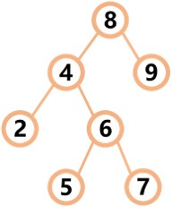

二叉搜索树，老熟人了，前中后、层次遍历，不管是递归还是非递归，讲道理都要滚瓜烂熟。递归写法十分简单，这里主要关注非递归写法即可。

通过做leetcode题目检验自己是否会了，题解有详细代码解答。

核心就是理解前中后序遍历的差别：

- 第一次见到结点就输出：前序
- 第二次见到结点就输出：中序
- 第三次见到结点才输出：后序

用一个栈来存储结点：

- 入栈时表示第一次见到结点
- 出栈时表示第二次见到结点
- 如何表示第三次见到结点？
  - 如果出栈的结点无右子结点，或上一个出栈的结点恰好是右子结点，则这是第三次看到这个结点（下面是解释）
  - 如果是后序遍历，那么在第二次见到结点时，再把结点入栈
  - 如果出栈的结点没有右子结点，它入栈了会马上出栈
  - 列举几棵树的后序遍历序列，总结规律可以发现，如果一个结点有右子树，它前一个出栈的对象必是右子结点

## 前/中序遍历非递归

[144. 二叉树的前序遍历](https://leetcode-cn.com/problems/binary-tree-preorder-traversal/)

[94. 二叉树的中序遍历](https://leetcode-cn.com/problems/binary-tree-inorder-traversal/)

其实方法是类似的，所以把二者放在一起

## :star:后序遍历非递归

只要把这个学会了，前面那两个自然而然就会了。

**考虑怎样表示第三次见到了这个结点。**

tips：某个结点如果输出，要么它没有左结点，要么它的上一个输出一定是它的右结点

[145. 二叉树的后序遍历](https://leetcode-cn.com/problems/binary-tree-postorder-traversal/)

## 层序遍历

这三题搞懂了层序遍历基本没问题

[剑指 Offer 32 - I. 从上到下打印二叉树](https://leetcode-cn.com/problems/cong-shang-dao-xia-da-yin-er-cha-shu-lcof/)

[剑指 Offer 32 - II. 从上到下打印二叉树 II](https://leetcode-cn.com/problems/cong-shang-dao-xia-da-yin-er-cha-shu-ii-lcof/) 和 [102. 二叉树的层序遍历](https://leetcode-cn.com/problems/binary-tree-level-order-traversal/) 相同

[剑指 Offer 32 - III. 从上到下打印二叉树 III](https://leetcode-cn.com/problems/cong-shang-dao-xia-da-yin-er-cha-shu-iii-lcof/)

```python
def levelorder_traversal(root):
    q = collections.deque([root])
    ans = []
    while q:
        n = len(q)
        for i in range(n):
            node = q.pop()
            if not 
```

## 前中后序的递归遍历

这个简单，略




