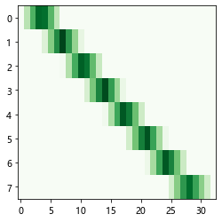

# librosa库获取梅尔谱

- 计算梅尔谱特征：[`librosa.feature.melspectrogram`](https://librosa.org/doc/latest/generated/librosa.feature.melspectrogram.html#librosa.feature.melspectrogram)[【源码】](https://librosa.org/doc/latest/_modules/librosa/feature/spectral.html#melspectrogram)
- 构建梅尔滤波器：[`librosa.filters.mel`](https://librosa.org/doc/latest/generated/librosa.filters.mel.html#librosa.filters.mel)[【源码】](https://librosa.org/doc/latest/_modules/librosa/filters.html#mel)

## 梅尔谱特征计算

梅尔谱特征计算过程：

- 原始数据经过stft计算出频谱
- 构建梅尔滤波器
- 频谱数据经过梅尔滤波器得到梅尔谱特征


梅尔滤波器直观理解

梅尔滤波器本质上就是个加权矩阵。

```python
import librosa
melfb = librosa.filters.mel(sr=2500, n_fft=64, n_mels=8)
fig, ax = plt.subplots(figsize=(4, 4))
ax.imshow(melfb, cmap='Greens')
ax.axis('auto')
```



假设某信号经过STFT变换后，形成了一个`32x1000`(32个频率点，1000帧，假设每帧64个样本点)的频谱数据。

构建8组梅尔滤波器，则梅尔滤波器的形状就是`8x32`

结合官方例子

```python
import librosa

# 加载数据
y, sr = librosa.load(librosa.ex('trumpet'))

# 方法1: 直接计算梅尔谱特征
S1 = librosa.feature.melspectrogram(y=y, sr=sr, n_fft=2048)

# 方法2: 先计算频谱特征，再计算梅尔谱特征
D = np.abs(librosa.stft(y))**2
S2 = librosa.feature.melspectrogram(S=D, sr=sr, n_fft=2048)

# 方法3: 先计算频谱，构建梅尔滤波器，再计算梅尔谱特征
D = np.abs(librosa.stft(y))**2
melfb = librosa.filters.mel(sr=sr, n_fft=2048)
S3 = melfb @ D

# 比较3者计算结果是否相同
np.allclose(S1, S2), np.allclose(S2, S3)
```

```
(True, True)
```

从方法3可以看出，梅尔滤波器本质上就是对频谱进行了一次矩阵运算。

使得频谱的维度降低了。


## 梅尔滤波器构建过程

分析[梅尔滤波器源码](https://librosa.org/doc/latest/_modules/librosa/filters.html#mel)


```python
def mel(
    *,
    sr,
    n_fft,
    n_mels=128,
    fmin=0.0,
    fmax=None,
    htk=False,
    norm="slaney",
    dtype=np.float32,
):

    if fmax is None:
        fmax = float(sr) / 2

    # Initialize the weights
    n_mels = int(n_mels)
    weights = np.zeros((n_mels, int(1 + n_fft // 2)), dtype=dtype)

    # Center freqs of each FFT bin
    fftfreqs = fft_frequencies(sr=sr, n_fft=n_fft)

    # 'Center freqs' of mel bands - uniformly spaced between limits
    mel_f = mel_frequencies(n_mels + 2, fmin=fmin, fmax=fmax, htk=htk)

    fdiff = np.diff(mel_f)
    ramps = np.subtract.outer(mel_f, fftfreqs)

    for i in range(n_mels):
        # lower and upper slopes for all bins
        lower = -ramps[i] / fdiff[i]
        upper = ramps[i + 2] / fdiff[i + 1]

        # .. then intersect them with each other and zero
        weights[i] = np.maximum(0, np.minimum(lower, upper))

    if norm == "slaney":
        # Slaney-style mel is scaled to be approx constant energy per channel
        enorm = 2.0 / (mel_f[2 : n_mels + 2] - mel_f[:n_mels])
        weights *= enorm[:, np.newaxis]
    else:
        weights = util.normalize(weights, norm=norm, axis=-1)

    # Only check weights if f_mel[0] is positive
    if not np.all((mel_f[:-2] == 0) | (weights.max(axis=1) > 0)):
        # This means we have an empty channel somewhere
        warnings.warn(
            "Empty filters detected in mel frequency basis. "
            "Some channels will produce empty responses. "
            "Try increasing your sampling rate (and fmax) or "
            "reducing n_mels.",
            stacklevel=2,
        )

    return weights
```

首先确定了梅尔滤波器组矩阵的形状为，行数为滤波器组数，列数为帧数除二+1

```python
n_mels = 128
n_fft = 2048
sr = 22050

n_mels = int(n_mels)
weights = np.zeros((n_mels, int(1 + n_fft // 2)), dtype=np.float32)
```

根据采样率和帧宽获取每条谱线对应的频率

> 假设帧宽为1000，那每帧经过FFT可以得到一个长为501的幅频图，501就代表有501根谱线，每根谱线对应的频率要根据采样率来计算。

```python
fftfreqs = librosa.fft_frequencies(sr=sr, n_fft=n_fft)

# 本质上就是加了一层封装
def fft_frequencies(*, sr=22050, n_fft=2048):
    return np.fft.rfftfreq(n=n_fft, d=1.0 / sr)
```

计算各个梅尔滤波器频带的中心频率

就是上面那个绿色的最亮的部分代表的频率。

[librosa.mel_frequencies](https://librosa.org/doc/latest/generated/librosa.mel_frequencies.html)

```python
fmin = 0
fmax = float(sr) / 2
htk=False
mel_f = librosa.mel_frequencies(n_mels + 2, fmin=fmin, fmax=fmax, htk=htk)
```

获取梅尔滤波器中心频率差`fdiff`

`np.subtract.outer`，两个一维的数据相减，得到一个2维的矩阵。

比如设`mel_f.shape == (40, )`，`fftfreqs.shape == (1250, )`

最终的`ramps.shape == (40, 1250)`。

其中：

- `ramps[0] = mel_f[0] - fftfreqs`
- `ramps[1] = mel_f[1] - fftfreqs`
- 以此类推

```python
fdiff = np.diff(mel_f)
ramps = np.subtract.outer(mel_f, fftfreqs)
```

计算每个梅尔滤波器的权重分布

**为什么这么计算？**

```python
for i in range(n_mels):
    # lower and upper slopes for all bins
    lower = -ramps[i] / fdiff[i]
    upper = ramps[i + 2] / fdiff[i + 1]

    # .. then intersect them with each other and zero
    weights[i] = np.maximum(0, np.minimum(lower, upper))
```

归一化

经过归一化之后，权重计算的过程就结束了。

```python
if norm == "slaney":
    # Slaney-style mel is scaled to be approx constant energy per channel
    enorm = 2.0 / (mel_f[2 : n_mels + 2] - mel_f[:n_mels])
    weights *= enorm[:, np.newaxis]
else:
    weights = util.normalize(weights, norm=norm, axis=-1)
```

检查是否有异常

```python
# Only check weights if f_mel[0] is positive
if not np.all((mel_f[:-2] == 0) | (weights.max(axis=1) > 0)):
    # This means we have an empty channel somewhere
    warnings.warn(
        "Empty filters detected in mel frequency basis. "
        "Some channels will produce empty responses. "
        "Try increasing your sampling rate (and fmax) or "
        "reducing n_mels.",
        stacklevel=2,
    )
```

