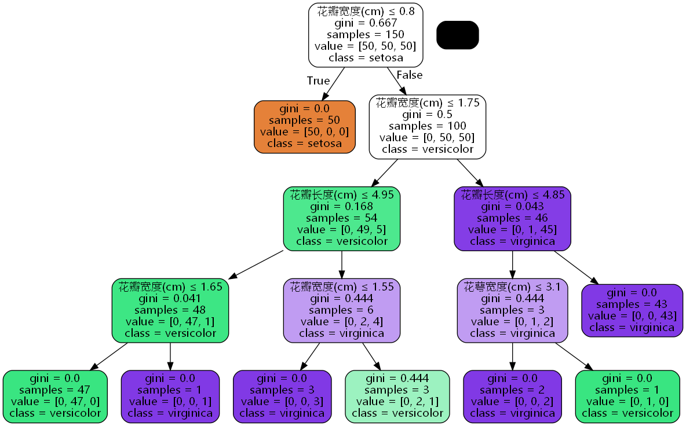

https://blog.csdn.net/ydyang1126/article/details/78842952

(1)需要安装graphviz

http://www.graphviz.org/download/

(2)安装python库graphviz

```
pip install graphviz -i 
```

(3)安装python库pydotplus

```
pip install pydotplus
```


首先需要训练好决策树模型

```python
from sklearn import datasets
from sklearn.tree import DecisionTreeClassifier
from sklearn import tree

# 使用sklearn自带的iris数据
iris = datasets.load_iris()
X = iris.data
y = iris.target

# 使用中文名
feature_names = ['花萼长度(cm)', '花萼宽度(cm)', '花瓣长度(cm)', '花瓣宽度(cm)']

# 训练模型，限制树的最大深度4
clf = DecisionTreeClassifier(max_depth=4)
#拟合模型
clf.fit(X, y)
```

给环境变量加入graphviz的路径，并导入`pydotplus`。

```python
import os
os.environ["PATH"] += os.pathsep + 'D:/Software/Graphviz/bin'

import pydotplus
```

生成graphviz绘图需要的dot数据

```python
dot_data = tree.export_graphviz(
    clf,  # 上面训练好的决策树模型
    out_file=None,
    feature_names=feature_names,
    class_names=iris.target_names,
    filled=True, 
    rounded=True,
    special_characters=True,
    fontname='Microsoft YaHei'  # 字体设为微软雅黑，为正确显示中文
)
```

绘图

```python
graph = pydotplus.graph_from_dot_data(dot_data)
graph.write_png("iris.png")
# graph.write_pdf("iris.pdf")  导出为pdf文件
```



value指不同类别的样本数量。比如第二行橙黄色方框，`value=[50, 0, 0]`表示有50个样本都被分类到第0个类别里了。

class指分类结果，比如第二行橙黄色方框，`class=setosa`表示这个叶节点的分类结果是setosa。
