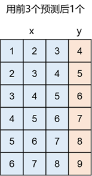

时间序列预测数据集的预处理

原始数据集是这样的：


如果用前1个数据预测后1个数据，特征用x表示，标签用y表示，那结果如下


用前3个预测后1个



用前3个预测后面2个


可以看到，用越多的数预测后面的数，数据集的样本数就越少

需要一个代码把长条状的数据转成需要的数据集

输入：预测用的变量个数n，要预测的变量个数m

```python
import numpy as np

def get_dataset(data, n=1, m=1):
    """
    n : 用多少个数据点来预测
    m : 预测多少个后面的数据点
    """
    x = []
    y = []
    for i in range(0, len(data)-n-m+1):
        x.append(data[i:i+n])
        y.append(data[i+n:i+n+m])
    return np.vstack(x), np.vstack(y) 

data = [1, 2, 3, 4, 5, 6, 7, 8, 9]
x, y = get_dataset(data)
```


# 如何平滑曲线

https://stackoverflow.com/questions/20618804/how-to-smooth-a-curve-in-the-right-way

如何求曲线拐点

https://stackoverflow.com/questions/28092394/find-inflection-and-stationary-points-in-a-numpy-1d-array
