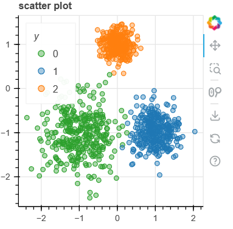

[MATH-SHU-236-Lecture-6-kmeans.pdf (nyu.edu)](https://cims.nyu.edu/~sling/MATH-SHU-236-2020-SPRING/MATH-SHU-236-Lecture-6-kmeans.pdf)

## 原理

我们经常遇到将给定的数据集划分为多个簇的问题：同一簇中的数据点相似性更高。聚类算法有很多，其中k-means是最知名且泛用性最高的算法之一。

什么是k-means？给定$\{x_{i}\}_{i=1}^{n} \in \R^{d}$，希望寻找k个质心，使得数据点到它们所属质心的距离总和最小化。

准确地说。设$\{c_{j}\}_{j=1}^{k}$为质心

$\{\Gamma_{j}\}_{j=1}^{k}$是各个质心对应的分区，$\{\Gamma_{j}\}_{j=1}^{k}$之间互不相交，且$\cup_{j=1}^{k}\Gamma_{j} = [n]$。

距离总和为：
$$
f(\textbf{c}_{j},\Gamma_{j}):=\sum_{j=1}^{k}\sum_{i \in \Gamma_{j}}d(\textbf{x}_i, \textbf{c}_j) \tag{1}
$$
这就是基于质心和分区的k-means损失函数，此处的$d(\textbf{x},\textbf{y})$是距离函数，用于衡量$\textbf{x}$和$\textbf{y}$的相似度，有以下几种距离函数。

- 欧式距离，$d(\textbf{x},\textbf{y})=\left\| \textbf{x} - \textbf{y}\right \|^{2}$。简约而泛用。
- $l_1$距离（曼哈顿距离，city-block距离）：$d(\textbf{x},\textbf{y})=\left\| \textbf{x} - \textbf{y}\right \|_{1}$
- 相关性：$d(\textbf{x},\textbf{y})=1 - \frac{\left<\textbf{x},\textbf{y}\right>}{\left \| \textbf{x} \right \|\left \| \textbf{y} \right \|}$。仅测量方向，忽略了大小。

k-means存在的另一种等效公式
$$
f(\textbf{c}_{j}) := \sum_{i=1}^{n}\min\limits_{1 \le j \le k}d(x_{i},c_{j}) \tag{2}
$$
和式(1)不同的是，式(2)将$x_{i}$分配给距离其最近的质心，因此消去了$\Gamma_{j}$。

$\min_{1 \le j \le k}d(x_i, c_j)$是$x_i$到距离其最近的质心的距离。

k-means的思想是：

- 寻找k个能表征原始数据集的质心
- 通过损失函数$f(c_j)$来衡量聚类效果。损失函数的值越小，聚类效果越好。

现在，我们就明确了我们的目标：寻找质心和分区的最优解。
$$
\min\limits_{{\{c_{j}, \Gamma_{j}\}}_{j=1}^{K}}f(c_j, \Gamma_j)
$$
这是一个优化程序，理想情况下，希望获得这个优化程序的全局最小化器。

- 对于 $d=1$，可以在多项式时间内找到全局最优解。

- 对于 $d \ge 2$，一般而言，获得全局最小化值是一个NP-hard问题，换句话说，我们无法


## 代码

```python
import matplotlib.pyplot as plt
from sklearn.datasets import make_blobs

from bokeh.plotting import figure, show
from bokeh.transform import factor_cmap

# 创建数据集
# X为样本特征，Y为样本簇类别， 共1000个样本，每个样本4个特征，共4个簇，
# 簇中心在[-1,-1], [0,0],[1,1], [2,2]， 簇方差分别为[0.4, 0.2, 0.2, 0.2]
X, y = make_blobs(
    n_samples=1000, 
    n_features=2, 
    centers=[[-1, -1], [1, -1], [0, 1]],
    cluster_std=[0.5, 0.3, 0.2],
    random_state=2022,
)

df = pd.DataFrame(X, columns=["x1", "x2"])
df["y"] = y.astype(str)

p = figure(title = "scatter plot", width=300, height=300)

data_source = ColumnDataSource(df)
p.scatter("x1", "x2", source=data_source,
          legend_group="y", fill_alpha=0.4, size=6,
          color=factor_cmap('y', 'Category10_3',df.y.unique())
          )

# p.y_range = Range1d(-5, 5)
p.legend.location = "top_left"
p.legend.title = "y"

show(p)

```

