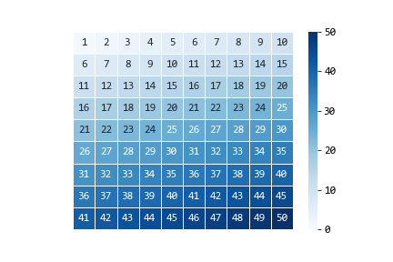

# 信号的分帧加窗

语音处理六大步骤：https://blog.csdn.net/u010164190/article/details/103904180

参考资料：https://www.cnblogs.com/LXP-Never/p/10078200.html#blogTitle10

https://www.zhihu.com/question/52093104/answer/225983811

​	我们要对语音进行分析，首先要提取能够表示该语音的特征参数，有了特征参数才可能利用这些参数进行有效的处理，在对语音信号处理的过程中，语音信号的质量不仅取决于处理方法，同时取决于时候选对了合适的特征参数。

　　语音信号是一个非平稳的时变信号，但语音信号是由声门的激励脉冲通过声道形成的，而声道(人的口腔、鼻腔)的肌肉运动是缓慢的，所以“短时间”(10~30ms)内可以认为语音信号是平稳时不变的。由此构成了语音信号的“短时分析技术”。

　　在短时分析中，将语音信号分为一段一段的语音帧，每一帧一般取10~30ms，我们的研究就建立在每一帧的语音特征分析上。

　　提取的不同的语音特征参数对应着不同的语音信号分析方法：时域分析、频域分析、倒谱域分析...由于语音信号最重要的感知特性反映在功率谱上，而相位变化只起到很小的作用，所有语音频域分析更加重要。

## 信号分帧

假如信号是一个一维的数组。要对其进行分帧

每帧帧长为10，步长为5

```python
import numpy as np

def get_frame(signal, window, step):
    signal_length = len(signal)
    # 计算帧数
    # num_frame = max(-1, (signal_length - window - 1)) // step + 1 + 1
    r = [signal[start:start+window] for start in 
         range(0, max(1, signal_length - window + step), step)]
    
    # 若最后一行长度不足，则补齐
    pad_width = window - len(r[-1])
    r[-1] = np.pad(r[-1], (0, pad_width), constant_values=0)
    
    return np.vstack(r)

signal = np.arange(1, 17)  # 信号
window = 10  # 帧宽
step = 5 # 步长
res = get_frame(signal, window, step)
```


```python
signal = np.arange(1, 17)  # 信号
window = 10  # 帧宽
step = 5 # 步长
res = get_frame(signal, window, step)

print('原始信号')
print(signal)
print('分帧后')
print(res)
```

```
原始信号
[ 1  2  3  4  5  6  7  8  9 10 11 12 13 14 15 16]
分帧后
[[ 1  2  3  4  5  6  7  8  9 10]
 [ 6  7  8  9 10 11 12 13 14 15]
 [11 12 13 14 15 16  0  0  0  0]]
```


可视化

```python
import seaborn as sns
plt.rcParams['font.family'] = 'consolas'
plt.rcParams['font.size'] = 12

fig, ax = plt.subplots()
sns.heatmap(res, vmin=0, vmax=50, square=True, 
            lw=1, annot=True, cmap='Blues', ax=ax)
ax.set_xticks([])
ax.set_yticks([])
plt.savefig('分帧.png')
plt.show()
```


分帧完毕后如下图



## 信号加窗

https://www.cnblogs.com/zhenmeili/p/14830176.html	

为什么要加窗？

加窗即与一个窗函数相乘,加窗之后是为了进行傅里叶展开.
 1.使全局更加连续，避免出现吉布斯效应
 2.加窗时候，原本没有周期性的语音信号呈现出周期函数的部分特征。
 加窗的代价是一帧信号的两端部分被削弱了，所以在分帧的时候，帧与帧之间需要有重叠。

> 加窗后一帧内的首尾信号会变小。
>
> 傅里叶变换会更加合理？

```python
import scipy.signal as signal
w = signal.windows.hann(10)
plt.plot(w)
```

我理解的信号加窗就是分帧后，对每一帧的每个点乘以一个系数

```python
res = w * res
```

