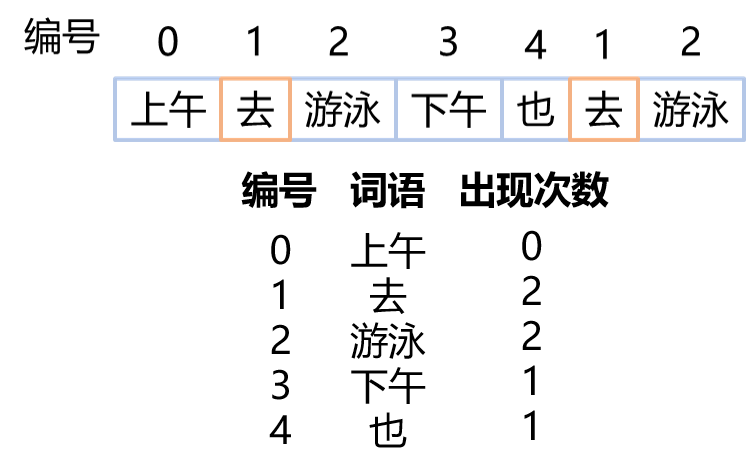

论文下载地址：https://nlp.stanford.edu/pubs/glove.pdf

glove词向量下载地址：https://nlp.stanford.edu/projects/glove/

**为什么会有glove词向量**

Word2Vec只能反映局部的词语之间的关系，GloVe能反应全局词语之间的关系。

**符号说明**

| 符号                       |                                   |
| -------------------------- | --------------------------------- |
| $X$                        | 词共现矩阵                        |
| $P$                        | 词共现概率矩阵                    |
| $X_{ij}$                   | 词$i$的上下文出现词$j$的**次数**  |
| $X_i=\sum_kX_{ik}$         | 词$i$的上下文出现过的**词的总数** |
| $P_{ij}=P(j|i)=X_{ij}/X_i$ | 词$j$出现在词$i$上下文的**概率**  |

举个例子说明上述符号：

先给出现的词编号：

以词“去”为中心词，这个词**周围的一个词**作为上下文，统计其他词出现的情况。

则
$$
(X_{10},X_{11},X_{12},X_{13},X_{14})=(0,2,2,1,1)
$$

$$
X_1=\sum_kX_{1k}=6
$$

$$
(P_{10},P_{11},P_{12},P_{13},P_{14})=(0,\frac{2}{6},\frac{2}{6},\frac{1}{6},\frac{1}{6})
$$

先从一个简单的例子了解词共现概率矩阵的作用：

这些词语之间的关联性如下：

fashion和ice与steam均不相关，$P(k|ice)/P(k|steam)$ 接近于1。

water与ice和steam均相关，$P(k|ice)/P(k|steam)$ 接近于1。

solid和ice相关，与steam不相关，$P(k|ice)/P(k|steam)$ 远离1。

也就是说，一个词和另外两个词比较，如果它之和其中一个相关，那它们共现概率的比值是远离1的。

**词向量之间的相似度取决于共现概率的比值，而不是共现概率本身**

因此提出了这个模型：
$$
F(w_i,w_j,\tilde{w}_k)=\frac{P_{ik}}{P_{jk}} \tag1
$$
其中$w \in R^d$表示词向量，$\tilde{w} \in R^d$是另一种词向量(separate context word vectors)，$W$和$\tilde{W}$是需要生成的两个词向量，它们的区别仅是随机初始化不一样，理论上，用哪个词向量最后的效果都是一样的。

$F$是模型，根据这三个词向量构建的模型。

因为向量空间是线性结构，等号左侧的$w_i,w_j$表示的是两个词是否是相关的，表示相关性最简单的方式就是两向量做差。这样就简化了上式：
$$
F(w_i-w_j,\tilde{w}_k)=\frac{P_{ik}}{P_{jk}}\tag2
$$
但是还是过于复杂，**等号右侧是一个标量**，也就是一个数，而左侧目前还是向量，要想使向量变成标量，就可以通过转置乘积的方式：
$$
F((w_i-w_j)^T\tilde{w}_k)=\frac{P_{ik}}{P_{jk}}\tag3
$$
这一步的原文没太理解，希望减法生成一个除法，也就是说，因为左侧还是有3个向量，希望简化为两个向量，那减法转除法能想到什么？指数运算！指数运算的减法就可以转换为除法，这里假设了$F$是一个指数运算：
$$
F((w_i-w_j)^T\tilde{w}_k)=\frac{F(w^T_i\tilde{w}_k)}{F(w^T_j\tilde{w}_k)}\tag4
$$
这样就可以分开计算分子和分母了，而分子和分母的形式是类似的，只需要考虑分子即可：
$$
F(w^T_i\tilde{w}_k)=P_{ik}=\frac{X_{ik}}{X_i}\tag5
$$
假设$F=exp$，求解上式可以取对数
$$
w^T_i\tilde{w}_k=log(P_{ik})=log(X_{ik})-log(X_i)\tag6
$$
加入两个偏置，这个偏置是用来替换掉$log(X_i)$的，因为讲道理的话，$w^T_i\tilde{w}_k \rightarrow w^T_k\tilde{w}_i$，等号右边不需要变，因为$X_{ik}$是一个对称矩阵，想要利用对称性这一点，所以把$log(X_i)$删掉，加入两偏置。

此时等号右侧已经是一个可统计的信息了，$X_{ik}$是可以统计出来的。
$$
w^T_i\tilde{w}_k+b_i+\tilde{b}_k=log(X_{ik})\tag7
$$
但是这个式子还是有问题，因为可能会出现$log0$的情况。因此$log(X_{ik})\rightarrow log(1+X_{ik})$

这个词共现矩阵很像LSA，LSA是啥。

由于词共现出现的次数很少，$X$大概有75%-95%的数据都是0。

提出weighted least squares regression 模型解决这个问题。

损失函数为：
$$
J=\sum_{i,j=1}^Vf(X_{ij})(w^T_i\tilde{w}_k+b_i+\tilde{b}_k-log(X_{ik}))^2\tag8
$$
$V$表示词向量的维度，$f(X_{ij})$为权重函数，为了描述词的重要性，权重函数的特性：

- $f(0)=0$
- $f(x)$应该是非递减的，这样共现小的词就不会有高权重
- 对于$x$很大的情况，$f(x)$的值也应该要相对小些，这样不会高估共现次数大的词。

$$
f(x)=\left\{ \begin{align}
&(x/x_{\text{max}})^\alpha & \text{if }x \lt x_{\text{max}}\\
&1 & \text{otherwise}
 \end{align}\right.
$$

这里给出经验值$x_{\text{max}}=100, \alpha=3/4$

有点像回归模型，这里就不需要我们考虑梯度下降求解的问题了。

理论上，获得语料，构造共现矩阵，然后自己写一下损失函数，就能训练glove模型了，因为类似tensorflow这种框架已经帮你解决了梯度下降的问题。