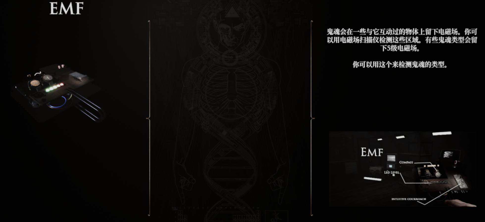
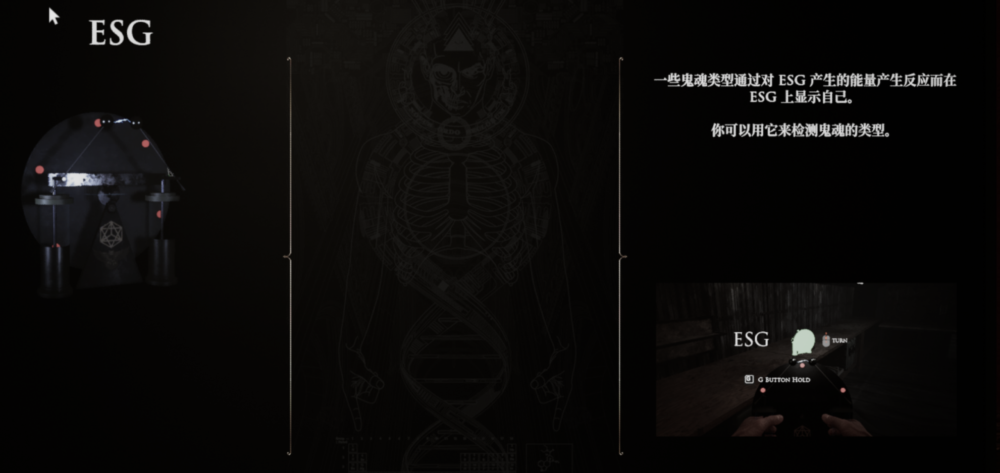
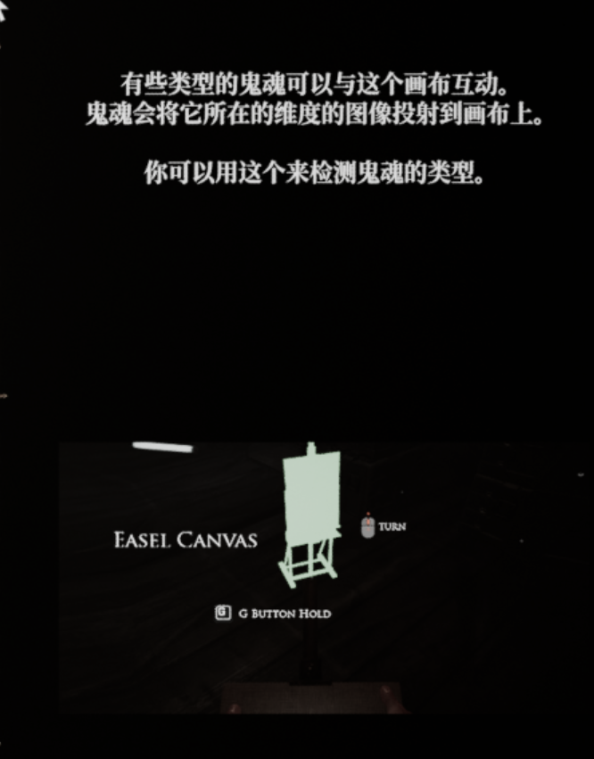
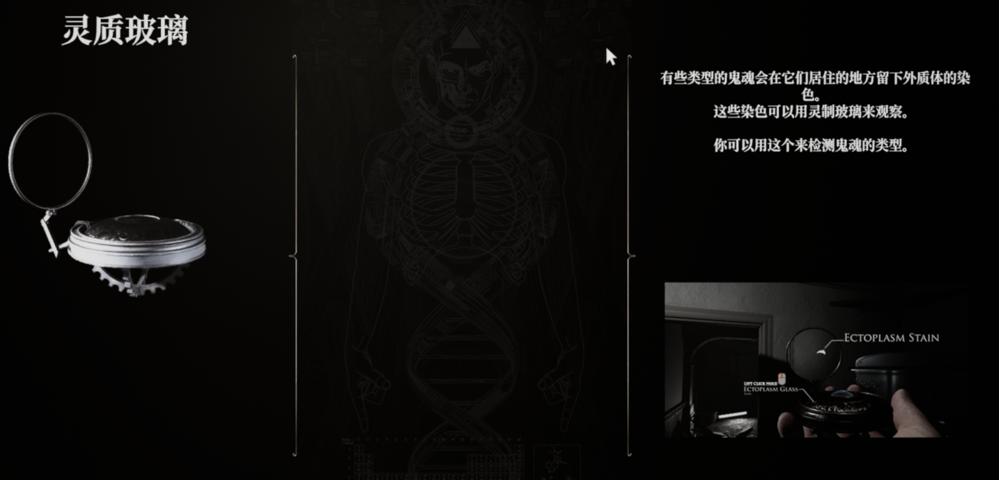
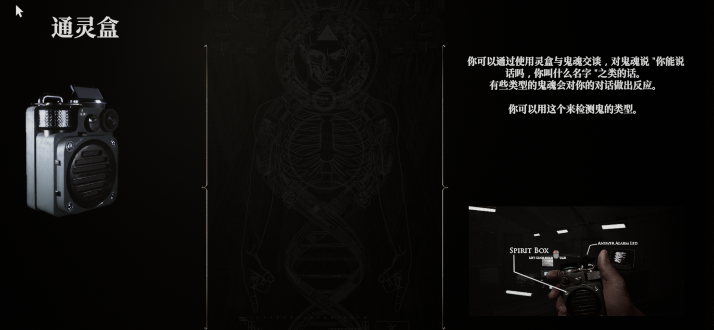
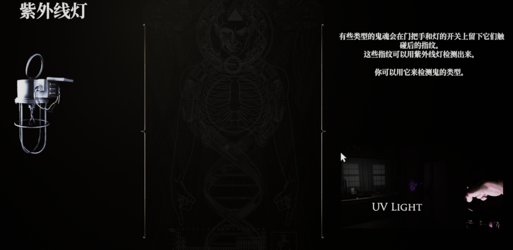
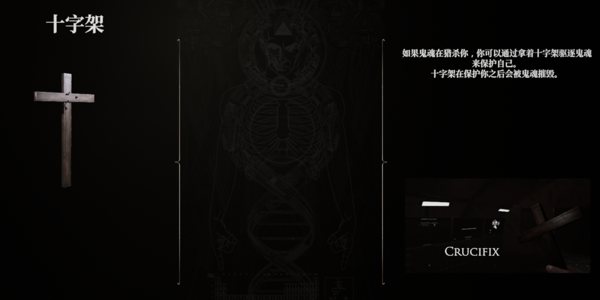
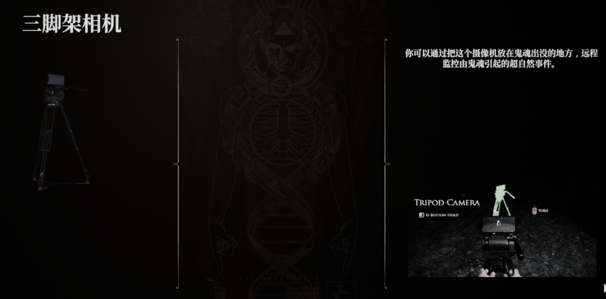
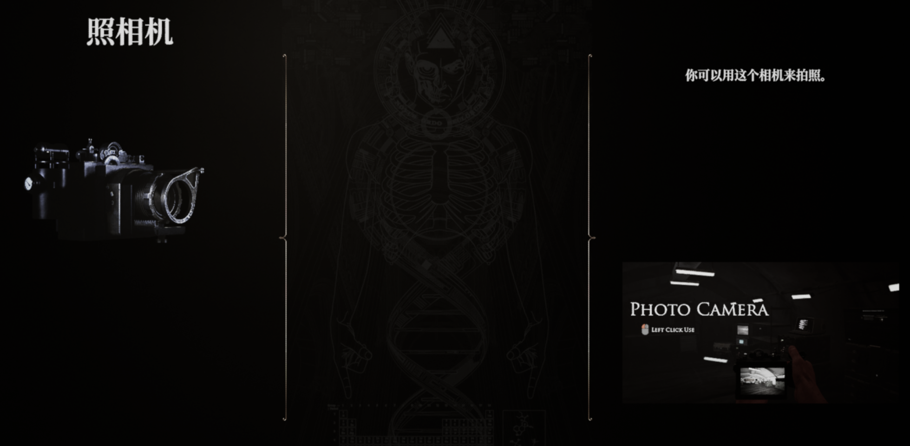

## 道具

## 鬼魂

### 1-1 IBLIS

IBLIS是一种即使在远处也能感知并有到猫物位置的鬼魂。如果你离IBLIS足够近，你可以听到
它使用其他幽灵不会说的语句。

优势：如果它决定狩猎你可能无法逃脱，因为它知道你的位置。

弱点∶如果靠近目标，它会移动得更慢。

证据：

- 灵盒反应
- 画架帆布画
- ESG幽灵反应

### 1-2 DEOGEN

众所周知，除了它眼中的猎物之外，它们对任何事物都不感兴趣。

优势:在猎杀选择的目标时，它们会更具攻击性。

弱点:如果猎物不在附近，它的攻击性就会降低。

证据：

- 外质体染色
- 指纹
- ESG 幽灵反应

### 1-3 AGASH

AGASH是一种以寒冷环境为食的幽灵。如果AGASH决定猎杀，你可以看到它的呼吸。

优势:它在寒冷的环境中移动得更快。

弱点:在温暖的环境中，它的运动可能会减慢。

证据

- 外质体染色
- 冻结的温度
- 指纹

### 1-4 SHADE

阴影被称为对光过敏的幽灵。他们不喜欢在明亮的环境中，并且总是喜欢关灯。

优势︰它们在黑暗中更具攻击性。

弱点:明亮的环境会削弱阴影。

证据

- 外质体染色
- 灵盒反应
- 画架帆布画

### 1-5 ONRYO

与其他鬼魂不同，ONYROS被称为嫉妒的鬼魂。他们可以选择一个人，爱上他们并攻击其他任何人。

优势∶如果有其他人和它们选择的人在一起，它会更具攻击性。

弱点:它们不会伤害它们爱上的人。

证据

- EMF 5级
- 指纹
- 画架帆布画

### 1-6 ONI

鬼有一种特殊的能力，可以迅速降低靠近它的人的理智。这是一个非常危险的幽灵。如果它愿意，它可以很快玩弄你的理智并决定杀死你。

优势︰众所周知，它非常快。

弱点:我们没有任何数据。

证据:

- EMF 5级
- 冻结的温度
- 指纹

### 1-7 THAYE

THAYE被称为可以扭曲时间概念的鬼魂。由于THAYE衰老得很快，因此无法知道它们的确切年龄。

优势:众所周知，THAYE在年轻时更快也更具进攻性。

弱点:年龄较大的THAYE移动得更慢，攻击性也会降低。

证据

- 灵盒反应
- 指纹
- 画架帆布画

## 测试

YUSUF LESTER

购买装备后，要点击一下装备左边的箭头装载。