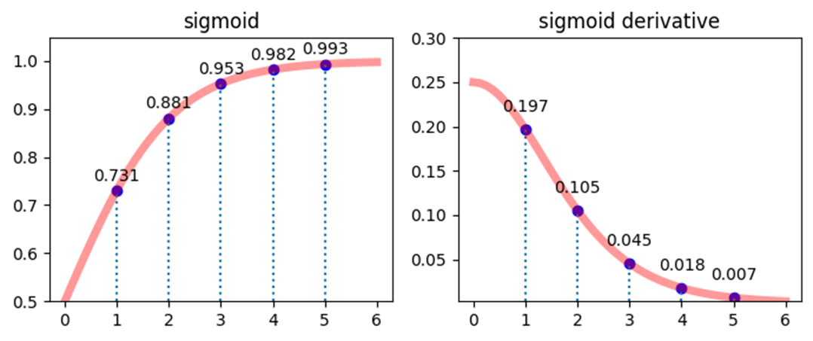

寿命被认为是非常稀缺的资源

作为游戏，如果模拟时间太长，感觉玩起来会很累。

|      | 上升期 | 平稳期  | 衰弱期 | 期望寿命 |
| ---- | ------ | ------- | ------ | -------- |
| 凡人 | 6-36   | 36-48   | 48-    | 60       |
| 练气 | 6-60   | 60-72   | 72-    | 80       |
| 筑基 | 6-100  | 100-110 | 110-   | 120      |
| 金丹 | 6-150  | 150-170 | 170-   | 180      |
| 元婴 | 6-270  | 270-290 | 290-   | 300      |
| 化神 | 6-450  | 450-470 | 470-   | 480      |


这些阶段和人物的表观年龄挂钩。如果有余力，这个表观年龄应该影响人物立绘。

16岁以前是幼年。上升期是青年。平稳期是中年。衰弱期是老年。


上升期顾名思义，在这段区间，修炼速度是越来越快的。

到达平稳期以后，修炼速度持平

增长速率的设定。需要设置一个上升期的增长速率。

刚到达新境界时，速率增长的会很快。然后增长速率会放得比较缓。最后的效果是


感觉可以研究一下sigmoid函数和tanh函数

```python
import numpy as np

def sigmoid(x):
    return 1 / (1 + np.exp(-x))

def sigmoid_derivative(x):
    s = sigmoid(x)
    return s * (1 - s)

def tanh(x):
    return np.tanh(x)

def tanh_derivative(x):
    t = tanh(x)
    return 1 - t**2
```

这里主要以sigmoid函数为例

正常情况下，x与y的对照关系是当x大概到5左右，y基本接近于1



观看导数曲线也可以看出，初始状态下速度提升很快。

但是有时候需要变换范围来满足特定的曲线需求

- 对x进行偏移和放缩
- 对y进行放缩

原函数：y = f(x)，值域为 ymin, ymax。

现在希望获得一个放缩后的新函数，值域放缩为(new_ymin, new_ymax) ，x也进行等比例放缩和偏移

```python
def transform_func(func, ymin, ymax, new_ymin, new_ymax, x_shift, x_scale):
    """
    func 要进行变换的函数，它只有一个参数
    ymin, ymax 已知的这个函数的范围
    new_ymin, new_ymax 变换后的函数的范围
    x_shift x的偏移量
    x_scale x的放缩比例
    """
    def new_func(x):
        # 首先对x进行偏移和放缩
        x_transformed = (x - x_shift) / x_scale
        # 计算原函数的输出
        y = func(x_transformed)
        # 对y进行放缩
        y_transformed = new_ymin + (new_ymax - new_ymin) * ((y - ymin) / (ymax - ymin))
        return y_transformed
    return new_func

```

案例

- y放缩后的范围设定为：5 至 20。（已知sigmoid函数，在x大于0时，y的值域为0.5~2)
- 当 x = 20时，希望y能达到 18 左右。求x应该放缩的比例 x_scale

这里首先需要求解x应该放缩的比例 x_scale

```python
# sigmoid的反函数
def sigmoid_r(y):
    assert  0.5 <= y < 1
    return  -np.log(1 / y - 1)

# 计算x放缩的比例
def get_sigmoid_x_scale(target_x, target_y, ymin, ymax):
    # 将 y 还原到原始sigmoid函数的范围
    y = (target_y - ymin) / (ymax - ymin) / 2 + 0.5
    # 计算原始的x
    x = sigmoid_r(y)
    # 计算放缩比例
    scale = target_x / x
    return scale
```

按照要求获得新的函数

```python
# 当x=target_x时，希望f(x) 到达目标 target_y
target_x = 20
target_y = 18
# 已知的函数f(x) 的范围
ymin, ymax = 0.5, 1
# 函数 f(x) 要放缩的范围
new_ymin, new_ymax = 5, 20
# x 要偏移的值
x_shift = 0
x_scale = get_sigmoid_x_scale(target_x, target_y, new_ymin, new_ymax)
new_func = transform_func(sigmoid, ymin, ymax, new_ymin, new_ymax, x_shift, x_scale)
```

搞了半天代码。


