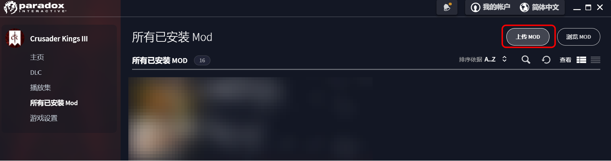

# CK3MOD笔记

控制台敲代码的时候用tab可以查看提示

## 创建mod

使用CK3自带的启动器，选择“所有已安装Mod”，点击“上传MOD”。

注意这里需要联网，否则是无法使用CK3启动器自带的MOD生成工具。



进入后选择创建MOD，根据提示即可创建自己的MOD。

## 技巧积累

主要参考的文件`.\Crusader Kings III\game\common`


### 仅宗族成员通婚

在文件`.\common\scripted_triggers`中，找到`relation_with_character_is_incestuous_in_faith_trigger`

这是是用来判断角色之间是否存在乱伦关系的trigger。如果存在乱伦，则不能结婚。

两个美元符`$`包起来的就是传入的参数比如`$FAITH$`，这个变量是信仰。

```perl
relation_with_character_is_incestuous_in_faith_trigger = {
	OR = {
		# ...
		AND = {
			$FAITH$ = { has_doctrine = doctrine_consanguinity_unrestricted }
			NOT = { dynasty = $CHARACTER$.dynasty }
		}
		#doctrine_consanguinity_unrestricted; all forms of incest is acceptable
	}	
}
```

加入的这一行表示当宗教信仰是无限制婚姻时，就转换成仅宗族内通婚。

假设玩家的宗教信仰包含无限制婚姻信条。

测试：

- 玩家寻找配偶：无法找到不同宗族的对象。
- 玩家改信其他宗教：能够找到不同宗族的对象。
- 玩家为同宗教角色寻找配偶：无法找到不同宗族的对象。
- 玩家为不同宗教角色寻找配偶：能够找到其他宗族的对象。
- 玩家是其他宗教，为该宗教角色寻找配偶：无法找到不同宗族的对象。

后果预计：基本上除了玩家，其他信仰该宗教的角色都无法结婚。

### 纯血角色仅宗族成员通婚

如果该角色没有纯血特质，那他就可以与其他宗族通婚。

优点：AI生成的家族也会发展壮大，此外，由于玩家家族全是纯血，AI家族无法与玩家家族通婚。


触发条件改为：

- 信仰是无限制婚姻
- 不是同一个宗族
- 任意一方角色有纯血特质

```perl
relation_with_character_is_incestuous_in_faith_trigger = {
	OR = {
		# ...
		AND = {
			$FAITH$ = { has_doctrine = doctrine_consanguinity_unrestricted }
			NOT = { dynasty = $CHARACTER$.dynasty }
			OR = { 
			    has_trait = pure_blooded
			    $CHARACTER$ = { has_trait = pure_blooded }
			}
		}
		#doctrine_consanguinity_unrestricted; all forms of incest is acceptable
	}	
}
```

测试：

- 玩家拥有纯血特质，寻找配偶：无法找到不同宗族对象。
- 玩家移除纯血特质，寻找配偶：能够找到不同宗族对象。

## 婚姻接受度修改

`.\common\scripted_modifiers\00_marriage_scripted_modifiers.txt`

### 宗族不同减少接受度

下面两个modifier的含义分别为：

- 如果两方宗族不同，且对方有纯血特质，则接受度-1000
- 如果两方宗族不同，且己方有纯血特质，则接受度-1000

```perl
marriage_ai_accept_modifier = { ###MARRIAGE SCRIPTED MODIFIERS###
	modifier = { # 两方
		scope:secondary_recipient = { 
			NOT { dynasty = scope:secondary_actor.dynasty}
			has_trait = pure_blooded
		}
		add = -1000
	
	
	modifier = { # 两方宗族不同，且我方有纯血特质
		scope:secondary_actor = { 
			NOT { dynasty = scope:secondary_recipient.dynasty}
			has_trait = pure_blooded
		}
		add = -1000
	}
	# ...
```

整合为一个modifier

```perl
	modifier = { # 两方
		scope:secondary_recipient = { 
			NOT { dynasty = scope:secondary_actor.dynasty}
			OR = {
			    has_trait = pure_blooded
			    scope:secondary_actor = { has_trait = pure_blooded }
			}
		}
		add = -1000
```


测试：

- 玩家有纯血特质，对面无：接受度-1000
- 玩家无纯血特质，对方有：接受度-1000

### 宗族相同增加接受度

两方宗族相同，且双方都有纯血特质 且双方都成年 且双方都小于25岁 接受度增加200

```perl
	modifier = { # 
		scope:secondary_recipient = { 
			dynasty = scope:secondary_actor.dynasty
			has_trait = pure_blooded
			age < 25
			is_adult = yes
		}
		scope:secondary_actor = { 
			has_trait = pure_blooded 
			age < 25
			is_adult = yes
		}
		add = 200
	}
```

### 骨科增加接受度

男性或年龄小于29。

```perl
	modifier = { # 
		scope:secondary_recipient = { 
			dynasty = scope:secondary_actor.dynasty
			is_sibling_of = scope:secondary_actor
			has_trait = pure_blooded
			OR = {
				is_male = yes
				age < 29
			}
		}
		scope:secondary_actor = { 
			has_trait = pure_blooded 
			OR = {
				is_male = yes
				age < 29
			}
		}
		add = 1000
	}
```

修改整合

```perl
	modifier = { # 
		scope:secondary_recipient = { 
			dynasty = scope:secondary_actor.dynasty
			has_trait = pure_blooded
			OR = {
				is_male = yes
				age < 29
			}
		}
		scope:secondary_actor = { 
			has_trait = pure_blooded 
			OR = {
				is_male = yes
				age < 29
			}
		}
		add = {
		    value = 100
		    if {
		        limit = { 
		            scope:secondary_actor = {
		                is_sibling_of = scope:secondary_recipient
		            }
		        }
		        multiply = 10
		    }
		}
	}
```


### 年龄相差越大接受度越低


## 定制宗教

### 能否结婚的判定

入口在这个函数`faith_allows_marriage_consanguinity_trigger`

`common\scripted_triggers\00_religious_triggers.txt`

```perl
#Needs CHARACTER_1 and CHARACTER_2
faith_allows_marriage_consanguinity_trigger = {
	save_temporary_scope_as = consanguinity_faith

	NOT = {
		$CHARACTER_1$ = {
			relation_with_character_is_incestuous_in_faith_trigger = {
			    CHARACTER = $CHARACTER_2$
			  	FAITH = scope:consanguinity_faith
			}
		}
	}
}
```

接收两个参数

然后跳转到函数`relation_with_character_is_incestuous_in_faith_trigger`

```perl
#Needs CHARACTER and FAITH
relation_with_character_is_incestuous_in_faith_trigger = {
	OR = {
		#doctrine_consanguinity_restricted; absolutely no family business 
		AND = {
			$FAITH$ = { has_doctrine = doctrine_consanguinity_restricted }
			is_close_or_extended_family_of = $CHARACTER$ #[parents, children, siblings, grandparents, grandchildren, cousins, uncles, aunts, nephews, nieces]
		}
		#doctrine_consanguinity_cousins; the only acceptable incest is with your cousin
		AND = {
			$FAITH$ = { has_doctrine = doctrine_consanguinity_cousins }
			OR = {
	            is_close_family_of = $CHARACTER$ #[parents, children, siblings, grandparents, grandchildren]
	            is_uncle_or_aunt_of = $CHARACTER$
	            is_nibling_of = $CHARACTER$
	        }
		}
		#doctrine_consanguinity_aunt_nephew_and_uncle_niece; extended family is ok
		AND = {
			$FAITH$ = { has_doctrine = doctrine_consanguinity_aunt_nephew_and_uncle_niece }	
			is_close_family_of = $CHARACTER$
		}
		# 下面是我修改的，必须要同一王朝，且具有纯血特质。
		# doctrine_consanguinity_unrestricted; all forms of incest is acceptable
		AND = {
			$FAITH$ = { has_doctrine = doctrine_consanguinity_unrestricted }
			OR = {
				NOT = { dynasty = $CHARACTER$.dynasty }
				NAND = {
					has_trait = pure_blooded
					$CHARACTER$ = { has_trait = pure_blooded }
				}
			}
		}
		
	}	
}

```


## 自定义宗族、角色

https://ck3.parawikis.com/wiki/%E8%A7%92%E8%89%B2%E6%A8%A1%E7%BB%84%E5%88%B6%E4%BD%9C

### 自定义宗族

参考`./common/dynasties/`

```perl
kk_dyn_01 = {
	name = "dynn_Nova"
	culture = "castilian"
}
```

中间的`name = "dynn_Nova"`貌似不加双引号也能本地化

### 自定义角色

```
disallow_random_traits = yes  # 不允许随机特质
dynasty_house = ...  # 设置宗族家族
```

肖像覆盖

```perl
pbd_female_02 = {
    name = pbd_female_name_02
    ....
    portrait_override={
        portrait_modifier_overrides={
            custom_hair=female_hair_fp2_iberian_muslim_01_common
        }
    }
    ...
}
```


`./history/characters/`

```perl
kk_person_01 = {
	name = kk_Arya
	dynasty = kk_dyn_01
    female = yes
    dna = kk_Arya_dna
    
	martial = 15
	diplomacy = 17
	intrigue = 16
	stewardship = 50
	religion = "catholic"
	culture = "castilian"
    sexuality = heterosexual

	trait = just
	trait = humble
	trait = education_intrigue_1

	851.1.1 = {
		birth = "851.1.1"
	}
	# 1212.1.1 = {
	#	 add_spouse = 71965
	# }
	947.1.1 = {
		death = "947.1.1"
	}
}
```

常用先天特质

```perl
trait = beauty_good_3
trait = physique_good_3
trait = intellect_good_3
trait = fecund
trait = pure_blooded
```

顶级教育特质

```perl
trait = education_diplomacy_4
trait = education_martial_4
trait = education_stewardship_4
trait = education_intrigue_4
trait = education_learning_4
trait = education_martial_prowess_4
```

巫师

```perl
trait = witch
```

将领特质

```perl
trait = military_engineer
trait = organizer
trait = logistician
trait = aggressive_attacker
trait = flexible_leader
trait = holy_warrior
trait = cautious_leader
trait = winter_soldier
trait = open_terrain_expert
trait = reckless
```

性格特质

```perl
# 合群 安于现状 慷慨 外交家
trait = gregarious
trait = content
trait = generous

# 多变 谋略家 
trait = deceiful
trait = fickle
trait = chaste

# 勤勉 耐心 谦虚 学者
trait = diligent
trait = patient
trait = humble

# 勤勉 节制 公正 财政
trait = diligent
trait = temperate
trait = just

# 勇敢 冷静 冷酷军事家
trait = brave
trait = calm
trait = callous
```

角色A：领主

```perl
    trait = education_stewardship_4
    trait = beauty_good_3
    trait = physique_good_3
    trait = intellect_good_3
    trait = fecund
    trait = pure_blooded
    trait = witch
    trait = brave
    trait = diligent
    trait = patient
```

角色B：领主配偶

```perl
    trait = education_stewardship_4
    trait = beauty_good_3
    trait = physique_good_3
    trait = intellect_good_3
    trait = fecund
    trait = pure_blooded
    trait = witch
    trait = brave
    trait = diligent
    trait = calm
    trait = military_engineer
    trait = organizer
    trait = logistician
```


### 自定义DNA

`./common/dna_data`

```perl
kk_Arya_dna={
    portrait_info={
        genes={
            hair_color={ 1 6 168 146 }
            skin_color={ 2 3 92 65 }
            eye_color={ 0 146 120 202 }
            gene_chin_forward={ "chin_forward_neg" 163 "chin_forward_neg" 140 }
            gene_chin_height={ "chin_height_pos" 119 "chin_height_pos" 121 }
            # ...
        }
    }
    enabled=yes
}
```

### 自定义领地

修改了`history\titles\k_andalusia.txt`，把里面的holder修改成自己角色的ID

```perl
852.9.22 = {
    #holder = 73683 # Muhammad I Umayyad
    holder = kk_person_01
}
```


## 角色特质

所有特质都有一个ID用于在游戏内部引用。它们可以在`game\common\traits\00_traits.txt`中找到。特质ID通常和它们的名称匹配。执行以下步骤可以根据特质的名称获得其ID

### 教育

| 教育特质                                                     | ID                          |
| ------------------------------------------------------------ | --------------------------- |
|  天真的绥靖者 | education_diplomacy_1       |
|  合格的谈判者 | education_diplomacy_2       |
|  魅力非凡的说客 | education_diplomacy_3       |
|  幕后操控人 | education_diplomacy_4       |
|  鲁莽的战士 | education_martial_1         |
|  坚强的战士 | education_martial_2         |
|  优秀战术家 | education_martial_3         |
|  天才军事家 | education_martial_4         |
|  放荡的浪子 | education_stewardship_1     |
|  节俭的职员 | education_stewardship_2     |
|  财富创造者 | education_stewardship_3     |
|  点石成金者 | education_stewardship_4     |
|  业余阴谋家 | education_intrigue_1        |
|  浮夸的诈骗师 | education_intrigue_2        |
|  暗中策划者 | education_intrigue_3        |
|  难以捉摸的影子 | education_intrigue_4        |
|  尽职的书吏 | education_learning_1        |
|  有见地的思想家 | education_learning_2        |
|  明睿的智者 | education_learning_3        |
|  哲学大师 | education_learning_4        |
|  笨手笨脚的扈从 | education_martial_prowess_1 |
|  自信的骑士 | education_martial_prowess_2 |
|  令人敬畏的方旗骑士 | education_martial_prowess_3 |
|  著名勇士 | education_martial_prowess_4 |


### 先天

| 先天特质                                                     | ID                              |
| ------------------------------------------------------------ | ------------------------------- |
|  其貌不扬 | beauty_bad_1                    |
|  丑陋不堪 | beauty_bad_2                    |
|  面目狰狞 | beauty_bad_3                    |
|  眉清目秀 | beauty_good_1                   |
|  螓首蛾眉 / 英姿飒爽 | beauty_good_2                   |
|  倾国倾城 | beauty_good_3                   |
|  迟钝 | intellect_bad_1                 |
|  愚笨 | intellect_bad_2                 |
|  痴呆 | intellect_bad_3                 |
|  敏锐 | intellect_good_1                |
|  聪慧 | intellect_good_2                |
|  天才 | intellect_good_3                |
|  纤弱 | physique_bad_1                  |
|  脆弱 | physique_bad_2                  |
|  衰弱 | physique_bad_3                  |
|  硬朗 | physique_good_1                 |
|  健壮 | physique_good_2                 |
|  阿玛宗 / 海格力斯 | physique_good_3                 |
|  抑郁 | depressed_1 / depressed_genetic |
|  精神错乱 | lunatic_1 / lunatic_genetic     |
|  附身 | possessed_1 / possessed_genetic |


### 生活特质

| 生活特质                                                     | ID                  |
| ------------------------------------------------------------ | ------------------- |
|  立志的剑客 | blademaster_1       |
|  刀剑大师 | blademaster_2       |
|  传奇剑圣 | blademaster_3       |
|  新手猎人 | hunter_1            |
|  猎人 | hunter_2            |
|  狩猎大师 | hunter_3            |
|  智者 / 女智者 | mystic_1            |
|  神秘主义者 | mystic_2            |
|  行奇迹者 | mystic_3            |
|  热切的狂欢者 | reveler_1           |
|  著名的狂欢者 | reveler_2           |
|  传奇的狂欢者 | reveler_3           |
|  新手医生 | physician_1         |
|  医生 | physician_2         |
|  著名医师 | physician_3         |
|  顾家男人 / 顾家女人 | family_first        |
|  草药师 | lifestyle_herbalist |

### 性格特质


| 特质     | 代码          |          |            |
| -------- | ------------- | -------- | ---------- |
| 勇敢     | brave         | 怯懦     | craven     |
| 冷静     | calm          | 暴怒     | wrathful   |
| 忠贞     | chaste        | 色欲     | lustful    |
| 安于现状 | content       | 野心勃勃 | ambitious  |
| 勤勉     | diligent      | 懒惰     | lazy       |
| 多变     | fickle        | 固执     | stubborn   |
| 宽宏大量 | forgiving     | 睚眦必报 | vengeful   |
| 慷慨     | generous      | 贪婪     | greedy     |
| 合群     | gregarious    | 害羞     | shy        |
| 诚实     | honest        | 狡诈     | deceitful  |
| 谦卑     | humble        | 傲慢     | arrogant   |
| 公正     | just          | 专断     | arbitrary  |
| 耐心     | patient       | 急躁     | impatient  |
| 节制     | temperate     | 暴食     | gluttonous |
| 轻信他人 | trusting      | 多疑     | paranoid   |
| 狂热     | zealous       | 愤世嫉俗 | cynical    |
| 慈悲     | compassionate | 冷酷     | callous    |
| 虐待狂   | sadistic      |          |            |

将领特质


| 特质（ID）                                                   | 效果                                 | 描述                                                         |                                                              |
| ------------------------------------------------------------ | ------------------------------------ | ------------------------------------------------------------ | ------------------------------------------------------------ |
|  | 激进的进攻者（aggressive_attacker）  | [](https://ck3.parawikis.com/wiki/File:Death_natural.png) **+25%** 敌方战死士兵 | *除了敌人的鲜血，没有什么可以满足激进的进攻者。*             |
|  | 灵活的将领（flexible_leader）        |  **−50%** 敌方防御优势 | *该角色知道如何减少防御方的军队从防御工事、地形、河川、海峡获得的优势。* |
|  | 涉水者（forder）                     |  渡过水域时没有优势惩罚 | *该角色靠近水时就像在自己家里，且不会在战争中因为过河、过海峡而受到优势惩罚。* |
|  | 圣战士（holy_warrior）               |  **+10** 信仰敌对度优势 | *正义的狂热在燃烧，圣战士不会休息，直至异教徒全被击败。*     |
|  | 后勤专家（logistician）              |  **+100%** 补给持续时间 | *如果有一件后勤专家知道的事情，那一定是如何让补给坚持得更久——越久越好。* |
|  | 军事工程师（military_engineer）      |  **−30%** 围攻阶段时间 | *拥有关于攻城器械与防御设施的广泛知识，军事工程师不会被城墙阻挡。* |
|  | 组织者（organizer）                  |  **+25%** 行军速度  **−20%** 撤退的损失 | *在有能之人的手中，组织良好的军队在任何情况下都能迅速击败敌人。* |
|  | 掠夺者（reaver）                     |  **+100%** 劫掠速度 [](https://ck3.parawikis.com/wiki/File:Death_natural.png) **−75%** 敌方伯爵领损耗 | *掠夺者对战利品的渴望几乎和胜利一样：如果存在任何有价值的东西，掠夺者就会找到它。* |
|  | 不屈的防御者（unyielding_defender）  | [](https://ck3.parawikis.com/wiki/File:Death_natural.png) **−25%** 友方战死士兵 | *不屈的防御者所知的金科玉律：敌人只能到此为止。*             |
|  | 谨慎的将领（cautious_leader）        |  **+4** 最小战斗骰  **−2** 最大战斗骰 与鲁莽相反 | *谨慎的将领会小心避免战斗中不必要的风险，但是也会因此损失潜在的收获。* |
|  | 鲁莽（reckless）                     |  **+6** 最大战斗骰  **−4** 最小战斗骰 与谨慎的将领相反 | *如果鲁莽的将领发现了一个优势，那就一定会牢牢把握住它。*     |
|  | 森林斗士（forest_fighter）           |  **+5** 在森林和针叶林的优势 | *有些人将森林视为障碍，该角色将森林视为机会。*               |
|  | 开阔地形专家（open_terrain_expert）  |  **+4** 在平原、农田和草原的优势 | *到了开阔的场地和广阔的空间，该角色就像回家一样，并且会迅速在战斗中加以利用。* |
|  | 崎岖地形专家（rough_terrain_expert） |  **+4** 在丘陵、山地和湿地的优势 | *对于那些能够利用困难地形并在战斗中占上风的人来说，困难地形可以成为强大的工具。* |
|  | 沙漠战士（desert_warrior）           |  **+5** 在沙漠、沙漠山地、绿洲和旱地的优势  移除在沙漠的补给上限惩罚 | *沙漠中的烈日与酷热不是该角色的敌人。*                       |
|  | 丛林追猎者（jungle_stalker）         |  **+6** 在丛林的优势 [](https://ck3.parawikis.com/wiki/File:Death_natural.png) **−50%** 在丛林受到的损耗  移除在丛林的补给上限惩罚 | *任何丛林中的繁茂树林都是该角色的盟友。*                     |
|  | 冬将军（winter_soldier）             |  **+25%** 受冬季影响省份的行军速度  **+6** 受冬季影响省份的优势 | *该角色受严冬铸炼，知道如何将其化为自己的优势。*             |

## 宗教

`./common/religion/religions`

mozarabic_church 穆扎赖卜派，感觉圣地的位置不错。

## 出生事件

出生以后检测，首先得宗教信条满足（或不用判定宗教信条？）

如果父母任意一方有纯血特质，小孩没有，则加上私生子特质，移出宗族。

然后宗教信条改成没有私生子，或者私生子可以被合法化。

参考mod**2247713439**的编写

在出生事件`common\on_action\child_birth_on_actions.txt`中绑定了事件`zzth_pulse`

```perl
on_birth_child = {
    ...
    on_actions = {
		delay = { days = 5 }
		zzth_pulse
	}
}
```

然后在同级目录下创建了一个`zzth_on_actions.txt`

当该事件触发时，且trigger下的条件满足，才会执行后续的事件

https://zhuanlan.zhihu.com/p/339913730

```perl
zzth_pulse = {
	trigger = {
		is_target_in_global_variable_list = {
			name = unavailable_unique_decisions
			target = flag:flag_add_zzth
		}
	}
	events = {
		zzth.0003
		
	}
}
```

然后在`events\zzth_events.txt`

```perl
zzth.0003 = {
	type = character_event
	hidden = yes
	immediate = {
		trigger_event = { id = zzth.0004 }
		trigger_event = { id = zzth.0005 }
		trigger_event = { id = zzth.0006 }
		
	}
}
```

> https://ck3.parawikis.com/wiki/%E4%BA%8B%E4%BB%B6%E6%A8%A1%E7%BB%84%E5%88%B6%E4%BD%9C
>
> hidden = yes 则该事件不会显示

`immediate`：立即执行下面的事件？triggers an event or on_action，应该是立即执行下面的3个事件。一个一个事件来看

https://ck3.parawikis.com/wiki/Effects

### zzth.0004

首先要满足一个OR的条件（下面3条满足其中一个）

- OR（下面的条件满足其中一个）
  - 如果有真实父亲，且真实父亲有zzth特质
  - 有母亲，母亲有zzth特质
  - 有父亲，且父亲就是真实父亲，且父亲有zzth特质
- NOR
  - 自己不能有zzth特质

>  `exists = xxx`  Checks whether the specified socope target exists (check for not being the null object)
>
> https://ck3.parawikis.com/wiki/%E8%A7%A6%E5%8F%91%E5%99%A8

这种情况下直接给自己增加一个zzth特质

```perl

zzth.0004 = {
	type = character_event
	hidden = yes
	
	trigger = {
		OR = {
			AND = {
				exists = real_father
				real_father = {
					OR = {
						has_trait = zzth
					}
				}
			}
			AND = {
				exists = mother
				mother = {
					OR = {
						has_trait = zzth
					}
				}
			}
			AND = {
				exists = father
				father = {
					OR = {
						has_trait = zzth
					}
				}
				real_father = father
			}
		}
		NOR = {
			has_trait = zzth
		}
	}
	
	immediate = {
		add_trait = zzth
	}
}
```

### zzth.0005

首先也是一长串的是否满足条件判断

- OR
  - 真实父亲有zzth，宗族跟真实父亲宗族不一致
  - 父亲有zzth，宗族跟父亲宗族不一致
  - 母亲有zzth，宗族跟父亲宗族不一致

设置家族跟真实父亲、母亲一致

```perl
zzth.0005 = {
	type = character_event
	hidden = yes
	
	trigger = {
		OR = {
		    AND = {
				exists = real_father
				real_father = { 
					has_trait = zzth
				}
				exists = dynasty
				exists = real_father.dynasty
				NOT = { dynasty = real_father.dynasty }
			}
			AND = {
				exists = father
				father = { 
					has_trait = zzth
				}
				real_father = father
				exists = dynasty
				exists = father.dynasty
				NOT = { dynasty = father.dynasty }
			}
			AND = {
				exists = mother
				mother = { 
					has_trait = zzth
				}
				exists = dynasty
				exists = mother.dynasty
				NOT = { dynasty = mother.dynasty }
			}
			NOT = { exists = house }
		}
		has_trait = zzth
		#NOT = { has_character_flag = renzu_guizong }
	}
	
	# weight_multiplier = {
		# base = 1
	# }
	
	immediate = {
		# add_character_flag = {
			# flag = renzu_guizong
		# }
		if = {
			limit = { 
				exists = real_father
				real_father = { 
					has_trait = zzth
				}
			}
			set_house = real_father.house
		}
		if = {
			limit = {   
				AND = {
					exists = father
					father = { 
						has_trait = zzth
					}
					real_father = father
				} 
			}
			set_house = father.house
		}
		if = {
			limit = { 
				exists = mother
				mother = { 
					has_trait = zzth
				}
			}
			set_house = mother.house
		}
	}
}
```

### zzth.0006

如果母亲没有zzth特质且父亲也没有zzth特质

如果孩子的宗族=父亲的宗族。增加私生子特质。并死亡。

```perl

zzth.0006 = {
	type = character_event
	hidden = yes
	trigger = {
		is_ai = yes
		# is_adult = yes
		#has_trait = zzth
		#AND = {
			exists = mother
			mother = { 
				NOT = { has_trait = zzth }
			}
			exists = real_father
			real_father = { 
				NOT = { has_trait = zzth }
			}
		#}
		#AND = {
			exists = father
			father = { 
				has_trait = zzth
			}
			NOT = { real_father = father }
		#}
	}
	immediate = {
		if = {
			limit = { 
				exists = father
				exists = dynasty
				exists = father.dynasty
				dynasty = father.dynasty
			}
			set_house = mother.house
		}
		add_trait = bastard
		death = {
			death_reason = death_old_age
		}
	}
}
```

### 我的修改

首先在文件`common\on_action\child_birth_on_actions.txt`中也绑定一个出生事件

```perl
on_birth_child = {
    ...
    on_actions = {
		delay = { days = 5 }
		pure_blood_dynasty_check
	}
}
```

上面这个方法可能不行，用的是下面的方法

```perl
on_birth_child = {
	events = {
		middle_east_decisions.0012 #Saoshyant Descendants.
		major_decisions.0101 #Divine/Consecrated Blood Descendants.
		birth.8001 #Reincarnation
		birth.8011 #Born in the Purple
		trait_specific.0500 #To handle genetic traits not expressed until later in life
		debug.0010 # Disease data tracking
		pure_blood_dynasty.0001  # 新增事件
	}
	...
}
```


在同目录下创建`pure_blood_dynasty_on_action.txt`

```perl
pure_blood_dynasty_check = {
	events = {
		pure_blood_dynasty.0001
	}
}
```

创建`events\pure_blood_dynasty_events.txt`

```perl
namespace = pure_blood_dynasty
pure_blood_dynasty.0001 = {
	type = character_event
	hidden = yes
	trigger = {
		is_ai = yes
        OR = {
            AND = {
                mother = { 
                    has_trait = pure_blooded
                }
                NOT = { 
                    real_father = {
                        has_trait = pure_blooded
                    }
                }
            }
            AND = {
                real_father = { 
                    has_trait = pure_blooded
                }
                NOT = { 
                    mother = {
                        has_trait = pure_blooded
                    }
                }
            }
        }
	}
	immediate = {
		if = {
			limit = { 
				has_trait = { pure_blooded }
			}
			remove_trait = pure_blooded
		}
		add_trait = bastard
		death = {
			death_reason = death_vanished
		}
	}
}
```

## 特质修改

Beauty Gene Fix - 2301744871

文件`common\traits\00_traits.txt`

实际上就是把外貌特质的修正给去掉了。`beauty_good_1`

	genetic_constraint_all = beauty_1
	genetic_constraint_men = male_beauty_1
	genetic_constraint_women = female_beauty_1


## 容貌修改

`gfx\portraits\trait_portrait_modifiers`

`gfx\portraits\portrait_modifiers`

这里有各项容貌的配置`\gfx\portraits\portrait_modifiers`

比如

```
custom_headgear=female_empty
```

就设置为女性不带头饰（只对女性生效）

`common\genes\01_genes_morph.txt`的

第一列是年龄，第二列是比例

原版代码：

```perl
age = {
	mode = multiply
	curve = {
		{ 0.0 0.0 }
		{ 0.38 0.0 }
		{ 0.7 0.8 }
	}
}
```

作者修改后

```perl
{
	mode = multiply
	curve = {
		{ 0.0 0.0 }
		{ 0.54 0.0 }
		{ 1.2 1.0 }
	}
}
```

意思是0~54岁时，都不显老。 54岁到120岁时逐渐老化


跟DNA里的 还有配合

```
 gene_age={ "old_beauty_1" 0 "old_2" 43 }
```


# 其他

## 

## 其他

### 角色对象的属性

```perl
character.father
character.real_father
character.mother
character.dyanasty
character.faith  # 未验证

```


### mod借鉴

2247713439 宗族同化，通过加特质的方式，如果没有该特质，会把子女移除。
2802749702  Kinship through Blood
2788312004 决议，仅至亲结婚 

2865333761 纯血加强

[2589024789](steam://openurl/https://steamcommunity.com/sharedfiles/filedetails/?id=2589024789) 更多的剧本开局

2308448522 容貌不老

2778846084 Beauty Fix

- Beauty traits won't change face structure of the character anymore
- Beauty complexion reduced by 75% (less makeup)
- Characters with beauty traits age significantly slower


在00_core_tenets.txt 中吧tenet_divine_marriage 的选择条件改成 
flag:doctrine_consanguinity_mandatory = { is_in_list = selected_doctrines }

在00_doctrines.txt文件中，增加了一个新的教条
doctrine_consanguinity_mandatory

00_dynasty_decisions.txt 修改的创建支系决议

doctrine_consanguinity_unrestricted  血亲婚姻无限制

remote_file_id="2595228274"

## DNA文件解析


​	