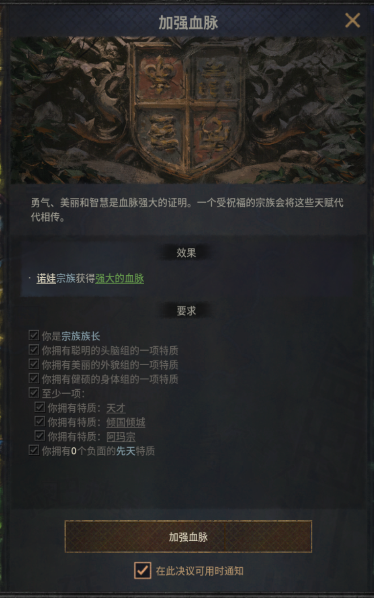
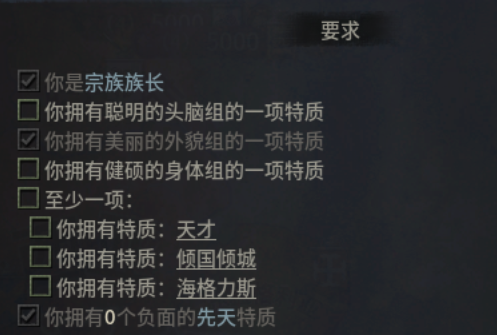
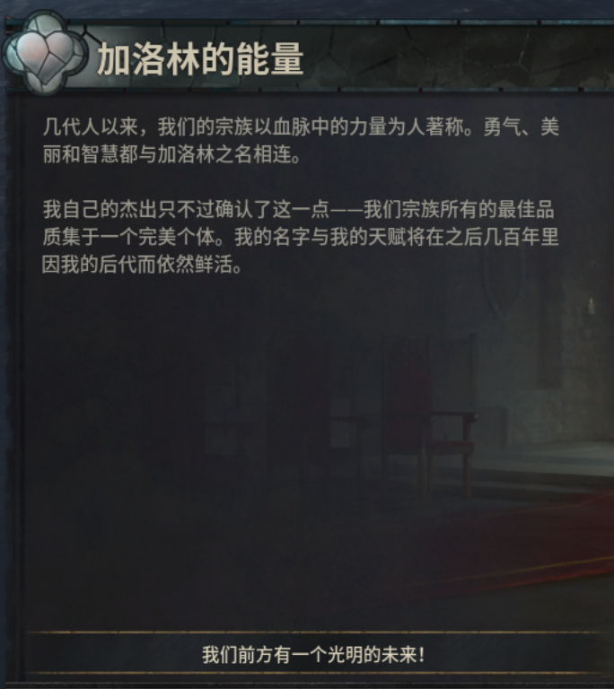
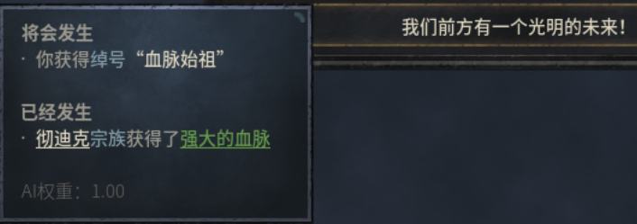

https://zhuanlan.zhihu.com/p/338294885?ivk_sa=1024320u

决议文件夹：`common\decisions`

https://ck3.parawikis.com/wiki/%E5%86%B3%E8%AE%AE%E6%A8%A1%E7%BB%84%E5%88%B6%E4%BD%9C

## 加强血脉

通过学习==加强血脉决议==来了解决议是怎么编写的。



```perl
strengthen_bloodline_decision = {
	picture = "gfx/interface/illustrations/decisions/decision_dynasty_house.dds"
	major = yes
	desc = strengthen_bloodline_decision_desc

	ai_check_interval = 120

	is_shown = {
		is_lowborn = no
		NOT = {
			dynasty = {
			 	has_dynasty_modifier = strong_blood
			}
		}
		OR = {
			has_trait = intellect_good
			has_trait = beauty_good
			has_trait = physique_good
			any_child = {
				dynasty = root.dynasty
				OR = {
					has_trait = intellect_good
					has_trait = beauty_good
					has_trait = physique_good
				}
			}
			AND = {
				exists = player_heir
				player_heir = {
					OR = {
						has_trait = intellect_good
						has_trait = beauty_good
						has_trait = physique_good
					}
				}
			}
		}
	}

	is_valid = {
		is_dynast = yes
		has_trait = intellect_good
		has_trait = beauty_good
		has_trait = physique_good
		OR = {
			has_trait = intellect_good_3
			has_trait = beauty_good_3
			has_trait = physique_good_3
		}
		num_of_bad_genetic_traits = 0
	}

	effect = {
		show_as_tooltip = {
			strengthen_bloodline_decision_effects = yes
		}

		trigger_event = major_decisions.0500

		every_player = {
			limit = {
				NOT = {
					this = root
				}
				dynasty = root.dynasty
			}
			send_interface_toast = {
				title = strengthen_bloodline_decision
				show_as_tooltip = {
					strengthen_bloodline_decision_effects = yes
				}
			}
		}
	}

	ai_potential = {
		always = yes
	}

	ai_will_do = {
		base = 100
	}
}
```

下面一条一条来看：

- `picture`：决议显示的图片
- `major`：是否是重要决议，重要的决议会放到上面。
- `desc`：决议的描述内容

满足`is_shown`内的所有条件时，这个决议才会出现在决议窗口里。

```perl
is_shown = {
    ...
}
```

满足`is_valid`内的所有条件时，这个决议才是可选的。



```perl
is_valid = {
    ...
}
```


点击决议后，页面顶部会弹出信息提示


```perl
		show_as_tooltip = {
			strengthen_bloodline_decision_effects = yes
		}
```

然后同时会触发一个事件



```perl
trigger_event = major_decisions.0500
```


ai相关的三个设定

- `ai_check_interval`：ai每120个月检查一次
- `ai_potential`：ai执行决议的意愿，这里表示AI总是愿意执行
- `ai_will_do`：ai执行决策的百分比几率。感觉是跟检查间隔呼应的。

```perl
ai_check_interval 120 
ai_potential = {
    always = yes
}

ai_will_do = {
    base = 100
}
```


实际的效果通过事件触发



`events/decisions_events/major_decisions_event.txt`

```perl
major_decisions.0500
```

```perl
#I have strengthened our bloodline
major_decisions.0500 = { #by Mathilda Bjarnehed
	type = character_event
	title = major_decisions.0500.t
	desc = major_decisions.0500.desc
	theme = physical_health
	left_portrait = {
		character = root
		animation = personality_bold
	}
	override_background = { event_background = throne_room }
	
	immediate = {
		play_music_cue = "mx_cue_positive_effect"
		strengthen_bloodline_decision_effects = yes
	}

	option = {
		name = major_decisions.0500.a

		give_nickname = nick_the_blood_motherfather
	}
}
```

值得注意的是这几个本地化变量

```perl
major_decisions.0500.t
major_decisions.0500.desc
major_decisions.0500.a
```

对应`localization\simp_chinese\event_localization\decisions\major_decisions_other_l_simp_chinese.yml`

```
 major_decisions.0500.t:0 "[ROOT.Char.GetDynasty.GetBaseNameNoTooltip]的能量"
 major_decisions.0500.desc:0 "几代人以来，我们的宗族以血脉中的力量为人著称。勇气、美丽和智慧都与[ROOT.Char.GetDynasty.GetBaseNameNoTooltip]之名相连。\n\n我自己的杰出只不过确认了这一点——我们宗族所有的最佳品质集于一个完美个体。我的名字与我的天赋将在之后几百年里因我的后代而依然鲜活。"
 major_decisions.0500.a:0 "我们前方有一个光明的未来！"
```


其中`strengthen_bloodline_decision_effects`

对应：`common\scripted_effects\00_major_decisions_scripted_effects_2.txt`

```perl
strengthen_bloodline_decision_effects = {
	dynasty = {
		add_dynasty_modifier = {
			modifier = strong_blood
		}
	}
}
```

最终的`modifier`在`common\modifiers\00_event_modifiers.txt`

```perl
strong_blood = {
	icon = health_positive
	health = 0.25
	positive_inactive_inheritance_chance = 0.4
	positive_random_genetic_chance = 4 # This will for instance cause a .2% chance to become 1%
}
```


