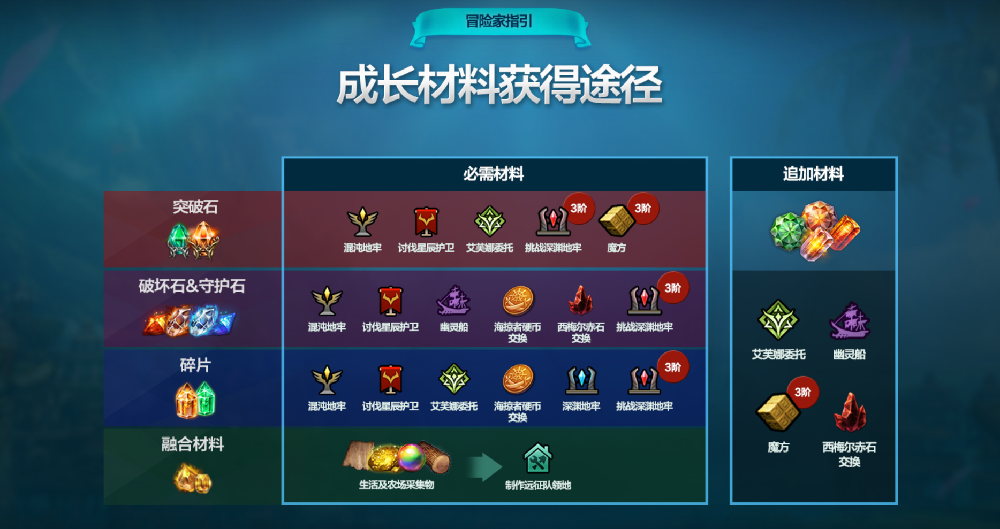
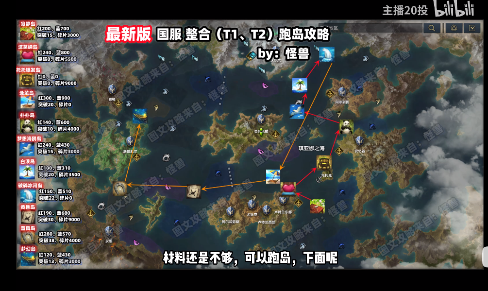
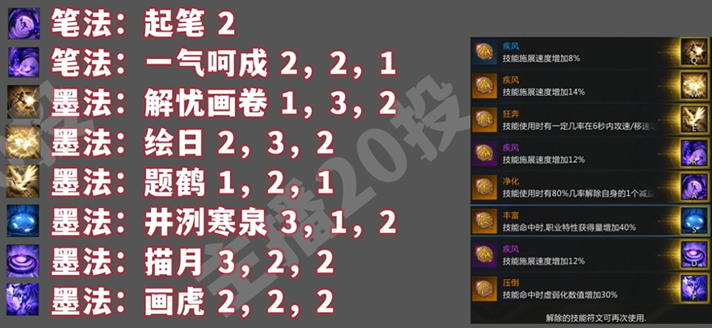
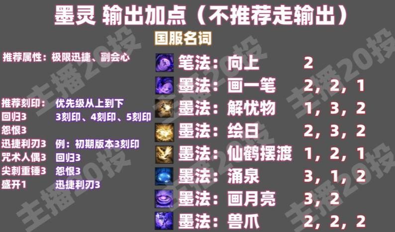
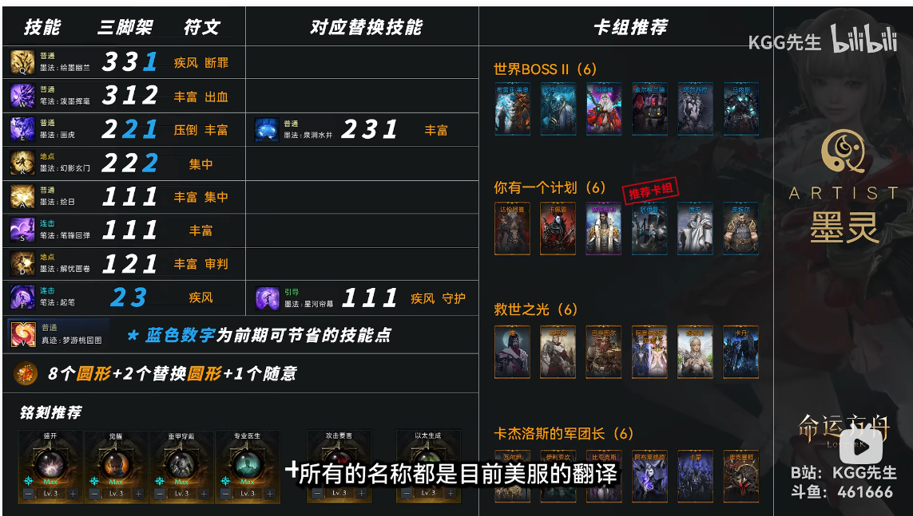
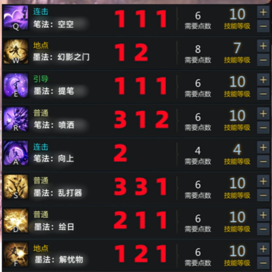

采蘑菇：https://www.caimogu.cc/
EMRPG：https://emrpg.com/
帕普尼卡：https://papunika.com/
LOAWA：https://loawa.com/

https://maxroll.gg/lost-ark/  抄技能搭配、查攻略

https://xzs.lost-ark.cn/zh/merchants 流浪商人

http://jsq.lost-ark.cn/ 能力石模拟点击，推荐点击

https://lostarkcodex.com/ 方舟数据库，英文

# 基础

## 快捷键

ctrl + 1 领地管理模式，可以研究

L  生活技能

alt + d 百科

alt + c 卡牌



## 机制详解

瘫痪，boss会在血量下方有个紫色的细血条。鼠标放到技能上，可以看到技能的瘫痪等级：下 ＜ 中 ＜ 中 ＜ 上 ＜ 最上。

- 技能没有写无力化的也会造成瘫痪伤害，但是效果小于瘫痪级别”下“
- 需要蓄力的技能要蓄满才能达到技能描述的瘫痪级别。
- 拥有多段伤害的技能要多段伤害全部命中才能达到技能描述的瘫痪级别。
- 可以用瘫痪手雷打出瘫痪效果

部位破坏：相当于boss身上的护甲buff，会提供非常高的伤害减免。在破坏这个护甲之前，你打的伤害会很低。鼠标放到技能上，可以看到技能的部位破坏等级，等级越高，越快破甲，类似于瘫痪。

- 假设怪物有30层部位护甲，你技能的破坏等级是4，就命中一次技能 -4层护甲，护甲掉完就失去减伤buff。

头部攻击：在怪物头前进行攻击，伤害增加20%，瘫痪增加10%

背部攻击：在怪物背后进行攻击，伤害增加5%，暴击率增加10%

侧击：技能没有写头部攻击或者背部攻击就是侧击。

疑惑：正面对决，头部攻击伤害增加25%。计算方式是 ：伤害 x (1 + 0.2 + 0.25) 还是：伤害 x 1.2 x 1.25

## 跑岛顺序

寂静岛 要打两个副本

熊猫岛 黄色任务找3个隐藏地点

梦想海鸥岛：需要睡歌岛 森林小舞曲

泳装岛：去阿尔泰因主城做立刻出发紫色人物

蓝风岛 需要用世外桃源岛得到的春之歌



获取海掠者硬币

[命运方舟国服 共鸣之歌+森林小舞曲 收集攻略 (bilibili.com)](https://www.bilibili.com/video/BV1Vc411A7nj/?spm_id_from=333.337.search-card.all.click&vd_source=749681a84bf35b829e9cf9decdaf2f2b)

金波岛，完成喂！醒醒任务

## 收集品

巨人之心

2.【好感度】特里希温 贝拉 需要魅力

3.【好感度】斯特恩 萨莎

9.【好感度】希普诺斯之眼 - 卡尔巴斯

14.【好感度】私人小岛 - 妮娜芙

boss 凝时之湖 塔尔希拉

15.【任务】智慧岛 - 第十五颗心

# 墨灵

## 输出

[【命运方舟】墨灵 3分钟学会 初期 加点 玩法(主播20投)](https://www.bilibili.com/video/BV1ka4y1F7u7)

### 饰品属性

推荐主迅速、副会心

### 推荐卡牌

光卡30 ＞ 光卡 18 ＞ 暴击卡

卡组推荐：未雨绸缪

### 推荐铭刻

铭刻1

```
归元3
怨恨3
巫毒娃娃3
突击队长3
锋利钝器3
盛开1
```

铭刻2

```
盛开3
觉醒3
身披重甲3

以下三选一
妙手回春3
攻击要害3
以太生成3
```

### 技能加点







## 辅助

### 饰品

项链：专长 + 迅捷

耳环1：迅捷

耳环2：迅捷

戒指1：迅捷

戒指2：迅捷

也开以专长、迅捷平分。

### 刻印

刻印推荐

盛开，觉醒，身披重甲，

举步生风、妙手回春，以太生成、压制

### 参考加点



https://www.bilibili.com/video/BV1ka4y1F7u7

如果打的副本不需要净化debuff，则可以将幻影之门替换为 涌泉。



# 大枪

https://www.bilibili.com/video/BV1QP41117A1/

导弹轰炸 2 1 2

炮塔召唤 1 撕裂

烈焰喷射器 3 1 2

高空轰炸 2 3 2 

重力爆炸 1 3 2

强化弹 1 2

前方炮击 2 1 1

# 数值分析

