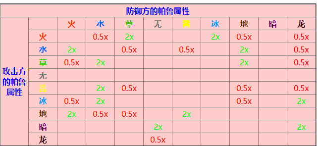

[幻兽帕鲁全配种工具 (caimogu.cc)](https://palworld.caimogu.cc/breed.html)

[帕鲁群岛 - 幻兽帕鲁互动地图 - 踩蘑菇社区 (caimogu.cc)](https://map.caimogu.cc/palworld/paru_islands.html)

打工人

播种:百合女王
采集:踏春兔
浇水:覆海龙→碧海龙，海誓龙，青雀
矿:焰煌，魔渊龙→阿奴比斯
搬运:白蓉雪怪→雷鸣鸟
生火:焰→腾炎龙
伐木:绿苔雪怪
发电:波鲁杰克斯→暴电熊
手工:阿努比斯→百合女王
冷却:唤冬兽→寒霜兽
药:夜幕蝙蝠→百合女王

腾炎龙 生火4
覆海龙 浇水4
百合女王 播种手工制药3 采集2
连理龙 播种3
波鲁杰克斯 发电4 搬运3 手工2
霹雳犬 发电2
阿努比斯 手工4 采矿3 搬运2
月镰魔 手工2
唤夜兽 采集4
铠格力斯 伐木3 搬运3 手工1 播种1
云海鹿/精灵龙/祇岳鹿/紫霞鹿 伐木2
魔渊龙 采矿4 手工1
焰煌 采矿4 生火3
碎岩龟 采矿3
黑月女王 制药手工3 采集2
夜幕蝙蝠 制药3
唤冬兽 冷却4
绿苔狨怪 搬运4 伐木3 手工2 播种1
白绒雪怪 搬运4 伐木3 手工2 冷却2
雷冥鸟 搬运3
美露帕/棉花糖/波霸牛/喵斯特 放牧1

图鉴补完：

姬小兔+火灵儿 23号

水灵儿+狱阎王 46号

[幻兽帕鲁全词条效果一览-幻兽帕鲁词条稀有度分享-游侠网 (ali213.net)](https://gl.ali213.net/html/2024-1/1303067.html)