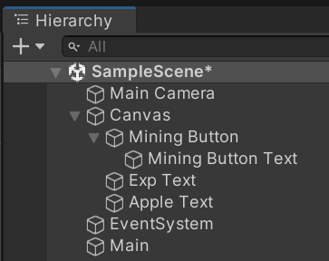
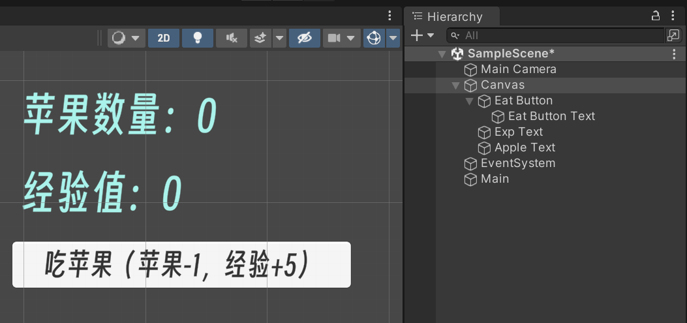

参考：

[LP编辑器-LP平台创作中心 (lpengine.cn)](http://console.lpengine.cn/)：这个编辑器是网页版的，因此我感觉需要一些前端的知识。

[十五分钟做一个文字放置游戏](https://zhuanlan.zhihu.com/p/100822441)

[（再进阶）十五分钟做一个文字放置游戏](https://zhuanlan.zhihu.com/p/103082959)


复刻上面的内容

- unity版本：2021.3.21

> ✨虽然是复刻但是会简化很多步骤描述，同时内容上也进行了一些优化（我自认为的）

### 创建物体

- 在Hierachy窗口创建一个 **Eat Button**，用于点击后吃苹果
  - Mining Button自带一个 Text，重命名为 **Eat Button Text**
- 创建一个 **Exp Text**，用于显示当前经验值
- 创建一个 **Apple Text**，用于显示当前苹果数量
- 创建一个 **Main** 空物体，用于挂载脚本

创建完毕后，Hierarchy界面应该是



### 编辑文本

接下来编辑各个文本的初始状态：

- Eat Button Text：**吃苹果（苹果-1，经验+5）**
- Exp Text：**经验值：0**
- Apple Text：**苹果数量：0**

格式调整随意，做好以后，大概长这样



### 编写脚本

脚本功能说明：

- 变量创建
  - expText 经验值的文本
  - appleText 苹果数量的文本
  - exp 当前经验值
  - appleNum 苹果数量
- addExp函数，实现点击按钮，增加经验的功能
- addApple函数，实现增加苹果数量的功能
- 在Start() 中，设置每秒执行一次 addApple函数
  - `InvokeRepeating`

创建`Assets/Scripts/Eat.cs`

```cs
using System.Collections;
using System.Collections.Generic;
using UnityEngine;
using TMPro;

public class Eat : MonoBehaviour
{
    public TextMeshProUGUI expText;
    public TextMeshProUGUI appleText;
    int exp;
    int appleNum;

    public void AddExp()
    {
        if (appleNum > 0)
        {
            appleNum -= 1;
            exp += 5;
            expText.text = "经验值: " + exp;
            appleText.text = "苹果数量: " + appleNum;
        }
        
    }

    void addApple()
    {
        appleNum += 1;
        appleText.text = "苹果数量: " + appleNum;

    }
    void Start()
    {
        // 每1秒执行一次 addApple方法
        InvokeRepeating("addApple", 0, 1f);
    }
}

```


### 挂载脚本

- 将`Eat.cs`脚本挂载在 Main物体上。
- 配置两个公开参数：`expText`，`appleText`'
- 给**Eat Button**的`OnClick()`事件绑定`addApple()`方法

