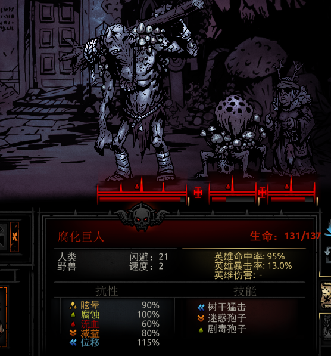

https://pc.52pk.com/miji/7446057.shtml

https://darkestdungeon.fandom.com/wiki/Darkest_Dungeon_Wiki

## 全奇物互动表

火把在大中小难度里分别只需要带 8 6 4根即可。

### 遗迹

遗迹多带圣水钥匙铲子

### 旷野

### 海湾

### 兽窟

### 全地域

## 地图攻略

### 海湾

巨钳粉碎者：高甲，低速

嵌断动脉在冠军难度会每回合掉8点血。

潮汐拍袭会击退英雄并造成眩晕

#### 海妖塞壬

## 荒野

剧毒孢子：4x5回合毒素

## 事件说明

http://www.zjkweiqi.cn/news/57728.html

### 地牢buff类

**陵墓的寂静**：“在山间村舍的人们确认了最近那令人欣喜的，在古老的遗迹周围的那股令人背脊发凉的氛围有所消减的信息。”

效果：下一个任务如果在遗迹则获得+33%的砺炼值和+15%的伤害

**灌木丛中的阳光**:“健康的植物已经开始点缀在树林周围——在这些植地之中的一件罕见事。”

效果：下一个任务如果在荒野则获得+33%的砺炼值和+15%的伤害

**隧道中的新鲜空气**：“西部居民为远古水道中传出作呕气味的消退而倍感轻松”

效果：下一个任务如果在兽窟则获得+33%的砺炼值和+15%的伤害

**风平浪静**：“迷信的船员们因今早那不可名状的异怖恶魔将不再骚扰他们货物的新闻感到欢心雀跃。”

效果：下一个任务如果在海湾则获得+33%的砺炼值和+15%的伤害

**援手**：“对这些经验丰富的幸存者来说，把尊严放在一边并非易事，但新兵们对这些帮助感激不尽。”

效果：移除下一个任务的等级限制

**英勇之魂**：“他们本就令人闻风丧胆——牙关作响，目光远大;而他们之间，也产生了坚不可催的友情纽带。”

效果：下一个任务美德几率增加15%

**丰收的作物**：“附近的农民早已联合了起来，提高警惕以保护我们小镇赖以生存的，健康的家畜与谷物。”

效果：下一个任务补给免费

**补给运达**：“在桥边与欣喜若狂的人群会合时，我们的管家把货运马车的安全到达归功于路上的浓雾和早一些的出发时间。”

效果:下一个任务补给价格减半

**黑暗正在涌起**：“沮丧与矛盾似乎飘泊在风中。许多冒险者承认自己心神不宁，甚至在这里，在我们相对安全的小镇。”

效果：下一个任务美德几率减少15%

**补给遗失**：“又一艘货船在沿海沉没，然而幸存下来的船员已被证实一直在令人难安地回避着关于这次航海噩梦的细节。”

效果：下一个任务补给数量减半

**光芒万丈**：光明似乎是为掩盖该地区的邪恶能量而凝聚，渗入最深暗之处为我们的战斗提供了显著的优势。

效果：本周在地牢里火把亮度黯淡的速度减慢

### 装备类

**失而复得**：“最终，在破旧的风筒以及弃置的武器架旁数个小时的敲打取得了成果!”

效果：免费升级武器(一个)

**出色的成品**：“他昼夜不停地工作了数日，被手中材料稀有卓越的品质所启迪，并决定以自己的精湛手艺把材料打造成能真正展现其价值的武器。”

效果：免费升级护甲(一件)

**苦劳者**：“一直以来，每年都定期有苦力不情愿地在我们的老路上奔波，但毕竟糟糕的经济状况已经将他们逼向绝望。"

效果：免费升级建筑(一次)

**城镇展会**：“城镇被友善与欢腾的精神所点缀着，但是这积极向上的态度可预料并不会持续太久。”

效果：所有压力释放活动和疗养院免费

**一缕阳光****：“舒爽的天气令人欢迎，尤其对于那些正在享受一段恢复心灵创伤时光的人。”

效果：提高压力释放活动的效果

**美好的一周**：“……在战役进行的同时，近来发生的事情令幸存着的士兵倍受鼓舞。据说他们的自信心达到了前所未有的高度。”

效果：所有空闲英雄+ 200%压力恢复

**狂欢节**：“酒馆将在庆祝期间开业，午夜而归的房客被要求至少离开的时候要保持衣冠齐整。”

效果：酒馆内所有活动免费

**酒桶已空**：“讽刺的是，那些声称忧心着与数量稀少的顾客也是那些整夜放荡不羁而把饮尽的人。”

效果：本周吧台无法使用，酒馆内的其他设施费用减半

**光天化日下的抢劫**：“赌博游戏被暂时叫停，但是由于我们小镇的通向外界的道路十分有限，治安官乐观地认为小偷会很快被抓捕归案。”

效果：本周赌场无法使用，酒馆内的其他设施费用减半

**洗濯日**：“床单与枕套在晾衣绳上显得白白净净，那些放纵的罪证就这样烟消云散，而玷污者们内心的愧疚就没有那么容易去除了。”

效果：本周大保健无法使用，酒馆内的其他设施费用减半

**诸圣日**：“教堂将在这个节日中盛装以待，并且将在接下来的一段时日里欢迎任何来访者。”

效果：教堂内所有设施免费

**喧闹的翻新**：“的确啊，对这个老教堂而言万事都不那么顺利;就连这个地方的泥土都排斥着它。修缮的工作将持续到这个星期结束。”

效果：本周回廊无法使用，教堂内的其他设施费用减半

**主教缺席**：“主教将自己反锁在酒窖里，显然在思考如何最好地帮助教众应对那些泛滥、有害的，感染着这些土地的惧怖之物。”

效果：本周耳堂无法使用，教堂内的其他设施费用减半

**清洗惩房**：“主教将不推荐使用情况如此的惩戒厅，除此之外他说他期望日常的宗教活动可以在短时间内恢复。”

效果：本周苦修厅无法使用，教堂内的其他设施费用减半

**医者大会**：“过来视察的代表团中都是研究肉体解剖和认知障碍的专家，也有一些法医从业者中的精英。”

效果：本周疗养院免费

**医疗技术突破**：“时间与金钱并没有白费，正如今天医护人员就宣称他们成功调配出了一种特效解毒剂。”

效果：本周病房免费

**游牧民新年**：“这些藏品令人印象颇深，并且那抬眼即见的折扣使得它们更加引人注目了。”

效果：游牧民货车里的饰品-50%(绿字)

**匪徒入侵!**：“准备战斗!一伙带着爆炸般的狂暴和弑杀意图的土匪来到了我们的小镇!”

效果：触发剧情任务“门前恶狼”

**夜幕下的窃贼**：然而，最终，这个该死的东西逃脱了;小镇的金库因为也因这不速之客而捉襟见肘。

效果：触发剧情任务，尖叫魔偷走了你的8件饰品，打败尖叫魔并夺回饰品

**尖叫魔的财宝**：藏在腐烂羽翼中的东西价值惊人，围观者都琢磨着是否要去它的栖息地冒一冒险……

效果：打败尖叫魔，夺回你在地牢丢失的若干饰品(8个?)

**悲惨的黑暗**：“……正如一个人所说，‘这些黑影总让人感觉不对——就像它们会自己扭曲着移动一样’。居民们被要求躲在家里直到破晓。”

效果：所有缓解压力活动均效果不佳

**从冥界而来**:“出于可恶的诅咒或者恶意的奇迹，看起来在这个该死的地方，即使死亡也能被扭转。这些战士中只有一个能复活……”

效果：从墓地中随机选则三位英雄，你可以选一位进行复活。复活后的英雄保持其决心等级，但他的技能，武器与护甲将回到一级

### 招募类

**荒漠焚风**：如沙尘暴般的流言蜚语与半真半假的传说围绕着这名来客。

效果：本周可以招募一个破盾者，以后驿站也会随机刷出破盾者

**蝰蛇之吻**：优雅却致命，这些踏着舞步的杀手在我们的军队中颇受欢迎。

效果：本周可以额外招募两个破盾者

**血之鞭挞**：有些人认为只有无尽的鲜血和痛苦才能净化这片土地上的病态。他们的其中之一将在此尽力。

效果：本周额外招募一名苦修(狂喜)

**血之朝圣**：在这极端绝望的境况下，一些于教会最为狂热的拥护者们为了寻求光荣的牺牲而走进了小镇。我们希望他们能尽早如愿。

效果：本周可以额外招募两个苦修

**古董街展**：“……近日被发现的宝藏令本地的寻宝狂热者激动不已，并且使得附近地区的专家亲躬而来。

效果：可以多招募两个古董商

**麻风移民队**：“我们无法帮助且只能默默尊敬这些不幸的人——他们优雅而谦卑地承受着如此的重担，就连健全者都为之唏嘘不已。”

效果：本周可以多招募两个麻风剑圣

**野蛮狂欢**：“渴求肉欲而又粗俗可鄙，一些游牧的武士游荡进我们的小镇来追求所谓的光荣战死。我们也只能祝福一切能够尽快地如其所愿。

效果：本周可以多招募两个野蛮战士

**宿命议会**：“每当这样以充满了诡异的发声与令人不安的吟唱为特色的怪事发生，我们总会自大地以为这些仪式本身并不存在真正的威胁。”

效果：本周可以额外招募两个神秘学者

**神圣召集**：“圣玛莎的修女们将以一首名为‘吾即是火焰’的圣歌引领开展布道。在这之后她们将在下厅接受忏悔者。”

效果：本周可以额外招募两个修女

**远征的召唤**：“……不可预料的是，只有两个到了。教堂诚挚的呼吁被回应了，尽在那讽刺般的冷漠中。”

效果：本周可以额外招募两个十字军 

**财富的谣言**:“冷静而缄默，这些人都是专家。驱使他们的并非血腥的气味，而是金币的光芒。”

效果：效果：本周可以多招募两个赏金猎人

**一轮圆月**：“……就是在这月圆之际，许多居民报告说听到了让人极度紧张的尖叫和咆哮。”

效果：在城镇空闲的咒缚者提升一点决心等级

**瘟疫!**：“疾病疫情的阴影笼罩了我们的小镇，并且随之而来的还有——恐慌。”

效果：在城镇空闲的瘟疫医生提升一点决心等级

**劫富济贫**：“最令人吃惊的，是在这个谜一样的现场中缺失了很多证据。无论如何，这个箱子就这么打开了，它的内容物如阴谋般消失不见。”

效果：在城镇空闲的盗墓提升一点决心等级

**背叛者在我们之中**：“对我们集体安全的威胁从来都不在少数，而这星期我们当地的治安机构加入了一位受欢迎的有争议人物……”

效果：在城镇空闲的训犬师提升一点决心等级

**闲暇的街演**：“这音乐本身是如此的老旧，但是，却奇怪般的无法取代。是这乐器本身古怪的音调，还是奏者指间那非人的特质?”

效果：在城镇空闲的小丑提升一点决心等级

**箭术锦标赛**：“双眼最敏锐和出手最稳定的人会赢得本周的锦标赛。胜者将获得令人梦寐以求的管家奖杯。”

效果：在城镇空闲的弩手和火枪手提升一点决心等级(箭术锦标赛还能用枪?)

**藏匿**:“在随后的斗殴中，有两个人逃离了现场并且都是法外之徒。他们手持武器，非常危险，而内心是如此的绝望。”

效果：在城镇空闲的强盗提升一点决心等级

**军事训练**：“这名经验丰富的军士会在下周的每个晚上在公会大堂讲解他的训练方法。所有想了解自保技能的人都被鼓励来参加。”

效果：在城镇空闲的老兵提升一点决心等级

## 怪癖

https://tieba.baidu.com/p/5945053765?red_tag=1756827271

