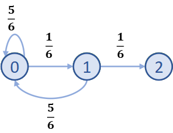
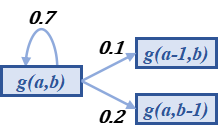

## 求平均暴击率

基础暴击率为5%，如果当前攻击未命中，则下一次暴击率增加10%，问：平均暴击率为多少。

~~如果赋予了基础概率值，实际上和之前差不大多~~

(以下待施工)
$$
P(N) = a + C(N-1)
$$

a为基础暴击率

C为暴击增量

N为攻击次数

攻击次数为1的时候只有基础暴击率

| N    | 第N次暴击的几率 | 之前没暴击的几率              | 第N次攻击才暴击的概率                   |
| ---- | --------------- | ----------------------------- | --------------------------------------- |
| 1    | $a$             | 1                             | $a$                                     |
| 2    | $a+C$           | $(1-a)$                       | $(a+C)(1-a)$                            |
| 3    | $a+2C$          | $(1-a)(1-a-C)$                | $(a+2C)(1-a)(1-a-C)$                    |
| n    | $a+(n-1)C$      | $\prod_{i=2}^{n}[1-a-(i-2)C]$ | $[a+(i-1)C]\prod_{i=2}^{n}[1-a-(i-2)C]$ |
| x    |                 |                               |                                         |

### 程序模拟

```python
import random
# a base_critical_probablily
# c probability_increment
def count_critical_hit(a=0.05, c=0.1):
    critical = False  # 是否暴击
    count = 0
    while not critical:
        count += 1
        if random.random() < a:
            critical = True
        else:
            a += c
    return count

def repeat_experiment(n):
    count = 0
    for i in range(n):
        count += count_critical_hit()
    return count / n

ans = repeat_experiment(1000000)
print("平均需要%.5f次攻击暴击一次" % ans)
```

```
平均需要4.11890次攻击暴击一次
```

### 理论求解（old）


对于这题，也就是$a=0.05$，$C=0.1$，求平均暴击率

```python
a = 0.05  # 基础暴击率
c = 0.1  # 暴击率增量
pn = a  # 当前暴击率
n = 1  # 第n次攻击
ans = 0
while pn < 1:
    tmp = n * (a + (n-1)*c)
    i = 2
    while i <= n:
        tmp *= (1 - a - (i - 2) * c)
        i += 1
    ans += tmp
    n += 1
    pn += c
print("平均需要%.5f次攻击暴击一次，暴击率为%.4f%%" % (ans, 1 / ans * 100))
```

```
平均需要4.11399次攻击暴击一次，暴击率为24.3073%
```


### 理论求解（new）

也用状态转换的思想，终点是暴击，一共有个状态。分别为

第一次攻击，第二次攻击，...，第十次攻击。（第十次攻击必暴击，因为此时概率累加到105%了）


e(x) 表示第x次开始攻击，直到暴击所需要的攻击次数的期望

走偏了，但是

```python
# a 基础暴击率
# c 暴击率增量
def critical_probablity(num_attack, a=0.05, c=0.1):
    return min(1, a + (num_attack - 1) * c)

def e(x):
    p = critical_probablity(x)  # 本次暴击概率
    if p >= 1:
        return 1
    else:
        # return p + (1 - p) * (e(x+1) + 1)
        return 1 + (1 - p) * e(x+1)
ans = e(1)
print("平均需要%.5f次攻击暴击一次，暴击率为%.4f%%" % (ans, 1 / ans * 100))
```

```
平均需要4.11469次攻击暴击一次，暴击率为24.3032%
```

然后到这里我发现之前的求解方式有疏漏，实际上是不对的

求离散随机变量的期望得把所有分布都考虑进来，但实际上忽略了最后一次攻击的情况。


改版

```python
def main():
    a = 0.05  # 基础暴击率
    c = 0.1  # 暴击率增量
    # 获取所有随机变量可能的取值
    distributions = get_distributions(a, c)
    # 计算所有随机变量取值的概率
    probabilities = [compute_probability(x) for x in distributions]
    
    # 返回期望
    return compute_expectation(distributions, probabilities)


# 根据随机变量分布和其概率计算期望
def compute_expectation(distributions, probabilities):
    ans = 0
    for x, p in zip(distributions, probabilities):
        ans += x * p
    return ans

# 生产随机变量分布
def get_distributions(a=0.05, c=0.1):
    distributions = [1]
    while a < 1:
        distributions.append(distributions[-1] + 1)
        a += 0.1
    return distributions

# 根据随机变量的取值计算概率
def compute_probability(x, a=0.05, c=0.1):
    # 当前暴击概率
    current_critical_probability = min(1, a + (x - 1) * c)
    
    # 之前都没暴击的概率
    never_critical_probability = 1
    for n in range(x - 1):
        never_critical_probability *= (1 - a - n * c)
    return current_critical_probability * never_critical_probability

ans = main()
print("平均需要%.5f次攻击暴击一次，暴击率为%.4f%%" % (ans, 1 / ans * 100))
```

```
平均需要4.11469次攻击暴击一次，暴击率为24.3032%
```

> 可以看出，用马尔科夫链的方式求解，代码更简洁
>
> 而且用取值*概率求期望的方式无法求解随机变量取值范围无限的情况


## 求连续n个元素需要的平均次数

有4种不同的元素，水火风电。每次获取一个元素的概率是一样的（均为25%），问平均要多少次才能集齐4种元素。


分析：

| 已获不同元素的个数 | 获得不同元素的概率 | 平均要几次才能获得不同元素 |
| ------------------ | ------------------ | -------------------------- |
| 0                  | 100%               | 1                          |
| 1                  | 75%                | 1 / 0.75 = 1.333           |
| 2                  | 50%                | 1 / 0.5 = 2                |
| 3                  | 25%                | 1 / 0.25 = 4               |

答：

平均需要1 + 1.333 + 2 + 4 = 8.333次才能集齐4种元素

例题3：有4种不同的元素，水火风电。每次获取一个元素的概率是一样的（均为25%），问平均需要多少次才能连续收集两个火元素。

分析：

分析有几种状态：

- 状态1：往前1次不是火元素
- 状态2：往前1次是火元素，往前2次不是火元素
- 状态3：往前1次是火元素，往前2次也是火元素（结束态）

状态转换的情况：

- 状态1 → 状态2：有1/4的概率收集到火元素
- 状态1 → 状态1：有3/4的概率收集到非火元素
- 状态2 → 状态3：有1/4的概率收集到火元素
- 状态2 → 状态1：有3/4的概率收集到非火元素

如果从状态1转到了状态1，那仍需要n次才能出现两个火元素。总次数就变成了n+1，这种情况的概率是3/4 * (n+1)

如果从状态1转到了状态2，又从状态2转到了状态1。总次数变成了n+2，这种情况的概率是1/4 * 3/4 * (n+2)

如果从状态1转到状态2，又从状态2转到了状态3，这种情况的概率为：1/4 * 1/4

解这个方程：3/4 * (n+1) + 1/4 * 3/4 * (n+2) + 1/4 * 1/4 = n

可以得n = 19

## 题4 数学期望

某城市有10万个家庭，没有孩子的家庭有1000个，有一个孩子的家庭有9万个，有两个孩子的家庭有6000个，有3个孩子的家庭有3000个。求平均每个家庭有多少个孩子。

则此城市中任一个家庭中孩子的数目是一个随机变量，记为X。它可取值0，1，2，3。

## 连续掷骰子掷出两个6




设需要从0 到 2 需要k次


$$
\begin{aligned}
k &= \frac{1}{6} \cdot \frac{1}{6} \cdot 2 + 
\frac{5}{6}(k + 1) + 
\frac{1}{6} \cdot \frac{5}{6}(k + 2) \\

36k &= 2 + 30k + 30 + 5k + 10 \\
k &= 42

\end{aligned}
$$


## 英雄升级问题

https://www.bilibili.com/video/BV17K411n7Sj

假如耗费一颗宝石可以升一级

0到1级概率：100%

1到2级概率：1/3升级1/3等级不变 1/3降级

2到3级概率：4/9降级 4/9等级不变 1/9升级

> 1级到2级平均需要多少次？
>
> 如何理解 1/3 * 1。
>
> 如何理解(1/3)(k+1)， 1/3 * (1 + E(2))，

0-1级：1

1-2级：k = (1/3)(k+2) + (1/3)(k+1) + (1/3)

```
3k = k+2 + k + 1 + 1
k = 4
```

2-3级：

```
k = (4/9)(k+5) + (4/9)(k+1) + (1/9)
9k = 4k + 20 + 4k + 4 + 1
k = 25
```


## 抽卡问题

抽卡时，每次抽取概率为：N：45%，R：50%，SR：5%。若连续29次抽取没抽出SR则下次抽取必出SR。问：平均每多少次抽取出一个SR？（若不方便给出准确答案给出计算思路亦可）（13分钟）

https://www.zhihu.com/question/382551711

这题跟马尔科夫链那题比较像


绿色圆圈表示抽到了卡的状态，蓝色圆圈的数字表示是**第几次抽卡**，总共最多会进行30次抽卡，必能抽到卡

设抽到卡的概率为p，则抽不到卡的概率为1-p，计算如下

```
p*1 + p*(1-p)*2 + p*(1-p)^2*3 + ... + + p*(1-p)^28*29  + (1-p)^29 * 30
```

程序代码如下：

```python
p = 0.05  # 抽中的概率 5%
limit = 30  # 多少抽保底
ans = 0
for i in range(1, limit, 1):
    ans += p * (1 - p) ** (i-1) * i
ans += (1 - p) ** (limit-1) * limit
print(f"平均需要 {ans:.4f} 次出SSR, 概率 {1 / ans * 100:.4f} %")
```

```
平均需要 15.7072 次出SSR, 概率 6.3665 %
```

过了许久不理解这个解法了。。。

`p*(1-p)^2*3`的含义是啥。。

大概能猜到，`p*(1-p)^2`表示第3抽抽到SSR的概率，也就是`E(3) = p * (1-p) ^ 2`


那么`p(x)`表示第X抽抽到SSR的概率，`xp(x)`表示什么？

后来搜索研究了一下，这其实就是离散随机变量的求解方法

如果X是离散型随机变量，它的全部可能取值是a1,a2,…，an,…,取这些值的相应概率是p1,p2…,pn,…,则其数学期望`E(X)=(a1)*(p1)+(a2)*(p2)+…+(an)*(pn)+…`；

> 如果要深究的话，就可以尝试理解为什么每一项是这样的。
>
> 取值是a4的概率是p4，a4 * p4的含义是啥。
>
> 把概率理解为权重，期望理解为随机变量的均值。
>
> 联系上面的例子
>
> X表示第X次抽到SR。
>
> E(X)就表示平均要花E(X)次抽到SR
>
> 然后每个次数抽到SR都有一个概率权重，加权求和就得到了平均次数。


模拟抽卡代码

```python
import random 
p = 0.05  # 抽到SSR的概率
max_count = 30
num_experiments = 1e7  # 1000万次实验

count = 0  # 连续几次没抽中
total = 0  # 总共抽中了几次SSR

for i in range(num_experiments):
    if random.random() <= p or count >= max_count - 1:
        total += 1
        count = 0
    else:
        count += 1
print("抽到SSR的概率为: %s" % (total/num_experiments))
print("平均需要 %.4f 次出SSR" % (1 / (total/num_experiments)))
```

```
抽到SSR的概率为: 0.0636677
平均需要 15.7066 次出SSR
```

### 马尔科夫链计算

后续补充的计算方案

设E(x)表示状态x转换到状态抽到卡（绿色）的期望次数。

再翻译一下：E(1) 就表示，从第一次抽卡开始，抽到SSR的期望次数

0.05 + 0.95 * (e(2) + 1) = 0.05 + 0.95E2 + 0.95 = 1 + 0.95E2


```python
def e(n):
    if n == 30:
        return 1
    else:
        return 0.05 + 0.95 * (e(n+1) + 1)
    # return 1 + 0.95 * e(n + 1)
print("平均需要 %.4f 次出SSR" % e(1))
```

```
平均需要 15.7072 次出SSR
```


## 扭蛋问题

扭蛋机里有4个不同的蛋，每次出货的概率相同，求抽到4个不同的蛋所需要的期望扭蛋次数

### 程序模拟

```python
import random
eggs = range(4) # 4个不同的蛋

# 一次实验，获得4个不同蛋所需要的扭蛋次数
def count_get_all_eggs(eggs):
    count = 0
    my_eggs = set()
    while len(my_eggs) < len(eggs):
        my_eggs.add(random.choice(eggs))
        count += 1
    return count

def repeat_experiment(n, eggs):
    avg_count = 0
    for i in range(n):
        avg_count += count_get_all_eggs(eggs)
    return avg_count / n

avg_count = repeat_experiment(10000, eggs)
print('平均 %.4f 次抽齐所有扭蛋' % avg_count)
```

```
平均 8.3555 次抽齐所有扭蛋
```

### 理论推导

扭蛋机里有4个不同的蛋，每次出货的概率相同，求抽到4个不同的蛋所需要的期望扭蛋次数

已有的不同的蛋的状态一共有5种，什么也没有，到有4颗不同的蛋。 


现在要求的是从状态0到状态4所需要的扭蛋次数，每转移一次状态会消耗一个扭蛋次数。比如说状态1可能往状态2或者状态1转换，转换后消耗一次扭蛋次数。

设G(k)表示抽到 k 个不同的蛋所需要的期望次数，E(k)表示从抽到k-1个不同的蛋到抽到 k 个不同的蛋所需要的期望次数（k >= 1）。

则
$$
G(k)=E(k) + E(k-1) + ... + E(1)
$$
显然，G(1) = E(1) = 1。表示抽到1个不同的蛋所需要的次数

抽到2个不同的蛋所需要的次数=G(2) = E(2) + E(1)

那么问题就转化为了：已经有1个蛋的情况下，抽到一个新蛋所需要的期望次数。

其实计算方式就很简单了：抽到一个新蛋的概率是(3/4)=0.75

期望抽取次数 = 1 / 0.75 ≈ 1.33次

E(2) = 4 / 3 ≈ 1.33

E(3) = 4 / 2 ≈ 2

E(4) = 4 / 1 ≈ 4

G(4) = E(1) + E(2) + E(3) + E(4) = 1 + 1.33 + 2 +4 = 8.33 次

拓展：一共有K个不同的蛋，抽到这K个不同的蛋所需的期望次数？
$$
G(K) = \sum_{i=1}^{K}\frac{K}{i}
$$

###  代码实现

```python
def g(k):
    ans = 0
    for i in range(k):
        ans += k / (i+1)
    return ans
print(g(4))  # 8.33
print(g(100))  # 518.73
```

## 全图鉴问题

英雄稀有度分为：R、SR、SSR三类。

其中抽到R的概率为 70%，SR的概率为28%，SSR的概率为2%

R级英雄共30名，SR英雄共20名，SSR英雄共10名。

问：

（1）抽到所有不同的SSR英雄需要花费的期望次数？

（2）假设每一抽都会送一张SSR英雄兑换券，满300张兑换券可以兑换任意一个英雄。问此时抽到所有不同的SSR英雄需要花费的期望次数。

（3）抽到所有英雄所需要花费的期望次数？

### 问题1

> 抽到所有不同的SSR英雄需要花费的期望次数？

问题1其实就是上面扭蛋问题的变种。

E(1) 表示抽到1名SSR英雄的所需的期望次数

E(1) = 1 / 0.02 = 50次

E(2) 表示抽到2名不同的SSR英雄的所需的期望次数 

抽到SSR的条件下，抽到2名不同的SSR英雄所需的期望次数=10/9≈1.11

E(2) = 1.11 / 0.02 = 55.5次。
$$
G(K) = (\sum_{i=1}^{K}\frac{K}{i})/p
$$
 p表示抽到某类卡的概率

代码实现

```python
def g(k):
    ans = 0
    for i in range(k):
        ans += k / (i+1)
    return ans

# 从n-1个不同 到 n个不同所需要的期望次数
def e(k, n):
    return k / (k - n + 1)
print(g(10) / 0.02)  # 1464次
```

程序模拟

```python
import random
# 1次抽卡
def one_call():
    r = random.random()
    if r <= 0.7:
        rare_level = 0
        hero_id = random.randint(0, 29)
    elif r <= 0.98:
        rare_level = 1
        hero_id = random.randint(0, 19)
    else:
        rare_level = 2
        hero_id = random.randint(0, 9)
    return rare_level, hero_id

# 实验
def experiment(d=10):
    diff_heros = set()
    count = 0
    while len(diff_heros) != d:
        rare_level, hero_id = one_call()
        if rare_level == 2:
            diff_heros.add((rare_level, hero_id))
        count += 1
    return count

# 重复实验取平均
def repeat(n):
    total = 0
    for i in range(n):
        total += experiment()
    return total / n
repeat(1000)
```

### 问题2

> 假设每一抽都会送一张SSR英雄兑换券，满300张兑换券可以兑换任意一个英雄。问此时抽到所有不同的SSR英雄需要花费的期望次数。


毫无疑问，问题2加大了分析难度。感觉可以通过阶梯来运算，严格的数值运算暂时还没想到方案。

例如：经过计算，G(6) = 735次，可以兑换2次，相当于抽到了8个不同的英雄

G(7) = 907.5次，可以兑换3个英雄，相当于抽到了10个不同的英雄。

实际上这个只是粗略的估计，肯定不算很准确。

需要注意的是，抽卡策略会影响次数。

比如：每到300抽就兑换一个英雄，这样会增加总抽卡次数。因为后面抽到不同英雄的难度就变大了。

而抽到7个不同英雄以后，再兑换3个SSR，则这样可以减少总抽卡次数。

因此最佳策略为：一直攒兑换券，一直到兑换券能兑换所有不同的英雄以后，再一起统一兑换。

程序模拟

```python
import random
# 1次抽卡
def one_call():
    r = random.random()
    if r <= 0.7:
        rare_level = 0
        hero_id = random.randint(0, 29)
    elif r <= 0.98:
        rare_level = 1
        hero_id = random.randint(0, 19)
    else:
        rare_level = 2
        hero_id = random.randint(0, 9)
    return rare_level, hero_id

# 实验
def experiment(d=10):
    diff_heros = set()
    count = 0
    while len(diff_heros) != d:
        rare_level, hero_id = one_call()
        if rare_level == 2:
            diff_heros.add((rare_level, hero_id))
        count += 1
        # 满300则上限-1
        if count % 300 == 0:
            d -= 1
    return count

# 重复实验取平均
def repeat(n):
    total = 0
    for i in range(n):
        total += experiment()
    return total / n
repeat(1000)
```

最终计算的实验结果为713.34次左右。

## 爬塔问题

鸣谢：any大神，提供有趣的题目

鸣谢：[ylx](https://github.com/ylxdzsw)，提供完整的解题思路

鸣谢：群友，提供666

每层塔会随机出现40种敌人，每次都完全随机的情况下，到第100层时把所有不同的敌人都遇到一次的概率是多少？

答：


`f(a, b, c)`表示从c个球里抽到b种颜色的概率，一共有a种颜色

```
f(a,b,c)=(b/a)*f(a,b-1,c-1)+(1-(b/a))*f(a,b,c-1)
```


```python
cache = {}
def f(total_colors, rest_colors, rest_balls):
    if (rest_colors, rest_balls) in cache:
        return cache[(rest_colors, rest_balls)]
    if rest_colors == 0:
        return 1
    if rest_balls == 0:
        return 0
    result = (rest_colors / total_colors) * f(total_colors, rest_colors - 1, rest_balls - 1) + (1 - (rest_colors / total_colors)) * f(total_colors, rest_colors, rest_balls - 1)
    cache[(rest_colors, rest_balls)] = result
    return result
```


方法2

```python
import math
cache = dict()

def f(n, num):
    ans = n ** num
    if (n, num) in cache:
        return cache[(n, num)]
    if n == 1:
        return ans
    for i in range(1, n):
        ans -= math.comb(n, i) * f(n-i, num)
    cache[(n, num)] = ans
    return ans

# d个不同的元素全排列，排num次，出现n个不同元素的次数
def g(n, d, num):
    ans = 0
    if n == 1:
        return d
    
    return math.comb(d, n) * f(n, num)
```

## 词条洗练模型

一个装备有4个词条，每个词条分为5档等级，1档最差，5档最好。

词条分为锁定/未锁定状态

每次洗练会刷新所有未锁定的词条。

现在你在洗练你的装备，只有当某个词条为最高档5档时才锁定该词条。

初始状态下装备的所有词条均为最低的1档。

问：将该装备洗练至顶配装备所需消耗的期望洗练次数。


```python
# 剩1个，期望5次
seen = {1: 5, 0: 0}

def g(k, p=0.2):
    if k in seen:
        return seen[k]
    
    up = (1 - p) ** k
    down = 1 - (1 - p) ** k
    for i in range(1, k+1):
        r = math.comb(k, i) * p ** i * (1 - p) ** (k-i) * (g(k-i) + 1)
        print(r)
        up += r
    ans = up / down
    seen[k] = ans
    return ans
```

思路：逆推

状态流程图为

```
4 -> 3 -> 2 -> 1 -> 0
```

数字表示还剩多少个未锁定的词条。

显然，只剩1个未锁定的词条时，所需期望次数为5次。（5档最好，意味着有20%的概率抽到顶级词条）

设$E_k$表示，抽取$k$个最佳词条时所需的期望次数，则$E_1=5$

然后计算剩2个词条时的期望次数$E_2$，这时概率分支分成3支

- 抽到2个最好词条，概率为$p_2$
- 抽到1个最好词条，概率为$p_1$
- 抽到0个最好词条，概率为$p_0$

则可以列公式
$$
\begin{aligned}
E_2 &= p_2 + p_1\cdot(E_1 + 1) + p_0\cdot(E_2 + 1) \\
E_2(1-p_0) &= p_2 + p_1\cdot(E_1+1)+p_0 \\
E_2 &= \frac{p_2 + p_1\cdot(E_1+1)+p_0}{1-p_0}
\end{aligned}
$$
什么原理

期望等于所有可能的概率乘次数。比如你有20%的概率获得100万，80%的概率获得10万。

期望获得的钱就是 0.2 * 100 + 0.8 * 10 = 28万。

## 装备掉落问题

已知击杀某怪物有10%概率掉落A，20%概率掉落B，怪物至多掉落1个材料（有可能为空），打造一件装备需要a个材料A和b个材料B。请问打造一件装备需要击杀怪物的次数期望？

https://www.zhihu.com/question/447332111

设$g(a, b)$为还需要a个材料A和b个材料B时，需要击杀怪物次数的的期望。

显然 
$$
g(0, 0) = 0 \\
g(a, 0) = 10a \\
g(0, b) = 5b
$$
现在的目标是求$g(a, b)$的递推公式。

状态$g(a, b)$有三种状态转移方式：

- $g(a, b) \xrightarrow{0.7} g(a, b)$：表示没有掉落装备
- $g(a, b) \xrightarrow{0.1} g(a-1, b)$：掉落了装备A
- $g(a, b) \xrightarrow{0.2} g(a, b-1)$：掉落了装备B

如下图



> 其实上面这个状态转移图隐藏了很多细节，最终目标是从状态g(a,b)转移到状态g(0,0)

则有：
$$
\begin{aligned}
g(a,b)&=0.1\cdot(g(a-1,b) + 1)+0.2\cdot(g(a, b-1)+1)+0.7\cdot(g(a,b)+1) \\
0.3g(a,b)&=0.1g(a-1,b)+0.2g(a, b-1) + 1 \\
g(a,b)&=\frac{1}{3}g(a-1,b)+\frac{2}{3}g(a,b-1)+\frac{10}{3}
\end{aligned}
$$

## 小球跳跃问题

有4个编号分别为1234的格子横向排列，开始时小球在，每次向相邻的随机一个格子等概率移动。

Q1：求n次移动后球在每个格子上的概率。

Q2：求从1号


## 状态转移矩阵

https://blog.csdn.net/jiayoudangdang/article/details/81838326
