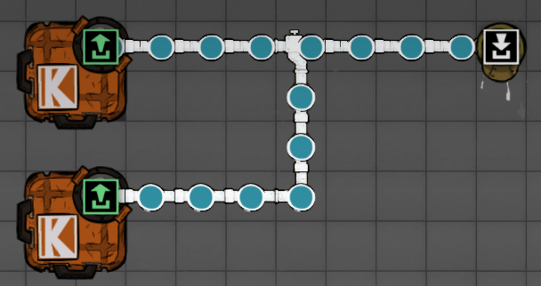
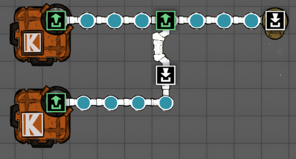
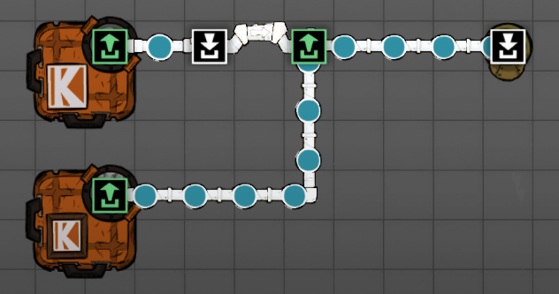
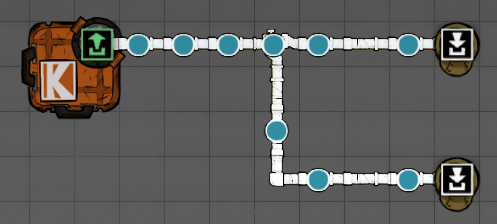
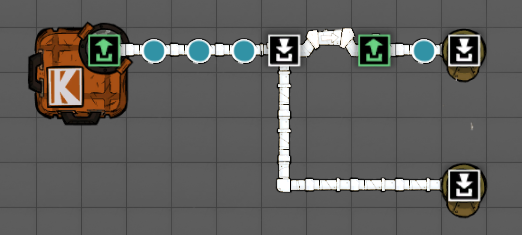
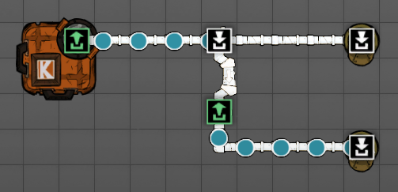

笔记

### 人物选择阶段

推荐的绿色特质：早起鸟，夜猫子，快速学习者

不推荐的绿色特质：装饰达人、美食家

不推荐的红色特质：鼾声如雷、大口呼吸者、面条臂、缓慢学习者、生物危害、无底洞之胃、过敏症、运动贫血症、胃肠胀气。

不要选的压力反应：狂吃

可以在人物名字上方选择你想要的特质

一般需要：科学家（研究至少+3）、工人（挖掘至少+3）、最后一个推荐农民或者研究者

### 开局阶段

进去以后先挖资源，快捷键G是挖掘，需要找铜矿造制氧机。

### 模组推荐

DEBUG模式开启

在有新游戏、加载游戏的界面，直接敲：kleiplay

## 管道攻略

基础知识：绿色是上游，从绿流向白

### 管道输入

输入后接桥（优先级排后面的管道，接管桥）

均分输入

优先上方输入

优先下方输入

### 管道输出

输出先接桥（想优先输入哪个管道，就接管桥）

均分输出

优先上方输出

优先下方输出

