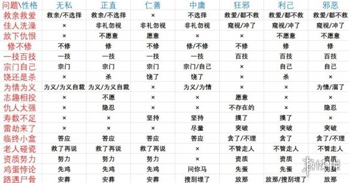
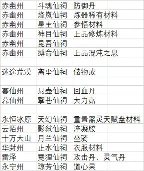

195.172 彩蛋 送橙色攻击心法

69, 95彩蛋 送坐骑


注意境界提升以后就不能通过低境界的道具回复心情了




给大能送礼物：寻灵符、避妖符、等等


仙祠




换宗门之前，最好多刷点贡献再过去

全功法词条

https://www.gamersky.com/handbook/202103/1367531.shtml


也可以在配置表找

`.\steamapps\common\鬼谷八荒\Mod\modFQA\配置修改教程\配置（只读）.xlsx`


功法词条探索

LocalText.json

```json
  {
    "id": "19523",
    "key": "s_8100122_xqzz",
    "ch": "每有&8100122_xqzz&点功法资质可使攻击提升&8100122_tsgj&点。",
    "tc": "每有&8100122_xqzz&點功法資質可使攻擊提升&8100122_tsgj&點。",
    "en": "For every &8100122_xqzz& Martial Arts points, your ATK will increase by &8100122_tsgj&."

```

猜测 tsgj 提升攻击

xqzz：需求资质

发现在BattleSkillPrefixValue.json中

```json
  {
    "id": "1197",
    "skillType": "4",
    "skillID": "81001",
    "number": "23",
    "require": "0",
    "multi": "1",
    "basRequire": "&zizhiAdd_3",
    "talent": "&talentAbilityAdd_2",
    "abilityPoint": "&daodianAdd_4",
    "weight1": "0",
    "weight2": "0",
    "weight3": "100",
    "weight4": "0",
    "weight5": "200",
    "weight6": "0",
    "weight7": "400",
    "weight8": "0",
    "weight9": "800",
    "weight10": "0",
    "weight11": "1600",
    "desc": "s_8100122_xqzz",
    "equipEffect": "8100122",
    "skillEffect": "0",
    "prefixKey": "&8100122_xqzz|&8100122_tsgj",
    "selectType": "2"
  },
```

在battleskillvalue中

```json
  {
    "id": "6187",
    "key": "&8100122_xqzz+6",
    "value1": "30",
    "value2": "30",
    "value3": "30",
    "value4": "25",
    "value5": "20",
    "value6": "15",
    "value7": "10",
    "value8": "8",
    "value9": "6",
    "value10": "5",
    "valueMon": "Disable",
    "colorBind": "0",
    "icon": "0",
    "valueScale": "x1|f0"
  },
```

有人统计了

https://bbs.3dmgame.com/forum.php?mod=viewthread&tid=6127997&page=1

## 词条build推荐

▲ 表示是特定属性独有的

☆表示比较推荐

前面有个勾选框用于检查自己的build有没有达到要求


### 录-念力

比较随意

每有1师父，念力上限+130

装备丹药叠加数量+6


### 剑的神功

- [x] ⭐▲ 剑法资质达到320时使身法持续+6s
- [x] ⭐▲ 每次使用身法使绝技冷却-6s
- [x] ⭐每5点剑法资质+1点移速
- [ ] 剑法资质 +攻击
- [ ] 剑法资质 +念力
- [ ] 剑法资质 +体力


### 剑的大法

通用

```
会心+78
体力上限达到18k则攻击+68点
灵力上限达到4k则攻击+68点
念力上限达到4k则攻击+68点
体力上限达到18k则防御+46点
灵力上限达到4k则防御+46点
念力上限达到4k则防御+46点
```

- [ ] 当装备橙红灵武技，该技伤害+25%
- [x] 当装备橙红灵武技，该技冷却-25%
- [ ] 当装备橙红灵武技，该技灵力消耗-40%
- [ ] 当装备橙红绝技，该技伤害+25%
- [x] 当装备橙红绝技，该技冷却-25%
- [ ] 当装备橙红绝技，该技灵力消耗-40%
- [ ] 当装备橙红神通，该技伤害+25%
- [ ] 当装备橙红神通，该技冷却-25%
- [ ] 当装备橙红神通，该技灵力消耗-40%
- [ ] 当装备橙红身法，该技冷却-25%
- [ ] 当装备橙红身法，该技灵力消耗-45%
- [x] 身法冷却-50%
- [x] 身法持续+9s

```


```


### 指法武技

- [x] ⭐命中30%敌人内虚
- [ ] 内虚攻击-4点
- [ ] ⭐内虚上限层数+2
- [ ] 内虚持续+15s
- [ ] ⭐冷却-0.2s
- [ ] ⭐射程 / 范围增加
- [ ] 指数量+1

### 指法绝技 

- [ ] 灵力消耗-32点
- [ ] ⭐冷却-3s
- [ ] 最远射程+165
- [ ] 每个幽空爆伤害范围+36
- [ ] ⭐引爆内虚造成灵力损失+42
- [ ] ⭐引爆内虚使眩晕2s
- [ ] ⭐若有5内虚则武技命中使灵力-13点、6s
- [ ] 场上只有一个敌人则使其+4内虚
- [ ] 击杀敌人冷却减少

### 指法神通

- [ ] 灵力消耗-62点
- [ ] 冷却-12s
- [ ] 虚空震波的伤害范围+360
- [ ] 每消耗1层灵虚提升威力+1531
- [ ] 每个击杀恢复灵力90点
- [ ] 每个击杀60%自身+1开脉
- [ ] 此技击杀8敌人立即刷新身法
- [ ] 场上只有一个敌人则返还60%灵虚

### 指法秘卷

- [ ] 每层内虚赋予增伤1.2%，最多10.8%
- [ ] 内虚达到6层体力恢复60点/s
- [ ] 内虚层数上限+3
- [x] 内虚持续+12s
- [x] 进房间时给随机8个敌人叠一层内虚

### 风身法

- [ ] 移速+30
- [ ] 护心+118
- [ ] 龙卷风伤害威力+5888/s
- [ ] 冷却-3s
- [ ] 灵力消耗-62点
- [ ] 龙卷风持续+3s
- [ ] 龙卷风移速+140
- [ ] 龙卷风使移速-25%、5s
- [ ] 若自身有灵风则龙卷风范围+120
- [ ] 龙卷风每0.5s在中心生成1旋风
- [ ] 龙卷风牵引1000范围内敌人

## 炼器相关

https://blizztc.com/news/262278.html

刷各种材料，或者宗门里买

星硫铁，打陨幽谷获得。炼器要自己炼才能得好的。

泪玉瞳——击倒冰川血魅鲮鱼

炼狱当康-引群号-荒炎号角(筑基境) 
 九霄雷神-唤雷角-斩雷晶锤(结晶境) 
 用引魂珠开启紫水晶后，有概率出现BOSS酸与-星硫铁-皇极天剑(结晶境) 
 苍魂鸣蛇-苍鸣磬-青冥玄钟(金丹境) 
 碎梦山挥-绝尘面-血纹假面(具灵境) 
 孤云长乘-云焰尾-炽阳之帜(元婴境) 
 血魅鲮鱼-泪玉瞳-碧海凝珠(化神境) 
 破云孟极-风匿袍-噬影斗篷(悟道境)
