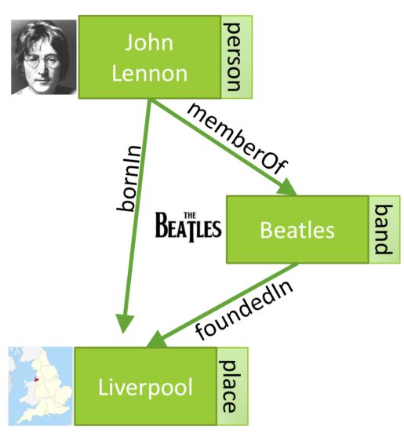
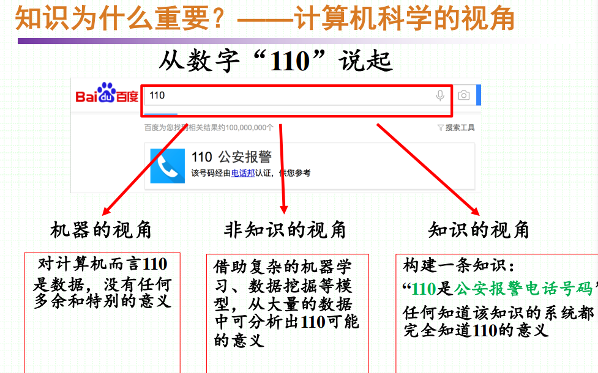
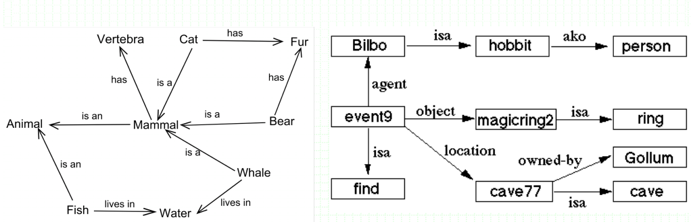

- 知识图谱概念
- 经典知识图谱
- 知识图谱应用

这个课先介绍了IBM Watson在益智节目《危险边缘》战胜了人类。

美军借助Palantir公司的技术成功定位本拉登藏身地

Google: Organize the world’s public information and make it universally accessible and useful
Palantir: Organize the world’s private information and make
it universally accessible and useful  

AlphaGo

### 知识图谱的例子

实体、属性、关系

节点是实体

节点 属性标签（可以包含类型）

两个节点的边是实体间关系

强调实体，但也可以描述概念

### 知识图谱与深度学习

| 区别     | 深度学习                                                 | 知识图谱                               |
| -------- | -------------------------------------------------------- | -------------------------------------- |
| 智能原理 | 对人类智能（大脑）的隐性模拟                             | 对人类智能（思考）的显性模拟           |
| 场景     | 擅长处理感知智能领域特定任务 围棋、语音、图像、视频 | 广泛用于各种任务 广泛用于各种任务 |
| 特点     | 海量训练数据 强大算力 难解释                   | 海量知识 可解释 可理解       |
| 进展     | 在一些任务上接近或超过人类                               | 在知识量上超过人类                     |

趋势是 未来两种智能技术深度融合

### 深度学习的瓶颈

算力红利：GPU和TPU等硬件计算速度的摩尔定律开始生效

大数据红利：大数据的获取、清洗和标注已经出现瓶颈

算法红利：新型模型的提出很难；现有模型的优化和潜力挖掘存在瓶颈

平台红利：DL开发平台日趋成熟，难以有更大提升空间

### 知识图谱与数据库

|            | 语义层     | 数据层     |
| ---------- | ---------- | ---------- |
| 关系数据库 | 没有语义   | 丰富的数据 |
| 传统知识库 | 丰富的语义 | 少量的实例 |
| 知识图谱   | 少量的语义 | 丰富的实例 |

知识图谱是学术界和工业界经过近50年不断尝试、失败改进后、推出的具有巨大应用价值和潜力的人工智能前沿技术

知识图谱在传统知识库的基础上发展而来，但更注重其中的数据

知识图谱不能替代数据库，二者互补

知识图谱包含语义信息（？），可进行一定的推理；形式更灵活，可扩展性更好

缺点：

天生缺乏直接的有效处理工具，大规模图谱数据处理常常借助于数据库技术

维基百科知识图谱：685个概念2795个属性4233000个实例

### 知识图谱本质

万物及其联系的网络

> Knowledge is a familiarity, awareness, or understanding of someone or something, such as facts, information, descriptions, or skills, which is acquired through experience or education by perceiving, discovering, or learning.  

2012年5月16日,Google发布了知识图谱，并指出知识图谱技术极大增强了Google搜索引擎返回结果的价值，从而掀起了一场知识图谱技术的热潮。

### 传统专家系统

化学结构分析

https://en.wikipedia.org/wiki/Dendral  

细菌感染诊断系统

https://en.wikipedia.org/wiki/Mycin  

自动配置零部件系统

https://en.wikipedia.org/wiki/Xcon  

## 知识表示

### 语义网络（Semantic Network）

语义网络：表示概念间语义关系的网络

- 1956年提出，最初目的用于语言翻译和自然语言处理
- 经典语义网络项目：WordNet

### 框架（Frame）

框架是人工智能中使用的一种数据结构