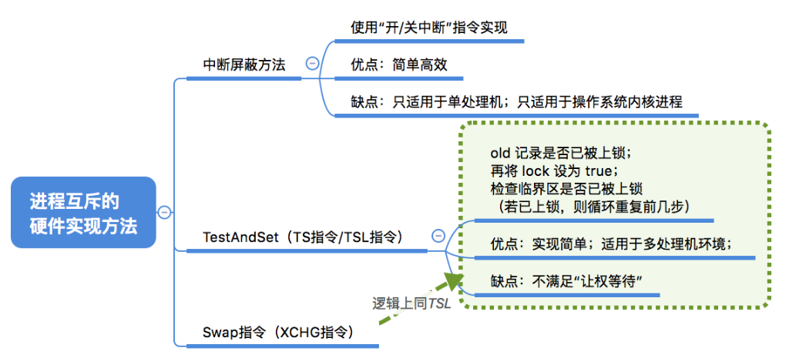
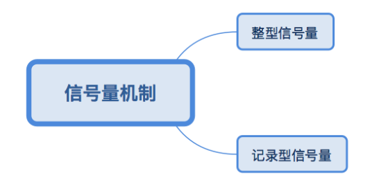
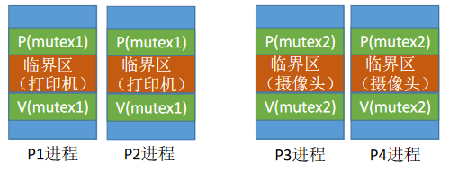
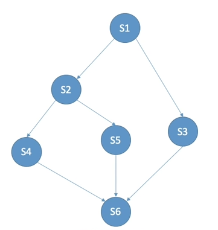

# 2.3同步与互斥


## 什么是进程同步

> 进程具有**异步性**的特征。异步性是指，各并发执行的进程以各自独立的、不可预知的速度向前推进

如果需要保证进程推进的顺序，操作系统要提供“进程同步机制”来实现该需求。

> 假如需要进程1执行完某段代码之后，进程2才能执行其他代码


再看另一个例子：进程通信——管道通信


读进程和写进程并发地运行，由于并发必然导致异步性，因此“写数据”和“读数据”两个操作执行的先后顺序是不确定的。

而实际应用中，又必须按照“**写数据→读数据**”的顺序来执行的。如何解决这种异步问题，就是“**进程同步**”所讨论的内容。

**同步**亦称**直接制约关系**，它是指为完成某种任务而建立的两个或多个进程，这些进程因为需要在某些位置上**协调**它们的**工作次序**而产生的制约关系。进程间的直接制约关系就是源于它们之间的相互合作。

## 什么是进程互斥

进程的“并发”需要“共享”的支持。各个并发执行的进程不可避免的需要共享一些系统资源（比如内存，又比如打印机、摄像头这样的I/O设备）

### 互斥共享方式

系统中的某些资源，虽然可以提供给多个进程使用，但一个时间段内只允许一个进程访问该资源

比如打印机资源

### 同时共享方式

系统中的某些资源，允许一个时间段内由多个进程“同时”对它们进行访问。

指的是宏观上的同时，比如硬盘的存取

### 临界资源

我们把**一个时间段内只允许一个进程使用的资源**称为**临界资源**。

许多物理设备（比如摄像头、打印机）都属于临界资源。

此外还有许多变量、数据、内存缓冲区等都属于临界资源。

对临界资源的访问，必须**互斥**地进行。

互斥，亦称**间接制约关系**。

进程互斥指当一个进程访问某临界资源时，另一个想要访问该临界资源的进程必须等待。

当前访问临界资源的进程访问结束，释放该资源之后，另一个进程才能去访问临界资源。

### 临界资源的互斥访问

```c
do {
    entry section;     // 进入区
    critical section;  // 临界区
    exit section;      // 退出区
    remainder section; // 剩余区
} while(true)
```

> **进入区**：负责检查是否可进入临界区，若可进入，则应设置正在访问临界资源的标志（可理解为“上锁”），以阻止其他进程同时进入临界区
>
> **临界区**：访问临界资源的那段代码
>
> **退出区**：负责解除正在访问临界资源的标志（可理解为“**解锁**”）
>
> **剩余区**：做其他处理

注意：**临界区**是进程中访问临界资源的**代码段**。**进入区**和**退出区**是**负责实现互斥**的**代码段**。临界区也可称为“临界段”

### 互斥访问的原则

如果一个进程暂时不能进入临界区，那么该进程是否应该一直占着处理机？

该进程有没有可能一直进不了临界区？


为了实现对临界资源的互斥访问，同时保证系统整体性能，需要**遵循以下原则**：

1.**空闲让进**。临界区空闲时，可以允许一个请求进入临界区的进程立即进入临界区；

2.**忙则等待**。当已有进程进入临界区时，其他试图进入临界区的进程必须等待；

3.**有限等待**。对请求访问的进程，应保证能在有限时间内进入临界区（保证不会饥饿）；

4.**让权等待**。当进程不能进入临界区时，应立即释放处理机，防止进程忙等待。

## 总结

 

# 进程互斥的软件实现方法


**学习思路**：

1.理解各个算法的思想、原理

2.结合上小节学习的“实现互斥的四个逻辑部分”，重点理解各算法在进入区、退出区都做了什么

3.分析各算法存在的缺陷（结合“实现互斥要遵循的四个原则”进行分析）

**没有进程互斥的后果**

回忆打印机例子

## 单标志法

### 算法思想

两个进程在**访问完临界区后**会把使用临界区的权限转交给另一个进程。也就是说**每个进程进入临界区的权限只能被另一个进程赋予**

```c
int turn = 0; // turn 表示当前允许进入临界区的进程号

// P0进程
while (turn != 0);  // 区别
critical section;
turn = 1;  // 区别
remainder section;


// P1进程
while (turn != 1)  // 区别
critical section;
turn = 0;  // 区别
remainder section;
```

`while (turn != 0)`相当于一个阻塞。

该算法可以实现“**同一时刻最多只允许一个进程访问临界区**”

> 考场上，两人只有一支笔，A先用，B就一直问，你用完没！

### 存在的问题

“**轮流访问**”带来的问题是，如果此时允许进入临界区的进程是P0，而P0一直不访问临界区，那么虽然此时临界区空闲，但是并不允许P1访问。

因此，单标志法存在的主要问题是：违背“**空闲让进**”原则。

## 双标志先检查法

### 算法思想

设置一个布尔型数组flag[]，数组中各个元素用来**标记各进程想进入临界区的意愿**

比如“flag[0]=ture”意味着0号进程P0现在想要进入临界区。

每个进程在进入临界区之前先检查当前有没有别的进程想进入临界区，如果没有，则把自身对应的标志flag[i]设为true，之后开始访问临界区。

```c
bool flag[2];    // 表示进入临界区意愿的数组
flag[0] = false;
flag[1] = false; // 初始时，两个进程都不想进入临界区

// P0进程
while (flag[1]);  // 区别
flag[0] = true;
critical section;
flag[0] = false;  // 区别
remainder section;


// P1进程
while (flag[0]);// 区别
flag[1] = true;
critical section;
flag[1] = false;  // 区别
```

### 存在的问题

若两个进程并发进行，两个进程都判断通过了，但是flag还没来得及修改。P0和P1将会同时访问临界区。

双标志先检查法的**主要问题**是：违反“**忙则等待**”原则。原因在于，**进入区**的“检查”和“上锁”两个处理**不是一气呵成**的。“检查”后，“上锁”前可能发生进程切换。

## 双标志后检查法

### 算法思想

双标志先检查法的改版。

前一个算法的问题是先“检查”后“上锁”，但是这两个操作又无法一气呵成，因此导致了两个进程同时进入临界区的问题。

因此，人们又想到**先“上锁”后“检查”**的方法，来避免上述问题。

```c
bool flag[2];    // 表示进入临界区意愿的数组
flag[0] = false;
flag[1] = false; // 初始时，两个进程都不想进入临界区

// P0进程
flag[0] = true;
while (flag[1]); // 区别
critical section;
flag[0] = false;  // 区别
remainder section;


// P1进程
flag[1] = true;
while (flag[0]); // 区别
critical section;
flag[1] = false;  // 区别
remainder section;
```

### 存在的问题

同样，如果两者同时执行**上锁**的动作，P0和P1将都无法进入临界区

因此，双标志后检查法虽然解决了“忙则等待”的问题，但是又违背了“**空闲让进**”和“**有限等待**”原则，会因各进程都长期无法访问临界资源而产生“饥饿”现象。

两个进程都争着想进入临界区，但是谁也不让谁，最后谁都无法进入临界区

## Peterson算法

### 算法思想

结合双标志法、单标志法的思想。如果双方都争着想进入临界区，那可以让进程尝试“孔融让梨”（谦让）。做一个有礼貌的进程。

```c
bool flag[2];    // 表示进入临界区意愿的数组
int turn = 0;    // turn 表示优先让哪个进程进入临界区

flag[0] = false;
flag[1] = false; // 初始时，两个进程都不想进入临界区

// P0进程
flag[0] = true;               // 1
turn = 1;                     // 2
while (flag[1] && turn==1);   // 3 区别
critical section;        
flag[0] = false;  // 区别
remainder section;

// P1进程
flag[1] = true;               // 4
turn = 0;                     // 5
while (flag[0] && turn==0);   // 6 区别
critical section;
flag[1] = false;  // 区别
remainder section;
```

分析以下执行顺序：

- 1 2 3 4 5 6
- 1 4 2 3
- 1 3 4 5 6 
- 1 4 2 5 6 **3** 使得P0执行

谁最后改变`turn`，谁就放弃了行动的优先权。

### 存在的问题

Peterson算法用软件方法解决了进程互斥问题，遵循了空闲让进、忙则等待、有限等待三个原则，但是依然未遵循**让权等待**的原则

**为什么没有实现让权等待原则？**

> 进程在一直轮询，并没有退出CPU

## 总结


# 进程互斥的硬件实现方法


掌握原理和优缺点

## 中断屏蔽方法

利用“**开/关中断指令”**实现（与原语的实现思想相同，即在某进程开始访问临界区到结束访问为止都不允许被中断，也就不能发生进程切换，因此也不可能发生两个同时访问临界区的情况）

**关中断后**：不允许当前进程被中断，也必然不会发生进程切换

**开中断后**：一切如常

优点：简单、高效

缺点：

- **不适用于多处理机**；
- 只适用于操作系统内核进程，**不适用于用户进程**（因为开/关中断指令只能运行在内核态，这组指令如果能让用户随意使用会很危险）

## TestAndSet

简称TS指令，也有地方称为TestAndSetLock指令，或TSL指令

TSL指令是用硬件实现的，执行的过程不允许被中断，只能一气呵成。以下是用C语言描述的逻辑


若刚开始lock是false，则TSL返回的old值为false，while循环条件不满足，直接跳过循环，进入临界区。

若刚开始lock是true，则执行TLS后old返回的值为true，while循环条件满足，会一直循环，直到当前访问临界区的进程在退出区进行“解锁”。

相比软件实现方法，TSL指令把“上锁”和“检查”操作用硬件的方式变成了一气呵成的原子操作。

优点：实现简单，无需像软件实现方法那样严格检查是否会有逻辑漏洞；适用于多处理机环境

境缺点：**不满足“让权等待”**原则，暂时无法进入临界区的进程会占用CPU并循环执行TSL指令，从而导致“忙等”。

## Swap指令（XCHG指令）

有的地方也叫Exchange指令，或简称XCHG指令。

Swap指令是用硬件实现的，执行的过程不允许被中断，只能一气呵成。以下是用C语言描述的逻辑


逻辑上来看Swap和TSL并无太大区别，都是先记录下此时临界区是否已经被上锁（记录在old变量上），再将上锁标记lock设置为true，最后检查old，如果old为false则说明之前没有别的进程对临界区上锁，则可跳出循环，进入临界区。

优点：实现简单，无需像软件实现方法那样严格检查是否会有逻辑漏洞；适用于多处理机环境

缺点：**不满足“让权等待”**原则，暂时无法进入临界区的进程会占用CPU并循环执行TSL指令，从而导致“忙等”。

## 总结



# 信号量机制



进程互斥的四种软件实现方式（单标志法、双标志先检查、双标志后检查、Peterson算法）

进程互斥的三种硬件实现方式（中断屏蔽方法、TS/TSL指令、Swap/XCHG指令）

1.在双标志先检查法中，进入区的“检查”、“上锁”操作无法一气呵成，从而导致了两个进程有可能同时进入临界区的问题；

2.所有的解决方案都无法实现“让权等待”

## 什么是信号量机制

1965年，荷兰学者Dijkstra提出了一种卓有成效的实现进程互斥、同步的方法——信号量机制

用户进程可以通过使用操作系统提供的**一对原语**来对**信号量**进行操作，从而很方便的实现了进程互斥、进程同步。

**信号量**其实就是一个变量（可以是一个整数，也可以是更复杂的记录型变量），可以用一个信号量来**表示系统中某种资源的数量**，比如：系统中只有一台打印机，就可以设置一个初值为1的信号量。

**原语**是一种特殊的程序段，其**执行只能一气呵成，不可被中断**。原语是由**关中断/开中断**指令实现的。软件解决方案的主要问题是由“进入区的各种操作无法一气呵成”，因此如果能把进入区、退出区的操作都用“原语”实现，使这些操作能“一气呵成”就能避免问题。

一对原语：**wait(S)**原语和**signal(S)**原语，可以把原语理解为我们自己写的函数，函数名分别为wait和signal，括号里的**信号量S**其实就是函数调用时传入的一个参数。

wait、signal原语常**简称为P、V操作**（来自荷兰语proberen和verhogen）。因此，做题的时候常把wait(S)、signal(S)两个操作分别写为P(S)、V(S)

## 整形信号量

用一个整数型的变量作为信号量，用来表示系统中某种资源的数量。

> 与普通整数变量的区别：对信号量的操作只有三种，即初始化、P操作、V操作

Eg：某计算机系统中有一台打印机..

```c
int S = 1; // 初始化整形信号量S，表示当前系统中可用的打印机资源数

void wait(int S) {
    while (S <= 0);  // 资源数不够，阻塞
    S = S - 1;  // 如果资源数够，则占用一个资源
}

void signal(int S) {
    S = S + 1;  // 用完资源后，在退出区释放资源
}
```

`wait()`存在一个问题，不满足“让权等待”原则，会发生“忙等”

```c
// 进程Pn
// ...
wait(S);        // 进入区
// 使用打印机...  // 临界区
signal(S);      // 退出区
// ...
```

## 记录型信号量

整型信号量的缺陷是存在“忙等”问题，因此人们又提出了“记录型信号量”，即用记录型数据结构表示的信号量。

```c
typedef struct {
    int value;  // 剩余资源数
    struct process *L;  // 等待队列
} semaphore;
```

```c
// 某进程需要使用资源时，通过 wait 原语申请
void wait (semaphore S) {
    S.value--;
    if (S.value < 0) {
        block (S.L);
    }
}
```

如果剩余资源数不够，使用**block**原语使进程从运行态进入阻塞态，并把挂到信号量S的等待队列（即阻塞队列）中

```c
// 进程使用完资源后，通过 signal 原语释放
void signal (semaphore S) {
    s.value++;
    if (S.value <= 0) {
        wakeup(S.L);
    }
}
```

释放资源后，若还有别的进程在等待这种资源，则使用**wakeup**原语唤醒等待队列中的一个进程，该进程从阻塞态变为就绪态

### 例子

某计算机系统中有2台打印机...，则可在初始化信号量S时将S.value的值设为2，队列S.L设置为空

如果来了4个打印任务，考虑S.value 和 S.L 的变化情况

### 补充

wait(S)、signal(S)也可以记为P(S)、V(S)，这对原语可用于实现系统资源的“申请”和“释放”。

S.value的**初值**表示系统中某种资源的数目。

对信号量S的**一次P操作**意味着进程**请求一个单位的该类资源**，因此需要执行S.value--，表示资源数减1

当S.value<0时表示该类资源已分配完毕，因此进程应调用block原语进行自我阻塞（当前运行的进程从**运行态→阻塞态**），主动放弃处理机，并插入该类资源的等待队列S.L中。

可见，该机制遵循了“让权等待”原则，不会出现“忙等”现象。

对信号量S的**一次V操作**意味着进程**释放一个单位的该类资源**，因此需要执行S.value++，表示资源数加1

若加1后仍是S.value<=0，表示依然有进程在等待该类资源，因此应调用wakeup原语唤醒等待队列中的第一个进程（被唤醒进程从**阻塞态→就绪态**）。

## 总结


# 深入信号量机制

用信号量机制实现进程互斥、同步、前驱关系


提示：一个信号量对应一种资源

信号量的值=这种资源的剩余数量（信号量的值如果小于0，说明此时有进程在等待这种资源）

P(S)——申请一个资源S，如果资源不够就阻塞等待

V(S)——释放一个资源S，如果有进程在等待该资源，则唤醒一个进程

## 实现进程互斥

1.分析并发进程的关键活动，划定临界区（如：对临界资源打印机的访问就应放在临界区）

2.设置互斥信号量mutex，初值为1

3.在进入区P(mutex)——申请资源

4.在退出区V(mutex)——释放资源

> 信号量mutex表示“进入临界区的名额”

```c
semaphore mutex = 1; // 初始化信号量
P1() {
    // ...
    P(mutex); // 使用临界资源前，加锁
    // 临界区代码段...
    V(mutex); // 使用临界资源后，解锁
    // ...
}

P2() {
    // ...
    P(mutex); // 使用临界资源前，加锁
    // 临界区代码段...
    V(mutex); // 使用临界资源后，解锁
    // ...
}
```

注意：对不同的临界资源需要设置不同的互斥信号量。



P、V操作**必须成对出现**。
缺少P(mutex)就不能保证临界资源的互斥访问。
缺少V(mutex)会导致资源永不被释放，等待进程永不被唤醒。

## 实现进程同步

### 什么是进程同步

进程同步：要让各并发进程按要求有序地推进。

比如，P1、P2并发执行，由于存在异步性，因此二者交替推进的次序是不确定的。

```c
P1() {
    code1();
    code2();
    code3();
}

P3() {
    code4();
    code5();
    code6();
}
```

若P2的“代码4”要基于P1的“代码1”和“代码2”的运行结果才能执行，那么我们就必须保证“代码4”一定是在“代码2”之后才会执行。

这就是进程同步问题，让本来异步并发的进程互相配合，有序推进。

### 如何实现

用信号量实现进程同步：

1.分析什么地方需要实现“同步关系”，即必须保证“一前一后”执行的两个操作（或两句代码）

2.设置同步信号量S,初始为0

3.在“前操作”之后执行V(S)

4.在“后操作”之前执行P(S)

```c
semaphore  S = 0;  // 初始化同步信号量，初始值为0
P1() {
    code1();
    code2();
    V(S);
    code3();
}

P3() {
    P(S);
    code4();
    code5();
    code6();
}
```

> 理解：信号量S代表“某种资源”，刚开始是没有这种资源的。P2需要使用这种资源，而又**只能由P1产生这种资源**
>
> V——产生资源
>
> P——使用资源

若先执行到V(S)操作，则S++后S=1。之后当执行到P(S)操作时，由于S=1，表示有可用资源，会执行S--，S的值变回0，P2进程不会执行block原语，而是继续往下执行代码4。

若先执行到P(S)操作，由于S=0，S--后S=-1，表示此时没有可用资源，因此P操作中会执行block原语，主动请求阻塞。之后当执行完代码2，继而执行V(S)操作，S++，使S变回0，由于此时有进程在该信号量对应的阻塞队列中，因此会在V操作中执行wakeup原语，唤醒P2进程。这样P2就可以继续执行代码4了

> 思考先执行P(1)，和先执行P(2)的区别

## 实现前驱关系

进程P1中有句代码S1，P2中有句代码S2，P3中有句代码S3......P6中有句代码S6。这些代码要求按如下前驱图所示的顺序来执行：

```c

P1() {
    S1();
}

P2() {
    S2();
}

P3() {
    S3();
}

P4() {
    S4();
}

P5() {
    S5();
}

P6() {
    S6();
}
```




其实每一对前驱关系都是一个进程同步问题（需要保证一前一后的操作）因此：

1.要**为每一对前驱关系各设置一个同步信号量**

2.在“前操作”之后对相应的同步信号量执行V操作

3.在“后操作”之前对相应的同步信号量执行P操作

用字母表示同步关系


```c
semaphore  a = 0;  // 初始化同步信号量，初始值为0
semaphore  b = 0;
// ...
semaphore  g = 0;

P1() {
    S1();
    V(a);
    V(b);
}

P2() {
    P(a);
    S2();
    V(c);
    V(d);
}

P3() {
    P(b);
    S3();
    V(g);
}

P4() {
    P(c);
    S4();
    V(e);
}

P5() {
    P(d);
    S5();
    V(f);
}

P6() {
    P(e);
    P(f);
    P(g);
    S6();
}
```

## 总结


# 生产者消费者问题

系统中有一组生产者进程和一组消费者进程

生产者进程每次生产一个产品放入缓冲区

消费者进程每次从缓冲区中取出一个产品并使用。（注：这里的“产品”理解为某种数据）

生产者、消费者共享一个初始为空、大小为n的缓冲区。（理解为队列）

缓冲区没满→生产者生产

缓冲区没空→消费者消费

缓冲区满时，生产者必须等待。（**同步**）

缓冲区空时，消费者必须等待。（**同步**）

缓冲区是临界资源，各进程必须**互斥**地访问

**为什么要互斥访问？**

> 加入有两个生产者，缓存区只剩下一个格子，它们都发现还剩下一个格子，说明可以加入新产品。这样就会出BUG

## 问题分析

PV操作题目分析步骤：

1.关系分析。找出题目中描述的各个进程，**分析它们之间的同步、互斥关系**。

2.整理思路。根据各进程的操作流程确定P、V操作的大致顺序。

3.设置信号量。并根据题目条件确定信号量初值。（互斥信号量初值一般为1，同步信号量的初始值要看对应资源的初始值是多少）

```c
semaphore empty = n;  // 同步信号量，表示空闲缓冲区的数量
semaphore full = 0;  // 同步信号量，表示产品的数量
semaphore mutex = 1;  // 互斥信号量
```

生产者的逻辑

- 缓冲区不能满
- 同一时间只能有一个进程操作缓冲区（互斥）

```c
producer() {
    P(empty);  // 消耗一个空间
    P(mutex);  // 申请使用缓冲区
    // 把产品放入缓冲区
    V(mutex);  // 释放缓冲区
    V(full);   // 产生一个产品
}
```

消费者的逻辑：

- 缓冲区不能空
- 同一时间只能有一个进程操作缓冲区（互斥）

```c
consumer() {
    
    P(full);
    P(mutex);
    // 把产品从缓冲区里取出来
    V(mutex);
    V(empty);
    // 使用产品
}
```

**能否改变相邻P V操作顺序?**

> P(mutex) 与 P(empty) 交换
>
> 若此时缓冲区内已经放满产品，则empty=0，full=n。
>
> 则生产者进程执行①使mutex变为0，再执行②，由于已没有空闲缓冲区，因此生产者被阻塞。由于生产者阻塞，因此切换回消费者进程。消费者进程执行③，由于mutex为0，即生产者还没释放对临界资源的“锁”，因此消费者也被阻塞。
>
> 这就造成了生产者等待消费者释放空闲缓冲区，而消费者又等待生产者释放临界区的情况，**生产者和消费者循环等待被对方唤醒**，出现“**死锁**”。

**互斥的P操作一定要在实现同步的P操作之后**

V操作不会导致进程阻塞，因此两个**V操作顺序可以交换**。

# 多生产者多消费者问题

桌子上有一只盘子，每次只能向其中放入一个水果。爸爸专向盘子中放苹果，妈妈专向盘子中放橘子，儿子专等着吃盘子中的橘子，女儿专等着吃盘子中的苹果。只有盘子空时，爸爸或妈妈才可向盘子中放一个水果。仅当盘子中有自己需要的水果时，儿子或女儿可以从盘子中取出水果。用PV操作实现上述过程。

定义信号量

> 第一次自己分析时，没有加入苹果和橘子这两个信号量

```c
semaphore dish=1;  // 盘子只能装一个果 
semaphore apple=0; // 盘子中的苹果
semaphore orange=0;// 盘子中的橘子
semaphore mutex=1; // 实现互斥访问盘子（缓冲区）
```

定义生产者

```c
dad() {
    P(dish);
    P(mutex);
    // 放苹果
    V(mutex);
    V(apple);
}

mom() {
    P(dish);
    P(mutex);
    // 放橘子
    V(mutex);
    V(orange);
}
```

定义消费者

```c
son() {
    P(orange)
    P(mutex);
    // 拿走橘子
    V(mutex);
    V(dish);
    // 吃橘子
}

daughter() {
    P(apple);
    P(mutex);
    // 拿走苹果
    V(mutex);
    V(dish);
    // 吃苹果
}
```

即使不设置专门的互斥变量mutex，也不会出现多个进程同时访问盘子的现象，为什么？

> 如果先执行儿子、女儿进程，因为一开始没有苹果和橘子，它们会被阻塞。
>
> 直到执行了爸爸、妈妈进程，添加了水果。
>
> 如果一开始先执行爸爸、妈妈进程，那就会顺利进行
>
> 原因在于：本题中的缓冲区大小为1，在任何时刻，apple、orange、plate三个同步信号量中最多只有一个是1。因此在任何时刻，最多只有一个进程的P操作不会被阻塞，并顺利地进入临界区...

```c
dad() {
    P(dish);
    // 放苹果
    V(apple);
}

mom() {
    P(dish);
    // 放橘子
    V(orange);
}

son() {
    P(orange)
    // 拿走橘子
    V(dish);
    // 吃橘子
}

daughter() {
    P(apple);
    // 拿走苹果
    V(dish);
    // 吃苹果
}
```

## 假如盘子可以放两个水果

```c
semaphore dish=2;  // 盘子能装2个果 
semaphore apple=0; // 盘子中的苹果
semaphore orange=0;// 盘子中的橘子
semaphore mutex=1; // 实现互斥访问盘子（缓冲区）
```

这时候代码的设计就要用一开始那种方式。

# 吸烟者问题

解决“可以生产多个产品的单生产者”问题


假设一个系统有三个抽烟者进程和一个供应者进程。

每个抽烟者不停地卷烟并抽掉它，但是要卷起并抽掉一支烟，抽烟者需要有三种材料：烟草、纸和胶水。

三个抽烟者中，第一个拥有烟草、第二个拥有纸、第三个拥有胶水。

供应者进程无限地提供三种材料，供应者每次将两种材料放桌子上，拥有剩下那种材料的抽烟者卷一根烟并抽掉它，并给供应者进程一个信号告诉完成了，供应者就会放另外两种材料再桌上，这个过程一直重复（让三个抽烟者轮流地抽烟）  

## 问题分析

三个兄弟要轮流抽烟

### 设置信号量

桌子可以抽象为容量为1的缓冲区，要**互斥**访问

组合一：纸+胶水

组合二：烟草+胶水

组合三：烟草+纸

**同步**关系（从事件的角度来分析）：

桌上有组合一→第一个抽烟者取走东西

桌上有组合二→第二个抽烟者取走东西

桌上有组合三→第三个抽烟者取走东西

发出**完成信号**→供应者将下一个组合放到桌上


```c
semaphore offer1 = 0;  // 桌上组合1的数量
semaphore offer2 = 0;  // 桌上组合2的数量
semaphore offer3 = 0;  // 桌上组合3的数量
semaphore finish = 0;  // 抽烟是否结束
int i = 0;             // 用于实现三个抽烟者轮流抽烟
```

### 生产者

```c
provider() {
    while(1) {
        if (i==0) {
            V(offer1);
        } else if (i==1) {
            V(offer2);
        } else if (i==2) {
            V(offer3);
        }
        i = (i + 1) % 3;
        P(finish);
    }
}
```

### 消费者

```c
smoker1 () {
    while(1) {
        P(offer1);
        // 拿走组合1，抽烟
        V(finish);
    }
}

smoker2 () {
    while(1) {
        P(offer2);
        // 拿走组合2，抽烟
        V(finish);
    }
}

smoker3 () {
    while(1) {
        P(offer3);
        // 拿走组合3，抽烟
        V(finish);
    }
}
```

若一个**生产者要生产多种产品**（或者说会引发多种前驱事件），那么各个**V操作应该放在各自对应的“事件”发生之后**的位置

# 读者-写者问题

有读者和写者两组并发进程，共享一个文件，当两个或两个以上的读进程同时访问共享数据时不会产生副作用，但若某个写进程和其他进程（读进程或写进程）同时访问共享数据时则可能导致数据不一致的错误。因此要求：

①允许多个读者可以同时对文件执行读操作；

②只允许一个写者往文件中写信息；

③任一写者在完成写操作之前不允许其他读者或写者工作；

④写者执行写操作前，应让已有的读者和写者全部退出。

**如何实现写操作优先？**

**写进程要等待所有读进程退出，实现这一点的核心思想是什么？**

## 信号量分析

> 难就难在不知道怎么分析读者进程的信号量设置

互斥关系：

- 写与读
- 写与写


```c
semaphore rw=1;     // 用于实现对共享文件的互斥访问
int count = 0;      // 记录当前有几个读进程在访问文件
semaphore mutex=1;  // 用于保证对count变量的互斥访问
```

写者进程

```c
writer() {
    while(1) {
        P(rw);
        // 写文件
        V(rw);
    }
}
```

读者进程

```c
reader() {
    while(1) {
        P(mutex);
        if (count == 0) {
            P(rw);
        }
        count++;
        V(mutex);
        // 读文件
        P(mutex);
        count--;
        if (count == 0) {
            V(rw);
        }
        V(mutex);
    }
    // 执行读操作
}
```

**思考mutex信号量的必要性**

如果两个读进程同时判断count == 0，那就会执行两次P(rw)，这样第二个读进程就被阻塞了，因为rw初始值为1。

**思考写进程是否会被饿死**

要有读进程还在读，写进程就要一直阻塞等待，可能“饿死”。因此，这种算法中，读进程是优先的

### 实现写进程优先

在这种算法中，连续进入的多个读者可以同时读文件；写者和其他进程不能同时访问文件；写者不会饥饿，但也并不是真正的“写优先”，而是相对公平的先来先服务原则。有的书上把这种算法称为“**读写公平法**”。

如果有写进程申请写文件，这时候就不允许再有新的读进程啦！

**设置信号量**

```c
semaphore rw=1;
int count = 0;
semaphore mutex=1;
semaphore w=1;  // 写进程实现写优先信号量
```

**写进程**

```c
writer() {
    while(1) {
        P(w);
        P(rw);
        // 写文件
        V(rw);
        V(w);
    }
}
```

**读进程**

```c
reader() {
    while(1) {
        P(w);   // 如果有写进程要写文件，这时候就不允许新读进程
        P(mutex);
        if (count == 0) {
            P(rw);
        }
        count++;
        V(mutex);
        V(w)
        // 读文件
        P(mutex);
        count--;
        if (count == 0) {
            V(rw);
        }
        V(mutex);
    }
    // 执行读操作
}
```

核心思想在于设置了一个计数器count用来记录当前正在访问共享文件的读进程数。我们可以用count的值来判断当前进入的进程是否是第一个/最后一个读进程，从而做出不同的处理。另外，对count变量的检查和赋值不能一气呵成导致了一些错误，如果需要实现“一气呵成”，自然应该想到用互斥信号量。 

# 哲学家进餐问题

一张圆桌上坐着5名哲学家，每两个哲学家之间的桌上摆一根筷子，桌子的中间是一碗米饭。哲学家们倾注毕生的精力用于思考和进餐，哲学家在思考时，并不影响他人。只有当哲学家饥饿时，才试图拿起左、右两根筷子（一根一根地拿起）。如果筷子已在他人手上，则需等待。饥饿的哲学家只有同时拿起两根筷子才可以开始进餐，当进餐完毕后，放下筷子继续思考。


- **关系分析**。系统中有5个哲学家进程，5位哲学家与左右邻居对其中间筷子的访问是互斥关系。
- **整理思路**。这个问题中只有互斥关系，但与之前遇到的问题不同的事，每个哲学家进程需要同时持有两个临界资源才能开始吃饭。如何**避免**临界资源分配不当造成的**死锁现象**，是哲学家问题的精髓。
- **信号量设置**。定义互斥信号量数组chopstick[5]={1,1,1,1,1}用于实现对5个筷子的互斥访问。并对哲学家按0~4编号，哲学家i左边的筷子编号为i，右边的筷子编号为(i+1)%5。

**信号量设置**

筷子显然是个互斥资源

```c
semaphore chopstick[5] = {1, 1, 1, 1, 1};
```

**哲学家进程**

```c
P(i) {
    while(1) {
        P(chopstick[i]);  // 拿左边的筷子
        P(chopstick[(i+1) % 5]);  // 拿右边的筷子
        // 吃饭
        V(chopstick[i]);
        V(chopstick[(i+1) % 5]);
    }
}
```

但是如果5个人同时拿起了左边的筷子，就会发生**死锁**。

如何防止死锁？

- 可以对哲学家进程施加一些限制条件，比如最多允许四个哲学家同时进餐。这样可以保证至少有一个哲学家是可以拿到左右两只筷子的
- 要求奇数号哲学家先拿左边的筷子，然后再拿右边的筷子，而偶数号哲学家刚好相反。用这种方法可以保证如果相邻的两个奇偶号哲学家都想吃饭，那么只会有其中一个可以拿起第一只筷子，另一个会直接阻塞。这就避免了占有一支后再等待另一只的情况
- 仅当一个哲学家左右两支筷子都可用时才允许他抓起筷子。

**这两种方式的代码实现**

方式1

```c
semaphore chopstick[5] = {1, 1, 1, 1, 1};
semaphore count = 4;  // 只能有4个人吃饭

P(i) {
    while(1) {
        P(count);
        P(chopstick[i]);  // 拿左边的筷子
        P(chopstick[(i+1) % 5]);  // 拿右边的筷子
        // 吃饭
        V(chopstick[i]);
        V(chopstick[(i+1) % 5]);
        V(count);
    }
}
```

方式2

```c
semaphore chopstick[5] = {1, 1, 1, 1, 1};

P(i) {
    while(1) {
        if (i % 2 == 0) {
            P(chopstick[i]);  // 拿左边的筷子
            P(chopstick[(i+1) % 5]);  // 拿右边的筷子
        } else {
            P(chopstick[(i+1) % 5]);  // 拿右边的筷子
            P(chopstick[i]);  // 拿左边的筷子
        }
        // 吃饭
        V(chopstick[i]);
        V(chopstick[(i+1) % 5]);
    }
}
```

**方式3**

取筷子的动作是一气呵成的，一个哲学家在取筷子时，其他人不得取

```c
semaphore chopstick[5] = {1, 1, 1, 1, 1};
semaphore mutex = 1;  // 互斥地取筷子
P(i) {
    while(1) {
        P(mutex);
        P(chopstick[i]);  // 拿左边的筷子
        P(chopstick[(i+1) % 5]);  // 拿右边的筷子
		V(mutex);
        // 吃饭
        V(chopstick[i]);
        V(chopstick[(i+1) % 5]);
    }
}
```

缺点，可能会导致能吃饭且想吃饭的人不能拿筷子。

## 总结

哲学家进餐问题的关键在于解决进程死锁。这些进程之间只存在互斥关系，但是与之前接触到的互斥关系不同的是，每个进程都需要同时持有两个临界资源，因此就有“死锁”问题的隐患。如果在考试中遇到了一个进程需要同时持有多个临界资源的情况，应该参考哲学家问题的思想，分析题中给出的进程之间是否会发生循环等待，是否会发生死锁。可以参考哲学家就餐问题解决死锁的三种思路。 

# 管程


## 为什么要引入管程

信号量机制存在的问题：编写程序困难、易出错

能不能设计一种机制，让程序员写程序时不需要再关注复杂的PV操作，让写代码更轻松呢？

1973年，BrinchHansen首次在程序设计语言(Pascal)中引入了“管程”成分——一种高级同步机制

如果PV操作顺序出错，就可能会发生死锁。

## 管程的定义和基本特征

用于实现进程互斥和同步

### 管程的定义

管程是一种特殊的软件模块，有这些部分组成：

1.局部于管程的**共享数据结构**说明；

2.对该数据结构进行操作的**一组过程**（就是一组函数）；

3.对局部于管程的共享数据设置初始值的语句；

4.管程有一个名字。

> 管程的定义类似于一个封装的类
>
> 就在这个类里边操作

### 管程的基本特征

1.局部于管程的数据只能被局部于管程的过程所访问；

2.一个进程只有通过调用管程内的过程才能进入管程访问共享数据；

3.每次仅允许一个进程在管程内执行某个内部过程。

## 管程解决生产者消费者问题

管程定义的伪代码

```c
monitor ProducerConsumer
    condition full, empty; // 条件变量用来实现同步（排队）
    int count = 0; // 缓冲区产品数
    void insert (Item item) {  // 把产品item放入缓冲区
        if (count == N)
            wait (full);
        count++;
        insert_item (item);  // 生产了一个产品
        if (count == 1)  // 生产产品之前，缓冲区为空
            signal (empty);  // 唤醒消费者进程
    }
    Item remove () {  // 从缓冲区取出一个产品
        if (count == 0)
            wait (empty);
        count--;
        if (count == N-1)  // 取走产品之前缓冲区已满
            signal(full);  // 唤醒生产者进程
        return remove_item();
    }
end monitor;
```

生产者与消费者

```
// 生产者进程
producer (){
    while(1){
        item = 生产一个产品;
        ProducerConsumer.insert(item);
    }
}

// 消费者进程
consumer() {
    while(1){
        item = ProducerConsumer.remove();
        消费产品item;
    }
}
```

由编译器负责实现各进程互斥地进入管程中的过程

管程中设置条件变量和等待/唤醒操作，以解决同步问题

每次仅允许一个进程在管程内执行某个内部过程。

例1：两个生产者进程并发执行，依次调用了insert过程...

例2：两个消费者进程先执行，生产者进程后执行...

### 总结

引入管程的目的无非就是要**更方便地实现进程互斥和同步**。

1.需要在管程中定义**共享数据**（如生产者消费者问题的缓冲区）

2.需要在管程中定义用于**访问这些共享数据的“入口”**——其实就是一些函数（如生产者消费者问题中，可以定义一个函数用于将产品放入缓冲区，再定义一个函数用于从缓冲区取出产品）

3.**只有通过这些特定的“入口”才能访问共享数据**

4.管程中有很多“入口”，但是每次**只能开放其中一个“入口”**，并且只能让一个进程或线程进入（如生产者消费者问题中，各进程需要互斥地访问共享缓冲区。管程的这种特性即可保证一个时间段内最多只会有一个进程在访问缓冲区。注意：这种**互斥特性是由编译器负责实现**的，程序员不用关心）

5.可在管程中**设置条件变量及等待/唤醒操作以解决同步问题**。可以让一个进程或线程在条件变量上等待（此时，该进程应先释放管程的使用权，也就是让出“入口”）；可以通过唤醒操作将等待在条件变量上的进程或线程唤醒。

程序员可以用某种特殊的语法定义一个管程（比如:monitor Producer Consumer ...... end monitor;），之后其他程序员就可以使用这个管程提供的特定“入口”很方便地使用实现进程同步/互斥了

## Java中类似于管程的机制

Java中，如果用关键字synchronized来描述一个函数，那么这个函数同一时间段内只能被一个线程调用

```java
static class monitor {
    private Item buffer[] = new Item[N];
    private int count = 0;
    
    public synchronized void insert (Item item) {
        ......
    }
}
```

每次只能有一个线程进入insert函数，如果多个线程同时调用insert函数，则后来者需要排队等待

## 总结

