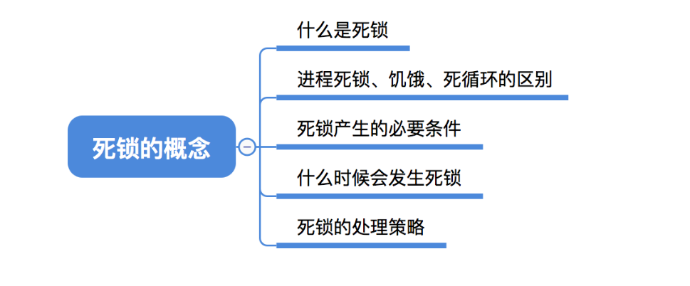
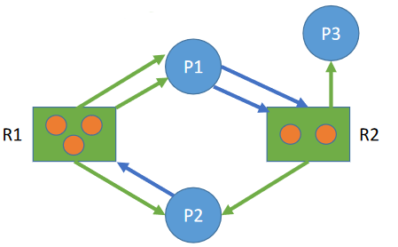
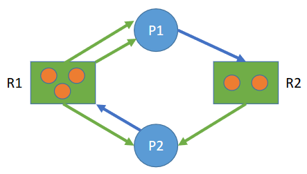

# 2.4死锁

# 死锁的概念



## 什么是死锁

每个人都占有一个资源，同时又在等待另一个人手里的资源。发生“死锁”

在并发环境下，各进程因竞争资源而造成的一种**互相等待**对方手里的资源，导致各进程都阻塞，都无法向前推进的现象，就是“**死锁**”。发生死锁后若无外力干涉，这些进程都将无法向前推进。

## 死锁、饥饿、死循环的区别

**死锁**：各进程互相等待对方手里的资源，导致各进程都阻塞，无法向前推进的现象。**至少有两个或两个以上的进程同时发生死锁**。发生死锁的进程一定处于阻塞态。

**饥饿**：由于长期得不到想要的资源，某进程无法向前推进的现象。比如：在短进程优先（SPF）算法中，若有源源不断的短进程到来，则长进程将一直得不到处理机，从而发生长进程“饥饿”。**可能只有一个进程发生饥饿**，发生饥饿的进程既可能是**阻塞态**(如长期得不到需要的I/O设备)，也可能是**就绪态**(长期得不到处理机)

**死循环**：某进程执行过程中一直跳不出某个循环的现象。有时是因为程序逻辑bug导致的，有时是程序员故意设计的。

死锁和饥饿是管理者（操作系统）的问题，死循环是被管理者的问题。

## 死锁产生的必要条件

产生死锁必须同时满足一下四个条件，只要其中任一条件不成立，死锁就不会发生。

**互斥条件**：只有对必须互斥使用的资源的争抢才会导致死锁（如哲学家的筷子、打印机设备）。像内存、扬声器这样可以同时让多个进程使用的资源是不会导致死锁的（因为进程不用阻塞等待这种资源）。

**不剥夺条件**：进程所获得的资源在未使用完之前，不能由其他进程强行夺走，只能主动释放。

**请求和保持条件**：进程**已经保持了至少一个资源**，但又**提出了新的资源请求**，而该资源又被其他进程占有，此时请求进程被阻塞，但又对自己已有的资源保持不放。

**循环等待条件**：存在一种进程资源的循环等待链，链中的每一个进程已获得的资源同时被下一个进程所请求。

> 发生死锁时一定有循环等待，但是发生循环等待时未必死锁（循环等待是死锁的必要不充分条件）
>
> 如果同类资源数大于1，则即使有循环等待，也未必发生死锁。但如果系统中每类资源都只有一个，那循环等待就是死锁的充分必要条件了。

## 什么时候会发生死锁

1.**对系统资源的竞争**。各进程对不可剥夺的资源（如打印机）的竞争可能引起死锁，对可剥夺的资源（CPU）的竞争是不会引起死锁的。

2.**进程推进顺序非法**。请求和释放资源的顺序不当，也同样会导致死锁。例如，并发执行的进程P1、P2分别申请并占有了资源R1、R2，之后进程P1又紧接着申请资源R2，而进程P2又申请资源R1，两者会因为申请的资源被对方占有而阻塞，从而发生死锁。

3**.信号量的使用不当也会造成死锁**。如生产者-消费者问题中，如果实现互斥的P操作在实现同步的P操作之前，就有可能导致死锁。（可以把互斥信号量、同步信号量也看做是一种抽象的系统资源）

## 死锁的处理策略

1.预防死锁。破坏死锁产生的四个必要条件中的一个或几个。

2.避免死锁。用某种方法防止系统进入不安全状态，从而避免死锁（银行家算法）

3.死锁的检测和解除。允许死锁的发生，不过操作系统会负责检测出死锁的发生，然后采取某种措施解除死锁。

## 总结


# 预防死锁


## 破坏互斥条件

**互斥条件**：只有对必须互斥使用的资源的争抢才会导致死锁。

如果把只能互斥使用的资源改造为允许共享使用，则系统不会进入死锁状态。比如:**SPOOLing**技术。操作系统可以采用SPOOLing技术把独占设备在逻辑上改造成共享设备。比如，用SPOOLing技术将打印机改造为共享设备...

该策略的**缺点**：并不是所有的资源都可以改造成可共享使用的资源。并且为了系统安全，很多地方还必须保护这种互斥性。因此，**很多时候都无法破坏互斥条件**。

## 破坏不剥夺条件

不剥夺条件：进程所获得的资源在未使用完之前，不能由其他进程强行夺走，只能主动释放。

**破坏不剥夺条件**：

方案一：当某个进程请求新的资源得不到满足时，它必须**立即释放保持的所有资源**，待以后需要时再重新申请。也就是说，即使某些资源尚未使用完，也需要主动释放，从而破坏了不可剥夺条件。

方案二：当某个进程需要的资源被其他进程所占有的时候，可以由操作系统协助，**将想要的资源强行剥夺**。这种方式一般需要**考虑各进程的优先级**（比如：剥夺调度方式，就是将处理机资源强行剥夺给优先级更高的进程使用）

**该策略的缺点**：

1.实现起来比较复杂。

2.释放已获得的资源可能造成前一阶段工作的失效。因此这种方法一般只适用于易保存和恢复状态的资源，如CPU。

3.反复地申请和释放资源会增加系统开销，降低系统吞吐量。

4.若采用方案一，意味着只要暂时得不到某个资源，之前获得的那些资源就都需要放弃，以后再重新申请。如果一直发生这样的情况，就会导致进程饥饿。

## 破坏请求和保持条件

请求和保持条件：进程已经**保持了至少一个资源**，但**又提出了新的资源请求**，而该资源又被其他进程占有，此时请求进程被阻塞，但又对自己已有的资源保持不放。

> 吃着碗里的，还看着锅里的

可以采用**静态分配方法**，即进程在运行前一次申请完它所需要的全部资源，在它的资源未满足前，不让它投入运行。一旦投入运行后，这些资源就**一直归它所有**，该进程就不会再请求别的任何资源了。

该策略实现起来简单，但也有明显的缺点：

有些资源可能只需要用很短的时间，因此如果进程的整个运行期间都一直保持着所有资源，就会造成严重的资源浪费，**资源利用率极低**。另外，该策略也有可能导致某些进程饥饿。

## 破坏循环等待条件

循环等待条件：存在一种进程资源的循环等待链，链中的每一个进程已获得的资源同时被下一个进程所请求。

可采用**顺序资源分配**法。首先给系统中的资源编号，规定每个进程**必须按编号递增的顺序请求资源**，同类资源（即编号相同的资源）一次申请完。

原理分析：一个进程只有已占有小编号的资源时，才有资格申请更大编号的资源。按此规则，已持有大编号资源的进程不可能逆向地回来申请小编号的资源，从而就不会产生循环等待的现象。假设系统中共有10个资源，编号为1,2,......10

该策略的缺点：

1.不方便增加新的设备，因为可能需要重新分配所有的编号；

2.进程实际使用资源的顺序可能和编号递增顺序不一致，会导致资源浪费；

3.必须按规定次序申请资源，用户编程麻烦。

## 总结


# 避免死锁


## 什么是安全序列

所谓安全序列，就是指如果系统按照这种序列分配资源，则每个进程都能顺利完成。只要能找出一个安全序列，系统就是安全状态。当然，**安全序列可能有多个**。

> 就是说，A进程需要4个苹果，B进程需要3个苹果，C进程需要2个苹果
>
> 有个规定就是，ABC需要借到需要的苹果，之后才会还给你。
>
> 你只有5个苹果，假设目前，A借了1个B借了2两个C借了1个（只剩1个）
>
> 这时间，如果A问你借1个，你借不借，如果你借了，你就没了，ABC都不会还给你。因为他们都没收到足够的苹果。
>
> 但是可以借给B或者C

如果分配了资源之后，系统中找不出任何一个安全序列，系统就进入了**不安全状态**。这就意味着之后**可能**所有进程都无法顺利的执行下去。当然，如果有进程提前**归还了一些资源**，那系统也有**可能重新回到安全状态**，不过我们在分配资源之前总是要考虑到最坏的情况。

如果系统处于安全状态，就一定不会发生死锁。如果系统进入不安全状态，就可能发生死锁（处于不安全状态未必就是发生了死锁，但发生死锁时一定是在不安全状态）

因此可以在**资源分配之前预先判断这次分配是否会导致系统进入不安全状态**，以此决定是否答应资源分配请求。这也是“**银行家算法**”的核心思想。

## 银行家算法举例

银行家算法是荷兰学者Dijkstra为银行系统设计的，以确保银行在发放现金贷款时，不会发生不能满足所有客户需要的情况。后来该算法被用在操作系统中，用于**避免死锁**。

**核心思想**：在进程提出资源申请时，先预判此次分配是否会导致系统进入不安全状态。如果会进入不安全状态，就暂时不答应这次请求，让该进程先阻塞等待。

> 大家都在抢苹果，最后谁都得不到足够的苹果。

苹果的例子中，只有一种类型的资源，但是在计算机系统中会有多种多样的资源，应该怎么把算法拓展为多种资源的情况呢？

> 可以把单维的数字拓展为多维的向量。比如：系统中有5个进程P0-P4，3种资源R0-R2，初始数量为(10,5,7)，则某一时刻的情况可表示如下：


可以算出，还剩下(3, 3, 2)的资源

判断此时系统是否处于安全状态

| 进程 | 最大需求  | 已分配    | 最多还需要 | 能否满足 |
| ---- | --------- | --------- | ---------- | -------- |
| P0   | (7, 5, 3) | (0, 1, 0) | (7, 4, 3)  | 不能     |
| P1   | (3, 2, 2) | (2, 0, 0) | (1, 2, 2)  | 能       |
| P2   | (9, 0, 2) | (3, 0, 2) | (6, 0, 0)  | 不能     |
| P3   | (2, 2, 2) | (2, 1, 1) | (0, 1, 1)  | 能       |
| P4   | (4, 3, 3) | (0, 0, 2) | (4, 3, 1)  | 不能     |

先满足P1，等它完成后，剩余资源为：(5, 3, 2)

满足P3，完成后：(7, 4, 3)，此时可以满足剩下的所有的任务

则可以依次满足P0 → P2 → P4


以此类推，最后能满足所有的进程，所以此时系统**处于安全状态**

不满足安全状态举例：P0 P2 P4的第一个资源所需数量+10

## 代码实现银行家算法

假设系统中有n个进程，m种资源每个进程在运行前先声明对各种资源的最大需求数，则可用一个n*m的矩阵（可用二维数组实现）表示所有进程对各种资源的最大需求数。称为**最大需求矩阵Max**

Max[i,j]=K表示进程Pi最多需要K个资源Rj。同理，系统可以用一个n*m的**分配矩阵Allocation**表示对所有进程的资源分配情况。

Max–Allocation=**Need矩阵**，表示各进程最多还需要多少各类资源。

另外，还要用一个长度为m的一维数组**Available**表示当前系统中还有多少可用资源。

某进程Pi向系统申请资源，可用一个**长度为m的一维数组Requesti**表示本次申请的各种资源量。（第i个进程申请的资源量）

| 符号      | 名称                               | 说明                |
| --------- | ---------------------------------- | ------------------- |
| $X$       | 最大需求矩阵Max                    | n行m列              |
| $A$       | 分配矩阵Allocation                 | n行m列              |
| $Y$       | 进程所需资源矩阵Need               | n行m列<br />$Y=X-A$ |
| $y^i$     | 表示进程Pi申请的各种资源量Requesti | 长为m的一维向量     |
| $y^i_j$   | 进程Pi申请的第j个资源的数量        | 标量                |
| $\beta$   | 系统可用资源Available              | 长为m的一维向量     |
| $\beta_j$ | 第j个资源的可用数量                | 标量                |

1. 若$y^i_j \le Y_{i,j}$，第i个进程，**申请**第j个资源的数量**小于等于**其**所需**资源量，进入下一步；否则认为出错
2. 若$y^i_j \le \beta_j$，第j个资源的**申请数量**小于等于第j个资源的**可用数量**，进入下一步；否则表示尚无足够资源，Pi必须等待
3. 系统**假装**把资源分配给进程Pi，并修改相应的数据（**并非真的分配，修改数值只是为了做预判**）
   - $\beta_j = \beta_j-y^i_j$ 可用资源被分配了，要减少可用资源
   - $A_{i,j}=A_{i,j}+y^i_j$
   - $Y_{i,j}=Y_{i,j}-y^i_j$
4. 操作系统执行**安全性算法**，检查此次资源分配后，**系统是否处于安全状态**。若安全，才正式分配；否则，恢复相应数据，让进程阻塞等待。

像之前那样，尝试找到一个安全队列


## 总结

**银行家算法步骤**：

①检查此次申请是否超过了之前声明的最大需求数

②检查此时系统剩余的可用资源是否还能满足这次请求

③试探着分配，更改各数据结构

④用安全性算法检查此次分配是否会导致系统进入不安全状态


**安全性算法步骤**：

检查当前的剩余可用资源是否能满足某个进程的最大需求，如果可以，就把该进程加入安全序列，并把该进程持有的资源全部回收。

不断重复上述过程，看最终**是否能让所有进程都加入安全序列**


系统处于不安全状态未必死锁，但死锁时一定处于不安全状态。系统处于安全状态一定不会死锁。

# 死锁的检测和解除


如果系统中既不采取预防死锁的措施，也不采取避免死锁的措施，系统就很可能发生死锁。

在这种情况下，系统应当提供两个算法：

①死锁检测算法：用于检测系统状态，以确定系统中是否发生了死锁。

②死锁解除算法：当认定系统中已经发生了死锁，利用该算法可将系统从死锁状态中解脱出来。

## 死锁的检测

为了能对系统是否已发生了死锁进行检测，必须：

①用某种数据结构来保存资源的请求和分配信息；

②提供一种算法，利用上述信息来检测系统是否已进入死锁状态。


P1进程得到了2个R1资源，正在请求1个R2资源

P2进程得到了1个R1资源，1个R2资源，正在请求1个R1资源

 ```python
graph = {
    'P1': ['R2'],
    'P2': ['R1'],
    'R1': (3, ['P1', 'P1', 'P2']),
    'R2': (2, ['P2'])
}
 ```

如果系统中剩余的可用资源数足够满足进程的需求，那么这个进程暂时是不会阻塞的，可以顺利地执行下去。

> P1请求了一个R2资源，R2资源充足，可以被满足，P1不会被阻塞。
>
> 但是P2请求R1资源，R1资源不足，P2被阻塞

如果这个进程执行结束了把资源归还系统，就可能使某些正在等待资源的进程被激活，并顺利地执行下去。

相应的，这些被激活的进程执行完了之后又会归还一些资源，这样可能又会激活另外一些阻塞的进程..

> P1结束之后，会归还R1和R2资源
>
> 此时P2能够申请到R1资源了

如果按上述过程分析，最终**能消除所有边**，就称这个图是**可完全简化的**。此时**一定没有发生死锁**（相当于能找到一个安全序列）

如果最终**不能消除所有边**，那么此时就是**发生了死锁**

最终还连着边的那些进程就是处于死锁状态的进程。

死锁的情况：



### 检测算法

（1）在资源分配图中，找出既不阻塞又不是孤点的进程Pi（即找出一条有向边与它相连，且该有向边对应资源的申请数量小于等于系统中已有空闲资源数量。如下图中，R1没有空闲资源，R2有一个空闲资源。若所有的连接该进程的边均满足上述条件，则这个进程能继续运行直至完成，然后释放它所占有的所有资源）。

（2）消去它所有的请求边和分配边，使之称为孤立的结点。在下图中，P1是满足这一条件的进程结点，于是将P1的所有边消去。

（3）进程Pi所释放的资源，可以唤醒某些因等待这些资源而阻塞的进程，原来的阻塞进程可能变为非阻塞进程。在下图中，P2就满足这样的条件。根据（1）中的方法进行一系列简化后，若能消去途中所有的边，则称该图是可完全简化的



## 死锁的解除

一旦检测出死锁的发生，就应该立即解除死锁。

补充：并不是系统中所有的进程都是死锁状态，用死锁检测算法**化简资源分配图后，还连着边的那些进程就是死锁进程**

解除死锁的主要方法有：

1.**资源剥夺法**。挂起（暂时放到外存上）某些死锁进程，并抢占它的资源，将这些资源分配给其他的死锁进程。但是应防止被挂起的进程长时间得不到资源而饥饿。

2.**撤销进程法**（或称**终止进程法**）。强制撤销部分、甚至全部死锁进程，并剥夺这些进程的资源。这种方式的优点是实现简单，但所付出的代价可能会很大。因为有些进程可能已经运行了很长时间，已经接近结束了，一旦被终止可谓功亏一篑，以后还得从头再来。

3.**进程回退法**。让一个或多个死锁进程回退到足以避免死锁的地步。这就要求系统要记录进程的历史信息，设置还原点。

如何决定对谁动手：

1.进程优先级

2.已执行多长时间

3.还要多久能完成

4.进程已经使用了多少资源

5.进程是交互式的还是批处理式的

## 总结

