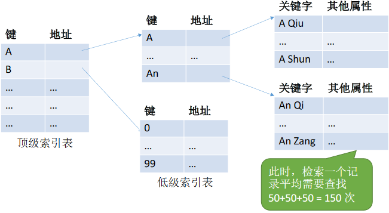
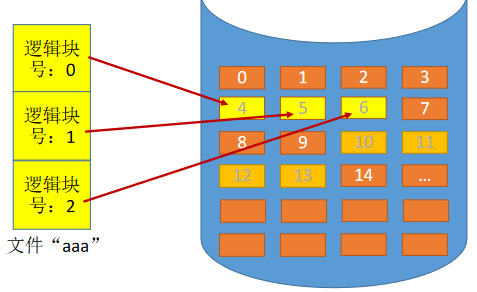
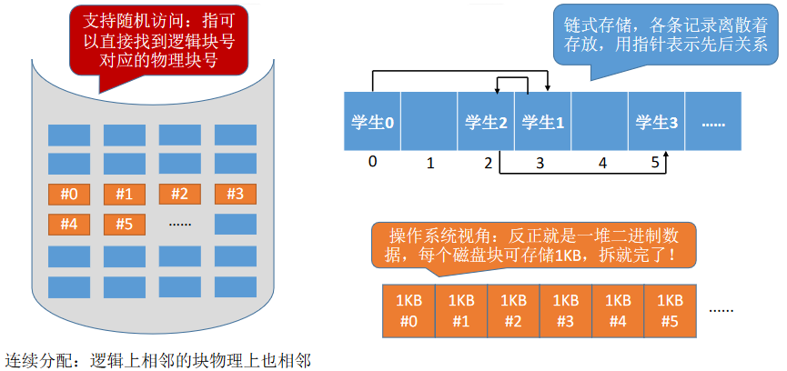
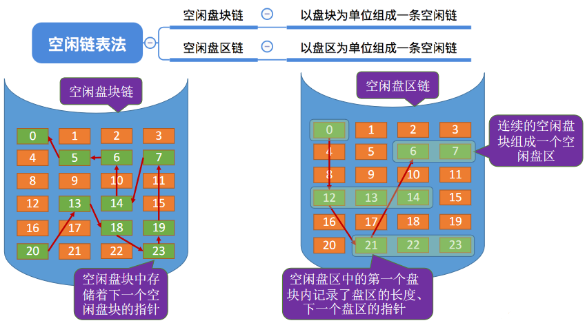

# 4.1文件管理系统

# 初识文件管理


文件——就是一组有意义的信息/数据集合

- 计算机中存放了各种各样的文件，一个文件有哪些属性？
- 文件内部的数据应该怎样组织起来？
- 文件之间又应该又应该怎么组织起来？
- 从下往上看，OS应提供哪些功能，才能方便用户、应用程序使用文件？
- 从上往下看，文件数据应该怎么存放在外存（磁盘）上？

## 文件的属性

**文件名**：由创建文件的用户决定文件名，主要是为了方便用户找到文件，**同一目录下不允许有重名文件**。

**标识符**：一个系统内的各文件标识符唯一，对用户来说毫无可读性，因此标识符只是操作系统用于区分各个文件的一种内部名称。

**类型**：指明文件的类型位置：

- 文件存放的路径（让用户使用）
- 在外存中的地址（操作系统使用，对用户不可见）

**大小**：指明文件大小

**创建时间**、**上次修改时间**

**文件所有者信息**

**保护信息**：对文件进行保护的访问控制信息


## 文件内部的数据应该怎样组织起来？

**无结构文件**（如文本文件）——由一些二进制或字符流组成，又称“**流式文件**”

有**结构文件**（如数据库表）——由一组相似的记录组成，又称“**记录式文件**”

> 记录是一组相关数据项的集合
>
> 数据项是文件系统中最基本的数据单位


> 有结构文件中，各个记录间应该如何组织的问题——应该顺序存放？还是用索引表来表示记录间的顺序？——这是“**文件的逻辑结构**”重点要探讨的问题

## 文件之间应该怎样组织起来？


用户可以自己创建一层一层的目录，各层目录中存放相应的文件。系统中的各个文件就通过一层一层的目录合理有序的组织起来了

**目录**其实也是一种**特殊的有结构文件**（由记录组成），如何实现文件目录是之后会重点探讨的问题

## 操作系统应该向上提供哪些功能？

可以“**创建文件**”，（点击新建后，图形化交互进程在背后调用了“create系统调用”）

可以“**读文件**”，将文件数据读入内存，才能让CPU处理（双击后，“记事本”应用程序通过操作系统提供的“读文件”功能，即**read系统调用**，将文件数据从外存读入内存，并显示在屏幕上）

可以“**写文件**”，将更改过的文件数据写回外存（我们在“记事本”应用程序中编辑文件内容，点击“保存”后，“记事本”应用程序通过操作系统提供的“写文件”功能，即**write系统调用**，将文件数据从内存写回外存）

可以“**删除文件**”（点了“删除”之后，图形化交互进程通过操作系统提供的“删除文件”功能，即**delete系统调用**，将文件数据从外存中删除）


读/写文件之前，需要“打开文件”

读/写文件结束之后，需要“关闭文件”

可用几个基本操作完成更复杂的操作，比如：“**复制文件**”：先创建一个新的空文件，再把源文件读入内存，再将内存中的数据写到新文件中

## 文件应如何存放在外存

操作系统以“块”为单位为文件分配存储空间，因此即使一个文件大小只有10B，但它依然需要占用1KB的磁盘块。外存中的数据读入内存时同样以块为单位

与内存一样，外存也是由一个个存储单元组成的，每个存储单元可以存储一定量的数据（如1B）。每个**存储单元**对应一个**物理地址**

类似于内存分为一个个“内存块”，外存会分为一个个“块/磁盘块/物理块”。每个**磁盘块**的大小是相等的，每块一般包含2的整数幂个地址（如本例中，一块包含210个地址，即1KB）。

同样类似的是，文件的逻辑地址也可以分为（逻辑块号，块内地址），操作系统同样需要将逻辑地址转换为外存的物理地址（物理块号，块内地址）的形式。块内地址的位数取决于磁盘块的大小


文件数据存放形式：连续，离散

离散存储如果记录各个磁盘块之间的先后顺序呢？

操作系统又应该怎么管理空闲磁盘块？


## 其他功能

文件共享：使多个用户可以共享使用一个文件

文件保护：如何保证不同的用户对文件有不同的操作权限

## 总结


# 文件的逻辑结构


所谓的“**逻辑结构**”，就是指在用户看来，文件内部的数据应该是如何组织起来的。

而“**物理结构**”指的是在操作系统看来，文件的数据是如何存放在外存中的。

> 类似于数据结构的“逻辑结构”和“物理结构”。
>
> 如“线性表”就是一种逻辑结构，在用户角度看来，线性表就是一组有先后关系的元素序列，如：a,b,c,d,e......“线性表”这种逻辑结构可以用不同的物理结构实现，如：顺序表/链表。顺序表的各个元素在逻辑上相邻，在物理上也相邻；而链表的各个元素在物理上可以是不相邻的。
>
> 因此，顺序表可以实现“随机访问”，而“链表”无法实现随机访问。
>
> 可见，算法的具体实现与逻辑结构、物理结构都有关（文件也一样，文件操作的具体实现与文件的逻辑结构、物理结构都有关）

## 无结构文件

按文件是否有结构分类，可以分为无结构文件、有结构文件两种。

**无结构文件**：文件内部的数据就是一系列二进制流或字符流组成。又称“流式文件”。如：Windows操作系统中的.txt文件。

文件内部的数据其实就是一系列字符流，没有明显的结构特性。因此也<u>不用探讨无结构文件的“逻辑结构”问题</u>

## 有结构文件

**有结构文件**：由一组相似的记录组成，又称“**记录式文件**”。每条记录又若干个数据项组成。如：数据库表文件。一般来说，每条记录有一个数据项可作为**关键字**（作为识别不同记录的ID）

> 数据库表中的primary key

根据各条记录的长度（占用的存储空间）是否相等，又可分为**定长记录**和**可变长记录**两种。


这个有结构文件由**定长记录**组成，**每条记录的长度都相同**（共128B）。各数据项都处在记录中相同的位置，具有相同的顺序和长度（前32B一定是学号，之后32B一定是姓名......）


这个有结构文件由**可变长记录**组成，由于各个学生的特长存在很大区别，因此“特长”这个数据项的长度不确定，这就导致了各条记录的长度也不确定。当然，没有特长的学生甚至可以去掉“特长”数据项。

> 可变长记录更常见
>
> 如果给这种长度不确定的项分配一个很大的空间，很可能会造成空间浪费

## 有结构文件的逻辑结构


### 顺序文件


文件中的记录一个接一个地顺序排列（逻辑上），记录可以是**定长**的或**可变长**的。各个记录在物理上可以**顺序存储**或**链式存储**。

> 通常按照记录存入的时间决定记录的顺序
>
> 顺序存储——逻辑上相邻的记录物理上也相邻（类似于顺序表）
>
> 链式存储——逻辑上相邻的记录物理上不一定相邻（类似于链表）

假设：已经知道了文件的起始地址（也就是第一个记录存放的位置）

思考1：能否快速找到第i个记录对应的地址？（即能否实现随机存取）
思考2：能否快速找到某个关键字对应的记录存放的位置？


对于可变长记录：需要显式地给出记录长度，假设用1字节表示记录长度

对于定长记录：若物理上采用顺序存储，则可实现随机存取；若能再保证记录的顺序结构，则可实现快速检索（即根据关键字快速找到对应记录）


顺序文件的缺点是增加/删除一个记录比较困难

### 索引文件

对于可变长记录文件，要找到第i个记录，必须先顺序第查找前i-1个记录，但是很多应用场景中又必须使用可变长记录。如何解决这个问题？

> 建立索引表以加快文件检索速度。每条记录对应一个索引项。


**索引表**本身是**定长记录的顺序文件**。因此可以快速找到第i个记录对应的索引项。

可将关键字作为索引号内容，若按关键字顺序排列，则还可以支持按照关键字折半查找。

每当要增加/删除一个记录时，需要对索引表进行修改。由于索引文件有很快的检索速度，因此**主要用于对信息处理的及时性要求比较高的场合**。

另外，**可以用不同的数据项建立多个索引表**。如：学生信息表中，可用关键字“学号”建立一张索引表。也可用“姓名”建立一张索引表。这样就可以根据“姓名”快速地检索文件了。（Eg：SQL就支持根据某个数据项建立索引的功能）

### 索引顺序文件

索引文件的**缺点**：每个记录对应一个索引表项，因此索引表可能会很大。比如：文件的每个记录平均只占8B，而每个索引表项占32个字节，那么索引表都要比文件内容本身大4倍，这样对存储空间的利用率就太低了。


索引顺序文件是索引文件和顺序文件思想的结合。索引顺序文件中，同样会为文件建立一张索引表，但不同的是：并不是每个记录对应一个索引表项，而是**一组记录对应一个索引表项**。

上例中，以姓名开头字母分组，每个分组就是一个顺序文件，分组内的记录不需要按关键字排序。

#### 检索效率分析

用这种策略确实可以让索引表“瘦身”，但是是否会出现不定长记录的顺序文件检索速度慢的问题呢？

若一个**顺序文件**有10000个记录，则根据**关键字检索**文件，只能从头开始顺序查找（这里指的并不是定长记录、顺序结构的顺序文件），平均须查找5000个记录。

若采用**索引顺序文件**结构，可把10000个记录分为√10000=100组，每组100个记录。则需要先顺序查找索引表找到分组（共100个分组，因此索引表长度为100，平均需要查50次），找到分组后，再在分组中顺序查找记录（每个分组100个记录，因此平均需要查50次）。可见，采用索引顺序文件结构后，**平均查找次数减少为50+50=100次**。

同理，若文件共有1000 000个记录，则可分为1000个分组，每个分组1000个记录。根据关键字检索一个记录平均需要查找500+500=1000次。这个查找次数依然很多，如何解决呢？

### 多级索引顺序文件

为了进一步提高检索效率，可以为顺序文件建立多级索引表。例如，对于一个含1000 000个记录的文件，可先为该文件建立一张低级索引表，每100个记录为一组，故低级索引表中共有10000个表项（即10000个定长记录），再把这10000个定长记录分组，每组100个，为其建立顶级索引表，故顶级索引表中共有100个表项



要为N个记录的文件建立K级索引，则最优的分组是每组$N^{1/(K+1)}$个记录。

检索一个记录的平均查找次数是$(N^{1/(K+1)}/2)* (K+1)$

## 总结


# 文件目录

编程时可以很方便的用文件路径找到一个文件

`/tmp/demo.txt`

从操作系统的角度来看，这些目录结构应该是如何实现的？


## 文件控制块


目录文件：目录本身就是一种有结构文件，由一条条记录组成。每条记录对应一个在该放在该目录下的文件

当我们双击“照片”后，操作系统会在这个目录表中找到关键字“照片”对应的目录项（也就是记录），然后从外存中将“照片”目录的信息读入内存，于是，“照片”目录中的内容就可以显示出来了。


目录文件中的一条记录就是一个“**文件控制块**（FCB）”

FCB的有序集合称为“文件目录”，一个FCB就是一个**文件目录项**。

FCB中包含了文件的**基本信息**（文件名、物理地址、逻辑结构、物理结构等），存取控制信息（是否可读/可写、禁止访问的用户名单等），使用信息（如文件的建立时间、修改时间等）。

**最重要**，最基本的还是**文件名、文件存放的物理地址**。

FCB实现了文件名和文件之间的映射。使用户（用户程序）可以实现“按名存取”

### 对目录的操作

**搜索**：当用户要使用一个文件时，系统要根据文件名搜索目录，找到该文件对应的目录项

**创建文件**：创建一个新文件时，需要在其所属的目录中增加一个目录项

**删除文件**：当删除一个文件时，需要在目录中删除相应的目录项

**显示目录**：用户可以请求显示目录的内容，如显示该目录中的所有文件及相应属性

**修改目录**：某些文件属性保存在目录中，因此这些属性变化时需要修改相应的目录项（如：文件重命名）

## 目录结构

### 单级目录结构

早期操作系统并不支持多级目录，整个系统中只建立一张目录表，每个文件占一个目录项。


单级目录实现了“按名存取”，但是**不允许文件重名**。

在创建一个文件时，需要先检查目录表中有没有重名文件，确定不重名后才能允许建立文件，并将新文件对应的目录项插入目录表中。

显然，单级目录结构不适用于多用户操作系统

### 两级目录结构

早期的多用户操作系统，采用两级目录结构。分为**主文件目录**（MFD，Master File Directory）和**用户文件目录**（UFD，User Flie Directory）。


主文件目录记录用户名及相应用户文件目录的存放位置

用户文件目录由该用户的文件FCB组成

**允许不同用户的文件重名**。文件名虽然相同，但是对应的其实是不同的文件

两级目录结构允许不同用户的文件重名，也可以在目录上实现实现**访问限制**（检查此时登录的用户名是否匹配）。但是两级目录结构依然缺乏灵活性，用户不能对自己的文件进行分类

### 多级目录结构

又称树形目录结构


用户（或用户进程）要访问某个文件时要用文件路径名标识文件，文件路径名是个字符串。各级目录之间用“/”隔开。从根目录出发的路径称为绝对路径。

例如：自拍.jpg的绝对路径是“/照片/2015-08/自拍.jpg”

系统根据绝对路径一层一层地找到下一级目录。

- 刚开始从外存读入根目录的目录表；
- 找到“照片”目录的存放位置后，从外存读入对应的目录表；
- 再找到“2015-08”目录的存放位置，再从外存读入对应目录表；
- 最后才找到文件“自拍.jpg”的存放位置。

整个过程需要3次读磁盘I/O操作。

很多时候，用户会连续访问同一目录内的多个文件（比如：接连查看“2015-08”目录内的多个照片文件），显然，每次都从根目录开始查找，是很低效的。因此可以设置一个“**当前目录**”

`./自拍2.jpg`

引入“**当前目录**”和“**相对路径**”后，磁盘I/O的次数减少了。这就提升了访问文件的效率。

树形目录结构可以很方便地对文件进行分类，层次结构清晰，也能够更有效地进行文件的管理和保护。但是，树形结构不便于实现文件的共享。为此，提出了“**无环图目录结构**”。

### 无环图目录结构


可以**用不同的文件名指向同一个文件**，甚至可以指向同一个目录（共享同一目录下的所有内容）。

需要**为每个共享结点设置一个共享计数器**，用于记录此时有多少个地方在共享该结点。用户提出删除结点的请求时，只是删除该用户的FCB、并使共享计数器减1，**并不会直接删除共享结点**。

只有**共享计数器减为0时**，才**删除结点**。

注意：共享文件**不同于复制文件**。在共享文件中，由于各用户指向的是同一个文件，因此只要其中**一个用户修改**了文件数据，那么**所有用户都可以看到文件数据的变化**。

## 索引结点（FCB的改进）

inode——index node

> FCB中只包含文件名和指向文件inode结点的指针，文件的其他信息都存放在inode中

其实在查找各级目录的过程中**只需要**用到“**文件名**”这个信息。


把其他信息放到别的位置，这样目录表占用的空间就会小很多

磁盘块能存放更多的目录，需要读取的磁盘块就会大大减少，这就提升了文件检索速度。

当找到文件名对应的目录项时，才需要将索引结点调入内存，索引结点中记录了文件的各种信息，包括文件在外存中的存放位置，根据“存放位置”即可找到文件。

存放**在外存中**的索引结点称为“**磁盘索引结点**”，当索引结点**放入内存**后称为“**内存索引结点**”。相比之下**内存索引结点中需要增加一些信息**，比如：文件是否被修改、此时有几个进程正在访问该文件等。

## 总结


# 文件的物理结构

文件分配方式


> 对非空闲磁盘块的管理是“文件的物理结构/文件分配方式”要探讨的问题
>
> 对空闲磁盘块的管理是“文件存储空间管理”要探讨的问题


## 文件块与磁盘块

类似于内存分页，磁盘中的存储单元也会被分为一个个“块/磁盘块/物理块”。很多操作系统中，**磁盘块的大小与内存块、页面的大小相同**


内存与磁盘之间的数据交换（即读/写操作、磁盘I/O）都是以“块”为单位进行的。即每次读入一块，或每次写出一块

在内存管理中，进程的逻辑地址空间被分为一个一个页面

同样的，在外存管理中，为了方便对文件数据的管理，**文件的逻辑地址空间也被分为了一个一个的文件“块”**。

于是文件的逻辑地址也可以表示为**（逻辑块号，块内地址）**的形式。

用户通过逻辑地址来操作自己的文件，操作系统要负责实现从逻辑地址到物理地址的映射

## 连续分配

连续分配方式要求每个文件在磁盘上**占有一组连续的块**。



### 地址转换

（逻辑块号，块内地址）→（物理块号，块内地址）。只需转换块号就行，块内地址保持不变

**文件目录**中记录存放的**起始块号**和**长度**（总共占用几个块）

用户给出要访问的逻辑块号，操作系统找到该文件对应的目录项（FCB）...

**物理块号**=起始块号+逻辑块号

当然，还需要检查用户提供的逻辑块号是否合法（逻辑块号≥ 长度就不合法）

可以直接算出逻辑块号对应的物理块号，因此**连续分配支持顺序访问和直接访问（即随机访问）**

### 优点

连续分配方式要求**每个文件在磁盘上占有一组连续的块**。

读取某个磁盘块时，需要移动磁头。访问的两个磁盘块相隔越远，移动磁头所需时间就越长。

结论：连续分配的文件在顺序读/写时速度最快

### 缺点


若此时文件A要拓展，需要再增加一个磁盘块（总共需要连续的4个磁盘块）

由于采用连续结构，因此文件A占用的磁盘块必须是连续的。

因此只能将文件A**全部“迁移”**到绿色区域。

结论：物理上采用连续分配的文件**不方便拓展**。

结论：物理上采用连续分配，存储空间利用率低，**会产生难以利用的磁盘碎片**可以用紧凑来处理碎片，但是需要耗费很大的时间代价。

### 总结

连续分配方式要求每个文件在磁盘上占有一组连续的块。

**优点**：支持顺序访问和直接访问（即随机访问）；连续分配的文件在顺序访问时速度最快

**缺点**：不方便文件拓展；存储空间利用率低，会产生磁盘碎片

## 隐式链接

链接分配采取离散分配的方式，可以为文件分配离散的磁盘块。分为**隐式链接**和**显式链接**两种


目录中记录了文件存放的**起始**块号和**结束**块号。当然，也可以增加一个字段来表示文件的长度


除了文件的最后一个磁盘块之外，每个**磁盘块中都会保存指向下一个盘块的指针**，这些指针对用户是透明的

### 地址转换

用户给出要访问的逻辑块号i，操作系统找到该文件对应的目录项（FCB）...

从目录项中找到起始块号（即0号块），将0号逻辑块读入内存，由此知道1号逻辑块存放的物理块号，于是读入1号逻辑块，再找到2号逻辑块的存放位置......以此类推。

因此，读入i号逻辑块，总共需要i+1次磁盘I/O。

结论：采用**链式分配**（隐式链接）方式的文件，**只支持顺序访问**，不支持随机访问，查找效率低。另外，指向下一个盘块的指针也需要耗费少量的存储空间。

### 优点

若此时要拓展文件，则可以随便找一个空闲磁盘块，挂到文件的磁盘块链尾，并修改文件的FCB

结论：采用隐式链接的**链接分配方式，很方便文件拓展**。另外，所有的空闲磁盘块都可以被利用，**不会有碎片问题，外存利用率高。**

### 缺点

只支持顺序访问，不支持随机访问，查找效率低，指向下一个盘块的指针也需要耗费少量的存储空间。

### 总结

隐式链接——除文件的最后一个盘块之外，每个盘块中都存有指向下一个盘块的指针。文件目录包括文件第一块的指针和最后一块的指针。

**优点**：很方便文件拓展，不会有碎片问题，外存利用率高。

**缺点**：只支持顺序访问，不支持随机访问，查找效率低，指向下一个盘块的指针也需要耗费少量的存储空间。

## 显式链接

把用于链接文件各物理块的指针显式地存放在一张表中。即文件分配表（FAT，File Allocation Table）


假设某个新创建的文件“aaa”依次存放在磁盘块2→5 →0 →1

假设某个新创建的文件“bbb”依次存放在磁盘块4→23 →3

**注意：一个磁盘仅设置一张FAT。开机时，将FAT读入内存，并常驻内存**。FAT的各个表项在物理上连续存储，且每一个表项长度相同，因此“物理块号”字段可以是隐含的。

### 地址转换

用户给出要访问的逻辑块号i，操作系统找到该文件对应的目录项（FCB）...

从目录项中找到起始块号，若i>0，则查询内存中的文件分配表FAT，往后找到i号逻辑块对应的物理块号。**逻辑块号转换成物理块号的过程不需要读磁盘操作**。

结论：采用链式分配（显式链接）方式的文件，**支持顺序访问，也支持随机访问**（想访问i号逻辑块时，并不需要依次访问之前的0~i-1号逻辑块），由于块号转换的过程不需要访问磁盘，因此相比于隐式链接来说，**访问速度快很多**。

> 在内存中遍历查找，不需要访问磁盘

显然，显式链接也不会产生外部碎片，也可以很方便地对文件进行拓展。

## 索引分配

> 索引分配的索引表存储在磁盘块中

**索引分配**允许文件离散地分配在各个磁盘块中，系统会**为每个文件建立一张索引表**，索引表中**记录了文件的各个逻辑块对应的物理块**（索引表的功能类似于内存管理中的页表——建立逻辑页面到物理页之间的映射关系）。索引表存放的磁盘块称为**索引块**。文件数据存放的磁盘块称为**数据块**。


假设某个新创建的文件“aaa”的数据依次存放在磁盘块2→5 →13 →9。

**7号磁盘**块作为“aaa”的索引块，索引块中保存了索引表的内容。

注：在显式链接的链式分配方式中，文件分配表FAT是一个磁盘对应一张。而**索引分配**方式中，索引表是**一个文件对应一张**。

可以用固定的长度表示物理块号（如：假设磁盘总容量为1TB=2^40^B，磁盘块大小为1KB，则共有2^30^个磁盘块，则可用4B表示磁盘块号），因此，索引表中的“逻辑块号”可以是隐含的。

### 地址转换

用户给出要访问的逻辑块号i，操作系统找到该文件对应的目录项（FCB）...

从目录项中可知索引表存放位置，将索引表从外存读入内存，并查找索引表即可只i号逻辑块在外存中的存放位置

可见，索引分配方式**可以支持随机访问**。

**文件拓展也很容易实现**（只需要给文件分配一个空闲块，并增加一个索引表项即可）

但是**索引表需要占用一定的存储空间**

### 文件过大的情况

若每个磁盘块1KB，一个索引表项4B，则一个磁盘块只能存放256个索引项。

如果一个文件的大小超过了256块，那么一个磁盘块是装不下文件的整张索引表的，如何解决这个问题？

### 索引分配方式

#### 链接方案

如果索引表太大，一个索引块装不下，那么可以将多个索引块链接起来存放。

但如果文件还是特别大，要访问文件的尾部，每次都要遍历到最后一个索引块。

#### 多层索引

建立多层索引（原理**类似于多级页表**）。使第一层索引块指向第二层的索引块。还可根据文件大小的要求再建立第三层、第四层索引块。


假设磁盘块大小为1KB，一个索引表项占4B，则一个磁盘块只能存放256个索引项。

若某文件采用**两层索引**，则该文件的最大长度可以到256 * 256 * 1KB=65,536KB=64MB

可根据逻辑块号算出应该查找索引表中的哪个表项。如：要访问1026号逻辑块，则1026/256=4，1026%256=2

因此可以先将一级索引表调入内存，查询4号表项，将其对应的二级索引表调入内存，再查询二级索引表的2号表项即可知道1026号逻辑块存放的磁盘块号了。访问目标数据块，**需要3次磁盘I/O**。

若采用三层索引，则文件的最大长度为256 * 256 * 256 * 1KB=16GB类似的，访问目标数据块，需要4次磁盘I/O

采用K层索引结构，且顶级索引表未调入内存，则访问一个数据块只需要K+1次读磁盘操作

#### 混合索引


多种索引分配方式的结合。例如，一个文件的顶级索引表中，既包含**直接地址索引**（直接指向**数据块**），又包含**一级间接索引**（指向单层索引表）、还包含**两级间接索引**（指向两层索引表）

对于小文件，就不需要一级和二级间接索引了。


这种结构的索引支持的最大文件长度为65800KB

## 总结

索引分配允许文件离散地分配在各个磁盘块中，系统会为每个文件建立一张索引表，索引表中记录了文件的各个逻辑块对应的物理块（索引表的功能类似于内存管理中的页表——建立逻辑页面到物理页之间的映射关系）。索引表存放的磁盘块称为索引块。文件数据存放的磁盘块称为数据块。

若文件太大，索引表项太多，可以采取以下三种方法解决：

①**链接方案**：如果索引表太大，一个索引块装不下，那么可以将多个索引块链接起来存放。缺点：若文件很大，索引表很长，就需要将很多个索引块链接起来。想要找到i号索引块，必须先依次读入0~i-1号索引块，这就导致磁盘I/O次数过多，查找效率低下。

②**多层索引**：建立多层索引（原理类似于多级页表）。使第一层索引块指向第二层的索引块。还可根据文件大小的要求再建立第三层、第四层索引块。采用K层索引结构，且顶级索引表未调入内存，则访问一个数据块只需要K+1次读磁盘操作。缺点：即使是小文件，访问一个数据块依然需要K+1次读磁盘。

③**混合索引**：多种索引分配方式的结合。例如，一个文件的顶级索引表中，既包含直接地址索引（直接指向数据块），又包含一级间接索引（指向单层索引表）、还包含两级间接索引（指向两层索引表）。**优点**：对于小文件来说，访问一个数据块所需的读磁盘次数更少。

超级超级超级重要考点：

①要会根据多层索引、混合索引的结构计算出文件的最大长度（Key：各级索引表最大不能超过一个块）；

②要能自己分析访问某个数据块所需要的读磁盘次数（Key：FCB中会存有指向顶级索引块的指针，因此可以根据FCB读入顶级索引块。每次读入下一级的索引块都需要一次读磁盘操作。另外，要注意题目条件——顶级索引块是否已调入内存）


# 逻辑结构与物理结构


## C语言创建无结构文件

```c
FILE *fp = fopen("test.txt", "w");  // 打开文件
if (fp == NULL) {
    printf("打开文件失败！");
    exit(0);
}

// 写入1w个hello world
for (int i=0; i<10000; i++)
    fputs("hello world!", fp);
fclose(fp);  // 关闭文件
```

### 逻辑结构（从用户视角看）

每个字符1B。在用户看来，整个文件占用一片连续的逻辑地址空间


Eg：你要找到第16个字符（编号从0开始）

```c
FILE *fp = fopen("test.txt", "w");  // 打开文件
if (fp == NULL) {
    printf("打开文件失败！");
    exit(0);
}

fseek(fp, 16, SEEK_SET);  // 读写指针指向16
char c = fgetc(fp);       // 从读写指针所指位置读出一个字符
printf("char: %c", c);    // 打印从文件独读出的字符
fclose(fp);               // 关闭文件
```

### 物理结构（从操作系统视角看）


被操作系统拆分为若干个块，逻辑块号相邻


用户：

使用C语言库函数fseek，将文件读写指针指向位置n（指明逻辑地址）
使用C语言库函数fgetc，从读写指针所指位置读出1B内容

fgetc底层使用了**Read系统调用**，操作系统将（逻辑块号，块内偏移量）转换为（物理块号，块内偏移量）

## C语言创建顺序文件


## 顺序文件采用顺序存储/链式存储

顺序文件：各个记录可以顺序存储或链式存储。


## 链式存储的顺序文件采用连续分配



## 链式存储的顺序文件采用链接分配...

其实就这张图不一样


文件内部各条记录链式存储：由创建文件的**用户自己设计**的

文件整体用链接分配：由**操作系统决定**

## 逻辑结构：索引文件

```c
typedef struct {
    int number;  // 学号
    int addr;    // 学生记录的逻辑地址
} IndexTable;

typedef struct {
    char name[30];   // 姓名
    char major[30];  // 专业
} Student_info;
```


索引文件：从用户视角来看，整个文件依然是连续存放的。如：前1MB存放索引项，后续部分存放记录。

## 索引文件采用索引分配..


**索引文件**的索引表：用户自己建立的，映射：关键字→记录存放的逻辑地址

**索引分配**的索引表：操作系统建立的，映射：逻辑块号→物理块号

## 总结


# 文件存储空间管理

> 告诉操作系统，有哪些空闲磁盘


非空闲已经学过了


## 存储空间的划分与初始化

安装Windows操作系统的时候，一个必经步骤是——为磁盘分区（C:盘、D:盘、E:盘等）

**存储空间的划分**：将物理磁盘划分为一个个文件卷（逻辑卷、逻辑盘）


**存储空间的初始化**：将各个文件卷划分为目录区、文件区

**目录区**主要存放文件目录信息（FCB）、用于磁盘存储空间管理的信息

**文件区**用于存放文件数据

有的系统支持超大型文件，可支持由**多个物理磁盘组成一个文件卷**

## 空闲表法

适用于“连续分配方式”


**如何分配磁盘块**：与内存管理中的动态分区分配很类似，为一个文件分配连续的存储空间。同样可采用**首次适应**、**最佳适应**、**最坏适应**等算法来决定要为文件分配哪个区间。

**如何回收磁盘块**：与内存管理中的动态分区分配很类似，当回收某个存储区时需要有四种情况：

①回收区的前后都没有相邻空闲区；
②回收区的前后都是空闲区；
③回收区前面是空闲区；
④回收区后面是空闲区。

回收时需要注意表项的合并问题。

例1：假如新创建的文件请求3个块，采用首次适应算法

> 可发现空闲盘块表中第三行满足要求，分配之后


例2：假如删除了某文件，系统回收了它占用的15、16、17号块

> 会合并第三第四行


## 空闲链表法



### 空闲盘块链

操作系统保存着链头、链尾指针。

如何分配：若某文件申请K个盘块，则从链头开始依次摘下K个盘块分配，并修改空闲链的链头指针。

如何回收：回收的盘块依次挂到链尾，并修改空闲链的链尾指针。

适用于**离散分配**的物理结构。为文件分配多个盘块时可能要重复多次操作

### 空闲盘区链

操作系统保存着链头、链尾指针、需要记录盘区的长度。

**如何分配**：

若某文件申请K个盘块，则可以采用首次适应、最佳适应等算法，从链头开始检索，按照算法规则找到一个大小符合要求的空闲盘区，分配给文件。
若没有合适的连续空闲块，也可以将不同盘区的盘块同时分配给一个文件，注意分配后可能要修改相应的链指针、盘区大小等数据。

**如何回收**：

若回收区和某个空闲盘区相邻，则需要将回收区合并到空闲盘区中。
若回收区没有和任何空闲区相邻，将回收区作为单独的一个空闲盘区挂到链尾。

离散分配、连续分配都适用。为一个文件分配多个盘块时效率更高

## 位示图法

连续分配、离散分配都适用


**位示图**：每个二进制位对应一个盘块。在本例中，“0”代表盘块空闲，“1”代表盘块已分配。位示图一般用连续的“字”来表示，如本例中一个字的字长是16位，字中的每一位对应一个盘块。因此可以用（字号，位号）对应一个盘块号。当然有的题目中也描述为（行号，列号）

**盘块号与（字号,位号）相互转换的公式：**

(字号,位号)=(i,j)的二进制位对应的盘块号b=ni+j

b号盘块对应的字号i=b/n，位号j=b%n


**如何分配**：若文件需要K个块，

①顺序扫描位示图，找到K个相邻或不相邻的“0”；
②根据字号、位号算出对应的盘块号，将相应盘块分配给文件；
③将相应位设置为“1”

**如何回收**：

①根据回收的盘块号计算出对应的字号、位号；
②将相应二进制位设为“0”

## 成组链接法

空闲表法、空闲链表法不适用于大型文件系统，因为空闲表或空闲链表可能过大。UNIX系统中采用了**成组链接法**对磁盘空闲块进行管理。

**文件卷的目录区**中专门用一个磁盘块作为“**超级块”**，当系统启动时需要将超级块读入内存。并且要保证内存与外存中的“超级块”数据一致。


一个分组中的块号不需要连续，此处只是为了让大家更方便看出各个分组的数量

超级块的第一个记录：下一组空闲盘块数

第二个记录：下一组空闲块的第一个块（若已经没有下一组空闲快，设为某特殊值（如-1））

其余记录：空闲块号

当要用这组空闲盘块时，把下一组空闲盘块的值赋给超级块。

**如何分配**？

Eg：需要1个空闲块

①检查第一个分组的块数是否足够。1<100，因此是足够的。
②分配第一个分组中的1个空闲块，并修改相应数据

把超级块中最后一个空闲块拿去分配，下一组空闲块数减一

Eg：需要100个空闲块

①检查第一个分组的块数是否足够。100=100，是足够的。
②分配第一个分组中的100个空闲块。但是**由于300号块内存放了再下一组的信息，因此300号块的数据需要复制到超级块中**。

**如何回收**？

Eg：假设每个分组最多为100个空闲块，此时第一个分组已有**99**个块，还要再回收一块

把这块回收的块分配到超级块中

Eg：假设每个分组最多为100个空闲块，此时第一个分组已有**100**个块，还要再回收一块。

需要**将超级块中的数据复制到新回收的块中**，并修改超级块的内容，让**新回收的块成为第一个分组**。

## 总结


# 文件的基本操作


## 创建文件

进行Create系统调用时，需要提供的几个主要参数：

1.所需的外存空间大小（如：一个盘块，即1KB）
2.文件存放路径（“D:/Demo”）
3.文件名（这个地方默认为“新建文本文档.txt”）

操作系统在处理Create系统调用时，主要做了两件事：

1.在外存中找到文件所需的空间（结合上小节学习的空闲链表法、位示图、成组链接法等管理策略，找到空闲空间）

2.根据文件存放路径的信息找到该目录对应的目录文件（此处就是D:/Demo目录），在目录中创建该文件对应的目录项。目录项中包含了文件名、文件在外存中的存放位置等信息

## 删除文件

进行Delete系统调用时，需要提供的几个主要参数：

1.文件存放路径（“D:/Demo”）
2.文件名（“test.txt”）

操作系统在处理Delete系统调用时，主要做了几件事：

1.根据文件存放路径找到相应的目录文件，从目录中**找到文件名对应的目录项**。
2.根据该目录项记录的文件在外存的存放位置、文件大小等信息，**回收文件占用的磁盘块**。（回收磁盘块时，根据空闲表法、空闲链表法、位图法等管理策略的不同，需要做不同的处理）
3.从目录表中**删除文件对应的目录项**。

## 打开文件

在很多操作系统中，在对文件进行操作之前，要求用户先使用open系统调用“打开文件”，需要提供的几个主要参数：

1.文件存放路径（“D:/Demo”）
2.文件名（“test.txt”）
3.要对文件的操作类型（如：r只读；rw读写等）

操作系统在处理open系统调用时，主要做了几件事：

1.根据文件存放路径找到相应的目录文件，从目录中**找到文件名对应的目录项**，并检查该用户是否有指定的操作权限。
2.**将目录项复制到内存中的“打开文件表”中**。并将对应表目的编号返回给用户。之后**用户使用打开文件表的编号来指明要操作的文件**。


**读/写指针**记录了该进程对文件的读/写操作进行到的位置，如果打开文件时声明的是“只读”，则该进程不能对文件进行写操作

**打开计数器**：记录此时有多少个进程打开了此文件

## 关闭文件

进程使用完文件后，要“关闭文件”

操作系统在处理Close系统调用时，主要做了几件事：

1.将进程的打开文件表相应表项删除
2.回收分配给该文件的内存空间等资源
3.系统打开文件表的打开计数器count减1，若count=0，则删除对应表项。

## 读文件

可以“读文件”，将文件数据读入内存，才能让CPU处理（双击后，“记事本”应用程序通过操作系统提供的“读文件”功能，即read系统调用，将文件数据从外存读入内存，并显示在屏幕上）

进程使用read系统调用完成写操作。需要

1.指明是哪个文件（在支持“打开文件”操作的系统中，只需要提供文件在打开文件表中的索引号即可）
2.指明要读入多少数据（如：读入1KB）
3.指明读入的数据要放在内存中的什么位置。

操作系统在处理read系统调用时，会从读指针指向的外存中，将用户指定大小的数据读入用户指定的内存区域中。

## 写文件

可以“写文件”，将更改过的文件数据写回外存（我们在“记事本”应用程序中编辑文件内容，点击“保存”后，“记事本”应用程序通过操作系统提供的“**写文件**”功能，即**write系统调用**，将文件数据从内存写回外存）

进程使用write系统调用完成写操作，需要

1.指明是哪个文件（在支持“打开文件”操作的系统中，只需要提供文件在打开文件表中的索引号即可）
2.指明要写出多少数据（如：写出1KB）
3.写回外存的数据放在内存中的什么位置

操作系统在处理write系统调用时，会从用户指定的内存区域中，将指定大小的数据写回写指针指向的外存。

## 总结


# 文件共享


操作系统为用户提供文件共享功能，可以让多个用户共享地使用同一个文件

注意：多个用户**共享同一个文件**，意味着系统中只有“**一份**”文件数据。并且只要某个用户修改了该文件的数据，其他用户也可以看到文件数据的变化。

如果是多个用户都“复制”了同一个文件，那么系统中会有“好几份”文件数据。其中一个用户修改了自己的那份文件数据，对其他用户的文件数据并没有影响。

## 基于索引结点的共享方式（硬链接）

索引结点，是一种文件目录瘦身策略。由于检索文件时只需用到文件名，因此可以将除了文件名之外的其他信息放到索引结点中。这样目录项就只需要包含文件名、索引结点指针。

索引结点中设置一个链接计数变量count，用于表示链接到本索引结点上的用户目录项数。

若**count=2**，说明此时有两个用户目录项链接到该索引结点上，或者说是有两个用户在共享此文件。若某个用户决定“删除”该文件，则只是要把用户目录中与该文件对应的目录项删除，且索引结点的count值减1。


若**count>0**，说明还有别的用户要使用该文件，暂时不能把文件数据删除，否则会导致指针悬空。


当**count=0**时系统负责删除文件。


## 基于符号链的共享方式（软链接）

当User3访问“ccc”时，操作系统判断文件“ccc”属于Link类型文件，于是会根据其中记录的路径层层查找目录，最终找到User1的目录表中的“aaa”表项，于是就找到了文件1的索引结点。


Link类型的文件名可以不同


双击打开时，操作系统判断这个文件是Link类型的“快捷方式”文件，于是会根据其中记录的“路径信息”检索目录，最终找到“QQScLauncher.exe”


文件aaa删除后，虽然文件1还存在（bbb没被删除），但当User3访问“ccc”时通过“C:/User1/aaa”这个路径已经找不到文件1了

软连接访问速度比硬链接慢

## 总结


# 文件保护


## 口令保护

为文件设置一个“口令”（如：abc123），用户请求访问该文件时必须提供“口令”

口令一般存放在文件对应的FCB或索引结点中。用户访问文件前需要先输入“口令”，操作系统会将用户提供的口令与FCB中存储的口令进行对比,如果正确，则允许该用户访问文件

**优点**: 保存口令的空间开销不多，验证口令的时间开销也很小。

**缺点**：正确的口令存放在系统内部，不够安全。

## 加密保护

使用密码对文件加密，比如压缩包密码

Eg:一个最简单的加密算法―—异或加密

 假设用于加密/解密的“密码”为“01001”


解密和加密的方式一样

如果解密密码不一样，最终的结果和原始数据不一样

优点：保密性强，不需要在系统中存储密码

缺点：编码/译码，需要时间

## 访问控制


在每个文件的FCB(或索引结点）中增加一个**访问控制列表**(Access-Control List ,ACL)，该表中记录了各个用户可以对该文件执行哪些操作。


有的计算机可能会有很多个用户,因此访问控制列表可能会很大，可以用**精简的访问列表**解决这个问题

精简的访问列表:以“组”为单位，标记各“组”用户可以对文件执行哪些操作。如:分为**系统管理员**、**文件主**、**文件主的伙伴**、**其他用户**几个分组。

系统需要管理分组的信息：

当某用户想要访问文件时，系统会检查该用户所属的分组是否有相应的访问权限。


若想要某个用户能读取文件，将该用户加入**文件主的伙伴**分组即可。

## 总结


# 文件系统的层次结构


**用户接口：**文件系统需要向上层的用户提供一些简单易用的功能接口。这层就是用于处理用户发出的系统调用请求（Read、Write、Open、Close等系统调用）（文件的基本操作）

**文件目录系统：**用户是通过文件路径来访问文件的，因此这一层需要**根据**用户给出的**文件路径**找到相应的**FCB或索引结点**。所有和目录、目录项相关的管理工作都在本层完成，如：管理活跃的文件目录表、管理打开文件表等。（文件目录）

**存取控制模块：**为了保证文件数据的安全，还需要验证用户是否有访问权限。这一层主要完成了文件保护相关功能。（文件保护）

**逻辑文件系统与文件信息缓冲区：**用户指明想要访问文件记录号，这一层需要将记录号转换为对应的逻辑地址（文件的逻辑结构）

> 文件信息缓冲区：对于有结构文件，如果采取索引顺序文件的逻辑结构，文件是有索引表的，在打开文件的时候，要把该文件的索引表放到内存中的文件信息缓冲区

**物理文件系统：**这一层需要把上一层提供的文件逻辑地址转换为实际的物理地址（文件的物理结构）

**辅助分配模块：**负责文件存储空间的管理，即负责**分配**和**回收**存储空间（文件存储空间管理）

**设备管理模块：**直接与硬件交互，负责和硬件直接相关的一些管理工作。如：分配设备、分配设备缓冲区、磁盘调度、启动设备、释放设备等【磁盘管理（之后）】

## 总结

用一个例子来辅助记忆文件系统的层次结构：

假设某用户请求删除文件“D:/工作目录/学生信息.xlsx”的最后100条记录。

1.用户需要通过操作系统提供的接口发出上述请求——**用户接口**
2.由于用户提供的是文件的存放路径，因此需要操作系统一层一层地查找目录，找到对应的目录项——**文件目录系统**
3.不同的用户对文件有不同的操作权限，因此为了保证安全，需要检查用户是否有访问权限——**存取控制模块**（存取控制验证层）
4.验证了用户的访问权限之后，需要把用户提供的“记录号”转变为对应的逻辑地址——**逻辑文件系统与文件信息缓冲区**
5.知道了目标记录对应的逻辑地址后，还需要转换成实际的物理地址——**物理文件系统**
6.要删除这条记录，必定要对磁盘设备发出请求——**设备管理程序模块**
7.删除这些记录后，会有一些盘块空闲，因此要将这些空闲盘块回收——**辅助分配模块**

# 综述


