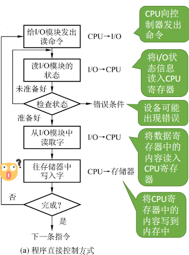
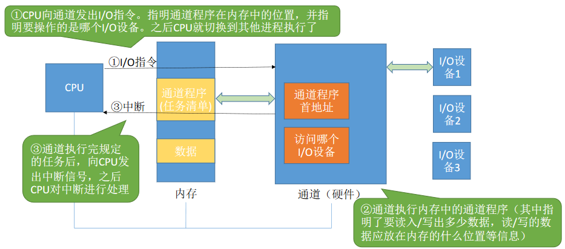
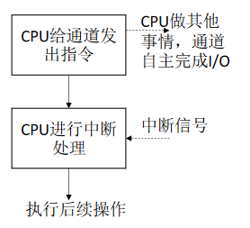
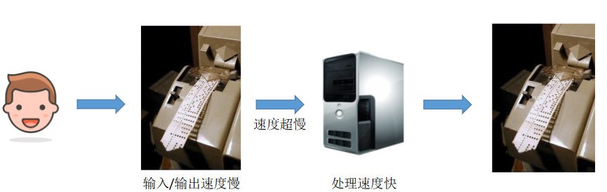
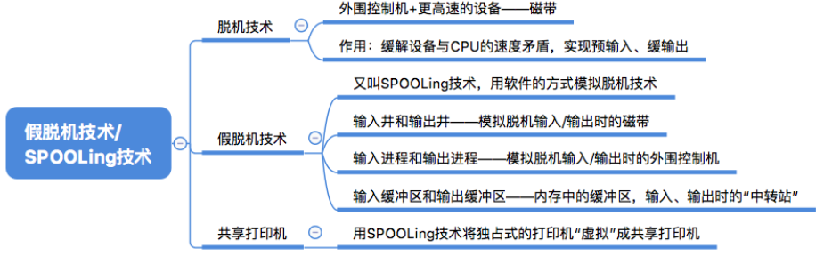
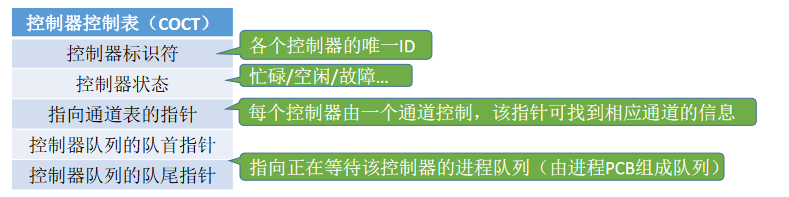
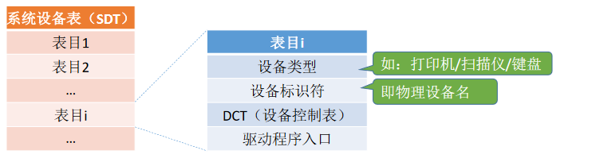
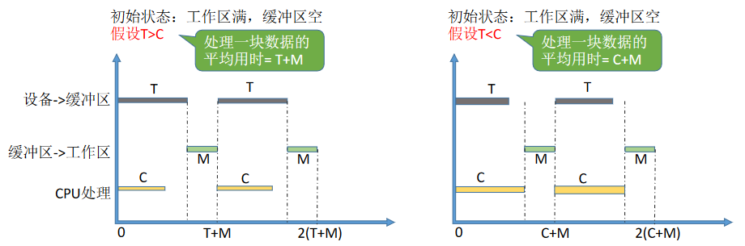
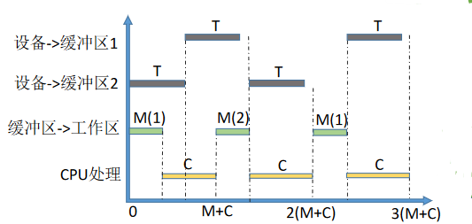

# 5.IO设备

# I/O设备的基本概念和分类

## 什么是I/O设备

“I/O”就是“输入/输出”（Input/Output）I/O设备就是可以将数据输入到计算机，或者可以接收计算机输出数据的外部设备，属于计算机中的硬件部件。

UNIX系统将外部设备抽象为一种特殊的文件，用户可以使用与文件操作相同的方式对外部设备进行操作。

- Write操作：向外部设备写出数据
- Read操作：从外部设备读入数据

## 按使用特性分类

## 按传输速率分类

## 按信息交换的单位分类

## 总结

# I/O控制器

## I/O设备的机械部件

I/O设备的**机械部件**主要用来执行具体I/O操作。

如我们看得见摸得着的鼠标/键盘的按钮；显示器的LED屏；移动硬盘的磁臂、磁盘盘面。

I/O设备的**电子部件**通常是一块插入主板扩充槽的印刷电路板。

CPU**无法直接控制**I/O设备的机械部件，因此I/O设备还要有一个**电子部件**作为CPU和I/O设备机械部件之间的“**中介**”，用于实现CPU对设备的控制。

这个电子部件就是**I/O控制器**，又称设备控制器。CPU可控制I/O控制器，又由I/O控制器来控制设备的机械部件。

如CPU发来的read/write命令，I/O控制器中会有相应的**控制寄存器**来存放命令和参数

I/O控制器中会有相应的**状态寄存器**，用于记录I/O设备的当前状态。如：1表示空闲，0表示忙碌

I/O控制器中会设置相应的**数据寄存器**。输出时，数据寄存器用于暂存CPU发来的数据，之后再由控制器传送设备。输入时，数据寄存器用于暂存设备发来的数据，之后CPU从数据寄存器中取走数据。

类似于内存的地址，为了区分设备控制器中的各个寄存器，也需要给各个**寄存器**设置一个特定的“**地址**”。I/O控制器通过CPU提供的“地址”来判断CPU要读/写的是哪个寄存器

> 这些寄存器是在I/O控制器上的

## I/O控制器的组成

**CPU与控制器的接口**

用于实现CPU与控制器之间的通信。
通过**控制线**发出命令；
通过**地址线**指明要操作的设备；
通过**数据线**来取出（输入）数据，或放入（输出）数据

数据寄存器、控制寄存器、状态寄存器可能有多个（如：每个控制/状态寄存器对应一个具体的设备），且这些寄存器都要有相应的地址，才能方便CPU操作。有的计算机会让这些寄存器占用内存地址的一部分，称为**内存映像I/O**；另一些计算机则采用**I/O专用地址**，即寄存器独立编址。

**I/O逻辑**

负责接收和识别CPU的各种命令（如地址译码），并负责对设备发出命令

**控制器与设备的接口**

用于实现控制器与设备之间的通信，一个I/O控制器可能会对应多个设备；

输出数据流向：CPU → 数据寄存器 → I/O逻辑 → 控制器与设备接口 → 设备

## 内存映像I/O vs 寄存器独立 编址

**内存映射I/O。**控制器中的寄存器与内存地址统一编址

**优点**：简化了指令。可以采用对内存进行操作的指令来对控制器进行操作，只需要指明寄存器的地址。

**寄存器独立编制**。控制器中的寄存器使用单独的地址

缺点：需要设置专门的指令来实现对控制器的操作，不仅要**指明寄存器的地址**，还要**指明控制器的编号**

## 总结

#  I/O控制方式

需要注意的问题：
1.完成一次读/写操作的流程；
2.CPU干预的频率；
3.数据传送的单位；
4.数据的流向；
5.主要缺点和主要优点。

## 程序直接控制方式

①CPU会在每个指令周期的末尾检查中断；

②中断处理过程中需要保存、恢复进程的运行环境，这个过程是需要一定时间开销的。可见，如果中断发生的频率太高，也会降低系统性能。

以读操作为例

## CPU干预的频率

很频繁，I/O操作开始之前、完成之后需要CPU介入，并且在等待I/O完成的过程中CPU需要不断地**轮询**检查。

### 数据传送的单位

每次读/写**一个字**

### 数据的流向

读操作（数据输入）：I/O设备 → CPU → 内存
写操作（数据输出）：内存 → CPU → I/O设备
每个字的读/写都需要CPU的帮助

### 主要缺点和主要优点

**优点**：实现简单。在读/写指令之后，加上实现循环检查的一系列指令即可（因此才称为“程序直接控制方式”）

**缺点**：CPU和I/O设备只能串行工作，CPU需要一直轮询检查，长期处于“忙等”状态，CPU利用率低

## 中断驱动方式

### 读写流程

引入**中断机制**。由于I/O设备速度很慢，因此在CPU发出读/写命令后，可将**等待I/O的进程阻塞**，先切换到别的进程执行。当I/O完成后，控制器会向CPU发出一个中断信号，CPU**检测到中断信号后**，会保存当前进程的运行环境信息，转去执行中断处理程序处理该中断。处理中断的过程中，CPU从I/O控制器读一个字的数据传送到CPU寄存器，再写入主存。接着，**CPU恢复等待I/O的进程（或其他进程）的运行环境，然后继续执行。**

①CPU会在每个指令周期的末尾检查中断；

②中断处理过程中需要保存、恢复进程的运行环境，这个过程是需要一定时间开销的。可见，如果中断发生的频率太高，也会降低系统性能。

### CPU干预的频率

每次I/O操作开始之前、完成之后需要CPU介入。等待I/O完成的过程中CPU可以切换到别的进程执行。

### 数据传送的单位

每次读/写一个字

### 数据的流向

读操作（数据输入）：I/O设备 → CPU → 内存
写操作（数据输出）：内存 → CPU → I/O设备

### 优缺点

**优点**：与“程序直接控制方式”相比，在“中断驱动方式”中，I/O控制器会通过中断信号主动报告I/O已完成，CPU**不再需要不停地轮询**。CPU和I/O设备可并行工作，CPU利用率得到明显提升。

**缺点**：每个字在I/O设备与内存之间的传输，都需要经过CPU。而频繁的中断处理会消耗较多的CPU时间。

## DMA方式

与“中断驱动方式”相比，DMA方式（Direct Memory Access，直接存储器存取。主要用于块设备的I/O控制）有这样几个改进：
①数据的**传送单位是“块”**。不再是一个字、一个字的传送；
②**数据的流向**是从设备直接放入内存，或者从内存直接到设备。**不再需要CPU**作为“快递小哥”。
③仅在传送一个或多个数据块的开始和结束时，才需要CPU干预。

DR（DataRegister，数据寄存器）：暂存从设备到内存，或从内存到设备的数据。
MAR（Memory Address Register，内存地址寄存器）：在输入时，MAR表示数据应放到内存中的什么位置；输出时MAR表示要输出的数据放在内存中的什么位置。
DC（DataCounter，数据计数器）：表示剩余要读/写的字节数。
CR（Command Register，命令/状态寄存器）：用于存放CPU发来的I/O命令，或设备的状态信息。

### 读写流程

CPU指明此次要进行的操作（如：读操作），并说明要读入多少数据、数据要存放在内存的什么位置、数据在外部设备上的地址（如：在磁盘上的地址）

控制器会根据CPU提出的要求完成数据的读/写工作，整块数据的传输完成后，才向CPU发出中断信号

### CPU干预的频率

仅在传送一个或多个数据块的开始和结束时，才需要CPU干预。

### 数据传送的单位

每次读/写**一个或多个块**（注意：每次读写的**只能是连续的**多个块，且这些块读入内存后**在内存中也必须是连续的**）

### 数据的流向

读操作（数据输入）：I/O设备 → 内存
写操作（数据输出）：内存 → I/O设备

### 优缺点

**优点**：数据传输以“块”为单位，CPU介入频率进一步降低。数据的传输不再需要先经过CPU再写入内存，数据传输效率进一步增加。CPU和I/O设备的并行性得到提升。

**缺点**：CPU每发出一条I/O指令，**只能读/写一个或多个连续的数据块**。如果要读/写多个离散存储的数据块，或者要将数据分别写到不同的内存区域时，CPU要分别发出多条I/O指令，进行多次中断处理才能完成。

## 通道控制方式

**通道**：一种**硬件**，可以理解为是“**弱鸡版的CPU**”。通道可以识别并执行一系列**通道指令**

与CPU相比，通道可以执行的指令很单一，并且通道程序是放在主机内存中的，也就是说通道与CPU共享内存

> 通道在执行任务的过程中，属不属于一个进程在跑呢？
>
> 我觉得应该算是，然后由于CPU的并发性，这个进程会和其他进程一起跑。

### 读写流程

### CPU干预的频率

极低，通道会根据CPU的指示执行相应的通道程序，只有完成一组数据块的读/写后才需要发出中断信号，请求CPU干预。

### 数据传送的单位

每次读/写一组数据块

### 数据的流向

读操作（数据输入）：I/O设备 → 内存
写操作（数据输出）：内存 → I/O设备

### 优缺点

缺点：实现复杂，需要专门的通道硬件支持
优点：CPU、通道、I/O设备可**并行工作**，资源利用率很高。

## 总结

# I/O软件层次结构

越上面的层次越接近用户，越下面的层次越接近硬件（由机械部分和电子部分组成）

每一层会利用其下层提供的服务，实现某些功能，并屏蔽实现的具体细节，向高层提供服务（“封装思想”）

**中间三层**属于操作系统的内核部分；即“I/O系统”；或称“I/O核心子系统”

**上四层**属于I/O软件的层次

## 用户层软件

用户层软件实现了与用户交互的接口，用户可直接使用该层提供的、与I/O操作相关的**库函数**对设备进行操作

例：`printf("hello world!")`

用户层软件将用户请求翻译成格式化的I/O请求，并通过“**系统调用**”请求操作系统内核的服务

例：`printf(“hello,world!”);`会被翻译成等价的write系统调用，当然，用户层软件也会在系统调用时填入相应**参数**（比如要打印输出的内容）。

Windows操作系统向外提供的一系列系统调用，但是由于系统调用的格式严格，使用麻烦，因此在用户层上封装了一系列更方便的库函数接口供用户使用（WindowsAPI）

## 设备独立性软件

**设备独立性软件**，又称**设备无关性软件**。与设备的硬件特性无关的功能几乎都在这一层实现。

主要实现的功能：
①向上层提供统一的调用接口（如read/write系统调用）
②设备的保护：原理类似与文件保护。设备被看做是一种特殊的文件，不同用户对各个文件的**访问权限**是不一样的，同理，对设备的访问权限也不一样
③差错处理：设备独立性软件需要对一些设备的错误进行处理
④设备的分配与回收
⑤数据缓冲区管理：可以通过缓冲技术屏蔽设备之间数据交换单位大小和传输速度的差异
⑥建立逻辑设备名到物理设备名的映射关系；根据设备类型选择调用相应的驱动程序

用户或用户层软件发出I/O操作相关系统调用的系统调用时，需要指明此次要操作的I/O设备的逻辑设备名（eg：去学校打印店打印时，需要选择打印机1/打印机2/打印机3，其实这些都是**逻辑设备名**）

设备独立性软件需要通过“**逻辑设备表**（LUT，Logical Unit Table）”来确定逻辑设备对应的**物理设备**，并找到该设备对应的**设备驱动程序**

操作系统系统可以采用两种方式管理**逻辑设备表**（LUT）：

第一种方式，整个系统只设置一张LUT，这就意味着所有用户不能使用相同的逻辑设备名，因此这种方式只适用于单用户操作系统。

第二种方式，为每个用户设置一张LUT，各个用户使用的逻辑设备名可以重复，适用于多用户操作系统。系统会在用户登录时为其建立一个用户管理进程，而LUT就存放在用户管理进程的PCB中。

> **思考：为什么不同类型的I/O设备需要有不同的驱动程序处理？**
>
> 各式各样的设备，外形不同，其内部的电子部件（I/O控制器）也有可能不同
>
> 不同设备的内部硬件特性也不同，这些特性只有厂家才知道，因此厂家须提供与设备相对应的驱动程序，CPU执行驱动程序的指令序列，来完成设置设备寄存器，检查设备状态等工作

## 设备驱动程序

主要负责对硬件设备的具体控制，将上层发出的一系列命令（如read/write）转化成特定设备“能听得懂”的一系列操作。包括设置设备寄存器；检查设备状态等

不同设备硬件特性不同，因此需要提供相对应的驱动程序

> 驱动程序一般会以一个独立进程的方式存在。

## 中断处理程序

当I/O任务完成时，I/O控制器会发送一个**中断信号**，系统会**根据中断信号类型**找到相应的**中断处理程序**并执行。中断处理程序的处理流程如下：

- 用户通过调用用户层软件提供的库函数发出的I/O请求
- 用户层软件通过“系统调用”请求设备独立性软件层的服务
- 设备独立性软件层根据LUT调用设备对应的驱动程序
- 驱动程序向I/O控制器发出具体命令
- 等待I/O完成的进程应该被阻塞，因此需要进程切换，而进程切换必然需要中断处理

## 总结

理解并记住I/O软件各个层次之间的**顺序**，要能够推理判断某个处理应该是在哪个层次完成的（最常考的是设备独立性软件、设备驱动程序这两层。只需理解一个特点即可：**直接涉及到硬件**具体细节、且**与中断无关**的操作肯定是在**设备驱动程序层**完成的；**没有涉及硬件**的、对各种设备都需要进行的**管理工作**都是在**设备独立性软件**层完成的

# I/O核心子系统

I/O核心子系统要实现的功能其实就是中间三层要实现的功能（参考上节）

需要重点理解和掌握的功能是：I/O调度、设备保护、假脱机技术（SPOOLing技术）、设备分配与回收、缓冲区管理（即缓冲与高速缓存）

## 这些功能要在哪个层次实现？

注：假脱机技术（SPOOLing技术）需要请求“磁盘设备”的设备独立性软件的服务，因此一般来说假脱机技术是在用户层软件实现的。但是408大纲又将假脱机技术归为“I/O核心子系统”的功能，因此考试时还是以大纲为准

**I/O调度**：用某种算法确定一个好的顺序来处理各个I/O请求。

> 如：磁盘调度（先来先服务算法、最短寻道优先算法、SCAN算法、C-SCAN算法、LOOK算法、C-LOOK算法）。当多个磁盘I/O请求到来时，用某种调度算法确定满足I/O请求的顺序。

同理，打印机等设备也可以用先来先服务算法、优先级算法、短作业优先等算法来确定I/O调度顺序。

**文件保护功能**，不同的用户对各个文件有不同的访问权限（如：只读、读和写等）。在UNIX系统中，**设备被看做是一种特殊的文件**，每个设备也会有对应的FCB。当用户请求访问某个设备时，系统根据FCB中记录的信息来判断该用户是否有相应的访问权限，以此实现“设备保护”的功能。（参考“文件保护”小节）

# 假脱机技术

SPOOLing技术

## 什么是脱机技术

> 为什么称为“脱机”——脱离主机的控制进行的输入/输出操作。

手工操作阶段：主机直接从I/O设备获得数据，由于设备速度慢，主机速度很快。人机速度矛盾明显，主机要浪费很多时间来等待设备

批处理阶段引入了脱机输入/输出技术（用磁带完成）：引入脱机技术后，缓解了CPU与慢速I/O设备的速度矛盾。另一方面，**即使CPU在忙碌**，也可以提前将数据输入到磁带；**即使慢速的输出设备正在忙碌**，也可以提前将数据输出到磁带。

## 输入井和输出井

假脱机技术”，又称“SPOOLing技术”是用软件的方式模拟脱机技术。SPOOLing系统的组成如下：

**输入进程**：模拟脱机输入时的外围控制机，从设备中读取数据到磁盘
**输出进程**：模拟脱机输出时的外围控制机，从磁盘中取出数据输入到设备

在输入进程的控制下，“**输入缓冲区**”用于暂存从输入设备输入的数据，之后再转存到输入井中

在输出进程的控制下，“**输出缓冲区**”用于暂存从输出井送来的数据，之后再传送到输出设备上

**输入井**：用于收容I/O设备输入的数据
**输出井**：收容用户进程输出的数据
输入井和输出井存在于磁盘

要实现SPOOLing技术，**必须要有多道程序技术**的支持。系统会建立“输入进程”和“输出进程”。

## 共享打印机原理分析

**独占式设备**——只允许各个进程串行使用的设备。一段时间内只能满足一个进程的请求。

**共享设备**——允许多个进程“同时”使用的设备（宏观上同时使用，微观上可能是交替使用）。可以同时满足多个进程的使用请求。

打印机是种“独占式设备”，但是可以用SPOOLing技术改造成“共享设备”

独占式设备的例子：若进程1正在使用打印机，则进程2请求使用打印机时必然阻塞等待

当多个用户进程提出输出打印的请求时，系统会答应它们的请求，但是并不是真正把打印机分配给他们，而是由假脱机管理进程为每个进程做两件事：

（1）在磁盘输出井中为进程申请一个空闲缓冲区（也就是说，这个缓冲区是在磁盘上的），并将要打印的数据送入其中；

（2）为用户进程申请一张空白的**打印请求表**，并将用户的打印请求填入表中

> 打印请求表：其实就是用来说明用户的打印数据存放位置等信息的

再将该表挂到假**脱机文件队列**上。

当打印机空闲时，输出进程会从文件队列的队头取出一张打印请求表，并根据表中的要求将要打印的数据从输出井传送到输出缓冲区，再输出到打印机进行打印。用这种方式可依次处理完全部的打印任务

> 要打印的数据流向：用户进程 → 输出井 → 输出缓冲区 → 打印机
>
> 在打印数据放到输出井之前，要创建打印请求表，挂到假脱机文件队列上
>
> 在打印数据从输出井取出前，要等待打印机空闲，从假脱机文件队列上取出打印请求表，根据该表找到输出井的打印数据。

虽然系统中只有一个台打印机，但每个进程提出打印请求时，系统都会为在输出井中为其分配一个存储区（相当于分配了一个逻辑设备），使每个用户进程都觉得自己在独占一台打印机，从而实现对打印机的共享。

SPOOLing技术可以把一台物理设备**虚拟**成逻辑上的多台设备，**可将独占式设备改造成共享设备**。

## 总结

# 设备的分配与回收

## 设备分配时应考虑的因素

设备的**固有属性**可分为三种：独占设备、共享设备、虚拟设备。

**独占设备**：一个时段只能分配给一个进程（如打印机）

**共享设备**：可同时分配给多个进程使用（如磁盘），各进程往往是宏观上同时共享使用设备，而微观上交替使用。

**虚拟设备**：采用SPOOLing技术将独占设备改造成虚拟的共享设备，可同时分配给多个进程使用（如采用SPOOLing技术实现的共享打印机）

设备的分配算法：

- 先来先服务
- 优先级高者优先
- 短任务优先

从进程运行的安全性上考虑，设备分配有两种方式：

**安全分配方式**：为进程分配一个设备后就将进程阻塞，本次I/O完成后才将进程唤醒。（eg：考虑进程请求打印机打印输出的例子）

一个时段内每个进程只能使用一个设备

**优点**：破坏了“请求和保持”条件，不会死锁
**缺点**：对于一个进程来说，CPU和I/O设备只能串行工作

**不安全分配方式**：进程发出I/O请求后，系统为其分配I/O设备，进程可继续执行，之后还可以发出新的I/O请求。只有某个I/O请求得不到满足时才将进程阻塞。

一个进程可以同时使用多个设备

**优点**：进程的计算任务和I/O任务可以并行处理，使进程迅速推进
**缺点**：有可能发生死锁（死锁避免、死锁的检测和解除）

## 静态分配和动态分配

静态分配：进程运行前为其分配全部所需资源，运行结束后归还资源(破坏了“请求和保持”条件，不会发生死锁)

动态分配：进程运行过程中动态申请设备资源

## 设备分配管理中的数据结构

“设备、控制器、通道”之间的关系：一个通道可控制多个设备控制器，每个设备控制器可控制多个设备。

**设备控制表（DCT）**：系统为每个设备配置一张DCT，用于记录设备情况

进程管理”章节中曾经提到过“系统会根据阻塞原因不同，将进程PCB挂到不同的阻塞队列中”，**设备队列的队首指针**

**控制器控制表（COCT）**：每个设备控制器都会对应一张COCT。操作系统根据COCT的信息对控制器进行操作和管理。

**通道控制表（CHCT）**：每个通道都会对应一张CHCT。操作系统根据CHCT的信息对通道进行操作和管理。

**系统设备表（SDT）**：记录了**系统中全部设备**的情况，每个设备对应一个表目

用户用设备名请求设备时，操作系统可根据SDT找到该设备。

## 设备分配的步骤

①根据进程请求的**物理设备名**查找**SDT**（注：物理设备名是进程请求分配设备时提供的**参数**）

②根据SDT找到**设备控制表DCT**，若设备忙碌则将进程PCB挂到设备等待队列中，不忙碌则将设备分配给进程。

③根据DCT找到**控制器控制表COCT**，若控制器忙碌则将进程PCB挂到控制器等待队列中，不忙碌则将控制器分配给进程。

④根据COCT找到**通道控制表CHCT**，若通道忙碌则将进程PCB挂到通道等待队列中，不忙碌则将通道分配给进程。

只有设备、控制器、通道三者都分配成功时，这次设备分配才算成功，之后便可启动I/O设备进行数据传送

## 分配步骤的改进

缺点：

①用户编程时必须使用“物理设备名”，底层细节对用户不透明，不方便编程
②若换了一个物理设备，则程序无法运行
③若进程请求的物理设备正在忙碌，则即使系统中还有同类型的设备，进程也必须阻塞等待

改进方法：建立逻辑设备名与物理设备名的映射机制，用户编程时只需提供逻辑设备名

①根据进程请求的**逻辑设备名**查找SDT（注：用户编程时提供的逻辑设备名其实就是“**设备类型**”）
②查找SDT，找到用户进程指定类型的、并且空闲的设备，将其分配给该进程。**操作系统在逻辑设备表（LUT）中新增一个表项**。
③根据DCT找到COCT，若控制器忙碌则将进程PCB挂到控制器等待队列中，不忙碌则将控制器分配给进程。
④根据COCT找到CHCT，若通道忙碌则将进程PCB挂到通道等待队列中，不忙碌则将通道分配给进程

逻辑设备表（LUT）建立了逻辑设备名与物理设备名之间的**映射关系**。

某用户进程第一次使用设备时使用逻辑设备名向操作系统发出请求，操作系统根据用户进程指定的设备类型（逻辑设备名）查找系统设备表，找到一个空闲设备分配给进程，并在LUT中增加相应表项。

如果之后用户进程再次通过相同的逻辑设备名请求使用设备，则操作系统通过LUT表即可知道用户进程实际要使用的是哪个**物理设备**了，并且也能知道该设备的**驱动程序入口地址**。

逻辑设备表的设置问题：

整个系统只有一张LUT：各用户所用的逻辑设备名不允许重复，适用于单用户操作系统
每个用户一张LUT：不同用户的逻辑设备名可重复，适用于多用户操作系统

## 总结

# 缓冲区管理

## 什么是缓冲区？

缓冲区是一个存储区域，可以由专门的硬件寄存器组成，也可利用内存作为缓冲区。

使用**硬件作为缓冲区**的**成本高**，**容量小**，一般仅用在对速度要求非常高的场合（如存储器管理中所用的联想寄存器（快表），由于对页表的访问频率极高，因此使用速度很快的联想寄存器来存放页表项的副本）

一般情况下，更多的是利用**内存作为缓冲区**，“设备独立性软件”的缓冲区管理就是要组织管理好这些缓冲区

## 缓冲区的作用

>  缓冲区没满之前，CPU可以做别的事，这就是为什么IO慢的原因！

## 单缓冲

假设某用户进程请求某种块设备读入若干块的数据。若采用**单缓冲**的策略，操作系统会**在主存中为其分配一个缓冲区**（若题目中没有特别说明，一个缓冲区的大小就是一个块）。

**注意**：当缓冲区数据非空时，不能往缓冲区冲入数据，只能从缓冲区把数据传出；当缓冲区为空时，可以往缓冲区冲入数据，**但必须把缓冲区充满以后**，才能从缓冲区把数据传出。

CMT是对应操作的耗时，假设T > C

>
> 常考题型：计算每处理一块数据平均需要多久
>
> 假定一个初始状态，分析下次到达相同状态需要多少时间，这就是处理一块数据平均所需时间。
>
> 在“单缓冲”题型中，可以假设初始状态为工作区满，缓冲区空。

T>C，因此CPU处理完数据后暂时不能将下一块数据传送到工作区，必须等待缓冲区中冲满数据

T<C，因此缓冲区中冲满数据后暂时不能继续冲入下一块数据，必须等待CPU处理结束后将数据从缓冲区传送到工作区

**结论：采用单缓冲策略，处理一块数据平均耗时Max(C,T)+M**

## 双缓冲

假设某用户进程请求某种块设备读入若干块的数据。若采用双缓冲的策略，操作系统会在主存中为其分配两个缓冲区（若题目中没有特别说明，一个缓冲区的大小就是一个块）

双缓冲题目中，假设初始状态为：工作区空，其中一个缓冲区满，另一个缓冲区空

假设T>C+M，**平均用时：T**

开始时，缓冲1满，因此可以往工作区填数据，同时缓冲区2空，可用往里边填数据

假设T<C+M：平均耗时C+M

假设2T<2M+C，则I/O设备将缓冲区1冲满时，缓冲区2的数据尚未取空，因此I/O设备暂时不能冲入数据

总之，T<C+M意味着设备输入数据块的速度要比处理机处理数据块的速度更快。

**结论：采用双缓冲策略，处理一个数据块的平均耗时为Max(T,C+M)**

## 使用单/双缓冲在通信时的区别

两台机器之间通信时，可以配置缓冲区用于数据的发送和接受。

A机要发送的数据要先放入A机缓冲区中，等缓冲区满时将数据发出

B机的缓冲区用于接受数据，B机的将缓冲区中的数据全部取走后，才能向A机发送数据

显然，若两个相互通信的机器**只设置单缓冲区**，在任一时刻只能实现数据的**单向传输**。

> 因为它们的缓冲区既要用来存储接收数据也要用于存储发送数据

若两个相互通信的机器设置双缓冲区，则同一时刻可以实现双向的数据传输。

注：管道通信中的“管道”其实就是缓冲区。要实现数据的双向传输，必须设置两个管道

## 循环缓冲区

将多个大小相等的缓冲区链接成一个循环队列。注：以下图示中，橙色表示已充满数据的缓冲区，绿色表示空缓冲区。

## 缓冲池

**缓冲池**由系统中共用的缓冲区组成。这些缓冲区按使用状况可以分为：空缓冲队列、装满输入数据的缓冲队列（输入队列）、装满输出数据的缓冲队列（输出队列）。

另外，根据一个缓冲区在实际运算中扮演的功能不同，又设置了四种工作缓冲区：
用于收容输入数据的工作缓冲区（hin）
用于提取输入数据的工作缓冲区（sin）
用于收容输出数据的工作缓冲区（hout）
用于提取输出数据的工作缓冲区（sout）

从输入队列中取得一块冲满输入数据的缓冲区作为“提取输入数据的工作缓冲区（sin）”。**缓冲区读空后挂到空缓冲区队列**

①**输入进程请求输入数据**：从空缓冲队列中取出一块（**队头**）作为收容输入数据的工作缓冲区（hin）。冲满数据后将缓冲区挂到输入队列队尾

②**计算进程想要取得一块输入数据**：从输入队列中取得一块冲满输入数据的缓冲区作为“提取输入数据的工作缓冲区（sin）”。**缓冲区读空后**挂到**空缓冲区队列队尾**

③**计算进程想要将准备好的数据冲入缓冲区**：从空缓冲队列中取出一块作为“收容输出数据的工作缓冲区（hout）”。**数据冲满后**将缓冲区挂到**输出队列队尾**

④**输出进程请求输出数据**：从输出队列中取得一块冲满输出数据的缓冲区作为“提取输出数据的工作缓冲区（sout）”。**缓冲区读空后**挂到**空缓冲区队列**

## 总结

