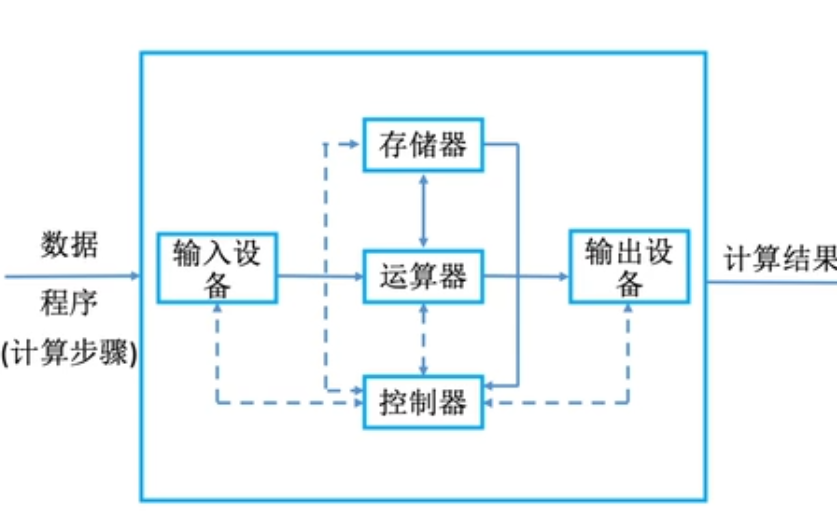
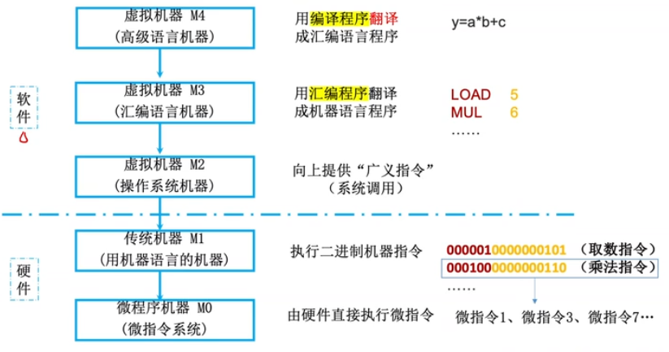
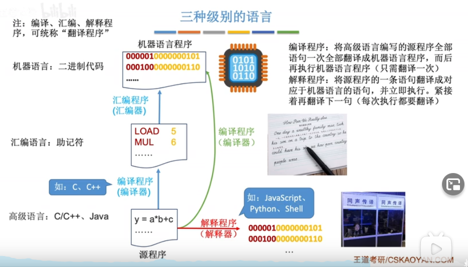

# 计算机发展历程

https://www.bilibili.com/video/BV1BE411D7ii?p=7

### 什么是计算机系统

计算机系统=硬件+软件

### 硬件的发展

第一代：电子管

第二代：晶体管

第三代：中小规模集成电路时代

第四代：大规模、超大规模集成电路时代

### 目前的发展趋势

更微型、多用途

更巨型、超高速


# 计算机硬件的基本组成

最早的计算机 ENIAC 需要手动接线来控制计算

存储程序的概念：将指令以二进制代码的形式事先输入计算机的主存储器，然后按其在存储器中的首地址执行程序的第一条指令，以后就按程序的规定顺序执行其他指定，直到指令执行结束。




冯诺依曼计算机结构的特点：

- 输入的是指令和数据

- 指令和数据以同等地位存于存储器，可按地址寻访

- 数据可以转换为二进制，指令也可以用二进制表示。

- 指令由操作码和地址码组成，操作码就是加减乘除的二进制，地址码就是要处理的数据在内存中什么地址。

- 运算器是冯诺依曼结构的核心。


现代计算机结构


以存储器为中心

CPU=运算器+控制器


主存：就是内存

辅存：就是硬盘，属于一种I/O设备

## 主存储器


主存储器简称主存，包括存储体和MAR、MDR

MAR(Memory Address Register): 存储地址寄存器

MDR(Memory Data Register): 存储数据寄存器

读数据时：MAR 根据地址去存储体找到你要的数据，然后通过MDR给你。

写数据时：告诉MAR要写到哪里，把数据放到MDR里。然后主存储器根据MAR和MDR把数据放到存储体里。

**存储单元**

存储单元：每个存储单元存放一串二进制代码

存储字（word)：存储单元中二进制代码的组合

存储字长：存储单元中二进制代码的位数

存储元：即存储二进制的电子元件，每个存储元可以存1bit


MAR的位数反映存储单元的个数：

比如MAR有4位，那就一共有2^4=16个存储单元，如果一个单元是8位，也就是MDR=8位。那主存储器就一共能存16*8=128个bit的信息。

## 运算器


用来实现算术运算（加减乘除），逻辑运算（与或非）

ACC(Accumulator)：累加器，用于存放操作数，或运算结果。

MQ(Multiple-Quotient Register)：乘商寄存器，在乘、除运算时，用于存放操作数或运算结构。

X(Arithmetic and Logic Unit)：通用的操作数寄存器，用于存放操作数

ALU(Algorithm Logic Unit)：算术逻辑单元，通过内部复杂的电路实现算数运算、逻辑运算。(计算成本最高)

## 控制器


CU(Control Unit) 控制单元：分析指令，给出控制信号

IR(Instruction Register) 指令寄存器：存放当前执行的指令

PC(Program Counter) 程序计数器：存放下一条指令的地址，有自动+1功能。

完成一条指令的流程：

- 取指令 从PC提取指令放到IR里
- 分析指令 IR
- 执行指令 CU

## 计算机的工作过程

首先，程序员写了下面这样的代码

```c
int a = 2, b = 3, c = 1, y = 0;
void main() {
    y=a*b+c
}
```

通过编译器，把这串代码编译成下面这样


首先，指令和数据都存放在主存储器里的存储体内。


(PC)=0，开始时，控制器内的PC(程序计数器)指向主存地址的0号位置。

(PC)->MAR，导致(MAR)=0，注意这个0的意思是地址。

M(MAR)->MDR，导致(MDR)=000001 0000 000101

(MDR)->IR，导致(IR)=000001 0000 000101

OP(IR)->CU，指令的**操作码**送到CU，CU分析后得知，这是“**取数**”指令。

Ad(IR)->MAR，指令的**地址码**送到MAR，导致(MAR)=5

M(MAR)->MDR，导致(MDR)=0000 0000 0000 0010，也就是a=2

(MDR)->ACC，导致(ACC)=0000 0000 0000 0010

以上执行完毕后，接着执行下一条指令，此时(PC)=1，(ACC)=2：

(PC)->MAR, (MAR)=1

M(MAR)->MDR, (MDR)=000100 0000000110

(MDR)->IR, (IR)=000100 0000000110

OP(IR)->CU, 指令的**操作码**送到CU，CU分析后得知，这是“**乘法**”指令

Ad(IR)->MAR，指令的**地址码**送到MAR，导致(MAR)=6

M(MAR)->MDR，导致(MDR)=0000 0000 0000 0011=3=b

MDR->MQ，(MQ)=0000 0000 0000 0011=3=b

(ACC)->X, (X)=2

(MQ)×(X)->ACC，由ALU实现乘法运算，使得(ACC)=6，如果乘积太大，则需要MQ辅助存储

**此时，(PC)=2，(ACC)=6**

(PC)->MAR, (MAR)=2

M(MAR)->MDR, (MDR)=000011 0000000111

(MDR)->IR, (IR)=000011 0000000111

OP(IR)->CU, 指令的**操作码**送到CU，CU分析后得知，这是“**加法**”指令

Ad(IR)->MAR，指令的**地址码**送到MAR，导致(MAR)=7

M(MAR)->MDR，导致(MDR)=0000 0000 0000 0001，也就是c=1

MDR->X，(X)=0000 0000 0000 0001

(ACC)+(X)->ACC, (ACC)=7，由ALU实现加法运算

**此时，(PC)=3，(ACC)=7**

(PC)->MAR, (MAR)=3

M(MAR)->MDR, (MDR)=000010 0000001000

(MDR)->IR, (IR)=000010 0000001000

OP(IR)->CU, 指令的**操作码**送到CU，CU分析后得知，这是“**存数**”指令，也就是说，要把ACC的数据，存储到地址码对应的存储单元中。

Ad(IR)->MAR，指令的**地址码**送到MAR，导致(MAR)=8

(ACC)->MDR，(MDR)=7

(MDR)->地址为8的存储单元，导致y=7 

**此时，(PC)=4，(ACC)=7**

(PC)->MAR, (MAR)=4

M(MAR)->MDR, (MDR)=000110 0000000000

(MDR)->IR, (IR)=000110 0000000000

OP(IR)->CU, 指令的**操作码**送到CU，CU分析后得知，这是“**停机**”指令。


总结：

取指令，和分析指令的步骤是基本一致的。

各种寄存器啥的，其实就是固定位数的2进制单元。比如MAR就是16位的，随时变化的，我现在理解寄存器就是，这个东西会经常变，但是在内存中的位置是不会变的。

有个疑问，比如说(PC)->(MAR)这步，是怎样实现的？是不是有条电路，连接了PC和MAR，然后激活，就把数据传过去了。

CU是如何分析指令的？

指令和数据以同等地位存于存储器，这个就很好理解，比如intel 8G的内存，在跑程序时，其实程序的代码是存在内存里的，程序创建的各种变量数据也存在内存。

# 计算机系统的层次结构


**微程序机器**

使用微指令系统，由硬件直接执行微指令

之前的例子，比如取数a=5到ACC内这个指令，就被划分成了更小的9个微指令。


**传统机器**

也就是使用机器语言的机器

```
000001 0000000101 （取数指令 把5取到ACC里)
000100 0000000110  (乘法指令 乘以6)
```

**汇编语言**

这两个显然不方便。这就出现了汇编语言，就是通过一些英文字符的形式替代了原本的01表示的机器语言。

```
LOAD 5 -> 000001 0000000101
MUL 5 -> 00010 0000000110
```


**高级语言**

java，C语言等，需要用编译程序翻译成汇编语言。


总结



主要关注硬件。

编译程序和解释程序的区别

- 编译程序：将高级语言编写的源程序全部语句一次全部翻译成机器语言程序，而后再执行机器语言程序
- 解释程序：将源程序的一条语句翻译成对应于机器语言的语句，并立即执行。紧接着再翻译下一句（每次执行都要翻译）



计算机体系结构与计算机组成原理的区别

| 计算机体系结构               | 计算机组成原理                   |
| ---------------------------- | -------------------------------- |
| 关注有无指令（如乘法指令）   | 关注如何实现指令（比如乘法指令） |
| 如何设计硬件与软件之间的接口 | 如何使用硬件实现所定义的接口     |

# 计算机的性能指标

MAR的位数反映存储单元的个数

MDR的位数表示每个存储单元的大小

总容量=MAR × MDR


## CPU的性能指标

CPU主频：3.6GHz，指挥CPU内部所有部件工作的节奏频率。

CPU时钟周期：单位是微秒，纳秒
$$
CPU主频=\frac{1}{CPU时钟周期}
$$
CPI(Clock cycle Per Instruction)：执行一条指令所需的时钟周期数

比如取数指令需要9个步骤，执行乘法指令需要11个步骤。不同的CPU实现一条指令，需要的CPI可能是不一样的。相同的指令，CPI可能也有变化。
$$
执行一条指令的耗时=CPI \times CPU时钟周期
$$

$$
CPU执行时间(整个程序耗时)=\frac{CPU时钟周期数}{主频}=\frac{指令条数\times CPI}{主频}
$$


IPS(Instructions Per Second)：每秒执行多少条指令
$$
IPS=\frac{主频}{平均CPI}
$$
FLOPS(Floating-point Operations Per Secoond): 每秒执行多少次浮点运算。

通常使用的时候在前面会加上单位：比如KFLOPS, MFLOPS, GIPS, TIPS

此处: K=10^3^ M=10^6^ G=10^9^ T=10^12^

例：某CPU主频为1000HZ，某程序包含100条指令，平均每条指令的CPI=3，则该程序在该CPU上执行需要多久？

## 系统整体的性能指标

数据通路带宽：数据总线一次所能并行传送信息的位数（各硬件部件通过数据总线传输数据）

吞吐量：系统在单位时间内处理请求的数量

响应时间：指从用户向计算机发送一个请求，到系统对该请求做出响应并获得它所需要的结果的等待时间。

通常包括CPU时间（运行一个程序所花费的时间）、等待时间（用于磁盘访问、存储器访问、I/O操作、操作系统开销等时间）。


**动态测试**

基准程序时用来测量计算机处理速度的一种实用程序，以便于被测量的计算机性能可以与运行相同程序的其他计算机性能进行比较。

