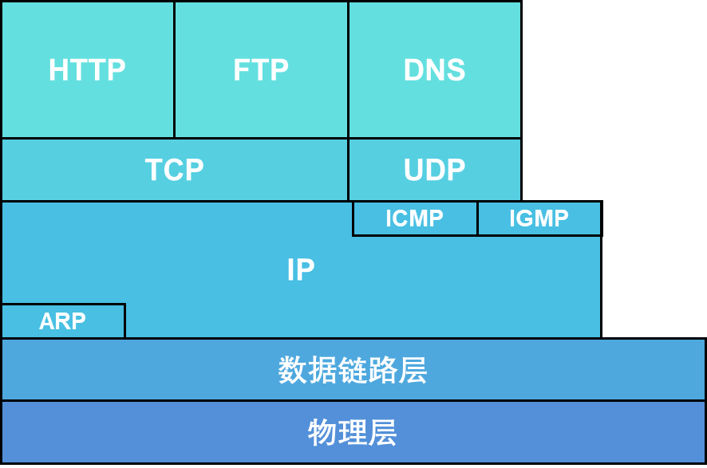

https://www.xuetangx.com/learn/SCUT08091000715/SCUT08091000715/4227198/video/6191494

# 基本概念

计算机网络是做什么的，主要是传数据的，发送方，接收方和中间商是计算机网络中的3个主要角色。怎么把我电脑上的数据准确无误的传到美国总统的电脑上，是计算机网络要解决的问题，解决这个问题采用的是分层的思想。OSI参考模型就分为：应用层，表示层，会话层，传输层，网络层，数据链路层，物理层

比如我要给美国总统发一封邮件，那这个邮件是怎么在网络中传输的我是不管的。我只负责写邮件，我就处于应用层。

我写完邮件后，就把数据传到下一层。

数据在各层中处理的数据对象就叫做PDU。

## 常见术语

**网络拓扑结构**

总线，星型是最常见的结构

**协议**

控制网络中的设备之间如何进行信息交换

**带宽**

bps：1秒多少比特

**吞吐量**

指实际的，可测量的带宽

**点到点**

比如实验室的电脑到路由器，两台电脑直接相连

**端到端**

类似虚连接，比如我的电脑和美国总统的电脑的连接。

**计算机网络的分类**

- PAN个人网
- LAN局域网
- MAN城域网
- WAN广域网
- Internet

**OSI和TCP/IP的区别**

- TCP的表示层和会话层被合并到应用层中了
- TCP的数据链路层和物理层被合并到网络接口层

**协议数据单元PDU**

- 信息（information，应用层）
- 数据流（Data Stream，上三层）
- 数据段（Segment，传输层）
- 分组（Packet，网络层）
- 帧（Frame，数据链路层）
- 比特流（Bits，物理层）

**服务、协议、接口之间的关系**

协议是作用于对等实体之间的，接口是上下层交互用的，每一层为上层提供服务。