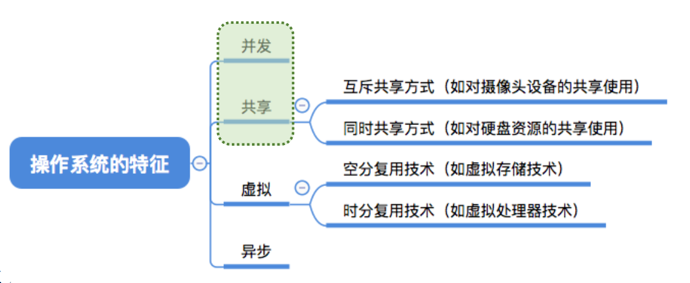
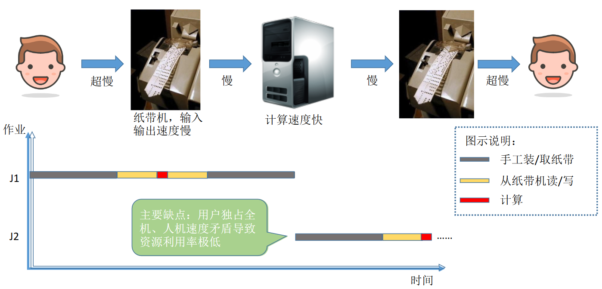
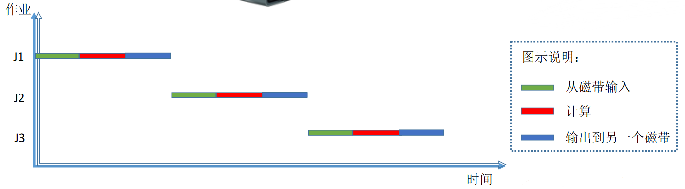
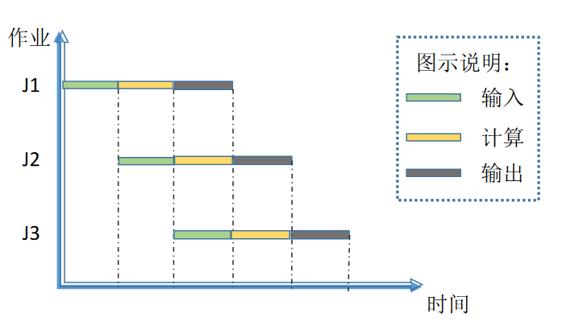
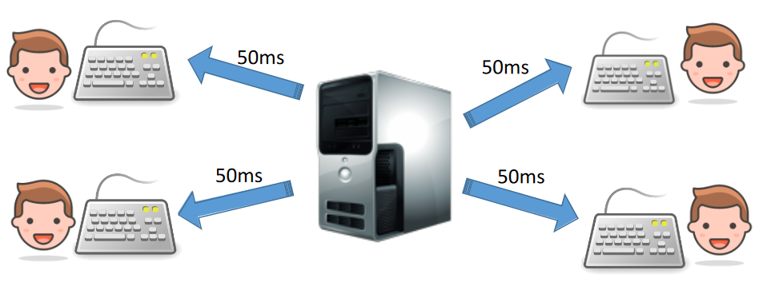
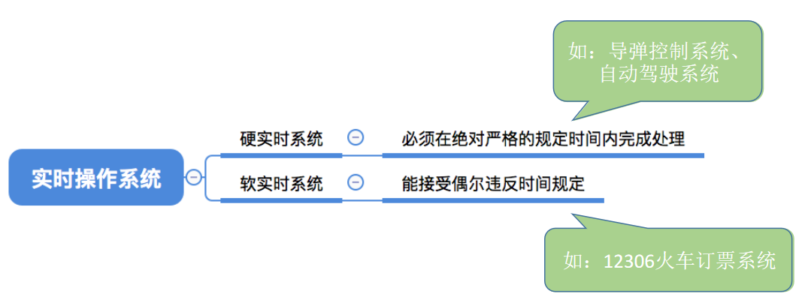
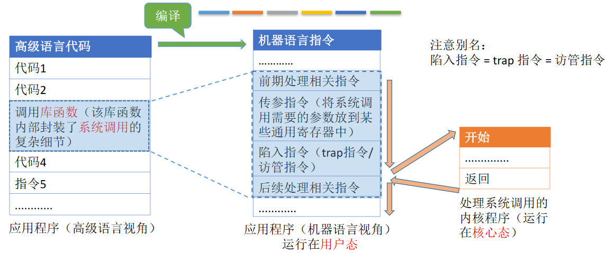

# 计算机系统概述

- Mac OS
- IOS
- Windows
- linux

## 操作系统的概念和定义

一台电脑的诞生

- 厂家组装一台**裸机**
- 出售前安装**操作系统**
- 用户安装**应用程序**
- **用户**使用QQ聊天

> **1. 操作系统是系统资源的管理者**
>
> 操作系统（Operating System, OS）是指控制和管理整个计算机系统的硬件和软件资源，并合理地组织调度计算机的工作和资源的分配
>
> **2. 向上层提供方便易用的服务**
>
> 提供给用户和其他软件方便的接口和环境
>
> **3. 最接近硬件的一层软件**
>
> 是计算机系统中最基本的系统软件 

## 操作系统的功能和目标

### 系统资源的管理者

> 系统资源的管理者

用QQ和朋友视频聊天的过程

- 找到QQ安装的位置（如 D:/Tencent/QQ/Bin）【**文件管理**】
- 双击打开QQ.exe【**存储器管理**】
  - 需要把该程序相关数据放入内存
- QQ程序正常运行【**处理机管理**】
  - 对应的进程被处理机（CPU）处理
- 开始和朋友视频聊天【**设备管理**】

### 向上层提供方便易用的服务

硬件只听得懂二进制指令，如：010010101010

在硬件之上安装了操作系统，操作系统对外暴露友好交互的接口。

> 汽车的例子，你不需要了解发动机的原理，只需要会踩油门

GUI（Graphical User Interface）简化了用户的理解难度。

联机命令接口：用户输入一条命令，系统执行一句

脱机命令接口：*.bat 文件，也就是**批处理命令接口**

程序接口：可以在程序中进行系统调用来使用程序接口。普通用户不能直接使用程序接口，只能通过程序代码间接使用。

### 最接近硬件的一层软件

需要实现对硬件机器的拓展

没有任何软件支持的计算机就是**裸机**，在裸机上安装操作系统，可以提供资源管理功能和方便用户的服务功能，将裸机改造成功能更强、使用更方便的机器。

通常把覆盖了软件的机器称为**扩充机器**，又称之为**虚拟机**。

> 类比汽车
>
> 发动机：只会转，轮胎：只会滚
>
> 在原始的硬件机器上覆盖一层传动系统：发动机带着轮子转（使原始的硬件机器得到拓展）
>
> 操作系统对硬件机器的拓展：将CPU、内存、磁盘、显示器、键盘灯硬件合理地组织起来，让各种硬件能够相互协调配合，实现更多更复杂的功能。

# 操作系统的四个特征

- 并发
- 共享
- 虚拟
- 异步

## 并发

并发和共享是两个最基本的特征，二者互为存在条件

**并发**：指两个或多个事件在同一时间间隔内发生。这些事件宏观上是同时发生的，微观上是交替发生的。

**并行**：指两个或多个事件在同一时刻同时发生。

操作系统就是伴随着“多道程序技术”而出现的。因此，操作系统和程序并发是一起诞生的。

**单核CPU**同一时刻只能执行一个程序，各个程序只能**并发**地执行

**多核CPU**同一时刻可以同时执行多个程序，多个程序可以**并行**地进行

## 共享

共享即资源共享，是指系统中的资源可供内存中多个并发执行的进程共同使用

共享的两种方式

- 互斥共享方式：一个时间段内只允许一个进程访问该资源
  - QQ和微信，同时间只能有一个进程使用摄像头
- 同时共享方式：允许一个时间段内由多个进程“同时”对它们进行访问
  - QQ和微信，同时进行文件传输，宏观上看，都在使用硬盘读取并发送文件，微观上看，两个进程是交替访问硬盘的。

## 并发和共享的关系

**并发性**指计算机系统中同时存在着多个运行着的程序。

**共享性**是指系统中的资源可供内存中多个并发执行的进程共同使用。

如果失去并发性，计算机只能运行一个系统，那就没必要共享了

如果失去共享性，不能同时访问硬盘资源，那就不能并发了。

## 虚拟

**虚拟**指把一个物理上的实体变为若干个逻辑上的对应物。物理实体（前者）是实际存在的，而逻辑上对应物（后者）是用户感受到的。

> 一个程序需要放入内存并给他分配CPU才能执行
>
> GTA5 需要4GB
>
> QQ需要256MB
>
> 迅雷需要256MB
>
> 网易云音乐需要256MB
>
> 电脑内存：4GB
>
> 问题：这些程序同时运行需要的内存远大于4GB，为何他们还可以在我的电脑上同时运行呢？
>
> 答案：这是虚拟存储器技术。实际只有4GB的内存，在用户看来似乎远远大于4GB

4GB的电脑内存为何能运行超过4GB的软件？

**虚拟存储器技术（空分复用技术）**：实际只有4GB的内存，在用户看来似乎远远大于4GB

单核CPU为何能同时运行多个程序？

**虚拟处理器技术（时分复用技术）**：实际上只有一个单核CPU，在用户看来似乎有6个CPU同时为自己服务。

## 异步

在多道程序环境下，允许多个程序并发执行，但由于资源有限，进程的执行不是一管到底的，而是走走停停，以不可预知的速度向前推进，这就是进程的异步性。

> 就是说，程序运行到一半，可能会阻塞。
>
> 比如程序A想用打印机，但是程序B正在用，那程序A就阻塞了。等程序B用完，程序A才能接着使用。

## 总结

# 操作系统的发展与分类

## 手工操作阶段

程序员用纸带机上打孔，把程序放到纸带机上

手工的工序太多了，很浪费时间。

## 批处理阶段

### 单道批处理系统

引入脱机输入/输出技术（用外围机+磁带完成），并由监督程序负责控制作业的输入、输出（操作系统的雏形）

> 优点：缓解了一定程度的人机速度矛盾，资源利用率有所提升。
>
> 缺点：内存中**仅能有一道程序运行**，只有该程序运行结束之后才能调入下一道程序。**CPU有大量的时间是在空闲等待I/O完成**。资源利用率依然很低。

不过节省了很多手工时间

### 多道批处理系统

之前的做法，输入设备忙碌的时候，计算设备是空闲的。希望它们都别闲着。

> 优点：多道程序**并发**执行，**共享**计算机资源。**资源利用率大幅提升**，CPU和其他资源更能保持“忙碌”状态，系统吞吐量增大。
>
> 缺点：用户响应时间长，**没有人机交互功能**（用户提交自己的作业之后就只能等待计算机处理完成，中间不能控制自己的作业执行。eg：无法调试程序/无法在程序运行过程中输入一些参数）

## 分时操作系统

分时操作系统：计算机以**时间片**为单位**轮流为各个用户/作业服务**，各个用户可通过终端与计算机进行交互。

> 优点：用户请求可以被即时响应，解决了人机交互问题。**允许多个用户同时使用一台计算机**，并且用户对计算机的操作相互独立，感受不到别人的存在。
>
> 缺点：**不能优先处理一些紧急任务**。操作系统对各个用户/作业都是完全公平的，循环地为每个用户/作业服务一个时间片，不区分任务的紧急性。

## 实时操作系统

> 优点：能够优先响应一些紧急任务，某些紧急任务不需时间片排队。

在实时操作系统的控制下，计算机系统接收到外部信号后及时进行处理，并且**要在严格的时限内处理完事件**。实时操作系统的主要特点是**及时性**和**可靠性**

## 其他操作系统

### 网络操作系统

是伴随着计算机网络的发展而诞生的，能把网络中各个计算机有机地结合起来，实现数据传送等功能，实现网络中各种资源的共享（如文件共享）和各台计算机之间的通信。（如：WindowsNT就是一种典型的网络操作系统，网站服务器就可以使用）

### 分布式操作系统

主要特点是**分布性**和**并行性**。系统中的各台计算机地位相同，任何工作都可以分布在这些计算机上，由它们并行、协同完成这个任务。

### 个人计算机操作系统

如WindowsXP、MacOS，方便个人使用。

# 操作系统的运行机制

程序运行的过程其实就是CPU执行一条一条的机器指令的过程

“指令”就是处理器（CPU）能识别、执行的最基本命令。

这里的指令与linux中`ls -a`，`mkdir`等指令不是一个概念，这些是**交互式命令接口**。本节中“指令”指的是**二进制机器指令**。

## 内核程序和应用程序

**应用程序**：普通程序员写的程序

**内核程序**：微软、苹果有一帮人负责实现操作系统，他们写的是“内核程序”。

**内核**：由很多内核程序组成了“**操作系统内核**”，或简称“内核（Kernel）”内核是操作系统最重要最核心的部分，也是**最接近硬件的部分**甚至可以说，一个操作系统只要有内核就够了（eg：Docker—>仅需Linux内核）操作系统的功能未必都在内核中，如图形化用户界面GUI

## 特权指令与非特权指令

应用程序只能使用“**非特权指令**”，如：加法指令、减法指令等

操作系统内核作为“管理者”，有时会让CPU执行一些“**特权指令**”，如：内存清零指令。这些指令影响重大，只允许“管理者”——即操作系统内核来使用

在**CPU设计和生产的时候就划分了特权指令和非特权指令**，因此CPU执行一条指令前就能判断出其类型。

CPU可以分别指令的类型，那CPU怎么知道是应用程序还是内核程序在执行这条指令？

## 内核态与用户态

CPU有两种状态，“内核态”和“用户态”

处于**内核态**时，说明此时正在运行的是**内核程序**，此时可以执行**特权指令**

处于**用户态**时，说明此时正在运行的是**应用程序**，此时只能执行**非特权指令**

> CPU中有一个寄存器叫**程序状态字寄存器**（PSW），其中有个二进制位，1表示“内核态”，0表示“用户态”
>
> 别名：内核态=核心态=管态；用户态=目态

## 状态的切换

1. 刚开机时，CPU为“内核态”，操作系统内核程序先上CPU运行

2. 开机完成后，用户可以启动某个应用程序

3. 操作系统内核程序在合适的时候主动让出CPU，让该应用程序上CPU运行

   操作系统内核在让出CPU之前，会用一条**特权指令**把PSW的标志位设置为“**用户态**”

4. 应用程序运行在“用户态”

5. 此时，一位猥琐黑客在应用程序中植入了一条特权指令，企图破坏系统...

6. CPU发现接下来要执行的这条指令是特权指令，但是自己又处于“用户态”

7. 这个非法事件会引发一个**中断信号**

   CPU检测到中断信号后，会立即变为“核心态”，并停止运行当前的应用程序，转而运行处理中断信号的内核程序

8. “中断”使操作系统再次夺回CPU的控制权

9. 操作系统会对引发中断的事件进行处理，处理完了再把CPU使用权交给别的应用程序

**内核态→用户态**：执行一条**特权指令**——修改PSW的标志位为“用户态”，这个动作意味着操作系统将主动让出CPU使用权

**用户态→内核态**：由“**中断**”引发，**硬件自动完成变态过程**，触发中断信号意味着操作系统将强行夺回CPU的使用权

> 除了非法使用特权指令之外，还有很多事件会触发中断信号。一个共性是，**但凡需要操作系统介入的地方，都会触发中断信号**

# 中断和异常

## 中断的作用

“中断”会使CPU由用户态变为内核态，使操作系统重新夺回对CPU的控制权

“中断”是让操作系统内核夺回CPU使用权的**唯一途径**

在合适的情况下，操作系统内核会把CPU的使用权主动让给应用程序（第二章进程管理相关内容）

## 中断的类型

### 内中断

与当前执行的指令有关，中断信号来源于CPU内部，内中断一般称为“**异常**”。

例子1：试图在**用户态**下执行**特权指令**

例子2：执行除法指令时发现除数为0

例子3：有时候应用程序想请求操作系统内核的服务，此时会执行一条特殊的指令——陷入指令，该指令会引发一个内部中断信号

> 执行“陷入指令”，意味着**应用程序主动地将CPU控制权还给操作系统内核**。“**系统调用**”就是通过陷入指令完成的，陷入指令并非是特权指令。

### 外中断

与当前执行的指令无关，中断信号来源于CPU外部

每一条指令执行结束时，CPU都会例行检查是否有外中断信号

#### 例1：时钟中断

时钟部件每隔一个时间片（如50ms）会给CPU发送一个时钟中断信号

CPU想并发执行两个应用程序

首先执行**程序1**，50ms后，收到时钟中断信号。

执行处理时钟中断的**内核程序**

执行**程序2**，循环反反复复。

#### 例2 I/O中断

由输入/输出设备发来的中断信号，当输入输出任务完成时，向CPU发送中断信号

比如打印机。

## 中断机制的基本原理

**不同的中断信号，需要用不同的中断处理程序来处理**。当CPU检测到中断信号后，会根据中断信号的类型去查询“**中断向量表**”，以此来找到相应的中断处理程序在内存中的存放位置。

# 系统调用

## 什么系统调用

> 知识点回顾：操作系统作为用户和计算机硬件之间的接口，需要向上提供一些简单易用的服务。主要包括命令接口和程序接口。其中，程序接口由一组系统调用组成。

“系统调用”是操作系统提供给应用程序（程序员/编程人员）使用的接口，可以理解为一种**可供应用程序调用的特殊函数**，应用程序可以通过系统调用来请求获得操作系统内核的服务

## 系统调用与库函数的区别

库函数其实也会调用操作系统提供的系统调用

不涉及系统调用的库函数：如“取绝对值”函数

涉及系统调用的库函数：如“创建一个新文件”函数

**系统调用的作用**：由操作系统内核对共享资源进行统一的管理，并向上提供“系统调用”，用户进程想要使用打印机这种共享资源，只能通过系统调用向操作系统内核发出请求。内核会对各个请求进行协调处理。

比如小A和小B都要打印论文，如果两个进程可以随意地、并发地共享打印机资源，那最后他们两个的论文就混在一起了。这时候就需要系统调用来统一分配打印机资源，要有个先来后到。

## 什么功能要用到系统调用

> 应用程序通过**系统调用**请求操作系统的服务。
>
> 而系统中的各种共享资源都由操作系统内核统一掌管，因此凡**是与共享资源有关的操作**（如存储分配、I/O操作、文件管理等），**都必须通过系统调用**的方式向操作系统内核提出服务请求，由操作系统内核代为完成。
>
> 这样可以**保证系统的稳定性和安全性**，防止用户进行非法操作。

## 系统调用的过程

- 高级语言调用库函数
- ”高级语言调用库函数“翻译成机器语言的话，会有多条机器语言指令，其中一条就是**陷入指令**。
- CPU根据陷入指令，把状态切换为**内核态**，执行系统调用的内核程序。
- 执行完毕后，返回给应用程序，CPU切换回**用户态**

注意：

1.陷入指令是在**用户态**执行的，执行陷入指令之后立即引发一个**内中断**，使CPU进入**核心态**

2.发出系统调用**请求是在用户态**，而对系统调用的相应**处理在核心态**下进行

## 总结

# 操作系统的体系结构

## 操作系统的内核

**原语**：是一种特殊的程序，具有**原子性**。也就是说，这段程序的运行必须一气呵成，不可被“中断”

**内核**是操作系统最基本、最核心的部分。

实现操作系统内核功能的那些程序就是**内核程序**。

## 大内核与微内核

操作系统内核需要运行在内核态

操作系统的非内核功能运行在用户态，也就是说，对于微内核，进程管理、存储器管理、设备管理是运行在用户态的。

这就会给微内核带来一些性能上的影响：

假设现在，应用程序想要请求操作系统的服务，这个服务的处理同时涉及到进程管理、存储管理、设备管理。

微内核的变态次数就会多很多。变态的过程是有成本的，要消耗不少时间，**频繁地变态会降低系统性能**。

## 总结

典型的大内核/宏内核/单内核操作系统：Linux、UNIX

典型的微内核操作系统：Windows NT

