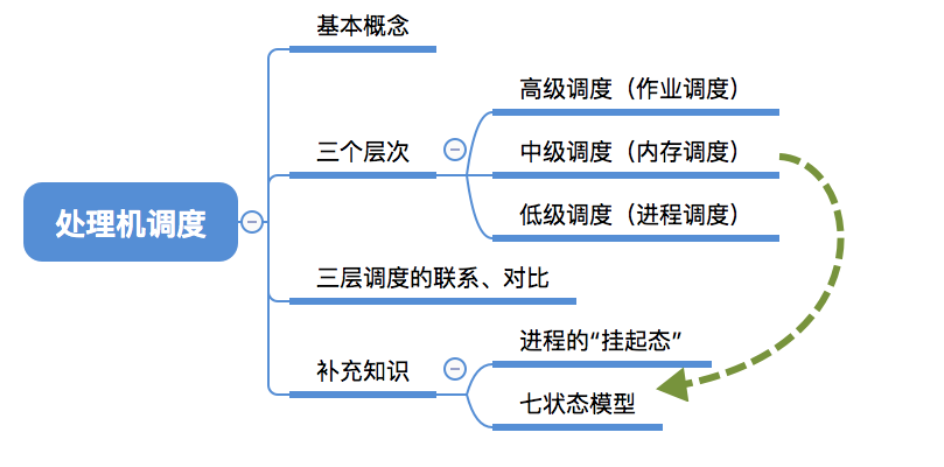
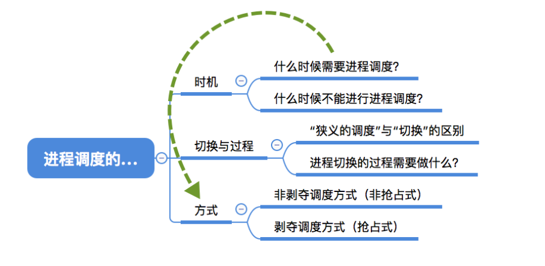
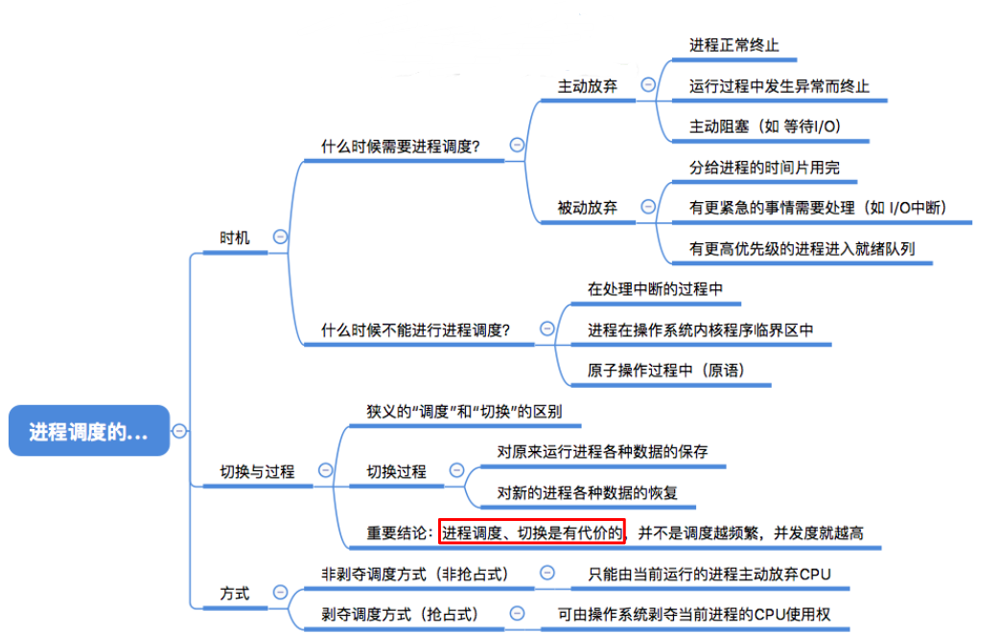
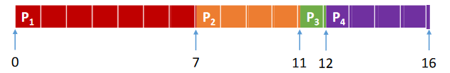
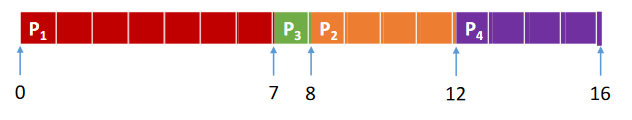
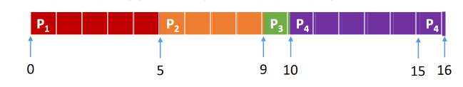
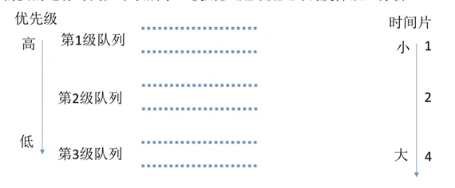
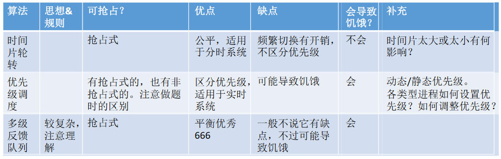

# 调度

# 处理机调度

## 调度的基本概念

当有一堆任务要处理，但由于资源有限，这些事情没法同时处理。这就需要确定某种规则来决定处理这些任务的顺序，这就是“**调度**”研究的问题。

## 调度的三个层次

作业：一个具体的任务

用户向系统提交一个作业≈用户让操作系统启动一个程序（来处理一个具体的任务）

### 高级调度

内存空间有限，有时无法将用户提交的作业全部放入内存.

高级调度（作业调度）。按一定的原则从外存的作业后备队列中挑选一个作业调入内存，并创建进程。每个**作业只调入一次，调出一次**。作业调入时会建立PCB，调出时才撤销PCB。

> 好几个程序需要启动，到底先启动哪个

### 低级调度

**低级调度**（进程调度/处理机调度）——按照某种策略从就绪队列中选取一个进程，将处理机分配给它。

进程调度是操作系统中**最基本的一种调度**，在一般的操作系统中都必须配置进程调度。进程调度的**频率很高**，一般几十毫秒一次。

### 中级调度

内存不够时，可将某些进程的数据调出外存。等内存空闲或者进程需要运行时再重新调入内存。

暂时调到**外存**等待的进程状态为**挂起状态**。被挂起的进程PCB会被组织成**挂起队列**

**中级调度**（内存调度）——按照某种策略决定将哪个处于挂起状态的进程重新调入内存。一个进程可能会被多次调出、调入内存，因此**中级调度**发生的**频率**要比高级调度**更高**。

## 进程的挂起态与七状态模型

暂时调到外存等待的进程状态为**挂起状态**（挂起态，suspend）

挂起态又可以进一步细分为**就绪挂起**、**阻塞挂起**两种状态

## 三层调度的联系和对比

- 高级，创建到就绪
- 中级，挂起到就绪/阻塞
- 低级，就绪到运行

|                            | 要做什么                                                     | 调度发生在.                 | 发生频率 | 对进程状态的影响                       |
| -------------------------- | ------------------------------------------------------------ | --------------------------- | -------- | -------------------------------------- |
| 高级调度 （作业调度） | 按照某种规则，从后备 队列中选择合适的作业 将其调入内存，并为其 创建进程 | 外存→内存 （面向作业） | 最低     | 无→创建态→就绪态                       |
| 中级调度 （内存调度） | 按照某种规则，从挂起 队列中选择合适的进程 将其数据调回内存 | 外存→内存 （面向进程） | 中等     | 挂起态→就绪态 （阻塞挂起→阻塞态） |
| 低级调度 （进程调度） | 按照某种规则，从就绪 队列中选择一个进程为 其分配处理机 | 内存→CPU                    | 最高     | 就绪态→运行态                          |

## 总结

# 进程调度

## 进程调度的时机

**进程调度**（低级调度），就是按照某种算法从就绪队列中选择一个进程为其分配处理机。

> 就是**就绪态**转换为**运行态**

### 什么时候需要进程调度

当前运行的进程**主动放弃**处理机：

- 进程正常终止
- 运行过程中发生异常而终止
- 进程主动请求阻塞（如等待I/O）

当前运行的进程**被动放弃**处理机：

- 分给进程的时间片用完
- 有更紧急的事需要处理（如I/O中断）
- 有更高优先级的进程进入就绪队列

### 什么时候不能进行进程调度

- 在**处理中断的过程中**。中断处理过程复杂，与硬件密切相关，很难做到在中断处理过程中进行进程切换。
- **进程**在**操作系统内核程序临界区**中
  - 但是进程在**普通临界区**中是可以进行调度、切换的。
- 在**原子操作过程中**（原语）。原子操作不可中断，要一气呵成（如之前讲过的修改PCB中进程状态标志，并把PCB放到相应队列）

> 进程处于临界区时**可以**进行处理机调度

**临界资源**：一个时间段内只允许一个进程使用的资源。各进程需要互斥地访问临界资源。

**临界区**：访问临界资源的那段**代码**。

内核程序临界区一般是用来访问某种内核数据结构的，比如进程的就绪队列（由各就绪进程的PCB组成）

 如果还没退出临界区（还没解锁）就进行进程调度，但是进程调度相关的程序也需要访问就绪队列，但此时就绪队列被锁住了，因此又无法顺利进行进程调度。

> **就绪队列属于临界资源**，当某个进程还处于临界区时，就无法访问临界资源，由于进程调度的程序也需要访问就绪队列（临界资源）所以就无法进行进程调度。
>
> 内核程序临界区访问的临界资源如果不尽快释放的话，极有可能影响到操作系统内核的其他管理工作。因此在访问内核程序临界区期间不能进行调度与切换
>
> 内核程序才访问临界资源？

例外：假如进程要访问打印机

在打印机打印完成之前，进程一直处于临界区内，临界资源不会解锁，但打印机又是慢速设备，此时如果一直不允许进程调度的话就会导致CPU一直空闲

**普通临界区访问的临界资源不会直接影响操作系统内核的管理工作**。因此在访问普通临界区时可以进行调度与切换。

**临界资源**：一对一，普通临界资源：打印机这种。特殊临界资源：就绪队列、阻塞队列等。

## 进程调度的方式

### 非剥夺调度方式

又称**非抢占方式**。即，只允许进程主动放弃处理机。在运行过程中即便有更紧迫的任务到达，当前进程依然会继续使用处理机，直到该进程终止或主动要求进入阻塞态。

实现简单，系统开销小但是无法及时处理紧急任务，适合于早期的批处理系统

## 剥夺调度方式

又称**抢占方式**。当一个进程正在处理机上执行时，如果有一个更重要或更紧迫的进程需要使用处理机，则立即暂停正在执行的进程，将处理机分配给更重要紧迫的那个进程。

可以优先处理更紧急的进程，也可实现让各进程按时间片轮流执行的功能（通过时钟中断）。适合于分时操作系统、实时操作系统。

## 进程切换与过程

### “狭义的进程调度”与“进程切换”的区别：

**狭义的进程调度**指的是从就绪队列中选中一个要运行的进程。（这个进程可以是刚刚被暂停执行的进程，也可能是另一个进程，后一种情况就需要进程切换）

> 狭义进程调度指的是**选择**

**进程切换**是指一个进程让出处理机，由另一个进程占用处理机的过程。

**广义的进程调度**包含了选择一个进程和进程切换两个步骤。包含了以上两个步骤。

进程切换的过程主要完成了：

- 对原来运行进程各种数据的**保存**

- 对新的进程各种数据的**恢复**

  （如：程序计数器、程序状态字、各种数据寄存器等处理机现场信息，这些信息一般保存在进程控制块）

注意：**进程切换是有代价的**，因此如果过于**频繁的**进行进程调度、切换，必然会**使整个系统的效率降低**，使系统大部分时间都花在了进程切换上，而真正用于执行进程的时间减少。

## 总结

# 调度算法的评价指标

## CPU利用率

由于早期的CPU造价极其昂贵，因此人们会**希望让CPU尽可能多地工作**

**CPU利用率**：指CPU“忙碌”的时间占总时间的比例。
$$
利用率=\frac{忙碌的时间}{总时间}
$$

> 某计算机只支持单道程序，某个作业刚开始需要在CPU上运行5秒，再用打印机打印输出5秒，之后再执行5秒，才能结束。在此过程中，CPU利用率、打印机利用率分别是多少？
>
> CPU利用率=(5+5)/(5+5+5)=66.66%
>
> 打印机利用率=5 / 15 = 33.33%

## 系统吞吐量

对于计算机来说，希望能用尽可能少的时间处理完尽可能多的作业

**系统吞吐量**：单位时间内完成作业的数量
$$
系统吞吐量=\frac{总共完成了多少道作业}{总共花了多少时间}
$$

> 某计算机系统处理完10道作业，共花费100秒，则系统吞吐量为？
>
> 10/100=0.1道/秒

## 周转时间

周转时间，是指从作业被**提交**给系统开始，到作业**完成**为止的这段时间间隔

- 作业在外存后备队列上等待作业调度（高级调度）的时间
- 进程在就绪队列上等待进程调度（低级调度）的时间
- 进程在CPU上执行的时间
- 进程等待I/O操作完成的时间

后三项在一个作业的整个处理过程中，可能发生多次

对于用户来说，更关心自己的**单个作业的周转时间**
$$
周转时间=作业完成时间–作业提交时间
$$
对于操作系统来说，更关心系统的整体表现，因此更关心所有作业**周转时间的平均值**
$$
平均周转时间 = \frac{各作业周转时间之和}{作业数}
$$
周转时间一定的情况下，实际运行时间长的任务，等待运行时间更短。

> 写作业的例子：只有一支笔，小明要花10分钟才能写完，他只等待了1分钟。小红1分钟就能写完，但是却要等10分钟。

对于**周转时间相同**的两个作业，实际运行时间长的作业在相同时间内被服务的时间更多，带权周转时间更小，用户满意度更高。

对于**实际运行时间相同**的两个作业，周转时间短的带权周转时间更小，用户满意度更高
$$
带权周转时间=\frac{作业周转时间}{作业实际运行的时间}=\frac{作业完成时间–作业提交时间}{作业实际运行的时间}
$$
带权周转时间与周转时间都是越小越好
$$
平均带权周转时间=\frac{各作业带权周转时间之和}{作业数}
$$

## 等待时间

等待时间，指进程/作业处于**等待处理机状态时间之和**，等待时间越长，用户满意度越低

开始时，作业在后备队列等待被服务（调度）

作业调入内存后，建立对应的进程。这个进程会被CPU服务、会被I/O设备服务，当然也会有等待被服务的时候

对于**进程**来说，等待时间就是指进程建立后等待被服务的时间之和，在等待I/O完成的期间其实进程也是在被服务的，所以不计入等待时间。

对于**作业**来说，不仅要考虑建立进程后的等待时间，**还要加上作业在外存后备队列中等待的时间**。

一个作业总共需要被CPU服务多久，被I/O设备服务多久一般是确定不变的，因此**调度算法其实只会影响作业/进程的等待时间**。

与前面指标类似，也有“**平均等待时间**”来评价整体性能。

## 响应时间

对于计算机用户来说，会希望自己的提交的请求（比如通过键盘输入了一个调试命令）尽早地开始被系统服务、回应。

响应时间，指从用户**提交**请求到**首次产生响应**所用的时间。

## 总结

# 调度算法1

学习思路：

- 算法思想
- 算法规则
- 这种调度算法是用于**作业调度**还是**进程调度**？
- 抢占式？非抢占式？
- 优点和缺点
- 是否会导致**饥饿**（某进程/作业长期得不到服务）

## 先来先服务FCFS

先来先服务（FCFS, First Come First Serve）

**算法思想**

主要从“公平”的角度考虑（类似于我们生活中排队买东西的例子）

**算法规则**

按照作业/进程到达的先后顺序进行服务

**这种调度算法是用于作业调度还是进程调度？**

用于作业调度时，考虑的是哪个作业先到达后备队列；用于进程调度时，考虑的是哪个进程先到达就绪队列

**抢占式？非抢占式？**

非抢占式的算法

**优缺点**

优点：公平、算法实现简单

缺点：排在长作业（进程）后面的短作业需要等待很长时间，带权周转时间很大，对短作业来说用户体验不好。即，FCFS算法对长作业有利，对短作业不利（Eg：排队买奶茶...）

**是否会导致饥饿**

不会

**例题**

各进程到达就绪队列的时间、需要的运行时间如下表所示。使用先来先服务调度算法，计算各进程的等待时间、平均等待时间、周转时间、平均周转时间、带权周转时间、平均带权周转时间。

| 进程 | 到达 时间 | 运行 时间 | 完成 时间 | 周转 时间 | 带权 周转 时间 | 等待 时间 |
| ---- | -------------- | -------------- | -------------- | -------------- | ------------------------ | -------------- |
| P1   | 0              | 7              | 7              | 7              | 1                        | 0              |
| P2   | 2              | 4              | 11             | 9              | 2.25                     | 5              |
| P3   | 4              | 1              | 12             | 8              | 8                        | 7              |
| P4   | 5              | 4              | 16             | 11             | 2.75                     | 7              |

平均周转时间：(7 + 9 + 8 + 11) / 4 = 8.75

平均带权周转时间：(1 + 2.25 + 8 + 2.75) / 4 = 3.5

平均等待时间：(0 + 5 + 7 + 7) / 4 = 4.75

> 注意：本例中的进程都是纯计算型的进程，一个进程到达后要么在等待，要么在运行。如果是又有计算、又有**I/O操作的进程**，其等待时间就是周转时间-运行时间-I/O操作的时间

## 短作业优先SJF

短作业优先（SJF, Shortest Job First）

**算法思想**

追求最少的平均等待时间，最少的平均周转时间、最少的平均平均带权周转时间

**算法规则**

最短的作业/进程优先得到服务（所谓“最短”，是指要求服务时间最短）

**这种调度算法是用于作业调度还是进程调度？**

即可用于作业调度，也可用于进程调度。用于进程调度时称为“短进程优先（SPF, Shortest Process First）算法”

**抢占式？非抢占式？**

SJF和SPF是非抢占式的算法。但是也有抢占式的版本——**最短剩余时间优先算法** （SRTN,Shortest Remaining Time Next）

**优缺点**

优点：“最短的”平均等待时间、平均周转时间

缺点：不公平。对**短作业有利**，对**长作业不利**。可能产生**饥饿**现象。另外，作业/进程的运行时间是由用户提供的，并不一定真实，不一定能做到真正的短作业优先

**是否会导致饥饿**

会。如果源源不断地有短作业/进程到来，可能使长作业/进程长时间得不到服务，产生“**饥饿**”现象。如果一直得不到服务，则称为“**饿死**”

**例题**1

每次调度时选择**当前已到达**且**运行时间最短**的作业/进程、

**调度顺序**为：P1 → P3 → P2 → P4

| 进程 | 到达 时间 | 运行 时间 | 完成 时间 | 周转 时间 | 带权 周转 时间 | 等待 时间 |
| ---- | -------------- | -------------- | -------------- | -------------- | ------------------------ | -------------- |
| P1   | 0              | 7              | 7              | 7              | 1                        | 0              |
| P2   | 2              | 4              | 12             | 10             | 2.5                      | 6              |
| P3   | 4              | 1              | 8              | 4              | 4                        | 3              |
| P4   | 5              | 4              | 16             | 11             | 2.75                     | 7              |

平均周转时间=(7+4+10+11)/4=8

平均带权周转时间=(1+4+2.5+2.75)/4=2.56

平均等待时间=(0+3+6+7)/4=4

**例题**2

使用抢占式的短作业预先调度算法

**最短剩余时间优先算法**：每当有进程加入**就绪队列改变时就需要调度**，如果新到达的进程**剩余时间**比当前运行的进程剩余时间**更短**，则由新进程**抢占**处理机，当前运行进程重新回到就绪队列。另外，当一个**进程完成时也需要调度**

P1(2/7)→P2(2/4)→P3(1/1)→P2(4/4)→P4(4/4)→P1(7/7)

| 进程 | 到达 时间 | 运行 时间 | 完成 时间 | 周转 时间 | 带权 周转 时间 | 等待 时间 |
| ---- | -------------- | -------------- | -------------- | -------------- | ------------------------ | -------------- |
| P1   | 0              | 7              | 16             | 16             | 2.28                     | 9              |
| P2   | 2              | 4              | 7              | 5              | 1.25                     | 1              |
| P3   | 4              | 1              | 5              | 1              | 1                        | 0              |
| P4   | 5              | 4              | 11             | 6              | 1.5                      | 2              |

平均周转时间=(16+5+1+6)/4=7

平均带权周转时间=(2.28+1.25+1+1.5)/4=1.50

平均等待时间=(9+1+0+2)/4=3

## 高响应比优先HRRN

### 对FCFS和SJF两种算法的思考

FCFS算法是在每次调度的时候选择一个等待时间最长的作业（进程）为其服务。但是**没有考虑到作业的运行时间**，因此导致了对短作业不友好的问题

SJF算法是选择一个执行时间最短的作业为其服务。但是又**完全不考虑各个作业的等待时间**，因此导致了对长作业不友好的问题，甚至还会造成饥饿问题

能不能设计一个算法，即考虑到各个作业的等待时间，也能兼顾运行时间呢？

**高响应比优先**（HRRN, Highest Response Ratio Next）

**算法思想**

要综合考虑作业/进程的等待时间和要求服务的时间

**算法规则**

在每次调度时先计算各个作业/进程的响应比，选择响应比最高的作业/进程为其服务
$$
响应比=\frac{等待时间+要求服务时间}{要求服务时间}
$$
**这种调度算法是用于作业调度还是进程调度？**

即可用于作业调度，也可用于进程调度

**抢占式？非抢占式？**

**非抢占式**的算法。因此只有当前运行的作业/进程主动放弃处理机时，才需要调度，才需要计算响应比

**优缺点**

综合考虑了等待时间和运行时间（要求服务时间）等待时间相同时，要求服务时间短的优先（SJF的优点）要求服务时间相同时，等待时间长的优先（FCFS的优点）对于长作业来说，随着等待时间越来越久，其响应比也会越来越大，从而避免了长作业饥饿的问题

**是否会导致饥饿**

不会

### 例子

**高响应比优先**算法：非抢占式的调度算法，只有当前运行的进程**主动放弃CPU**时（正常/异常完成，或主动阻塞），才需要进行调度，调度时**计算所有就绪进程的响应比，选响应比最高的进程**上处理机

等待时间越久，越有机会得到服务

要求服务时间越长，越有机会得到服务

| 进程 | 到达 时间 | 运行 时间 | 完成 时间 | 周转 时间 | 带权 周转 时间 | 等待 时间 |
| ---- | -------------- | -------------- | -------------- | -------------- | ------------------------ | -------------- |
| P1   | 0              | 7              | 7              | 7              | 1                        | 0              |
| P2   | 2              | 4              | 12             | 10             | 2.5                      | 6              |
| P3   | 4              | 1              | 8              | 4              | 4                        | 3              |
| P4   | 5              | 4              | 16             | 11             | 2.75                     | 7              |

P1完成后，计算其他三个进程的响应比：

P2: (5 + 4) / 4 = 2.25

P3: (3 + 1) / 1 = 4

P4: (2 + 4) / 4 = 1.5

因此选P3，P3完成后，计算其他三个进程的响应比：

P2: (6 + 4) / 4 = 2.5

P4: (3 + 4) / 4 = 1.75

因此选P2

平均周转时间=(7+10+4+11)/4=8

平均带权周转时间=(1+2.5+4+2.75)/4=2.56

平均等待时间=(0+6+3+7)/4=4

## 总结

注：这几种算法主要关心对用户的公平性、平均周转时间、平均等待时间等评价系统整体性能的指标，但是不关心“响应时间”，也并不区分任务的紧急程度，因此对于用户来说，交互性很糟糕。因此**这三种算法一般适合用于早期的批处理系统**，当然，FCFS算法也常结合其他的算法使用，在现在也扮演着很重要的角色。而适合用于交互式系统的调度算法将在下个小节介绍...

# 调度算法2

## 时间片轮转

时间片轮转（RR,Round-Robin）

伴随分时操作系统而诞生

**算法思想**

**算法思想**

公平地、轮流地为各个进程服务，让每个进程在一定时间间隔内都可以得到响应

**算法规则**

按照各进程到达就绪队列的顺序，轮流让各个进程执行一个**时间片**（如100ms）。

若进程未在一个时间片内执行完，则剥夺处理机，将进程重新放到就绪队列队尾重新排队。

**这种调度算法是用于作业调度还是进程调度？**

用于**进程调度**（只有作业放入内存建立了相应的进程后，才能被分配处理机时间片）

**抢占式？非抢占式？**

若进程未能在时间片内运行完，将被强行剥夺处理机使用权，因此时间片轮转调度算法属于**抢占式**的算法。由时钟装置发出时钟中断来通知CPU时间片已到

**优缺点**

优点：公平；响应快，适用于分时操作系统；

缺点：由于高频率的进程切换，因此有一定开销；不区分任务的紧急程度。

**是否会导致饥饿**

不会

### 例子

使用**时间片轮转**调度算法，分析时间片大小分别是2、5时的进程运行情况。

**时间片轮转**调度算法：轮流让就绪队列中的进程依次执行一个时间片（每次选择的都是排在就绪队列队头的进程）

- 默认新到达的进程先进入就绪队列
- 如果时间片没用完，任务结束了，则重新调度

| 进程 | 到达 时间 | 运行 时间 |
| ---- | -------------- | -------------- |
| P1   | 0              | 5              |
| P2   | 2              | 4              |
| P3   | 4              | 1              |
| P4   | 5              | 6              |

**时间片大小为2的情况**

**时间片大小为5的情况**

如果时间片太大或太小会怎样？

> 时间片太大，时间片轮转调度算法**退化为先来先服务算法**
>
> 时间片太小，进程切换过于频繁，实际用于进程执行的时间比例会降低。

如何设计时间片的长度？

> 设计时间片时要让切换进程的开销占比不超过1%

## 优先级调度算法

**算法思想**

随着计算机的发展，特别是实时操作系统的出现，越来越多的应用场景需要根据任务的紧急程度来决定处理顺序

**算法规则**

每个作业/进程有各自的优先级，调度时选择优先级最高的作业/进程

**用于作业/进程调度**

既可用于作业调度，也可用于进程调度。甚至，还会用于在之后会学习的I/O调度中

**是否可抢占？**

抢占式、非抢占式都有。

区别在于：

- 非抢占式只需在进程主动放弃处理机时进行调度即可
- 抢占式还需在就绪队列变化时，检查是否会发生抢占。

**优缺点**

优点：用优先级区分紧急程度、重要程度，适用于实时操作系统。可灵活地调整对各种作业/进程的偏好程度。

缺点：若源源不断地有高优先级进程到来，则可能导致饥饿

**是否会导致饥饿**

会

### 例子

| 进程 | 到达 时间 | 运行 时间 | 优先数 |
| ---- | -------------- | -------------- | ------ |
| P1   | 0              | 7              | 1      |
| P2   | 2              | 4              | 2      |
| P3   | 4              | 1              | 3      |
| P4   | 5              | 4              | 2      |

**使用非抢占式的优先级调度算法**

每次调度时选择当前**已到达且优先级最高**的进程。当前进程主动放弃处理机时发生调度。

**抢占式的优先级调度算法**
每次调度时选择当前已到达且优先级最高的进程。当前进程主动放弃处理机时发生调度。另外，当**就绪队列发生改变时也需要检查是会发生抢占**。

### 补充

就绪队列未必只有一个，可以按照不同优先级来组织。另外，也可以把优先级高的进程排在更靠近队头的位置

根据优先级是否可以动态改变，可将优先级分为**静态优先级**和**动态优先级**两种。

- 静态优先级：创建进程时确定，之后一直不变。
- 动态优先级：创建进程时有一个初始值，之后会根据情况动态地调整优先级。

**如何合理设置各类进程的优先级？**

- 系统进程优先级高于用户进程

- 前台进程优先级高于后台进程

- 操作系统更偏好I/O型进程（或称**I/O繁忙型进程**）

  与I/O型进程相对的是计算型进程（或称**CPU繁忙型进程**）

> I/O设备和CPU可以并行工作。如果优先让I/O繁忙型进程优先运行的话，则越有可能让I/O设备尽早地投入工作，则资源利用率、系统吞吐量都会得到提升

**如果采用的是动态优先级，什么时候应该调整？**

可以从追求公平、提升资源利用率等角度考虑

- 如果某进程在就绪队列中**等待了很长时间**，则可以适当**提升**其优先级
- 如果某进程占用处理机**运行了很长时间**，则可适当**降低**其优先级
- 如果发现一个进程**频繁地进行I/O操作**，则可适当**提升**其优先级

## 多级反馈队列调度算法

融会贯通：

- FCFS算法的优点是公平
- SJF算法的优点是能尽快处理完短作业，平均等待/周转时间等参数很优秀
- 时间片轮转调度算法可以让各个进程得到及时的响应
- 优先级调度算法可以灵活地调整各种进程被服务的机会

**算法思想**

对其他调度算法的折中权衡

**算法规则**

1.设置多级就绪队列，各级队列优先级从高到低，时间片从小到大

2.新进程到达时先进入第1级队列，按FCFS原则排队等待被分配时间片，若用完时间片进程还未结束，则进程进入下一级队列队尾。如果此时已经是在最下级的队列，则重新放回该队列队尾

3.只有第k级队列为空时，才会为k+1级队头的进程分配时间片

**用于作业/进程调度**

用于进程调度

**是否可抢占？**

**抢占式**的算法。在k级队列的进程运行过程中，若更上级的队列（1~k-1级）中进入了一个新进程，则由于新进程处于优先级更高的队列中，因此新进程会抢占处理机，原来运行的进程放回k级队列队尾。

**优缺点**

对各类型进程相对公平（FCFS的优点）；

每个新到达的进程都可以很快就得到响应（RR的优点）；

短进程只用较少的时间就可完成（SPF的优点）；

不必实现估计进程的运行时间（避免用户作假）；

可灵活地调整对各类进程的偏好程度，比如CPU密集型进程、I/O密集型进程（拓展：可以将因I/O而阻塞的进程重新放回原队列，这样I/O型进程就可以保持较高优先级） 

**是否会导致饥饿**

会

#### 例子

| 进程 | 到达 时间 | 运行 时间 |
| ---- | -------------- | -------------- |
| P1   | 0              | 8              |
| P2   | 1              | 4              |
| P3   | 5              | 1              |

设置多级就绪队列，各级队列**优先级从高到低**，**时间片从小到大**

**新进程**到达时先进入**第1级**队列，按**FCFS原则**排队等待被分配时间片。

若用完时间片**进程还未结束**，则进程进入**下一级队列队尾**。

如果此时已经在**最下级的队列**，则**重新放回**最下级队列队尾

只有**第k级队列为空时**，才会为k+1级队头的进程**分配**时间片**被抢占处理机的进程**重新放回**原队列**队尾

## 总结

> 比起早期的批处理操作系统来说，由于计算机造价大幅降低，因此之后出现的交互式操作系统（包括分时操作系统、实时操作系统等）更注重系统的响应时间、公平性、平衡性等指标。而这几种算法恰好也能较好地满足交互式系统的需求。因此这三种算法**适合用于交互式系统**。（比如UNIX使用的就是多级反馈队列调度算法）