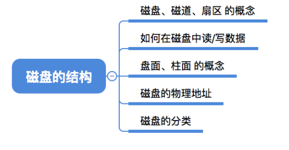
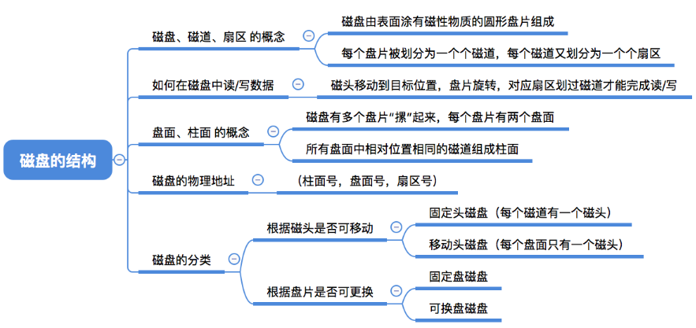
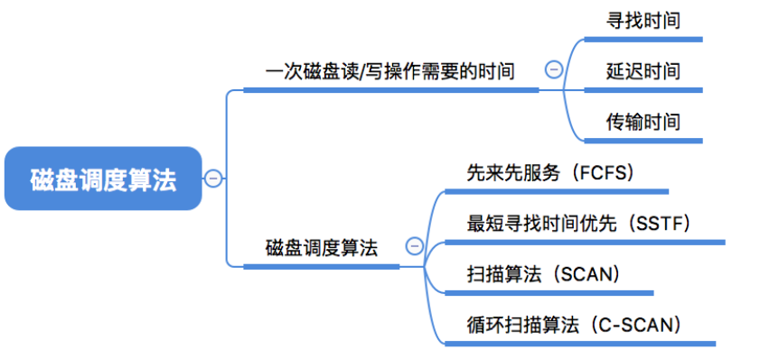
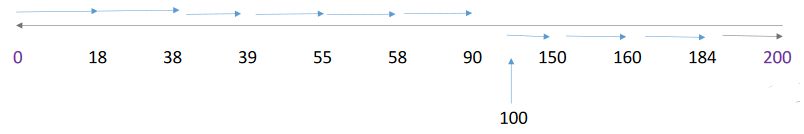
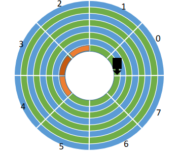
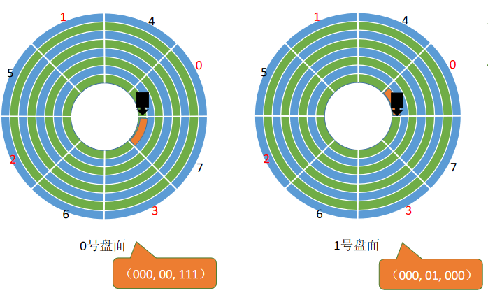
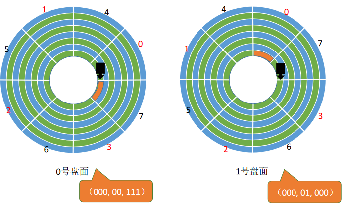

# 4.2磁盘

# 磁盘的结构

## 磁盘、磁道、扇区

磁盘的表面由一些磁性物质组成，可以用这些磁性物质来记录二进制数据

马达是带着磁盘旋转

磁盘的盘面被划分成一个个磁道。这样的一个“圈”就是一个磁道

最内侧磁道上的扇区面积最小，因此数据密度最大

一个**磁道**又被划分成一个个**扇区**，每个扇区就是一个“**磁盘块**”。各个扇区存放的数据量相同（如1KB）

## 如何在磁盘中读/写数据

需要把“**磁头**”移动到想要读/写的扇区所在的磁道。磁盘会转起来，让目标扇区从磁头下面划过，才能完成对扇区的读/写操作。

## 盘面、柱面

可用**（柱面号，盘面号，扇区号）**来定位任意一个“磁盘块”。

> 在“文件的物理结构”小节中，我们经常提到文件数据存放在外存中的几号块，这个块号就可以转换成（柱面号，盘面号，扇区号）的地址形式。

可根据该地址读取一个“块”
①根据“柱面号”移动磁臂，让磁头指向指定柱面；
②激活指定盘面对应的磁头；
③磁盘旋转的过程中，指定的扇区会从磁头下面划过，这样就完成了对指定扇区的读/写。

## 磁盘的分类

磁头可以移动的称为**活动头磁盘**。磁臂可以来回伸缩来带动磁头定位磁道

磁头不可移动的称为**固定头磁盘**。这种磁盘中每个磁道有一个磁头

盘片可以更换的称为**可换盘磁盘**

盘片不可更换的称为**固定盘磁盘**

# 磁盘调度算法

## 一次磁盘读/写操作需要的时间

**寻找时间**（寻道时间）$T_s$：在读/写数据前，将磁头移动到指定磁道所花的时间。

①启动磁头臂是需要时间的。假设耗时为$s$；
②移动磁头也是需要时间的。假设磁头匀速移动，每跨越一个磁道耗时为m，总共需要跨越n条磁道。则：寻道时间$T_s=s+mn$

>  硬盘移动一个磁道大约需要0.2ms，磁臂启动时间约为2ms

**延迟时间**$T_R$：通过旋转磁盘，使磁头定位到目标扇区所需要的时间。设磁盘转速为$r$（单位：转/秒，或转/分），则平均所需的延迟时间
$$
T_R=\frac{1}{2}\frac{1}{r}=\frac{1}{2r}
$$
1/r就是转一圈需要的时间。找到目标扇区平均需要转半圈，因此再乘以1/2

> 硬盘的典型转速为5400转/分，或7200转/分

**传输时间**$T_t$：从磁盘读出或向磁盘写入数据所经历的时间，假设磁盘转速为$r$，此次读/写的字节数为$b$，每个磁道上的字节数为$N$。则传输时间为
$$
Tt=\frac{1}{r}\frac{b}{N}=\frac{b}{rN}
$$
需要读取$b/N$个磁道，读/写一个磁道所需的时间为$1/r$

延迟时间和传输时间都与磁盘转速相关，且为线性相关。而转速是硬件的固有属性，因此操作系统也**无法优化**延迟时间和传输时间

**总的平均存取时间**
$$
T_a=T_S+T_R+T_t
$$

## 先来先服务算法（FCFS）

根据进程请求访问磁盘的先后顺序进行调度。假设磁头的初始位置是100号磁道，有多个进程先后陆续地请求访问55、58、39、18、90、160、150、38、184号磁道

按照FCFS的规则，按照请求到达的顺序，磁头需要依次移动到55、58、39、18、90、160、150、38、184号磁道

磁头总共移动了45+3+19+21+72+70+10+112+146=498个磁道

响应一个请求平均需要移动498/9=55.3个磁道（**平均寻找长度**）

优点：公平；如果请求访问的磁道比较集中的话，算法性能还算过的去

缺点：**如果有大量进程竞争使用磁盘**，请求访问的磁道很分散，则FCFS在性能上很差，**寻道时间长**。

## 最短寻找时间优先（SSTF）

SSTF算法会优先处理的磁道是与当前磁头最近的磁道。可以保证每次的寻道时间最短，但是并不能保证总的寻道时间最短。（其实就是贪心算法的思想，只是选择眼前最优，但是总体未必最优）

假设磁头的初始位置是100号磁道，有多个进程先后陆续地请求访问55、58、39、18、90、160、150、38、184号磁道

磁头总共移动了(100-18)+(184-18)=248个磁道

响应一个请求平均需要移动248/9=27.5个磁道（平均寻找长度）

**优点**：性能较好，平均寻道时间短

**缺点**：可能产生“**饥饿**”现象

> Eg：本例中，如果在处理18号磁道的访问请求时又来了一个38号磁道的访问请求，处理38号磁道的访问请求时又来了一个18号磁道的访问请求。如果有源源不断的18号、38号磁道的访问请求到来的话，150、160、184号磁道的访问请求就永远得不到满足，从而产生“饥饿”现象。

## 扫描算法（SCAN）

SSTF算法会产生饥饿的原因在于：磁头有可能在一个小区域内来回来去地移动。为了防止这个问题，可以规定，**只有磁头移动到最外侧磁道的时候才能往内移动，移动到最内侧磁道的时候才能往外移动**。

这就是**扫描算法（SCAN）**的思想。由于磁头移动的方式很像电梯，因此也叫电梯算法。假设某磁盘的磁道为0~200号，磁头的初始位置是100号磁道，且此时磁头正在往磁道号增大的方向移动，有多个进程先后陆续地请求访问55、58、39、18、90、160、150、38、184号磁道

> 不撞南墙不回头

磁头总共移动了(200-100)+(200-18)=282个磁道

响应一个请求平均需要移动282/9=31.3个磁道（平均寻找长度）

**优点**：性能较好，平均寻道时间较短，不会产生饥饿现象

**缺点**：
①只有到达最边上的磁道时才能改变磁头移动方向，事实上，处理了184号磁道的访问请求之后就不需要再往右移动磁头了。
②SCAN算法**对于各个位置磁道的响应频率不平均**

（如：假设此时磁头正在往右移动，且刚处理过90号磁道，那么下次处理90号磁道的请求就需要等磁头移动很长一段距离；而响应了184号磁道的请求之后，很快又可以再次响应184号磁道的请求了）

## LOOK调度算法

扫描算法（SCAN）中，只有到达最边上的磁道时才能改变磁头移动方向，事实上，处理了184号磁道的访问请求之后就不需要再往右移动磁头了。

LOOK调度算法就是为了解决这个问题，**如果在磁头移动方向上已经没有别的请求**，就可以立即改变磁头移动方向。（边移动边观察，因此叫LOOK）

假设某磁盘的磁道为0~200号，磁头的初始位置是100号磁道，且此时磁头正在往磁道号增大的方向移动，有多个进程先后陆续地请求访问55、58、39、18、90、160、150、38、184号磁道

优点：比起SCAN算法来，不需要每次都移动到最外侧或最内侧才改变磁头方向，使寻道时间进一步缩短

## 循环扫描算法（C-SCAN）

SCAN算法对于各个位置磁道的响应频率不平均，而C-SCAN算法就是为了解决这个问题。规定只有磁头朝某个特定方向移动时才处理磁道访问请求，而**返回时直接快速移动至起始端而不处理任何请求**。

假设某磁盘的磁道为0~200号，磁头的初始位置是100号磁道，且此时磁头正在往磁道号增大的方向移动，有多个进程先后陆续地请求访问55、58、39、18、90、160、150、38、184号磁道

只有到了最边上的磁道才能改变磁头移动方向。磁头返回途中不处理任何请求

**优点**：比起SCAN来，对于各个位置磁道的响应频率很平均。

**缺点**：只有到达最边上的磁道时才能改变磁头移动方向，事实上，处理了184号磁道的访问请求之后就不需要再往右移动磁头了；并且，磁头返回时其实只需要返回到18号磁道即可，不需要返回到最边缘的磁道。另外，比起SCAN算法来，**平均寻道时间更长**。

## C-LOOK调度算法

C-SCAN算法的主要缺点是只有到达最边上的磁道时才能改变磁头移动方向，并且磁头返回时不一定需要返回到最边缘的磁道上。C-LOOK算法就是为了解决这个问题。如果**磁头移动的方向上已经没有磁道访问请求**了，就可以**立即让磁头返回**，并且磁头**只需要返回到有磁道访问请求的位置**即可。

假设某磁盘的磁道为0~200号，磁头的初始位置是100号磁道，且此时磁头正在往磁道号增大的方向移动，有多个进程先后陆续地请求访问55、58、39、18、90、160、150、38、184号磁道

优点：比起C-SCAN算法来，不需要每次都移动到最外侧或最内侧才改变磁头方向，使寻道时间进一步缩短

## 总结

# 减少延迟时间的方法

假设要连续读取橙色区域的2、3、4扇区：

磁头读取一块的内容（也就是一个扇区的内容）后，需要一小段时间处理，而盘片又在不停地旋转

因此，如果2、3号扇区相邻着排列，则读完2号扇区后无法连续不断地读入3号扇区必须等盘片继续旋转，3号扇区再次划过磁头，才能完成扇区读入

**结论**：磁头读入一个扇区数据后需要一小段时间处理，**如果逻辑上相邻的扇区在物理上也相邻**，则读入几个连续的逻辑扇区，**可能需要很长的“延迟时间”**

## 交替编号

若采用交替编号的策略，即让逻辑上相邻的扇区在物理上有一定的间隔，可以使读取连续的逻辑扇区所需要的延迟时间更小。

## 磁盘地址结构的设计

思考：为什么？磁盘的物理地址是（柱面号，盘面号，扇区号）而不是（盘面号，柱面号，扇区号）

假设某磁盘有8个柱面/磁道（假设最内侧柱面/磁道号为0 ），4个盘面，8个扇区。则可用3个二进制位表示柱面，2个二进制位表示盘面，3个二进制位表示扇区。

> 假设要连续读取物理地址（00,000,000）~（00,001,111）的扇区

**若物理地址结构是（盘面号，柱面号，扇区号）**

（00,000,000）~（00,000,111 ）转两圈可读完

之后再读取物理地址相邻的区域，即（00,001,000）~（00,001,111 ），需要**启动磁头臂**，将**磁头移动**到下一个磁道

**若物理地址结构是（柱面号，盘面号，扇区号）**

（000,00,000）~（000,00,111 ）由盘面0的磁头读入数据

之后再读取物理地址相邻的区域，即（000,01,000）~（000,01,111 ）

由于**柱面号/磁道号**相同，只是**盘面号不同**，因此**不需要移动磁头臂**。只需要**激活相邻盘面的磁头**即可

## 错位命名

方案一：若相邻的盘面相对位置相同处**扇区编号相同**

注意，所有盘面都是一起连轴转的

读取完磁盘块（000,00,111）之后需要短暂的时间处理，而盘面又在不停地转动，因此当（000,01,000）第一次划过1号盘面的磁头下方时，并不能读取数据，只能再等该扇区再次划过磁头。

> 磁盘顺时针旋转，磁头不变

方案二：**错位命名**

由于采用错位命名法，因此读取完磁盘块（000,00,111）之后，还有一段时间处理

当（000,01,000）第一次划过1号盘面的磁头下方时，就可以直接读取数据。从而减少了延迟时间

## 总结

# 磁盘的管理

## 磁盘初始化

Step1：进行**低级格式化**（**物理格式化**），将磁盘的各个磁道划分为扇区。一个扇区通常可分为头、数据区域（如512B大小）、尾三个部分组成。管理扇区所需要的各种数据结构一般存放在头、尾两个部分，包括扇区校验码（如奇偶校验、CRC循环冗余校验码等，校验码用于校验扇区中的数据是否发生错误）

Step2：将磁盘分区，每个分区由**若干柱面**组成（即分为我们熟悉的C盘、D盘、E盘）

Step3：进行**逻辑格式化**，创建文件系统。包括创建文件系统的根目录、初始化存储空间管理所用的数据结构（如位示图、空闲分区表）

## 引导块

计算机开机时需要进行一系列初始化的工作，这些初始化工作是通过执行**初始化程序**（**自举程序**）完成的

**初始化程序**可以放在ROM（只读存储器）中。ROM中的数据在出厂时就写入了，并且**以后不能再修改**

初始化程序程序（自举程序）放在ROM中存在什么问题？

万一需要更新自举程序，将会很不方便，因为ROM中的数据无法更改。如何解决呢？

**完整的自举程序**放在磁盘的**启动块**（即引导块/启动分区）上，启动块位于磁盘的固定位置。

拥有启动分区的磁盘称为启动磁盘或系统磁盘（C:盘）

ROM中只存放很小的“自举装入程序”

开机时计算机先运行“自举装入程序”，通过执行该程序就可**找到引导块**，并将完整的“自举程序”读入内存，完成初始化

## 坏块的管理

坏了、无法正常使用的扇区就是“坏块”。这属于硬件故障，操作系统是无法修复的。应该将坏块标记出来，以免错误地使用到它

对于简单的磁盘，可以在逻辑格式化时（建立文件系统时）对整个磁盘进行坏块检查，标明哪些扇区是坏扇区，比如：在FAT表上标明。（在这种方式中，**坏块对操作系统不透明**）

对于复杂的磁盘，磁盘控制器（磁盘设备内部的一个硬件部件）会维护一个坏块链表。

在磁盘出厂前进行低级格式化（物理格式化）时就将坏块链进行初始化。会保留一些“备用扇区”，用于替换坏块。这种方案称为**扇区备用**。且这种处理方式中，**坏块对操作系统透明**。

> 不透明，操作系统知道有坏块，知道坏块在哪里。
>
> 透明，操作系统不知道有坏块。

## 总结

