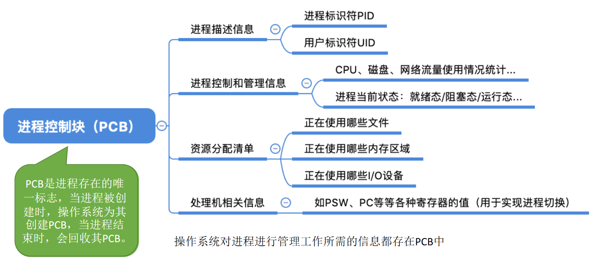
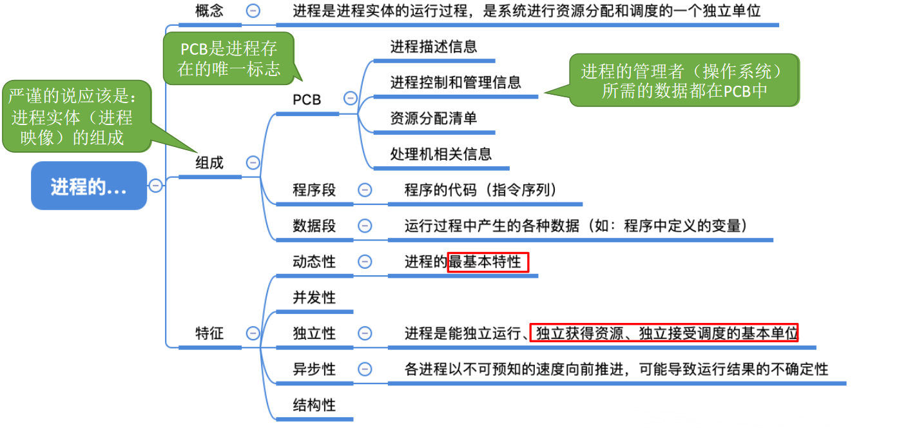
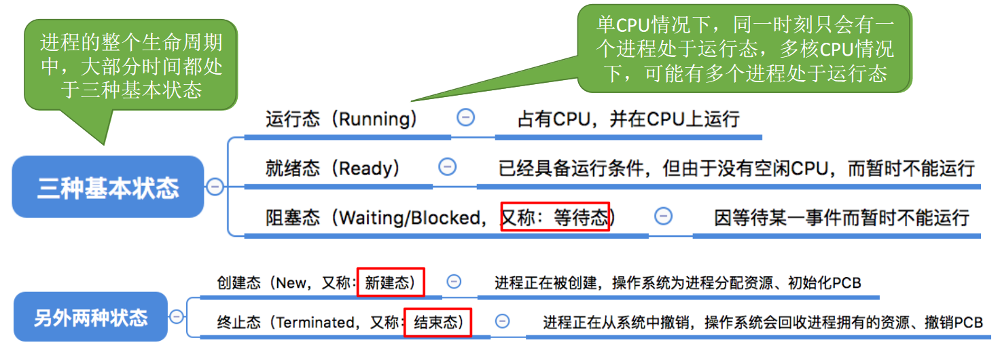
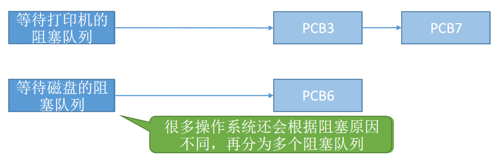
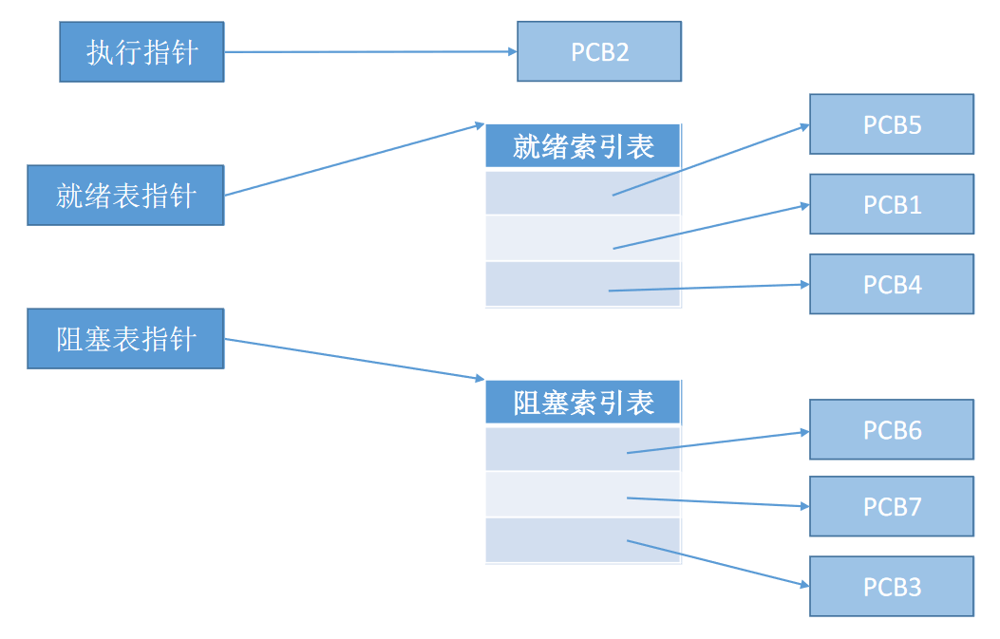
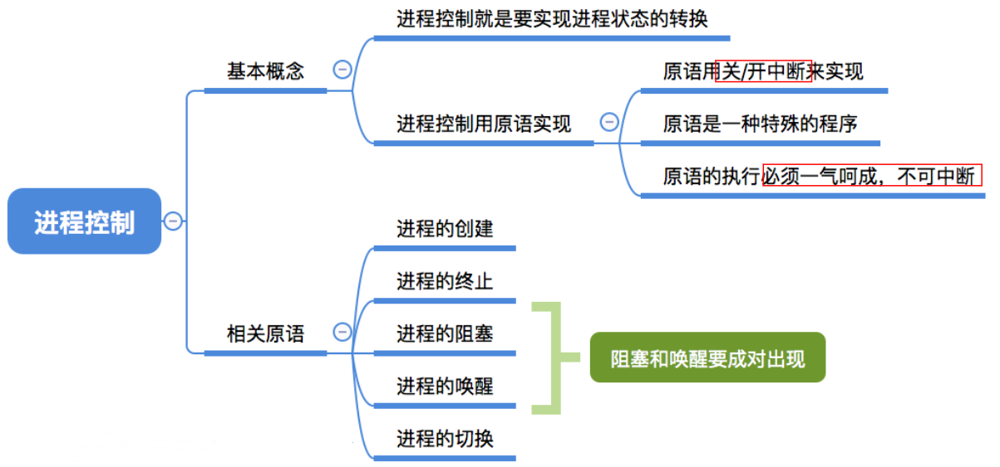
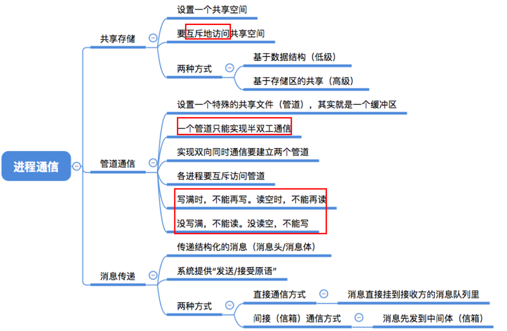
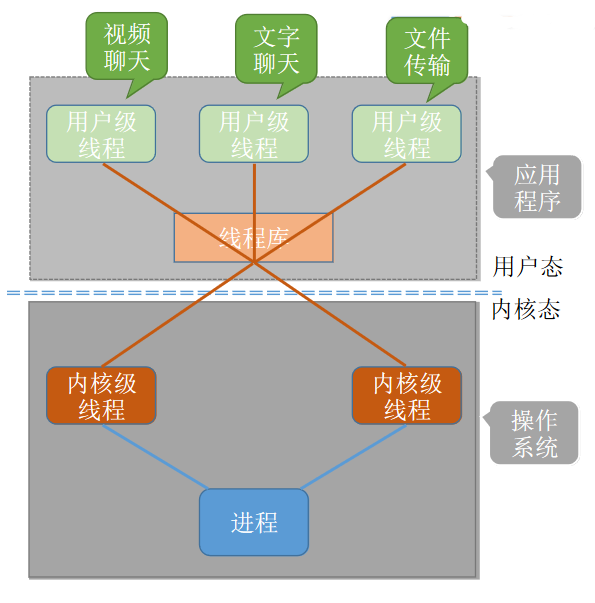

# 进程的基本介绍


## 进程的概念

**程序**：是**静态**的，就是个存放在磁盘里的可执行文件，就是一系列的指令集合。

**进程**（Process）：是**动态**的，是程序的一次执行过程，同一个程序多次执行会对应多个进程。

如果打开3次QQ，任务管理器里就会有3个不同的进程。

**如何区分各个进程？**

当进程被创建时，操作系统会为该进程分配一个唯一的、不重复的“身份证号”——PID（ProcessID，进程ID）

**操作系统要记录哪些内容？**

- PID，UID（进程所属用户ID），这是基本的进程描述信息，可以让操作系统**区分各个进程**。
- 记录给进程**分配了哪些资源**（如：分配了多少内存、正在使用哪些I/O设备、正在使用哪些文件）。可用于实现操作系统对资源的管理。
- 还要记录进程的**运行情况**（如：CPU使用时间、磁盘使用情况、网络流量使用情况等）可用于实现操作系统对进程的控制、调度。

这些信息都被保存在一个数据结构**PCB（Process Control Block）**中，即**进程控制块**

操作系统需要对各个并发运行的进程进行管理，但凡管理时所需要的信息，都会被放在PCB中

## 进程控制块PCB



## 程序段与数据段

PCB是给**操作系统**用的

程序段和数据段：是给**进程自己使用**的

程序运行的过程：


一个进程实体（进程映像）由PCB、程序段、数据段组成。进程是动态的，进程实体（进程映像）是静态的。进程实体反应了进程在某一时刻的状态（如：x++后，x=2）

## 进程的组成


进程的组成更确切的说，应该是“**进程实体(进程映像)的组成**”

**程序段、数据段、PCB**三部分组成了进程实体（进程映像）

**PCB**是给**操作系统**用的，PCB是进程存在的唯一标志！

**程序段、数据段**是给**进程自己用**的，与进程自身的运行逻辑有关

> 同时挂三个QQ号，会对应三个QQ进程，它们的PCB、数据段各不相同，但程序段的内容都是相同的（都是运行着相同的QQ程序）

进程是进程实体的运行过程，是系统进行**资源分配**和**调度**的一个独立单位。

> 一个进程被“调度”，就是指操作系统决定让这个进程上CPU运行

## 进程的特征

程序是静态的，进程是动态的，相比于程序，进程拥有以下特征：


## 总结



# 进程的状态与转换


## 创建态与就绪态


进程正在被创建时，它的状态是“**创建态**”，在这个阶段操作系统会为进程分配资源、初始化PCB。

## 就绪态

万事俱备，只欠CPU。进程已经拥有了除处理机之外所有需要的资源，一旦获得处理机，即可立即进入运行态开始运行。

当进程创建完成后，便进入“**就绪态**”，处于就绪态的进程已经具备运行条件，但由于没有空闲CPU，就暂时不能运行

## 运行态

系统中可能会有很**多个进程都处于就绪态**，当CPU空闲时，操作系统就会选择一个就绪进程，让它上处理机运行。

如果一个进程此时在CPU上运行，那么这个进程处于“**运行态**”。CPU会执行该进程对应的程序（**执行指令序列**）

## 阻塞态

在进程运行的过程中，可能会请求等待某个事件的发生（如等待某种系统资源的分配，或者等待其他进程的响应）。比如打印机正在被占用。

在这个事件发生之前，进程无法继续往下执行，此时操作系统会让这个进程下CPU，并让它进入“阻塞态”

当CPU空闲时，又会选择另一个“就绪态”进程上CPU运行

当等待的事件发生后（比如打印机空闲了），进程从“阻塞态”回到“就绪态”。

## 终止态

一个进程可以执行exit系统调用，请求操作系统终止该进程。

此时该进程会进入“**终止态**”，操作系统会让该进程下CPU，并**回收**内存空间等资源，最后还要回收该进程的PCB。

> 回收内存指的是把进程的PCB，程序段，数据段所占用的内存释放。

当终止进程的工作完成之后，这个进程就彻底消失了。

## 状态转换


**运行态→阻塞态**是一种进程自身做出的**主动行为**

**阻塞态→就绪态**不是进程自身能控制的，是一种**被动行为**。

注意：不能由阻塞态直接转换为运行态，也不能由就绪态直接转换为阻塞态（因为进入阻塞态是进程主动请求的，必然需要进程在运行时才能发出这种请求）




进程PCB中，会有一个**变量state来表示进程的当前状态**。如：1表示创建态、2表示就绪态、3表示运行态...为了对同一个状态下的各个进程进行统一的管理，操作系统会将各个进程的PCB组织起来。

## 进程组织


### 链接方式

如果是多核CPU，同一时刻可以有多个进程处于运行态

方便操作系统对进程进行统一管理。




### 索引方式

给各种状态的进程进行索引，一般不用这种方式



## 总结


# 进程控制


## 基本概念

### 什么是进程控制

进程控制的主要功能是对系统中的所有进程实施有效的管理，它具有**创建新进程**、**撤销已有进程**、**实现进程状态转换**等功能。

**简化理解**：进程控制就是要实现**进程状态转换**


### 如何实现进程控制

使用“原语”实现

> 原语是一种特殊的程序，它的执行具有原子性。也就是说，这段程序的运行必须一气呵成，不可中断


**为何进程控制（状态转换）需要“一气呵成”？**

> 如果不能“一气呵成”，就有可能导致操作系统中的某些关键数据结构信息不统一的情况，这会影响操作系统进行别的管理工作 

假设PCB中的变量state表示进程当前所处状态，1表示就绪态，2表示阻塞态，此外，有**就绪队列**和**阻塞队列**两个队列。当有阻塞进程要变成就绪状态时，复制进程控制的内核程序至少需要做两件事：

- 将该进程的state 设为1
- 将该进程从阻塞队列移动到就绪队列

如果没有一气呵成，只改变了state，队列没变，那就乱了。

**如何实现原语的“原子性”？**

原语的执行具有原子性，即执行过程只能一气呵成，期间不允许被中断。可以用“**关中断指令**”和“**开中断指令**”这两个**特权指令**实现原子性

**正常情况**：

CPU每执行完一条指令都会例行检查是否有中断信号需要处理，如果有，则暂停运行当前这段程序，转而执行相应的中断处理程序。

**关中断指令**：

CPU执行了关中断指令之后，就**不再例行检查中断信**号，直到执行**开中断指令**之后才会恢复检查。

## 进程控制相关的原语


只需要终止父进程，就会自动终止子进程


主要搞懂什么是保存/恢复运行环境

先复习一下程序是怎么运行的


这些指令顺序执行的过程中，很多**中间结果是放在各种寄存器**中的。

如果执行过程中，发生了进程切换。当前进程不执行了，就要把当前的寄存器的值存起来！

在进程切换时先**在PCB中保存这个进程的运行环境**（保存一些必要的寄存器信息）

当原来的进程再次投入运行时，可以**通过PCB恢复它的运行环境**

**什么是运行环境？**

CPU里，寄存器存储的值！

## 总结

无论哪个进程控制原语，要做的无非三类事情：

- 更新PCB中的信息（修改进程状态（state）保存/恢复运行环境）
- 将PCB插入合适的队列
- 分配/回收资源



# 进程通信


## 什么是进程通信

进程通信就是指进程之间的**信息交换**

进程是分配系统资源的单位（包括内存地址空间），因此各进程拥有的**内存地址空间相互独立**。

为了保证安全，**一个进程不能直接访问另一个进程的地址空间**。

但是进程之间的信息交换又是必须实现的。为了保证进程间的安全通信，操作系统提供了一些方法。

## 共享存储


两个进程对共享空间的**访问**必须是**互斥**的（互斥访问通过操作系统提供的工具实现，一个进程访问共享空间时，其他进程不得访问）

操作系统只负责提供共享空间和同步互斥工具（如P、V操作）

### 基于数据结构的共享

共享空间里只能放一个长度为10的数组。这种共享方式速度慢、限制多，是一种低级通信方式

### 基于存储区的共享

在内存中画出一块共享存储区，数据的形式、存放位置都**由进程控制**，而不是操作系统。相比之下，这种共享方式速度更快，是一种**高级通信方式**

## 管道存储


“管道”是指用于连接读写进程的一个共享文件，又名pipe文件。其实就是**在内存中开辟一个大小固定的缓冲区**

- 管道只能采用**半双工通信**，某一时间段内只能实现单向的传输。如果要实现**双向同时通信**，则需要设置**两个管道**。
- 各进程要**互斥**地访问管道
- 数据以字符流的形式写入管道，当**管道写满**时，**写进程**的write()系统调用将被阻塞，等待读进程将数据取走。当**读进程将数据全部取走后**，**管道变空**，此时**读进程**的read()系统调用将被**阻塞**。
- **如果没写满，就不允许读。如果没读空，就不允许写。**
- 数据一旦被读出，就从管道中被抛弃，这就意味着**读进程最多只能有一个**，否则可能会有读错数据的情况。

## 消息传递

进程间的数据交换以**格式化的消息**（Message）为单位。进程通过操作系统提供的“发送消息/接收消息”两个**原语**进行数据交换。

计算机网络中的报文，就是一种消息通信，包括：

- 消息头
  - 发送进程ID
  - 接受进程ID
  - 消息类型
  - 消息长度
- 消息体

### 直接通信方式

消息直接挂到接收进程的消息缓冲队列上，接受进程一个一个处理消息缓冲队列。


### 间接通信方式

消息要先发送到**中间实体**（信箱）中，因此也称“信箱通信方式”。Eg：计网中的电子邮件系统


## 总结



# 线程

用户级线程（User-Level Thread,ULT）

历史背景：早期的操作系统（如：早期Unix）只支持进程，不支持线程。当时的“线程”是由线程库实现的

## 为什么要引入线程


有的进程可能需要“同时”做很多事，而传统的进程只能串行执行一系列程序。为此，引入了“线程”来增加并发度。

进程会包含多个线程，CPU通过自身的调度算法来运行线程。

**线程**是一个**最基本的CPU执行单元**，也是**程序执行流的最小单位**。

引入线程之后，不仅是进程之间可以**并发**，进程内的各线程之间也可以并发，从而进一步**提升了系统的并发度**，使得一个进程内也可以并发处理各种任务（如QQ视频、文字聊天、传文件）

引入线程后，**进程**只作为**除CPU之外的系统资源的分配单元**（如打印机、内存地址空间等都是分配给进程的）

**怎么理解切换进程运行环境，系统开销会很大？**

不需要切换到内核态

## 线程的属性


线程因为共享内存地址空间，通信会很简单。

## 线程实现方式


### 用户级线程

历史背景：早期的操作系统（如：早期Unix）只支持进程，不支持线程。当时的“线程”是由线程库实现的。手动来调度。比如聊天和视频，每次只执行一条指令，交替执行

```c
int main() {
    int i = 0;
    while (true) {
        if (i==0) {处理视频聊天的代码;}
        if (i==0) {处理文字聊天的代码;}
        if (i==0) {处理文件传输的代码;}
        i = (i + 1) % 3;
    }
}
```

以上就可以看做三个线程。


很多编程语言提供了强大的线程库，可以实现线程的创建、销毁、调度等功能。

**线程的管理工作由谁来完成？**

用户级线程由应用程序通过线程库实现，所有的**线程管理工作**都由**应用程序**负责（包括线程切换）

**线程切换是否需要CPU状态转换？**

不需要，用户级线程中，**线程切换**可以在用户态下即可完成，无需操作系统干预。

**操作系统是否能意识到用户级线程的存在？**

在用户看来，是有多个线程。但是在操作系统内核看来，并意识不到线程的存在。“**用户级线程**”就是“**从用户视角看能看到的线程**”

**这种线程的实现方式有什么优点和缺点？**

优点：用户级线程的切换在用户空间即可完成，不需要切换到核心态，线程管理的系统开销小，效率高

缺点：**当一个用户级线程被阻塞后，整个进程都会被阻塞**，并发度不高。多个线程不可在多核处理机上并行运行。

### 内核级线程

内核级线程（Kernel-Level Thread, KLT,又称“内核支持的线程”）由操作系统支持的线程。

大多数现代操作系统都实现了内核级线程，如Windows、Linux


**线程的管理工作由谁来完成？**

内核级线程的管理工作由操作系统内核完成。

**线程切换是否需要CPU状态转换？**

需要，线程调度、切换等工作都由内核负责，因此内核级线程的切换必然需要在核心态下才能完成。

**操作系统是否能意识到用户级线程的存在？**

操作系统会为每个内核级线程建立相应的TCB（Thread Control Block，线程控制块），通过TCB对线程进行管理。“**内核级线程**”就是“**从操作系统内核视角看能看到的线程**”

**这种线程的实现方式有什么优点和缺点？**

优点：当一个线程被阻塞后，别的线程还可以继续执行，并发能力强。多线程可在多核处理机上并行执行（疑惑，程序的程序段和数据段不是存在CPU里的吗？）

缺点：一个用户进程会占用多个内核级线程，线程切换由操作系统内核完成，需要切换到核心态，因此线程管理的成本高，开销大。

## 多线程模型

在支持内核级线程的系统中，根据用户级线程和内核级线程的映射关系，可以划分为几种多线程模型

### 一对一模型


一个用户级线程映射到一个内核级线程。每个用户进程有与用户级线程同数量的内核级线程。

优点：当一个线程被阻塞后，别的线程还可以继续执行，并发能力强。多线程可在多核处理机上并行执行。

缺点：一个用户进程会占用多个内核级线程，线程切换由操作系统内核完成，需要切换到核心态，因此线程管理的成本高，开销大。

### 多对一模型


个用户级线程映射到一个内核级线程。且一个进程只被分配一个内核级线程。就和用户级线程实现方式没什么不同了。

优点：用户级线程的切换在用户空间即可完成，不需要切换到核心态，线程管理的系统开销小，效率高

缺点：当一个用户级线程被阻塞后，整个进程都会被阻塞，并发度不高。多个线程不可在多核处理机上并行运行

**重点重点重点**：操作系统只“看得见”内核级线程，因此**只有内核级线程才是处理机分配的单位**。

### 多对多模型

n用户及线程映射到m个内核级线程（n>=m）。每个用户进程对应m个内核级线程。

克服了多对一模型并发度不高的缺点（一个阻塞全体阻塞），又克服了一对一模型中一个用户进程占用太多内核级线程，开销太大的缺点。

用户级线程是“**代码逻辑**”的载体

内核级线程是“**运行机会**”的载体，内核级线程才是处理机分配的单位。例如：多核CPU环境下，左边这个进程最多能被分配两个核。

一段“**代码逻辑**”只有获得了“**运行机会**”才能被CPU执行

> 厨师做菜的例子，用户级线程表示要做的**菜**是啥，比如回锅肉，宫保鸡丁，糖醋里脊。
>
> 内核级线程就是**锅**，菜只有放在锅里才能炒。一个锅炸了，所有菜都得等。

内核级线程中可以运行任意一个有映射关系的用户级线程代码，只有两个内核级线程中正在运行的代码逻辑都阻塞时，这个进程才会阻塞



## 总结

