# 3.1内存

# 内存的基础知识


## 什么是内存，有何作用

内存可存放数据。程序执行前需要先放到内存中才能被CPU处理——缓和CPU与硬盘之间的速度矛盾

磁盘的读写速度很慢，CPU的处理速度很快

如何找到程序的数据存放在哪个位置：


内存地址从0开始，每个地址对应一个**存储单元**

如果计算机“**按字节编址**”，则每个存储单元大小为**1字节**，即1B，即8个二进制位

如果字长为16位的计算机“**按字编址**”，则每个存储单元大小为**1个字**；每个字的大小为16个二进制位

> 如果一台电脑有4GB内存，地址的长度是多少？
>
> 4GB = 4 * 2^30^ B ，地址的长度就是32位

## 指令工作原理


指令的工作基于“**地址**”。每个地址对应一个数据的存储单元

程序运行的时候，会在内存中开辟一个**程序段**存放代码，还会开辟一个**数据段**存放程序中定义的变量，比如上面的x

指令由**操作码**和**参数**（非必须）和**操作地址**组成。

**如果这个进程不是从地址#0开始存放的，会影响指令的正常执行吗？**

程序经过编译、链接后生成的指令中**操作地址**指明的是**逻辑地址**（相对地址），即：相对于进程的起始地址而言的地址

> 这样程序段被放到内存的时候，指令中的地址需要随着装入位置而改变
>
> 不然会发生错误。

逻辑地址需要转成**物理地址**（绝对地址）

## 装入的三种方式

指令在运行过程中，需要对内存地址进行操作，但是程序装入的位置不一定，那地址也是不一定的，怎么解决这个问题？

### 绝对装入

在编译时，如果知道程序将放到内存中的哪个位置，编译程序将产生绝对地址的目标代码。装入程序按照装入模块中的地址，将程序和数据装入内存。

绝对装入只适用于**单道程序环境**。程序中使用的绝对地址，可在编译或汇编时给出，也可由程序员直接赋予。通常情况下都是编译或汇编时再转换为绝对地址。

灵活性比较差，我的代码万一要拿去别的电脑执行咋办。

### 可重定位装入（静态重定位）

又称**可重定位装入**。编译、链接后的装入模块的地址都是从0开始的，指令中使用的地址、数据存放的地址都是相对于起始地址而言的逻辑地址。

可根据内存的当前情况，将装入模块装入到内存的适当位置。**装入时**对地址进行“重定位”，将逻辑地址变换为物理地址（地址变换是在装入时一次完成的）。

静态重定位的特点是在一个作业装入内存时，**必须分配其要求的全部内存空间**，如果没有足够的内存，就不能装入该作业。作业一旦进入内存后，在**运行期间就不能再移动**，也不能再申请内存空间。

### 动态运行时装入（动态重定位）

又称**动态运行时装入**。编译、链接后的装入模块的地址都是从0开始的。装入程序把装入模块装入内存后，并不会立即把逻辑地址转换为物理地址，而是**把地址转换推迟到程序真正要执行时才进行**。因此装入内存后所有的地址依然是逻辑地址。这种方式需要一个**重定位寄存器**的支持。

**重定位寄存器**：存放装入模块存放的**起始位置**

**允许程序在内存中发生移动**

并且可将程序分配到不连续的存储区中；在程序运行前只需装入它的部分代码即可投入运行，然后在程序运行期间，根据需要动态申请分配内存；便于程序段的共享，可以向用户提供一个比存储空间大得多的地址空间。

> 指令运行中，访问地址时，要先进过重定位寄存器，相加之后得到真正的物理地址

## 从写程序到程序运行


**编译**：由编译程序将用户源代码编译成若干个目标模块（编译就是把高级语言**翻译为机器语言**）

**链接**：由链接程序将编译后形成的一组目标模块，以及所需库函数链接在一起，形成一个完整的装入模块

**装入**（装载）：由装入程序将装入模块装入内存运行

## 三种链接方式

### 静态链接：

在程序运行之前，先将各目标模块及它们所需的库函数连接成一个完整的可执行文件（装入模块），之后不再拆开。

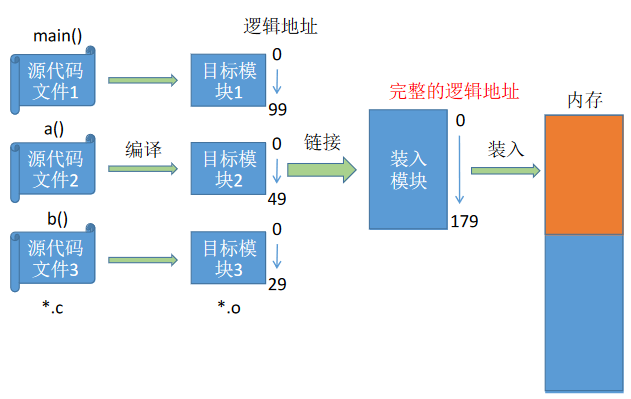

### 装入时动态链接

将各目标模块装入内存时，边装入边链接的链接方式。


### 运行时动态链接

在程序执行中需要该目标模块时，才对它进行链接。其优点是便于修改和更新，便于实现对目标模块的共享。

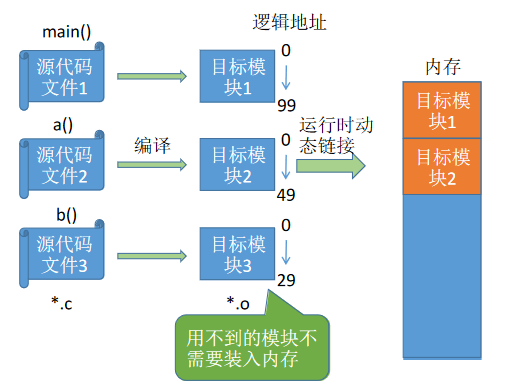

## 总结

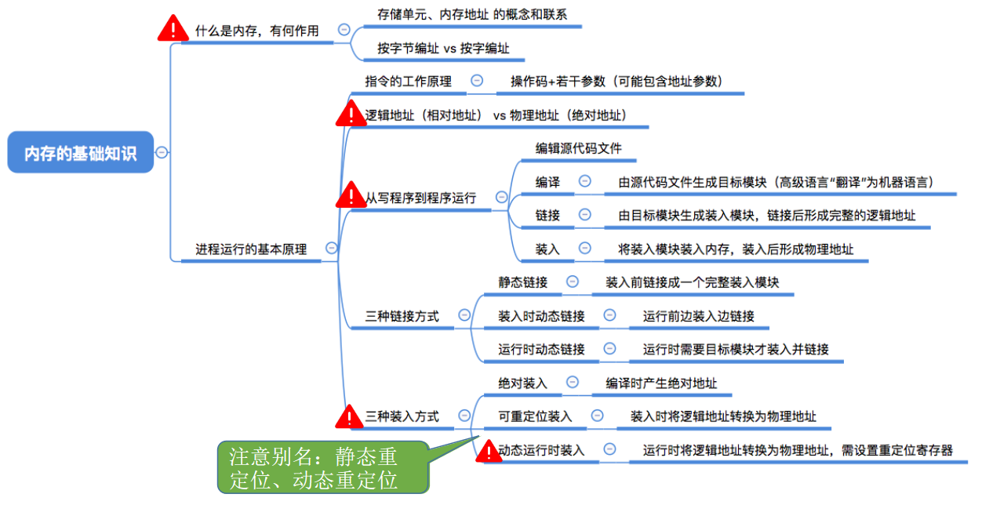

# 内存管理的概念


## 内存空间的分配与回收

- 运行中的进制：操作系统要怎么记录哪些内存区域已经被分配出去了，哪些又还空闲？
- 新来的进程：很多位置都可以放，那应该放在哪里？
- 运行完毕后的进程：如何将进程占用的内存空间回收？

## 内存空间扩充

**操作系统需要提供某种技术从逻辑上对内存空间进行扩充**

游戏GTA的大小超过60GB，按理来说这个游戏程序运行之前需要把60GB数据全部放入内存。然而，实际我的电脑内存才4GB，但为什么这个游 戏可以顺利运行呢？

采用**虚拟技术**（操作系统的虚拟性）

## 地址转换

操作系统需要提供地址转换功能，负责程序的**逻辑地址**与**物理地址**的转换

为了使编程更方便，程序员写程序时应该只需要关注指令、数据的逻辑地址。而逻辑地址到物理地址的转换（这个过程称为**地址重定位**）应该由操作系统负责，这样就保证了程序员写程序时不需要关注物理内存的实际情况。

使用上节讲的三种装入方式即可


## 内存保护

操作系统需要提供**内存保护**功能。保证各进程在各自存储空间内运行，互不干扰

内存保护可采取两种方法：

方法一：在CPU中设置一对上、下限寄存器，存放进程的上、下限地址。进程的指令要访问某个地址时，CPU检查是否越界。

方法二：采用重定位寄存器（又称基址寄存器）和界地址寄存器（又称限长寄存器）进行越界检查。重定位寄存器中存放的是进程的起始物理地址。**界地址寄存器**中存放的是进程的**最大逻辑地址**。

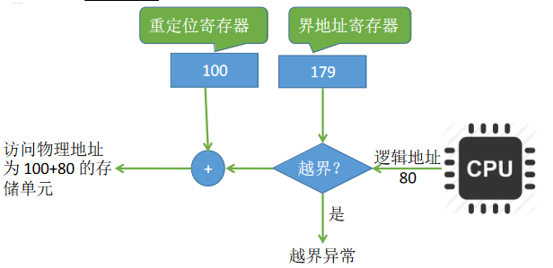

> 179表示最大逻辑地址，也就是说，指令编写的时候，逻辑地址的范围是0-179。

## 总结


# 覆盖与交换

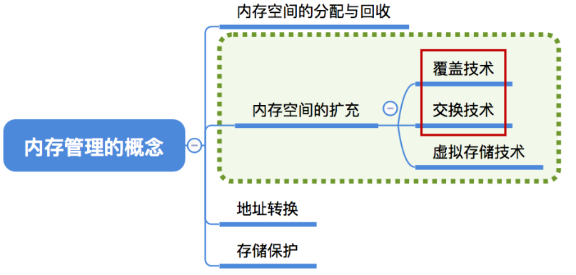

## 覆盖技术

早期的计算机内存很小，比如IBM推出的第一台PC机最大只支持1MB大小的内存。因此经常会出现内存大小不够的情况。

后来人们引入了覆盖技术，用来解决“程序大小超过物理内存总和”的问题

**思想**：将**程序分为多个段**（多个模块）。常用的段常驻内存，不常用的段在需要时调入内存。

内存中分为**一个“固定区”**和**若干个“覆盖区”**

需要常驻内存的段放在“**固定区**”中，**调入后就不再调出**（除非运行结束）

不常用的段放在“**覆盖区**”，**需要用到时调入**内存，用不到时调出内存


注意：对于覆盖区0和覆盖区1，这两段不能重叠，可以观察它们的调用结构了解。但是B和C调用的时候，可以覆盖到覆盖区0里。就不需要把B和C的代码都放到内存里了。

缺点：**必须由程序员声明覆盖结构**，操作系统完成自动覆盖。**对用户不透明**，增加了用户编程负担。**覆盖技术只用于早期的操作系统中**，现在已成为历史。

## 交换技术

交换（对换）技术的设计思想：内存空间紧张时，系统将内存中某些进程**暂时换出**外存，把外存中某些已具备运行条件的进程**换入内存**（进程在内存与磁盘间动态调度）

**中级调度**（内存调度），就是要决定将哪个处于挂起状态的进程重新调入内存

暂时换出外存等待的进程状态为**挂起状态**（挂起态，suspend）挂起态又可以进一步细分为**就绪挂起**、**阻塞挂起**两种状态


几个问题：

- 应该在外存（磁盘）的什么位置保存被换出的进程？

> 具有对换功能的操作系统中，通常把磁盘空间分为**文件区**和**对换区**两部分。
>
> 文件区主要用于存放文件，主要追求存储空间的利用率，因此对文件区空间的管理采用**离散分配方式**；
>
> 对换区空间只占磁盘空间的小部分，被换出的进程数据就存放在对换区。
>
> 由于对换的速度直接影响到系统的整体速度，因此对换区空间的管理主要追求换入换出速度，因此通常**对换区采用连续分配方式**（学过文件管理章节后即可理解）。总之，**对换区的I/O速度比文件区的更快**。

- 什么时候应该交换？

> 交换通常在许多进程运行且内存吃紧时进行，而系统负荷降低就暂停。
>
> 例如：在发现许多进程运行时经常发生**缺页**，就说明内存紧张，此时可以换出一些进程；如果缺页率明显下降，就可以暂停换出。

- 应该换出哪些进程？

> 可优先换出阻塞进程；可换出优先级低的进程；为了防止优先级低的进程在被调入内存后很快又被换出，有的系统还会考虑进程在内存的驻留时间...

**PCB会常驻内存，不会被换出外存**

## 总结


# 连续分配管理方式


连续分配：指为用户进程分配的必须是一个连续的内存空间。

## 单一连续分配

在单一连续分配方式中，内存被分为**系统区**和**用户区**。系统区通常位于内存的低地址部分，用于存放操作系统相关数据；用户区用于存放用户进程相关数据。内存中**只能有一道用户程序**，用户程序独占整个用户区空间。


优点：实现简单；无外部碎片；可以采用覆盖技术扩充内存；不一定需要采取内存保护（eg：早期的PC操作系统MS-DOS）。

缺点：只能用于单用户、**单任务**的操作系统中；有内部碎片；存储器利用率极低。

**内部碎片**：分配给某进程的内存区域中，有些部分没有用上

## 固定分区分配

可分为**分区大小相等**和**分区大小不等**两种形式

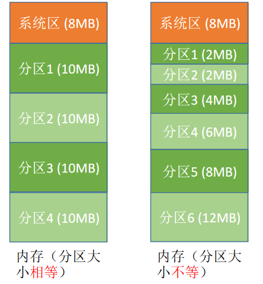

20世纪60年代出现了支持多道程序的系统，为了能在内存中装入多道程序，且这些程序之间又不会相互干扰，于是将**整个用户空间**划分为**若干个固定大小的分区**，在**每个分区中只装入一道作业**，这样就形成了最早的、最简单的一种可运行多道程序的内存管理方式。

**分区大小相等**：缺乏灵活性，但是很适合用于用一台计算机控制多个相同对象的场合（比如：钢铁厂有n个相同的炼钢炉，就可把内存分为n个大小相等的区域存放n个炼钢炉控制程序）

**分区大小不等**：增加了灵活性，可以满足不同大小的进程需求。根据常在系统中运行的作业大小情况进行划分（比如：划分多个小分区、适量中等分区、少量大分区）

**怎样知道分区分配的情况？**
操作系统需要建立一个数据结构——**分区说明表**，来实现各个分区的分配与回收。每个表项对应一个分区，通常按分区大小排列。每个表项包括对应分区的**大小**、**起始地址**、**状态**（是否已分配）。

| 分区号 | 大小(MB) | 起始地址(M) | 状态   |
| ------ | -------- | ----------- | ------ |
| 1      | 2        | 8           | 未分配 |
| 2      | 2        | 10          | 未分配 |
| 3      | 4        | 12          | 已分配 |

用数据结构的数组（或链表）即可表示这个表

当某用户程序要装入内存时，由操作系统内核程序根据用户程序大小检索该表，从中找到一个能满足大小的、未分配的分区，将之分配给该程序，然后修改状态为“已分配”。

优点：实现简单，无外部碎片。

缺点：

- 当用户程序太大时，可能所有的分区都不能满足需求，此时不得不采用覆盖技术来解决，但这又会降低性能；
- 会产生内部碎片，内存利用率低。

## 动态分区分配

**动态分区分配**又称为**可变分区分配**。这种分配方式**不会预先划分内存分区**，而是在进程装入内存时，**根据进程的大小动态地建立分区**，并使分区的大小正好适合进程的需要。因此系统分区的大小和数目是可变的。（eg：假设某计算机内存大小为64MB，系统区8MB，用户区共56MB...）

1.系统要用什么样的数据结构记录内存的使用情况？

2.当很多个空闲分区都能满足需求时，应该选择哪个分区进行分配？

3.如何进行分区的分配与回收操作？


动态分区分配没有内部碎片，但是有外部碎片。

**内部碎片**，分配给某进程的内存区域中，如果有些部分没有用上。

**外部碎片**，是指内存中的某些空闲分区由于太小而难以利用。

如果内存中空闲空间的总和本来可以满足某进程的要求，但由于进程需要的是一整块连续的内存空间，因此这些“碎片”不能满足进程的需求。可以通过**紧凑（拼凑，Compaction）**技术来解决外部碎片。

> 紧凑技术，把分散的进程挪到一块，腾出一块大的进程

1.回忆交换技术，什么是换入/换出？什么是中级调度（内存调度）？

2.思考动态分区分配应使用哪种装入方式？“紧凑”之后需要做什么处理？

> 采用动态重定位，修改进程的起始地址

### 如何记录内存使用情况

两种常用的数据结构：

- **空闲分区表**：每个空闲分区对应一个表项。表项中包含分区号、分区大小、分区起始地址等信息
- **空闲分区链**：每个分区的起始部分和末尾部分分别设置前向指针和后向指针。起始部分处还可记录分区大小等信息

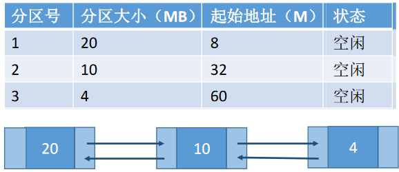

### 如何选择分区

应该用最大的分区进行分配？还是用最小的分区进行分配？又或是用地址最低的部分进行分配？

把一个新作业装入内存时，须按照一定的**动态分区分配算法**，从空闲分区表（或空闲分区链）中选出一个分区分配给该作业。由于分配算法算法对系统性能有很大的影响，因此人们对它进行了广泛的研究。

### 分区分配

目前情况是这样


现在来了4MB的进程，如果分配给分区1


如果分配给分区3


### 分区回收


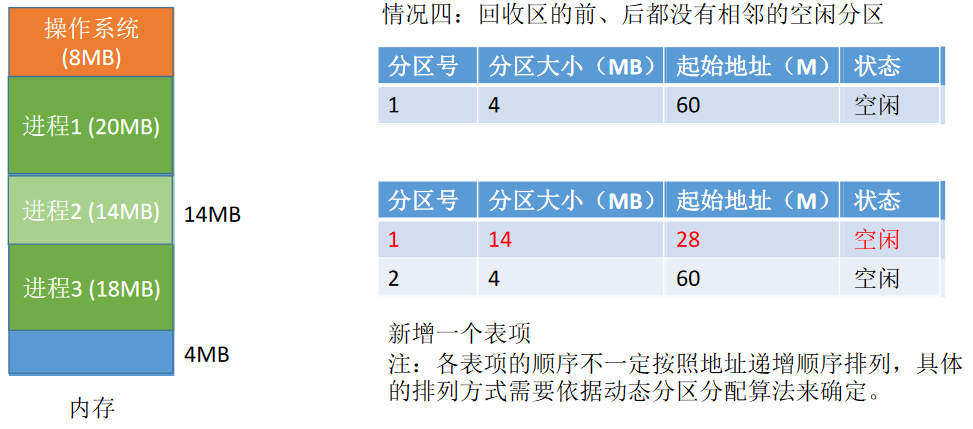

### 总结

# 动态分区分配算法

在动态分区分配方式中，当很多个空闲分区都能满足需求时，应该选择哪个分区进行分配？


## 首次适应算法

**算法思想**：每次都从低地址开始查找，找到第一个能满足大小的空闲分区。

**如何实现**：**空闲分区以地址递增的次序排列**。每次分配内存时顺序查找**空闲分区链**（或**空闲分区表**），找到大小能满足要求的第一个空闲分区。

## 最佳适应算法

**算法思想**：由于动态分区分配是一种连续分配方式，为各进程分配的空间必须是连续的一整片区域。因此为了保证当“大进程”到来时能有连续的大片空间，可以尽可能多地留下大片的空闲区，即，**优先使用更小的空闲区**。

**如何实现**：**空闲分区按容量递增次序链接**。每次分配内存时顺序查找空闲分区链（或空闲分区表），找到大小能满足要求的第一个空闲分区。

**缺点**：每次都选最小的分区进行分配，会留下越来越多的、很小的、难以利用的内存块。因此这种方法**会产生很多的外部碎片**。

## 最坏适应算法

又称最大适应算法（Largest Fit）

**算法思想**：为了解决最佳适应算法的问题——即留下太多难以利用的小碎片，可以在每次分配时优先使用最大的连续空闲区，这样分配后剩余的空闲区就不会太小，更方便使用。

**如何实现**：空闲分区按容量递减次序链接。每次分配内存时顺序查找空闲分区链（或空闲分区表），找到大小能满足要求的第一个空闲分区。

**缺点**：每次都选最大的分区进行分配，虽然可以让分配后留下的空闲区更大，更可用，但是这种方式会导致较大的连续空闲区被迅速用完。如果之后有“大进程”到达，就没有内存分区可用了。

> 对大进程不友好

## 邻近适应算法

算法思想：首次适应算法每次都从链头开始查找的。这可能会导致低地址部分出现很多小的空闲分区，而每次分配查找时，都要经过这些分区，因此也增加了查找的开销。如果**每次都从上次查找结束的位置开始检索**，就能解决上述问题。

如何实现：空闲分区**以地址递增的顺序排列**（可排成一个**循环链表**）。每次分配内存时从上次查找结束的位置开始查找空闲分区链（或空闲分区表），找到大小能满足要求的第一个空闲分区。

首次适应算法每次都要从头查找，每次都需要检索低地址的小分区。但是这种规则也决定了当低地址部分有更小的分区可以满足需求时，会更有可能用到低地址部分的小分区，也会更有可能把高地址部分的大分区保留下来（最佳适应算法的优点）

邻近适应算法的规则可能会导致无论低地址、高地址部分的空闲分区都有相同的概率被使用，也就**导致了高地址部分的大分区更可能被使用，划分为小分区**，最后导致无大分区可用（最大适应算法的缺点）综合来看，四种算法中，**首次适应算法的效果反而更好**

## 总结

最佳/最坏适应算法需要对空闲分区表进行排序


# 基本分页存储管理的基本概念


连续分配：为用户进程分配的必须是一个连续的内存空间。

非连续分配：为用户进程分配的可以是一些分散的内存空间。

## 什么是分页存储

- 什么是**页框**（page frame）与**页面**，它们有什么区别？

将内存空间分为一个个大小相等的分区（比如：每个分区4KB），每个分区就是一个“**页框**”（页框=页帧=内存块=物理块=物理页面）。

每个页框有一个编号，即“**页框号**”（页框号=页帧号=内存块号=物理块号=物理页号），页框号从0开始。

> 内存地址是一个内存单元的地址，一个内存单元比如说16B
>
> 而页框是多个内存单元的集合，比上一节中内存分区要小一点，比如一个页框4KB

将进程的**逻辑地址空间**也分为**与页框大小相等的**一个个部分，每个部分称为一个“**页**”或“**页面**”。每个页面也有一个编号，即“页号”，页号也是从0开始。

> 页框：是对操作系统的内存进行划分
>
> 页/页面：是对程序的逻辑地址进行划分

操作系统**以页框为单位为各个进程分配**内存空间。进程的每个页面分别放入一个页框中。也就是说，进程的**页面**与内存的**页框**有一一对应的关系。

各个页面不必连续存放，可以放到不相邻的各个页框中。

进程的最后一个页面可能没有一个页框那么大。也就是说，分页存储有可能产生内部碎片，因此**页框不能太大**，否则可能产生过大的内部碎片造成浪费

## 页表

这样的话，程序的存储那么割裂，怎么组织起来呢？

为了能知道**进程的每个页面在内存中存放的位置**，操作系统要为每个进程建立一张**页表**。

注：页表通常存在PCB（进程控制块）中


1.一个进程对应一张页表

2.进程的每个页面对应一个页表项

3.每个页表项由“**页号**”和“**块号**”组成，块号就是页框编号（内存块号）

4.页表记录进程页面和实际存放的内存块之间的映射关系

5.每个页表项的长度是相同的

### 每个页表项占多少字节？

> 页表项=页号+块号

页表项连续存放，因此**页号**可以是隐含的，**不占存储空间**（类比数组）

> 假设页表中的各页表项从内存地址为X的地方开始连续存放...如何找到页号为i的页表项？（需要知道**页表的首地址X**）
>
> i号页表项的存放地址=X+3*i因此，页表中的页号可以是隐含的，即页号不占用存储空间

假设某系统物理内存大小为4GB，页面大小为4KB，则每个页表项至少应该为多少字节？

- 计算内存块的个数：4 * 2^30^ / 4 * 2^10^ = 2^20^个内存块
- 需要用20bit来表示内存块的地址
- 也就是至少要用3B（字节）来表示**块号**
- 存储整个页表至少需要3*(n+1)B

> **内存地址与内存号的转换**：内存地址=内存号 * 内存块大小

### 如何实现地址的转换?

回忆：进程在内存中连续存放时，操作系统是如何实现逻辑地址到物理地址的转换的？

> 需要一个重定位寄存器：每次执行指令前，要用起始位置 + 逻辑地址

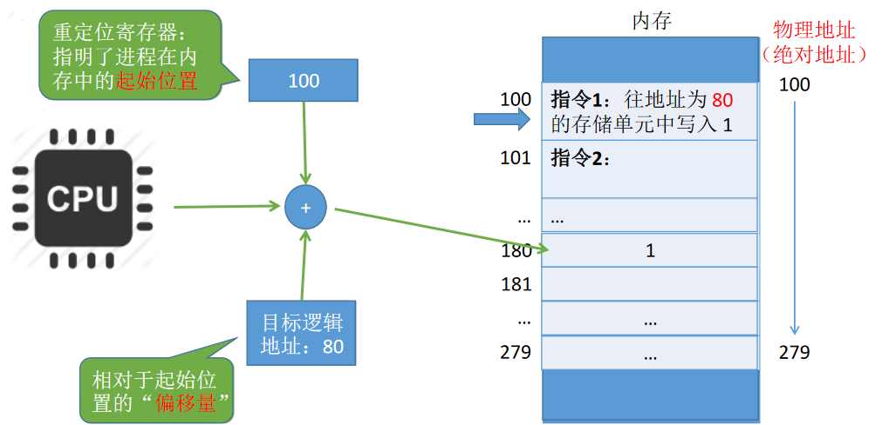

将进程地址空间分页之后，操作系统该如何实现逻辑地址到物理地址的转换？

> 每个页面中的指令，写的是逻辑地址，每个页面都对应一个内存块号（页框号），根据块号可以计算出内存地址，相当于重定位寄存器。

- 如果要访问逻辑地址A
- 确定逻辑地址A对应的**页号**P
- 找到P号页面在内存中的起始地址（查页表）
- 确定逻辑地址A的“**页内偏移量**”W

### 如何确定一个逻辑地址对应的页号、页内偏移量？

在某计算机系统中，页面大小是50B。某进程逻辑地址空间大小为200B，则逻辑地址110对应的页号、页内偏移量是多少？

页号=逻辑地址 / 页面长度 （取除法的整数部分）

页内偏移量=逻辑地址%页面长度（取除法的余数部分）

则该问题中：

页号 = 110 // 50 = 2

页内偏移量=110 % 50 = 10

**逻辑地址**可以拆分为（**页号**，**页内偏移量**）通过页号查询页表，可知页面在内存中的起始地址页面在内存中的起始地址+页内偏移量=实际的物理地址

### 页面大小是2的整数幂的好处

在计算机内部，地址是用二进制表示的，如果**页面大小刚好是2的整数幂**，则计算机硬件可以很快速的把逻辑地址拆分成（页号，页内偏移量）

假设某计算机用8个二进制位表示逻辑地址，页面大小为4B

0号页的逻辑地址范围应该是0-15，用二进制表示应该是：

000**0** 0000 到 0000 1111

1号页的逻辑地址范围应该是16-31，用二进制表示应该是：

000**1** 0000 到 0001 1111

2号页的逻辑地址范围应该是32-47，用二进制表示应该是：

00**10** 0000 到 0010 1111

> 这就很好拆分页号和偏移量
>
> 如果每个页面的大小为2^k^B
>
> 逻辑地址的后k位就是**页内偏移量**
>
> 其余部分就是**页号**

假设**物理地址**也用8个二进制位表示

0号内存块的起始物理地址：0000 0000
1号内存块的起始物理地址：0001 0000
2号内存块的起始物理地址：0010 0000
3号内存块的起始物理地址：0011 0000

假设通过查询页表得知1号页面存放的内存块号是9（1001）

则9号内存块的起始地址=1001 0000

直接加上逻辑地址的页内偏移量即可得到**物理地址**

结论：如果页面大小刚好是2的整数幂，则只需把页表中记录的**物理块号拼接上页内偏移量**就能得到对应的**物理地址**

总结：页面大小刚好是2的整数幂有什么好处？

①逻辑地址的拆分更加迅速——如果每个页面大小为2KB，用二进制数表示逻辑地址，则末尾K位即为页内偏移量，其余部分就是页号。因此，如果让每个页面的大小为2的整数幂，计算机硬件就可以很方便地得出一个逻辑地址对应的页号和页内偏移量，而无需进行除法运算，从而提升了运行速度。

②物理地址的计算更加迅速——根据逻辑地址得到页号，根据页号查询页表从而找到页面存放的内存块号，将二进制表示的内存块号和页内偏移量拼接起来，就可以得到最终的物理地址。

### 逻辑地址结构

逻辑地址 = 页号P + 页内偏移量W

如逻辑地址25 = 0001 1001，P=1，W=9

如果有K位bit位表示页内偏移量，则说明页面大小为2^k^个内存单元

如果有M为bit为表示页号，则说明一个进程最多有2^M^个页面

## 总结

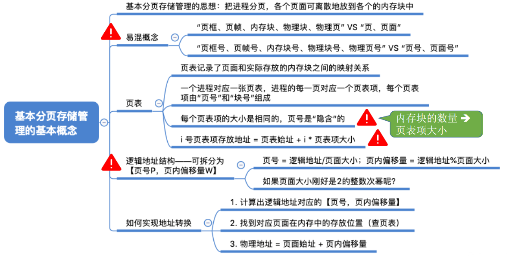

# 基本地址变换机构

> 给出逻辑地址，如何找到物理地址。

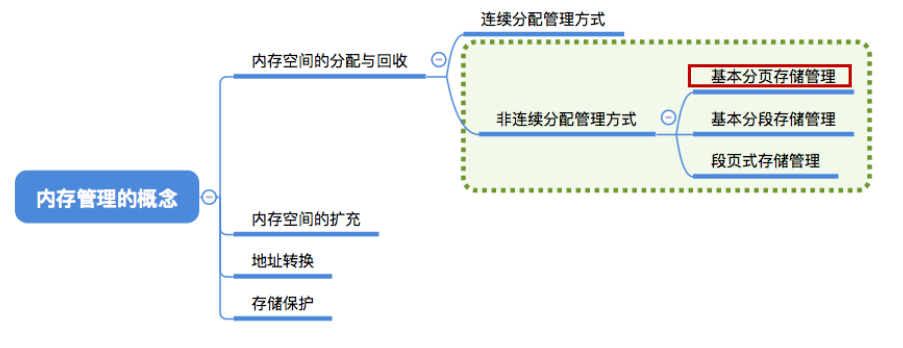

结合上一小节理解基本地址变换机构（用于实现逻辑地址到物理地址转换的一组硬件机构）的原理和流程

基本地址变换机构可以借助进程的页表将逻辑地址转换为物理地址。

通常会在系统中设置一个**页表寄存器**（PTR），存放**页表在内存中的起始地址F**和**页表长度M**。进程未执行时，页表的始址和页表长度放在**进程控制块**（PCB）中，当进程被调度时，操作系统内核会把它们放到页表寄存器中。

注意：**页面大小是2的整数幂**
设页面大小为L，逻辑地址A到物理地址E的变换过程如下：


主要有几个东西，搞清楚这几个东西之间的关系：

- 逻辑地址
- 页表
- 页表寄存器
- PCB

PCB 存储页表的首地址和页表长度，进程没运行时存在PCB，进程运行时，把这两个东西放到页表寄存器

1.通过**逻辑地址**可以获得页号和页内偏移量

2.根据**页表寄存器**中的页表长度，判断页号是否越界

3.根据页号+页表寄存器中的页表首地址，找到内存块号

4.根据内存块号和页内偏移量找到**物理地址**

## 例题

例：若页面大小L为1K字节，页号2对应的内存块号b=8，将逻辑地址A=2500转换为物理地址E。等价描述：某系统按字节寻址，逻辑地址结构中，页内偏移量占10位，页号2对应的内存块号b=8，将逻辑地址A=2500转换为物理地址E。

答案：8644

在分页存储管理（页式管理）的系统中，只要确定了每个页面的大小，逻辑地址结构就确定了。因此，**页式管理中地址是一维**的。即，只要给出一个逻辑地址，系统就可以自动地算出页号、页内偏移量两个部分，并不需要显式地告诉系统这个逻辑地址中，页内偏移量占多少位。

## 对页表项大小的进一步探讨

> 满足页面大小 / 页表项大小 能被整除

每个页表项的长度是相同的，页号是“隐含”的

之前讨论过，一个页表项至少要3个字节才够

假设一个页面为32B，那每个页框可以存放 32 / 3 = 10个页表项，可以存储0-9号页号

第10号页表项的起始位置就是32，计算方式就变成10 * 3 + 2。

加的这个2，特别多余

> 结论：理论上，页表项长度为3B即可表示内存块号的范围，但是，为了方便页表的查询，常常会让一个页表项占更多的字节，使得每个页面恰好可以装得下整数个页表项。

所以，如果用4B表示一个页表项，那一个页框就能存放 8 个页表项，可以存储0 - 7号页号，第8号页号的计算方式也是：8 * 4。这样就很方便

## 总结


# 具有快表的地址变换机构


## 什么是快表

快表，又称**联想寄存器**（TLB，translation lookaside buffer ），是一种**访问速度比内存快很多的高速缓存**（TLB不是内存！），用来存放**最近访问的页表项的副本**，可以加速地址变换的速度。与此对应，内存中的页表常称为**慢表**。


能否把整个页表放在TLB中？

> 不能！成本太高

块表访问的流程

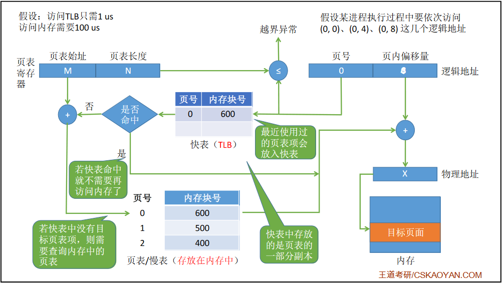

①CPU给出逻辑地址，由某个硬件算得页号、页内偏移量，将页号与快表中的所有页号进行比较。

②如果找到匹配的页号，说明要访问的页表项在快表中有副本，则直接从中取出该页对应的内存块号，再将内存块号与页内偏移量拼接形成物理地址，最后，访问该物理地址对应的内存单元。因此，若**快表命中**，则访问某个逻辑地址仅需**一次访存**即可。

③如果没有找到匹配的页号，则需要访问内存中的页表，找到对应页表项，得到页面存放的内存块号，再将内存块号与页内偏移量拼接形成物理地址，最后，访问该物理地址对应的内存单元。因此，若**快表未命中**，则访问某个逻辑地址需要**两次访存**（注意：在**找到页表项后，应同时将其存入快表**，以便后面可能的再次访问。但若快表已满，则必须按照一定的算法对旧的页表项进行替换）

如果没有快表，需要访问两次内存（一次访问慢表，一次根据物理地址访问内存）那就是200us，如果有快表，假设快表命中率是90%，访问时间就是：100 + 0.9 * 1 + 0.1 * 100=110.9us。

## 局部性原理

如下面这个程序：这个程序执行时，会很频繁地访问10号页面、23号页面

```c
int i = 0;
int a[100];
while (i < 100) {
    a[i] = i;
    i++;
}
```


**时间局部性**：如果执行了程序中的某条指令，那么不久后这条指令很有可能再次执行；如果某个数据被访问过，不久之后该数据很可能再次被访问。（因为程序中存在大量的循环）

**空间局部性**：一旦程序访问了某个存储单元，在不久之后，其附近的存储单元也很有可能被访问。（因为很多数据在内存中都是连续存放的）

上小节介绍的**基本地址变换机构**中，每次要访问一个逻辑地址，都需要查询内存中的页表。由于局部性原理，可能连续很多次查到的都是同一个页表项

## 总结


TLB和普通Cache的区别——TLB中只有页表项的副本，而普通Cache中可能会有其他各种数据的副本

# 两级页表


## 单级页表存在的问题

> 问题1：可能需要**大量连续的页框**来存放页表
>
> 问题2：没有必要让整个页表常驻内存，因为进程在一段时间内可能只需要访问某几个特定的页面。

假设逻辑地址为32位，页面大小为4KB，页表项长度为4B（32bit）页表项表示的是内存块编号

一页有4KB，也就是2^12^B，意味着有2^12^个内存单元。页内偏移量要用12个字节来表示。因此剩下20个字节可以用来表示页号。

最多就有2^20^页，一个页表项对应一页，也就是说，一个最大的页表，存储页表项需要2^20^ * 4B = 2^22^B，也就是4MB。

需要2^22^ / 2^12^ = 2^10^个页框存储该页表

根据页号查询页表的方法：K号页对应的页表项存放位置=页表始址+K* 4

要在**所有的页表项都连续存放**的基础上才能用这种方法找到页表项

根据局部性原理可知，很多时候，进程在一段时间内只需要访问某几个页面就可以正常运行了。因此**没有必要让整个页表都常驻内存**。

## 两级页表的原理、地址结构

把页表再分页并离散存储，然后再建立一张页表记录页表各个部分的存放位置，称为页目录表，或称外层页表，或称顶层页表

把必须连续存放的页表再分页 

可将长长的页表进行分组，使每个内存块刚好可以放入一个分组（比如上个例子中，页面大小4KB，每个页表项4B，**每个页面可存放1K个页表项**，因此**每1k个连续的页表项为一组**，每组刚好占一个内存块，再将各组离散地放到各个内存块中。

为离散分配的页表再建立一张页表，称为**页表目录**（外层页表/顶层页表）

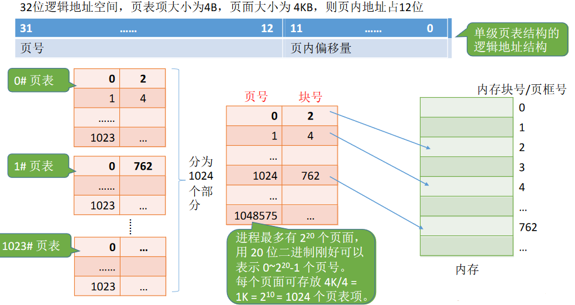


以前20位的页号可以拆分成两级10位的页号

## 地址变换

①按照地址结构将逻辑地址拆分成三部分

②从PCB中读出页目录表始址，再根据一级页号查页目录表，找到下一级页表在内存中的存放位置

③根据二级页号查二级页表，找到最终想访问的内存块号

④结合页内偏移量得到物理地址

用之前的8位逻辑地址，后四位为页内偏移量来测试。把前4位划分成2级页表

假设逻辑地址为：1001 0011

页号为9 也就是 1001，页内偏移量为0011

一级页号就是10，二级页号就是01

| 一级页号 | 内存块号 |
| -------- | -------- |
| 00       | 1        |
| 01       | 2        |
| 10       | 4        |
| 11       | 5        |

根据一级页号10，找到内存块号为4的内存，得到二级页表

| 二级页号 | 内存块号 |
| -------- | -------- |
| 00       | 6        |
| 01       | 8        |
| 10       | 9        |
| 11       | 11       |

根据二级页号01，找到内存块号8，也就是1000，加上页内偏移量0011

得到物理地址：1000 0011

## 解决问题二

可以在需要访问页面时才把页面调入内存（虚拟存储技术）。可以在页表项中增加一个标志位，用于表示该页面是否已经调入内存


## 总结

若分为两级页表后，页表依然很长，则可以采用更多级页表，一般来说各级页表的大小不能超过一个页面


# 基本分段存储管理方式


## 什么是分段

进程的地址空间：按照程序自身的逻辑关系划分为若干个段，每个段都有一个段名（在低级语言中，程序员使用段名来编程），每段从0开始编址

内存分配规则：以段为单位进行分配，**每个段在内存中占据连续空间**，但**各段之间可以不相邻**。

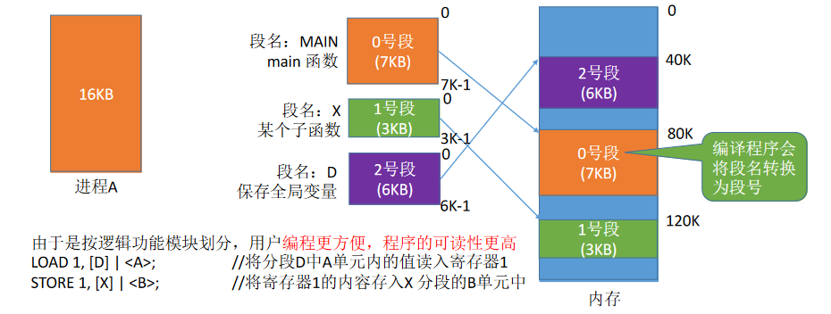

分段系统的逻辑地址结构由段号（段名）和段内地址（段内偏移量）所组成。如：

| 31 …… 16 | 15 …… 0  |
| -------- | -------- |
| 段号     | 段内地址 |

**段号的位数**决定了每个**进程最多可以分几个段**

**段内地址位数**决定了每个段的**最大长度**是多少

在上述例子中，若系统是按字节寻址的，则段号占16位，因此在该系统中，每个进程最多有2^16^=64K个段

段内地址占16位，因此每个段的最大长度是2^16^=64KB。

```
LOAD 1, [D] | <A>;   // 将分段D中A单元的值读入寄存器1
STORE 1, [X] | <B>;  // 将寄存器1的内容存入X分段的B单元中
```

写程序时使用的段名[D]、[X]会被编译程序翻译成对应**段号**

`<A>`单元、`<B>`单元会被编译程序翻译成**段内地址**


## 段表

和页表一样，需要知道段所在的地址，但是除了地址之外，还需知道段的长度


1.每个段对应一个段表项，其中记录了该段在内存中的**起始位置**（又称“**基址**”）和**段的长度**。

2.**各个段表项的长度是相同的**。例如：某系统按字节寻址，采用分段存储管理，逻辑地址结构为（段号16位,段内地址16位），因此用16位即可表示最大段长。物理内存大小为4GB（可用32位表示整个物理内存地址空间）。因此，可以让每个段表项占16+32=48位，即6B。由于段表项长度相同，因此段号可以是隐含的，不占存储空间。若段表存放的起始地址为M，则K号段对应的段表项存放的地址为M+K*6

> 逻辑地址 = 段号 + 段内地址
>
> 段表项 = 段长 + 基地址
>
> 段长位数等于段内地址位数
>
> 基地址位数根据内存大小来确定

## 地址变换

```
LOAD 1, [D] | <A>; // 将分段D中A单元内的值读入寄存器1
```

经过编译程序编译后，形成等价的机器指令：“取出段号为D=2，段内地址为A=1024的内存单元中的内容，放到寄存器1中” 

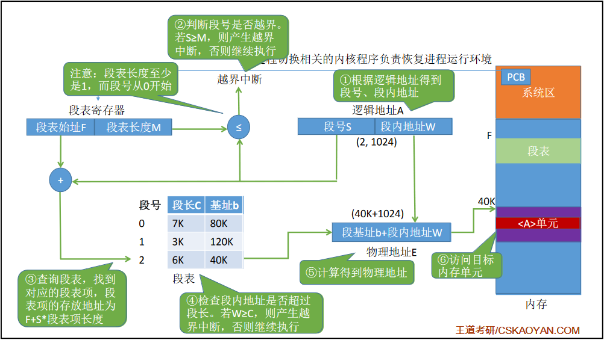

搞清楚如何获得物理地址A

- 逻辑地址A=段号S+段内地址W
- 段表寄存器=段表始址F+段表长度M
- 若段号大于段表长度，越界中断
- 找到段表项所在位置=段号S*段表项长度 + 段表始址F
- 根据段表项，获得段长C和基地址b
- 若段内地址大于段长，越界中断
- 物理地址：基地址b + 段内地址W

## 分段、分页管理的对比

**页****是信息的物理单位****。分页的主要目的是为了实现离散分配，提高内存利用率。分页仅仅是系统管理上的需要，完全是系统行为，**对用户是不可见的**。

**段**是信息的**逻辑单位**。分段的主要目的是更好地满足用户需求。一个段通常包含着一组属于一个逻辑模块的信息。**分段对用户是可见的**，用户编程时需要显式地给出段名。

页的大小固定且由系统决定。段的长度却不固定，决定于用户编写的程序。

**分页**的用户进程地址空间是**一维**的，程序员只需给出一个记忆符即可表示一个地址。

**分段**的用户进程地址空间是**二维**的，程序员在标识一个地址时，既要给出**段名**，也要给出**段内地址**。


**分段**比分页**更容易实现信息的共享和保护**。

不能被修改的代码称为**纯代码**或**可重入代码**（不属于临界资源），这样的代码是可以共享的。可修改的代码是不能共享的（比如，有一个代码段中有很多变量，各进程并发地同时访问可能造成数据不一致）


如何理解这一点

因为一个进程A是按照功能，分段存到内存里的。另外一个进程B想用进程A的某个功能段，只需要将各进程的段表项指向同一个段即可实现共享

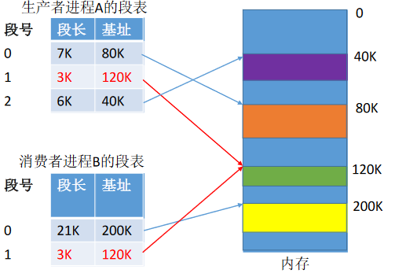

为什么分页不方便共享

如果让消费者进程的某个页表项指向橙色3KB的页面，显然不合理，因为这个页面中的橙色部分是不允许共享的，只有绿色部分可以

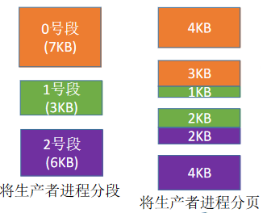

1、2号页面只有一部分允许其他进程访问，因此很难用页表实现信息保护


**访问一个逻辑地址需要几次访存**？

分页（单级页表）：第一次访存——查内存中的页表，第二次访存——访问目标内存单元。总共**两次**访存

分段：第一次访存——查内存中的段表，第二次访存——访问目标内存单元。总共**两次**访存

与分页系统类似，分段系统中**也可以引入快表机构**，将近期访问过的段表项放到快表中，这样**可以少一次访问**，加快地址变换速度。

## 总结


# 段页式管理方式


|          | 优点                                                     | 缺点                                                         |
| -------- | -------------------------------------------------------- | ------------------------------------------------------------ |
| 分页管理 | 内存空间利用率高，不会产生外部碎片，只会有少量的页内碎片 | 不方便按照逻辑模块实现信息的共享和保护                       |
| 分段管理 | 很方便按照逻辑模块实现信息的共享和保护                   | 如果段长过大，为其分配很大的连续空间会很不方便。另外，段式管理会产生外部碎片 |

分段管理中产生的外部碎片也可以用“紧凑”来解决，只是需要付出较大的时间代价

## 段页式管理

> 先分段再分页

将进程**按逻辑模块分段**，再**将各段分页**（如每个页面4KB）再将内存空间分为大小相同的内存块/页框/页帧/物理块进程前将各页面分别装入各内存块中

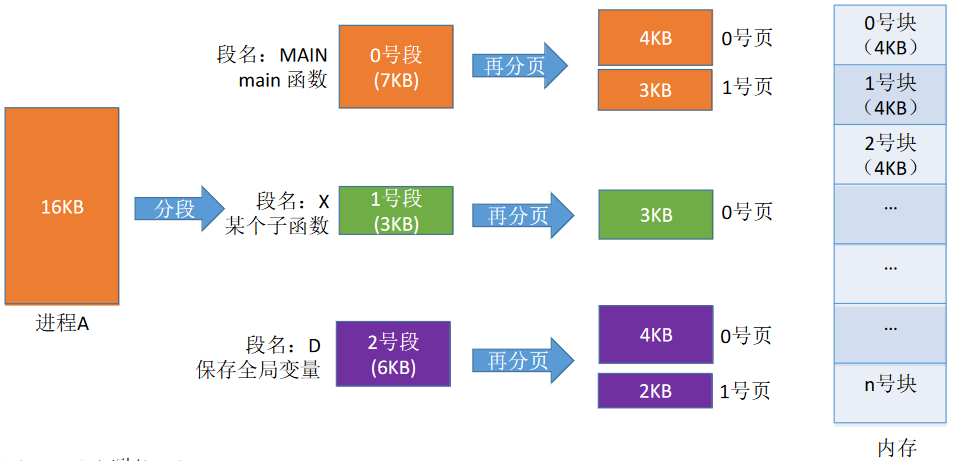

## 逻辑地址结构

| 31 …… 16            | 15 …… 12                 | 11 …… 0                               |
| ------------------- | ------------------------ | ------------------------------------- |
| 段号                | 页号                     | 页内偏移量                            |
| 16位，最多2^16^个段 | 4位，每个段最多2^4^=16页 | 12位，每个页面内存块大小为2^12^=4096B |

**段号**的位数决定了每个进程最多可以分几个段
**页号**位数决定了每个段最大有多少页
**页内偏移量**决定了页面大小、内存块大小是多少

分段”对用户是可见的，程序员编程时需要显式地给出段号、段内地址。而将各段“分页”对用户是不可见的。系统会根据段内地址自动划分页号和页内偏移量。因此**段页式**管理的**地址结构**是**二维**的


> 一个段表，多个页表

段表=(段号) + 页表长度 + 页表存放块号

页表=(页号) + 内存块号

## 地址转换


开局一个逻辑地址

- 逻辑地址=段号+页号+页内偏移量
- 根据段号，找到对应该段号的页表（访存）
- 根据页号和找到的页表，找到内存块号（访存）
- 根据内存块号和页内偏移量，得到物理地址（访存）

需要三次访存

可以引入块表机制，可以节省2次访存。

## 总结

