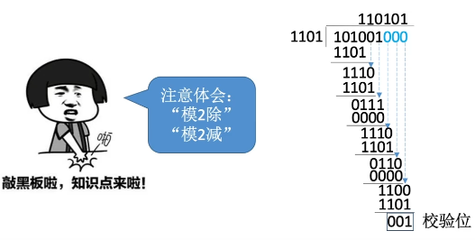
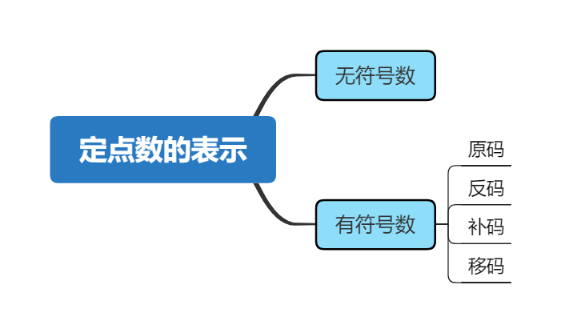
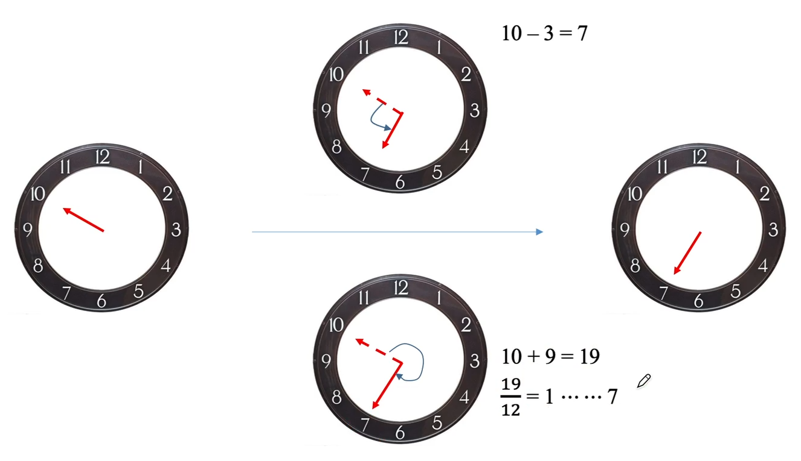
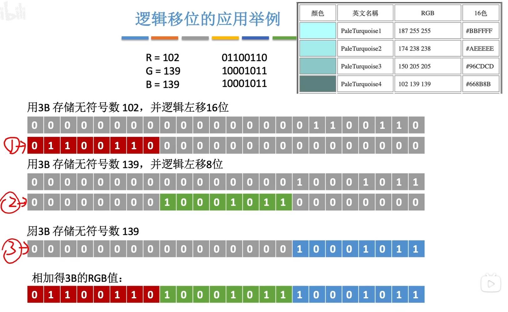
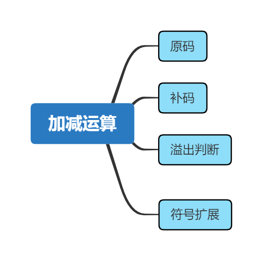
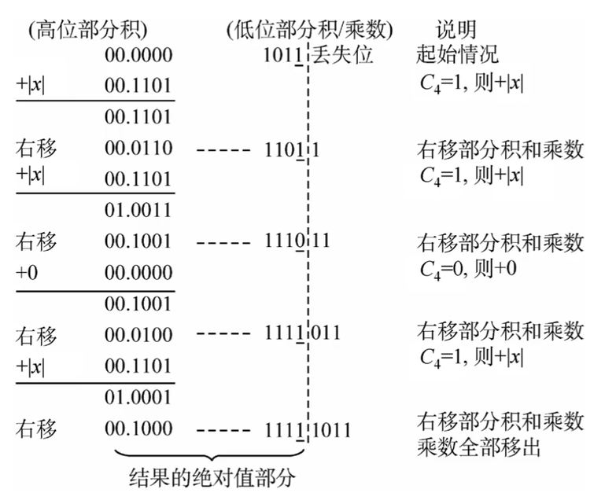

https://www.bilibili.com/video/BV1BE411D7ii?p=8

数据如何在计算机中表示？

运算器如何实现数据的算数、逻辑运算？

# 1.编码与检验码

## 进位计数制

基数：每个数码位所用到的不同符号的个数。

比如10进制的基数是10,16进制的基数是16

### **二进制，八进制，十六进制怎么转换成十进制**

位权：

```
3 2 1 0 -1 -2 -3  # 这个就是位权
1 0 0 1. 1  1  0

-> 十进制

1 * 2^3 + 0 * 2^2 + 0 * 2^1 + 1 * 2^0 + 1 * 2^-1 + 1 * 2^-2
= 8 + 0 + 0 + 1 + 0.5 + 0.25
= 9.75
```

### **二进制和八进制十六进制的转换**

这个比较简单，就略过了嗷

### **十进制与任意进制的转换**

十进制数除以基数，对于整数部分，是先从尾巴开始得到的。**除基取余**法。

11转换为2进制

```
11 % 2 = 5 + (1)
5 % 2  = 2 + (1)
2 % 2  = 1 + (0)
1 % 2  = 0 + (1)
1011
```

关键是小数部分怎么转换？

比如0.3 转换为2进制（**乘基取整**）

```
0.3 * 2 = (0) + 0.6
0.6 * 2 = (1) + 0.2
0.2 * 2 = (0) + 0.4
0.4 * 2 = (0) + 0.8
0.8 * 2 = (1) + 0.6
0.01001
```


### 真值和机器数

真值就是人类习惯的方式，机器数就是计算机习惯的方式。

```
真值  机器数

+15  0 1111
-8   1 1000
```

**体会到的新东西**

```
二进制    十进制
0.1   ->  0.5
0.01  ->  0.25
0.001 ->  0.125

八进制
0.1   ->  0.125
0.01  ->  0.015625

十六进制
0.1   ->  0.0625
```

十六进制与二进制的互转，应该要背

```
0000 -> 0  0001 -> 1  0010 -> 2  0011 -> 3
0100 -> 4  0101 -> 5  0110 -> 6  0111 -> 7
1000 -> 8  1001 -> 9  1010 -> A  1011 -> B
1100 -> C  1101 -> D  1110 -> E  1111 -> F
```

十进制的小数如何转换为二进制

乘基取整，其实不难，很强。

## BCD码

BCD码的作用，方便二进制和十进制的转换。就是十进制数在计算机内部如何保存的问题。

Binary-Coded Decimal‎，原理就是用4位二进制数来表示十进制数。

### 8421码

比如985这三个数字，用8421码表示的话就是：

>1001 1000 0101

**问题**：如何利用8421码进行相加？比如5 + 8 = 13

>5      +    8     =   13

问题是超过了10，而8421码只能保存0~9这9个数字。

**解决**：对于大于等于10的数，给这个数加上一个6(0110)

>13(1101) + 6(0110) = 1 0011 -> 1(0001) 3(0011)

这样就刚好还是按照8421码的格式表示了一个数字

### 余3码

余三码 = 8421码 + (0011)~2~ 

其他都一样，但是余三码是无权重的

### 2421码

改变了权值定义，但是可能会有歧义，比如

> 5 可以表示为
>
> 1011 或 0101

所以规定：5~9之间的数字首位必须是1。

## 字符与字符串

讨论字符串如何在计算机里存储

### ASCII


采用7位二进制编码，共有128个常用字符。由于计算机字节的单位是8，所以凑了一位，一共是8位。

常用的记一下

>a 97
>
>A 65
>
>0 48

32~126是可印刷字符，其他的是控制或通信字符(ACK)。

### 汉字的表示和编码

1980年设计了GB 2312-80: 汉字+各种符号一共7445个

采用的是**区位码**编码：一共有94个区，每区94个位置。

但由于ascii码的前32位是控制字符，如果你发送了一条信息是这样的：`0000 0110 ...`。别人接受到前8个bit，一看是6。对方计算机可能会误以为你发了个ACK码。

所以为了防止信息交换时域“控制/通信字符”冲突，区码和位码都需要加上20H。这样就得到了**国标码**。

国标码再加上 80H，就得到了**汉字内码**（机内码）。

为什么要加80H，ascii一共只用到了前7位，还是那个问题，如果对方机器读到一个字节，且字节的数值小于128。它可能会误以为是ascii码，所以要加上一个128(80H)。这样，每个汉字的一个字节的编码都是大于128的。


**汉字的输入编码**

比如说拼音

**输出编码**

汉字字形码


二进制为1的地方，表示这个点要显示，为0表示这个点不显示。

### 字符串的存储

**英文字符串存储**

比如存储`"abc"`

在内存中就是：`61H 62H 63H 00H`

`00H`作为字符串结尾的标志。


**中文字符串存储**

比如存储`"abc啊"`

在内存中就是：`61H 62H 63H B0H A1H 00H`

其中`BOH A1H`就是中文的“啊”的编码。但是其实这个顺序是不一定的：

- 大端模式：`B0H A1H`，最高有效字节存前面
- 小端模式：`A1H B0H`

## 奇偶校验码

### 基本概念

在传输过程中，数据传错了，怎么检验。

由若干位代码组成的一个字叫**码字**，下面是4个码字

>00 01 10 11

将两个码字逐位进行对比，具有不同的位的个数称为两个码字之间的距离。

> 001 和 011 的距离就是 1

一种编码方案可能有若干个合法码字，各合法码字间的最小距离称为“**码距**”用$d$表示。

当$d=1$时，无检错能力；当$d=2$时，有检错能力；当$d \ge 3$时，若设计合理，可能具有检错、纠错的能力。

### 如何进行校验

#### 原理

奇校验码：整个校验码（有效信息位和**校验位**）中“1”的个数为**奇数**。

偶校验码：整个校验码（有效信息位和**校验位**）中“1”的个数为**偶数**。

**注意：是包括校验位的**

以奇校验码为例：

> 给出两个编码 1001101 和 1010111 的奇校验码：
>
> 答：分别为 1 和 0
>
> 补充后：01001101 和 11010111

如果数据在发送过程中，发生了1bit的跳变，就能检测出这段数据发生了错误。但是如果发生了2bit的跳变，那奇偶校验码就**无法检测出错误**。

#### 硬件实现

各信息进行异或（模2加）运算，得到的结果即为偶校验位。

异或运算：同0异1

> 原数据：1001101
>
> 异或运算：1 ⊕0⊕0⊕1⊕1⊕0⊕1=0
>
> 则这串数据的偶校验码就是 0
>
> 新数据：01001101
>
> 然后进行检验：0⊕1⊕0⊕0⊕1⊕1⊕0⊕1=0 说明结果可能正确

如果检验运算结果为1，则结果出错。

#### 缺陷

- 只能发现奇数位错误
- 无法确定是哪一位出错

## 海明校验码

Richard Hamming于1950年提出

- 检验码有几个，怎么确定个数
- 如何确定每个位置检验码的值
- 如何检错纠错

### 基本思想

设计思路：将信息位分组进行偶校验→多个校验位。希望不仅能反馈对错，还能知道哪里发生了错误。

问题：

- 怎么分组
- 需要设置多少个校验位

假设一共有$n$个信息位，$k$个校验位。

$k$个校验位就能表示$2^k$种状态，总信息位数是$n+k$，还需额外有1位表示数据正确，则要满足如下不等式：
$$
2^k \ge n + k + 1
$$

### 求解步骤

设信息位：1010

**1.确定海明码的位数**

根据上述不等式可以得校验位的个数$k=3$

设信息位为$D_4D_3D_2D_1(1010)$，校验位为：$P_3P_2P_1$

则对应的海明码为：$H_7H_6H_5H_4H_3H_2H_1$


2.确定校验位的分布

校验位$P_i$放在海明码位号为$2^{i-1}$的位置上，信息位按位填入，则：

$H_7H_6H_5H_4H_3H_2H_1$

$D_4D_3D_2P_3D_1P_2P_1$


**3.求校验位的值**

首先把数据位的下标转换成二进制的形式：

>$D_4=1 \rightarrow H_7$ 111
>
>$D_3=0 \rightarrow H_6$ 110
>
>$D_2=1 \rightarrow H_5$ 101
>
>$D_1=0\rightarrow H_3$ 011

对于$P_1$这个组

$P_1 = H_3 \oplus H_5 \oplus H_7 = D_1 \oplus D_2 \oplus D_4 = 0$

$P_2 = H_3 \oplus H_6 \oplus H_7 = D_1 \oplus D_3 \oplus D_4 =1$

$P_3 = H_5 \oplus H_6 \oplus H_7 = D_2 \oplus D_3 \oplus D_4 =0$

最终的结果就是：`1010010`

**4.纠错**

计算分组内的数据和对应分组的校验码的异或值，如果结果是0，那就没问题。

$S_1 = P_1 \oplus D_1 \oplus D_2 \oplus D_4$

$S_2 = P_2 \oplus D_1 \oplus D_3 \oplus D_4$

$S_3 = P_3 \oplus D_2 \oplus D_3 \oplus D_4$

如果发生了错误，比如`1010000`

计算出来的结果就是$S_1=0,S_2=1,S_3=0$

这样就确定了第`2(010)`位发生了错误。

### 补充

海明码具有1位纠错能力和2位检错能力。

一般会加入一个全校验位，对整体进行偶校验。这个就和之前的偶校验一样。

如果$S_3S_2S_1=000$，且全体偶校验**成功**，则无错误

如果$S_3S_2S_1 \neq 000$，且全体偶校验**失败**，有1位错，可以纠正

如果$S_3S_2S_1 \neq 000$，且全体偶校验**成功**，有2位错，需重传

## 循环冗余校验码

Cyclic Redundancy Check，CRC

- 给定源数据和生成多项式怎么做
- 如何检错纠错

设计思想：数据是二进制表示的，可以转换为十进制的数字，比如可能是56。约定一个除数，比如说是7。若 56 ÷ 7最后能被整除，说明数据没错，否则说明数据发生了错误。

- 怎么获得除数

- 怎么构建被除数

> 设生成多项式$G(x)=x^3+x^2+1$，信息码为101001，求对应的CRC码。

1.确定信息码的长度K，生成多项式的最高次幂R，以及生成多项式对应的二进制码。

由题目可得的二进制码=1101 ($1 \cdot x^3 + 1 \cdot x^2 + 0 \cdot x^1 + 1 \cdot x^0$ )

信息码的长度K=6

生成多项式的最高次幂R=3

则校验码位数N = K + R = 9

**2.移位**

信息码左移R位

**3.相除**

用生成多项式进行模2除法，产生余数。



这里的模2减相当于异或操作。

最终的CRC码：101001 **001**

**4.检错和纠错**

发送：101001001

接收：101001001，用1101进行模2除，余数为000，代表没有出错。


如果校验位能表示信息位+校验位的所有状态，CRC就具有纠错1位的能力。 
$$
2^R \ge K + R + 13
$$

# 2.计算

## 定点数表示

定点数：小数点的位置固定，例如常规计数法：996.007

浮点数：小数点的位置不固定，例如科学计数法：9.96007×10^2^

二进制的定点数、浮点数也类似。



### 无符号数的定点表示

整个机器字长的全部二进制位均为数值位，没有符号位，相当于数的绝对值。

> 1001 1100B
>
> = 1 × 2^7^ + 0 × 2^6^ + 0 × 2^5^ + 1 × 2^4^ +  × 2^3^ + 1 × 2^2^ + 1 × 2^1^ + 0 × 2^0^
>
> = 156D

表示范围：

- 8位二进制数：0~255
- 16位二进制数：0~65535
- n位无符号数：0~2^n^ - 1

无符号数只探讨整数

### 有符号数的定点表示

定点整数=符号位(1)+数值部分(n-1)+隐含的小数点(0)

定点小数=符号位(1)+隐含的小数点(0)+数值部分(n-1)

数值部分也称为尾数。

可以用，**原码、反码、补码**三种方式来表示定点整数和定点小数。还可以用**移码**来表示定点整数。若真值为x，则用[x]~原~、[x]~反~、[x]~补~、[x]~移~分别表示真值所对应的原码、反码、补码、移码。

#### 原码

用尾数表示真值的绝对值，符号位“0/1”对应“正/负”

定点整数的表示

>​              原码
>
>+19D: 0001 0011
>
>-19D: 1001 0011

定点小数的表示

>​              原码
>
>+0.75D 0110 0000
>
>-0.75D 1110 0000

若机器字长n+1位，则

**原码整数的表示范围**

$-(2^n-1) \le x \le (2^n-1)$

**原码小数的表示范围**

$-(1-2^{-n}) \le x \le (1-2^{-n})$

**真值0有+0和-0两种形式**

#### 反码

若符号位为0，则反码与原码相同

若符号位为1，则**数值位**全部取反

| 真值   | 原码      | 反码      |
| ------ | --------- | --------- |
| +19D   | 0001 0011 | 0001 0011 |
| -19D   | 1001 0011 | 1110 1100 |
| +0.75D | 0110 0000 | 0110 0000 |
| -0.75D | 1110 0000 | 1001 1111 |

表示范围和原码一致

#### 补码

正数的补码=原码

负数的补码=反码末位+1（要考虑进位）

负数的原码转补码和补码转原码的方式是一样的

**补码的真值0只有一种表示形式**，所以就有约定`1000 0000`表示$-2^7$，对于补码小数就是 -1。

补码的整数表示范围：$-2^n \le x \le 2^n - 1$

补码的小数表示范围：$-1 \le x \le (1-2^{-n})$

#### 移码

补码的基础之上将符号位取反。注意：**移码只能用于表示整数**

移码的作用：可以很方便地对比数的大小。

|      | 补码 | 移码 |
| ---- | ---- | ---- |
| +7   | 0111 | 1111 |
| +6   | 0110 | 1110 |
| +5   | 0101 | 1101 |
| +4   | 0100 | 1100 |
| +3   | 0011 | 1011 |
| +2   | 0010 | 1010 |
| +1   | 0001 | 1001 |
| 0    | 0000 | 1000 |
| -1   | 1111 | 0111 |
| -2   | 1110 | 0110 |
| -3   | 1101 | 0101 |
| -4   | 1100 | 0100 |
| -5   | 1011 | 0011 |
| -6   | 1010 | 0010 |
| -7   | 1001 | 0001 |
| -8   | 1000 | 0000 |

#### 总结

| 真值   | 原码      | 反码      | 补码      | 移码      |
| ------ | --------- | --------- | --------- | --------- |
| +19D   | 0001 0011 | 0001 0011 | 0001 0011 | 1001 0011 |
| -19D   | 1001 0011 | 1110 1100 | 1110 1101 | 0110 1101 |
| +0.75D | 0110 0000 | 0110 0000 | 0110 0000 | 1110 0000 |
| -0.75D | 1110 0000 | 1001 1111 | 1010 0000 | 0010 0000 |
| +0     | 0000 0000 | 0000 0000 | 0000 0000 | 1000 0000 |
| -0     | 1000 0000 | 1111 1111 | 0000 0000 | 1000 0000 |

技巧：已知x的补码，求-x的补码，符号位、数值位全部取反，末位+1

表示范围(假设机器字长位n+1位)

|      | 原码                      | 反码   | 补码             | 移码   |
| ---- | ------------------------- | ------ | ---------------- | ------ |
| 整数 | $[-(2^n-1), (2^n-1)]$     | 同原码 | $[-2^n,2^n-1]$   | 同补码 |
| 小数 | $[-(1-2^{-n}), 1-2^{-n}]$ | 同原码 | $[-1, 1-2^{-n}]$ | 无     |

## 原码补码移码的作用

为了能够进行加减法，对于无符号数，没问题

> 0000 1110(14)
>
>+1000 1110(142)
>
>=1001 1100(156)

对于有符号数，就会出现下面这种情况，这就错了。

> 0000 1110(14)
>
>+1000 1110(-14)
>
>=1001 1100(-28)

主要是从硬件角度考虑，希望只用一个加法器就能同时进行加、减运算。


$$
-3 \% 12 = 9 \% 12 = 9
$$
余数的定义，能找到唯一的整数$q$使得下面第二个式子满足：
$$
x \% m = r\\
x = qm+r
$$
所以在模12的条件下，-15，-3，9，21...这些数是等价的。

互为补数：2数绝对值之和等于模，比如 `abs(-3) + 9 == 12`

若能找到负数的补数，就可以用正数的加法来等价替代减法。

> **模 - 负数的绝对值 = 负数的补数**
>
> 12 - (-3) = 9

切换到二进制的视角，因为最多只有8位，所以实天然的模就是256(1 0000 0000)。

对于-14(1000 1110)的绝对值就是14(0000 1110)

>**模 - 负数的绝对值 = 负数的补数**
>
>1 0000 0000 - 0000 1110 = 1111 0001 + 1
>
>= 1111 0010（恰好是-14的补码）

因此运算就变成，这就能正确表示了。

> 0000 1110(14)
>
>+1111 0010(-14的补码)
>
>= 1 0000 0000(0)

## 移位运算


### 算数移位

原码的算数移位：符号位保持不变，仅对数值位进行移位。

> 1001 0100 (-20D)
>
> 1010 1000 (-40D) 算数左移
>
> 1101 0000 (-80D) 算数左移
>
> 1010 0000 (-32D) 算数左移，严重误差
>
> 1000 1010 (-10D) 算数右移
>
> 1000 0101 (-5D) 算数右移
>
> 1000 0010 (-2D) 算数右移，精度丢失。

反码的算数移位

正数和原码一致

负数补位是补1，左右移都是补1

>原码：1001 0100(-20D)
>
>反码：1110 1011(-20D反)
>
>左移：1101 0111(-40D反)

补码的算数移位

正数一致

负数：左移时低位补0，右移时高位补1

>原码：1001 0100(-20D)
>
>反码：1110 1011(-20D反)
>
>补码：1110 1100(-20D补)
>
>左移：1101 1000(-40D补)
>
>右移：1111 0110(-10D补)

总结

|      | 码制             | 添补代码             |
| ---- | ---------------- | -------------------- |
| 正数 | 原码、反码、补码 | 0                    |
| 负数 | 原码             | 0                    |
| 负数 | 补码             | 左移添0<br />右移添1 |
| 负数 | 反码             | 1                    |

左移相当于乘2右移相当于除2

#### 用途

计算机实现乘法的过程，例如20×7

>20 × 7 = 20 × (2^0^+2^1^+2^2^)
>
>= 20 + 20左移一位 + 20左移两位

### 逻辑移位

无符号数的算数移位，没有符号位。左右移都是补0

应用：



### 循环移位

移出来的位被补到最后一位

>1000 1110
>
>左移：0001 1101
>
>右移：0100 0111

进位位，一个1bit的位，记录运算过程中有没有发生进位

带进位位的循环移位，就是把进位位添补到左边或者右边。

移出的位放到进位位，原进位位补上空缺。

>1 0110 1011
>
>0 1101 0111(左移)
>
>1 1011 0101(右移)

应用：

调换高低字节。

## 加减运算



### 原码的加减运算

加法运算

| 正+正                | 负+负                | 正+负                                    | 负+正                                    |
| -------------------- | -------------------- | ---------------------------------------- | ---------------------------------------- |
| 绝对值做加法结果为正 | 绝对值做加法结果为负 | 绝对值大的减绝对值小的，符号同绝对值大的 | 绝对值大的减绝对值小的，符号同绝对值大的 |

减法运算：转换为加法运算

| 正-负 | 负-正 | 正-正 | 负-负 |
| ----- | ----- | ----- | ----- |
| 正+正 | 负+负 | 正+负 | 负+正 |

### 补码的加减运算

使用补码实现加法运算，比如15 + (-24)

结果再取一个补码。

>0000 1111(15D)
>
>1001 1000(-24D)
>
>0000 1111(15D补)
>
>1110 1000(-24D补)
>
>1111 0111(X补)
>
>1000 1001(X原)
>
>可以求得X=-9D

符号位也会参与相加的运算。

技巧：一个数的补码，找到最右边的1，这个1和它右边的数和原码一致，这个1左边的数除了符号位全部取反。

例如：

>1101 1100 -> 1010 0100
>
>0001 0110 -> 0110 1010 

### 溢出判断

设机器字长为8位（含1位符号位），A=15，B=-24，C=124

只有正+正或负+负才会发生溢出。

#### 方法1：

若正+正的结果的符号位不为正，则说明发生了溢出。可以用这个公式来表示，实际上就是结果符号位不等于两数符号位时就知道发生了溢出。

这个公式考虑到了所有可能。

- 如果A和B的符号位不同，结果一定是0
- 如果ABS的符号位相同，结果一定是0

$$
V=A_sB_s\overline{S}_s+\overline{A}_s\overline{B}_sS_s
$$

若V=1，表示有溢出

$A_s、B_s、S_s$分别表示A、B和运算结果的符号位。

#### 方法2：

采用一位符号位，根据数据位进位情况判断溢出。

符号位的进位为$C_s$，最高数值位的进位为$C_1$

当两个正数相加，最高位变成了1，此时$C_s=0, C_1=1$说明发生了上溢

当两个负数相加，最高位从1变成了0，此时$C_s=1,C_1=0$，说明发生了下溢。

#### 方法3：

采用双符号位

正数符号为00，负数符号为11

> 00 1111
>
>+00 0001
>
>= 01 0000

两符号位异或运算结果为1，发生了溢出

>11 1111
>
>11 0011
>
>10 0010

实际上在硬件电路中也只存储一个符号位，在进行运算之前会复制一份符号位，复制的符号位不变。

双符号位补码又称：模4补码

单符号位补码又称：模2补码

### 符号扩展

短数据变长数据

定点整数的符号扩展：在原符号位和数值位中间添加新位，正数都添0；负数原码添0，负数反、补码添1

|      | 短        | 长                 |
| ---- | --------- | ------------------ |
| 原码 | 1,1011010 | 1,00000000 1011010 |
| 反码 | 1,0100101 | 1,11111111 0100101 |
| 补码 | 1,0100110 | 1,11111111 0100110 |

定点小数的符号扩展

牢记技巧：找原码最右边的1，左反右原

|      | 短        | 长                  |
| ---- | --------- | ------------------- |
| 原码 | 1.1011010 | 1.1011010 0000 0000 |
| 反码 | 1.0100101 | 1.0100101 1111 1111 |
| 补码 | 1.0100110 | 1.0100110 0000 0000 |

### 总结


## 乘法运算

### 乘法运算的实现思想

二进制乘法其实在草稿纸上和十进制的写法一致。

考虑机器是怎么实现的

- 符号位如何处理
- 乘积的位数会扩大一倍，如何处理
- 所有的位积都要保存下来最后统一相加吗？

### 原码的一位乘法

设机器字长为n+1=5位(含1位符号位)，x原=1.1101，y原=0.1011，采用原码一位乘法求xy。

符号位单独处理，$x_s \oplus y_s$

数值位取绝对值进行乘法计算。

|x|原 = 0.1101 |y|原=0.1011


这个我看了视频，但是不手动操作是不能体会的。



体会为什么说ACC存放高位部分积，MQ存放低位部分积。

就用双符号位的形式吧，因为补码也是同理。

### 补码的一位乘法

设机器字长为n+1=5位(含1位符号位)，x原=1.1101，y原=0.1011，采用Booth算法求xy。

补码 一位乘法需要进行n轮加法、移位，**最后再多来一次加法**

每次加法可能+0，也可能+|x|原。根据当前MQ中的最低位来确定。